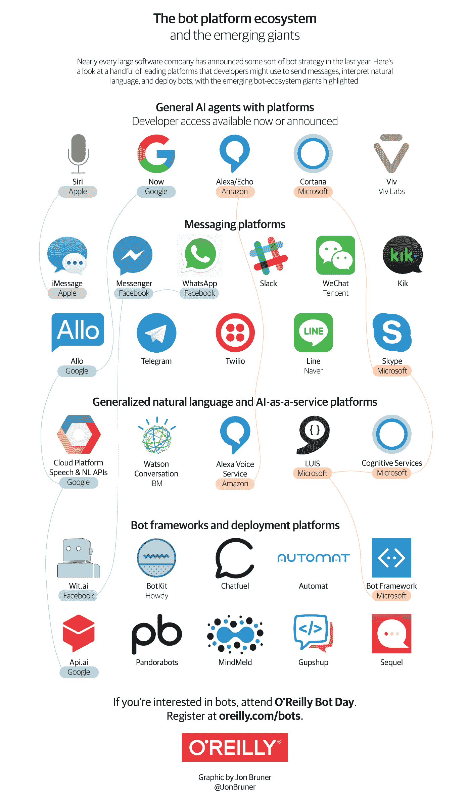
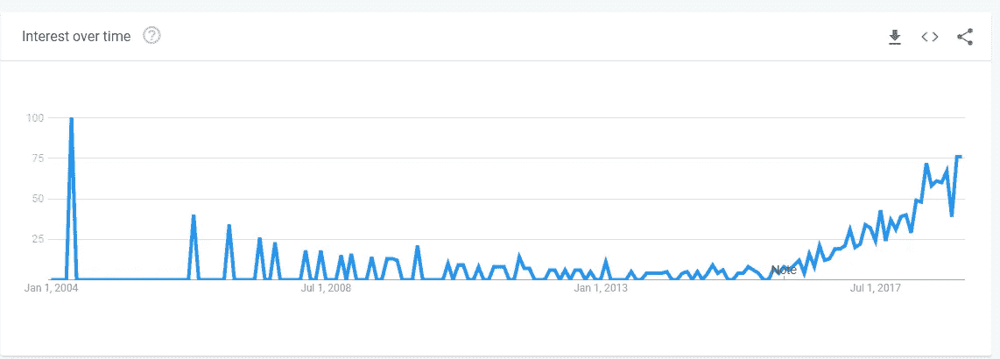
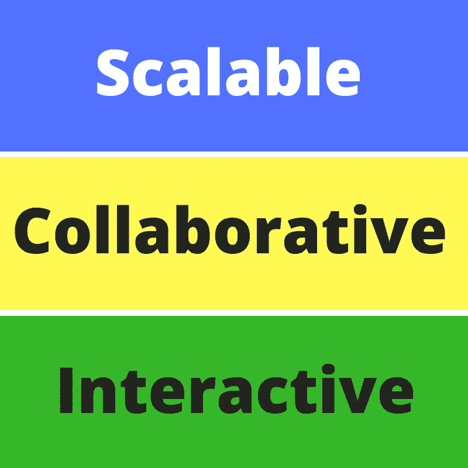
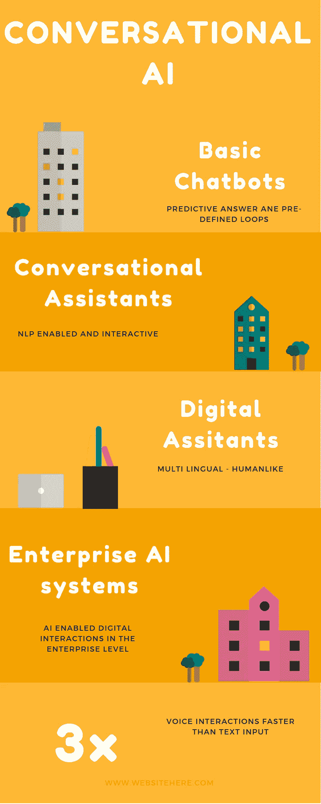

# 对话式 AI 系列

> 原文：<https://medium.datadriveninvestor.com/conversational-ai-series-e069743efbca?source=collection_archive---------15----------------------->

什么是对话式 AI？这是一种交流形式，可以在人类和其他设备之间进行，也可以在非人类世界中使用自然语言对话(NLP)、人类手势和语音进行交流。对话式人工智能的未来目标是提供无缝的类似人类的体验。从早到晚，你可能最终会和机器交谈，而不是和其他智人交谈。我宁愿称它为**人造智人。**

> 对话是一门艺术。因此，如果你编写了一个“人造智人”软件，不仅能相互交谈和理解，还能与智人交谈和理解，你就会成为一名艺术家。

对话式人工智能在 2018 年像其他任何最热门的趋势一样启动了市场，它也有资格在 2019 年名列榜首。今年我想从 NLP 及其在语音平台/聊天机器人/智能代理系统中的应用开始。

# 生态系统:

乔恩·布鲁纳有一张关于对话式人工智能生态系统的极好的信息图。这些区别对于理解构成对话式人工智能的构件是必不可少的。

source: Infographic: The bot platform ecosystem — O’Reilly Media [http://oreil.ly/2seBVco](http://oreil.ly/2seBVco)

# P 丰富性和用例:

谷歌提供了许多关于趋势的见解。NLP 和对话式人工智能在 2018 年主导了技术领域，并将在 2019 年继续如此。

以下基于区域的趋势将显示 NLP 在不同区域占主导地位。NLP 增强了语音产品的体验，NLP 中的研究对提高对话式人工智能平台的准确性有很大帮助。

对对话式人工智能的兴趣趋势与语音即服务在技术领域获得大量关注的事实相一致。

Source: Google Trends Interest Over Conversational AI

因此证明！

# 灵活的接口架构:

在这个不断变化的技术领域，拥有灵活的界面对于产品的成功至关重要。在全球公司中，研究团队正在向 NLP 研究和原型投入大量资金。技术世界将会看到产品和平台相互交流，而不是互动。

# 演变

> 进化是一个不断分支和扩张的过程。—杰伊可以

这是科技领域任何产品的要点。对话人工智能已经从一个基本的聊天机器人发展成为类似人类的人工智能助手。

Evolution of Conversational AI

我将是不可避免的，企业和技术世界必须接受它，并引导它为地球的更好服务。对话式人工智能在人类对话中挖掘出了许多隐藏的潜力，NLP 的进步将增加处理自然语言世界的潜力。

这是对话式人工智能博客的第一个系列之一。