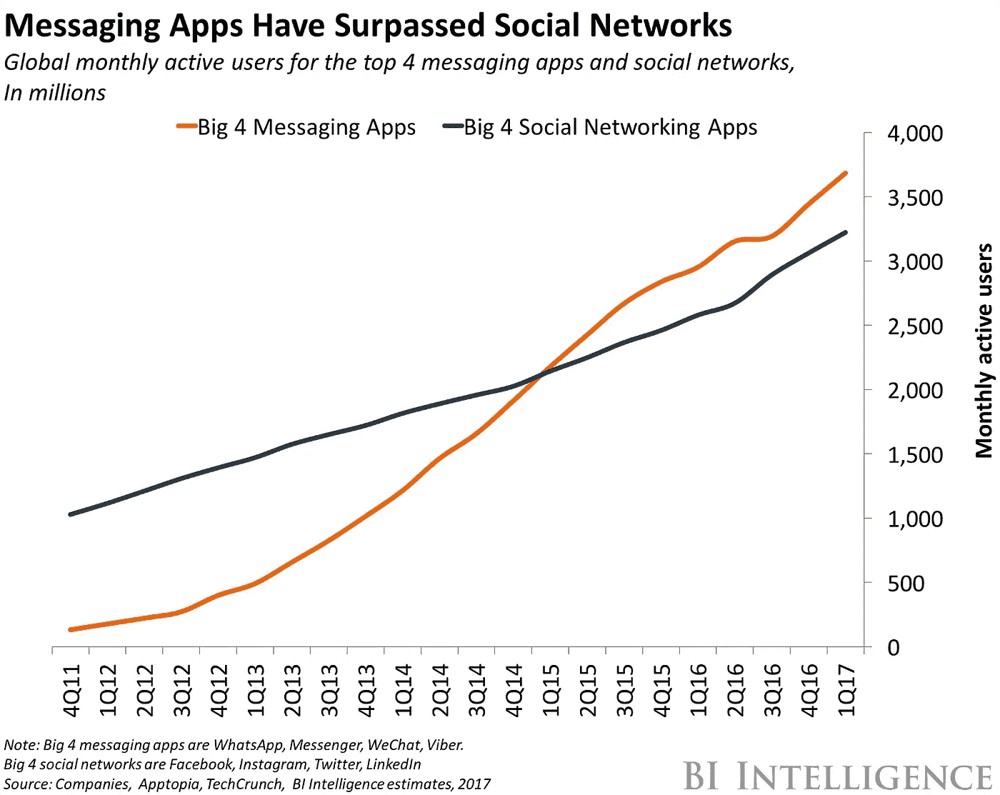
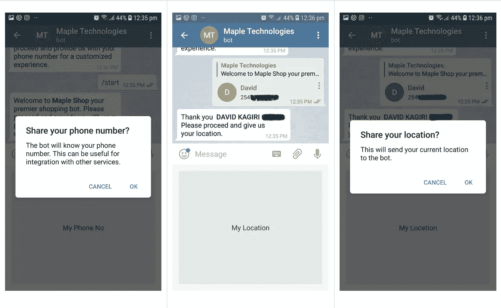
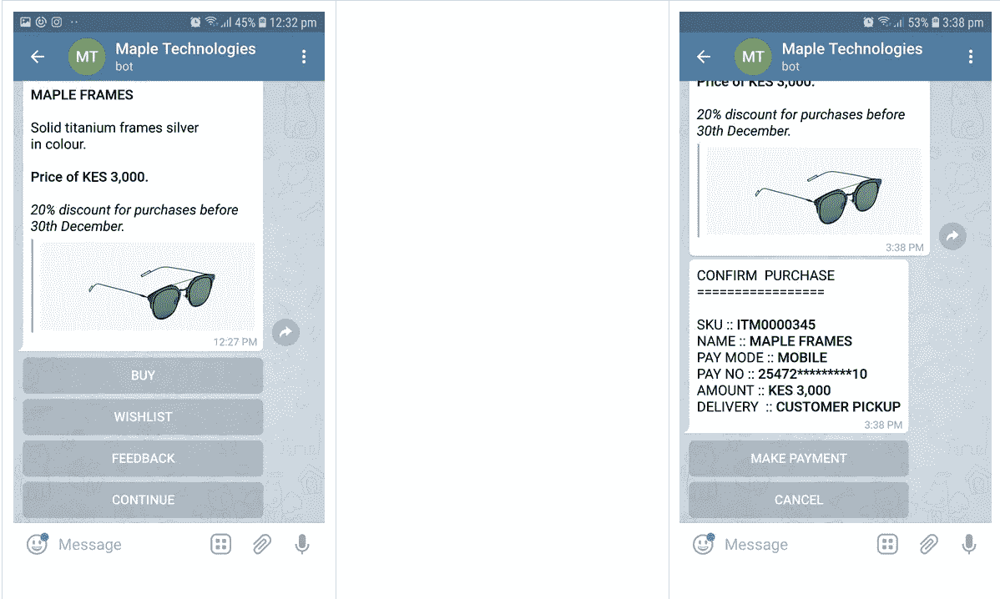
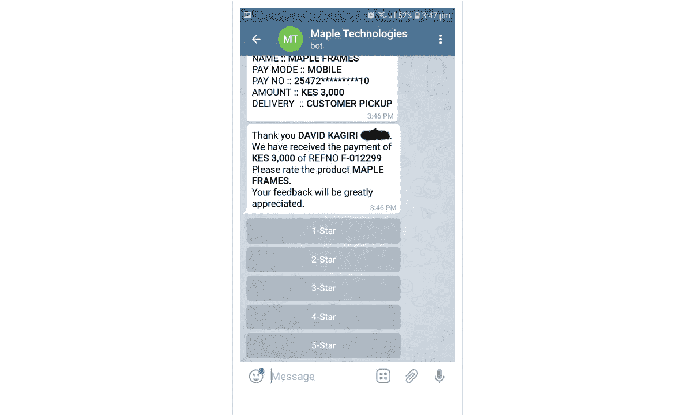

# 会话式商务。是时候了！

> 原文：<https://medium.datadriveninvestor.com/conversational-commerce-its-time-3587ad9f900d?source=collection_archive---------12----------------------->

**“我们总是高估未来两年将发生的**变化，低估未来十年将发生的变化**。不要让自己被麻痹而无所作为。”~比尔盖茨。**

什么是真正的“对话式商务”？它将如何影响我的业务？我需要做什么才能走在曲线的前面？我现有商务渠道上的客户旅程是否符合我的客户的期望？

让我们暂时后退一步，看看典型的商业环境。

企业在基础设施上投入大量资金，以实现其主要目标，推动销售——商业的核心部分。这包括物理网点/商店、人力资源、流动性和广告。鉴于目前的趋势，传统渠道如购物中心和实体店的销售很快被网上购物、移动购物和其他电子商务选择所取代。这主要是由于人口结构的变化，越来越多的 GenZ 客户加入了消费市场。还有一般的“懒惰”。我们都想以更方便的方式购物，而不是离开舒适的地方。

为了弥补减少的客流量，企业选择创建电子商务网站，这带来了新的挑战，如高弃车率和跳出率。如果网站增加了流量，企业就不得不投资更多的员工来回应客户的询问，如果做得不好，收益递减法则就会发挥作用。顾客不满意会影响商业利润。其他人选择走得更远，从各种媒体购买广告，使用绩效指标难以衡量的策略来增加流量，这增加了他们的运营支出。

该业务进一步在各种电子商务平台上列出产品，目的是增加销售额。会发生什么？企业面临着品牌稀释的风险，除此之外，如果他们没有关键的客户数据，那么他们就无法完善他们的市场产品。

在履行订单和产品的最后一公里交付方面，情况如何？如果第三方平台搞糟了这个重要的价值链服务，你就会失去回头客。

技术改变了景观。GenZ 消费者需要无摩擦的客户之旅。WhatsApp、Telegram、微信、Messenger、Viber 等新渠道。被证明是大多数人交流和互动的首选媒介。在这些生态系统中，数百万具有相似兴趣和愿望的用户社区正在形成。这些渠道和其中的社区，提供了一个几乎无限的观众和不可估量的潜在市场。利用这些渠道的病毒式传播，销售额会扶摇直上。

那么我们从哪里开始呢？

我需要了解和做些什么，才能赶上这一改变商业格局的新浪潮？

让我们首先来看看这个商业价值链中最重要的人物——消费者。

趋势显示，消费者的注意力正从社交媒体平台转移到消息应用上。由于当今世界信息的涌入和轰炸，他们的注意力是有限的。企业需要以最自然、最直观、最少摩擦的方式进行销售——通过对话。自从商业出现以来，我们就一直使用对话来进行交易。我们用语言来传达我们的需求和愿望，用语言来传递和接受反馈。

> 定义:**对话式商务是一种自动化技术，由规则驱动，有时也由人工智能驱动，使在线购物者和品牌能够通过聊天和语音界面进行互动。**

顾客之旅可以被组织成对话。电话号码和位置等重要的客户信息可以在流程中无缝捕获。售后反馈对您的业务至关重要，因为它可以将您的商务模式转变为由数据驱动的模式，而不是靠直觉运行的模式。

聊天机器人可以被定制以反映你品牌和你的过程。一个结构良好、步骤最少的机器人将有助于更快地转化销售。有了足够的数据，*人工智能*就可以慢慢融入一个自我维持的信息循环。收集更多数据以改善对整个业务的洞察，包括供应链、库存控制，it 变得更加智能，从而带来更多销售和更多数据！极乐世界！

一个企业总是可以从把他们的聊天机器人介绍给他们已知和信任的客户群开始。网络效应开始显现，业务规模扩大。

这就引出了另一个问题。假设，领导和订单蜂拥而至。企业如何处理这些海量的重要信息？

解决这一问题的方法是通过后台操作来处理销量和缺货。需要及时的仪表板来及时响应最终有助于客户满意度的某些业务指标和 KPI。

让我们举例说明如何通过电报机器人来实现这一点(购买方式我爱电报如何有一个非常强大的机器人 API，并不断改进它。我看到了很大的发展潜力。)

首先，客户找到机器人。

*   一进门，系统就会提示你输入电话号码和位置。客户主动给你他们的信息。
*   向用户显示的个性化欢迎消息。

*   基于输入，向客户提供内嵌的产品细节和选项。
*   如果他决定购买，他会被带到一个付款确认页面。

*   在购买时，他可以选择提供反馈，并可能做一个简单的售后调查。

这种体验为企业提供了宝贵的数据点。如果" T0 "很好地消化了" T1 "，企业就能迅速地对消费者需求和市场情绪做出反应。这就是“*增长型*”企业和“*停滞型*”企业之间的鸿沟。

库存可以保持在最佳水平，以保持最低的存储成本，包括缺货，特别是季节性销售。商业可能性的排列几乎是无限的。

今天，你想为你的企业采用对话式商务策略吗？

我们枫叶科技公司已经在商业领域运营了 8 年多。我们相信，我们正在慢慢走向一个由神经网络驱动的对话式商务时代。我们将设置库存控制、客户管理、支付集成、定制仪表板、数据中枢等。只需使用我们的[机器人](https://t.me/maple_tech_bot)注册或访问我们的[网站](https://signup.maple.ltd/?r=medium)，我们将很快与您联系。

感谢您花时间阅读这篇文章。

如果你有兴趣和我聊天，[把手伸到这里](https://twitter.com/intent/tweet?text=Hey @davykiash! I loved your article about conversational commerce and I'd love to chat! https://medium.com/@davykiash/conversational-commerce-its-time-3587ad9f900d)(或者发邮件给我 david@maple.co.ke)。我很想收到你的来信。

我们将永远在这个领域不断前进，做令人惊叹的事情。

受到启发，开始尝试。