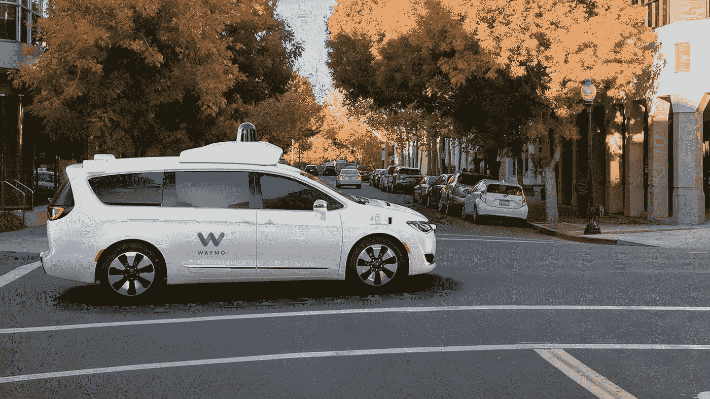
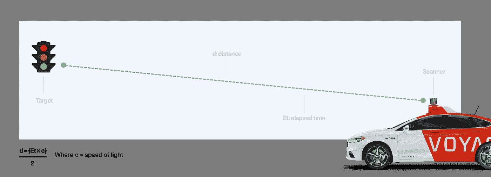
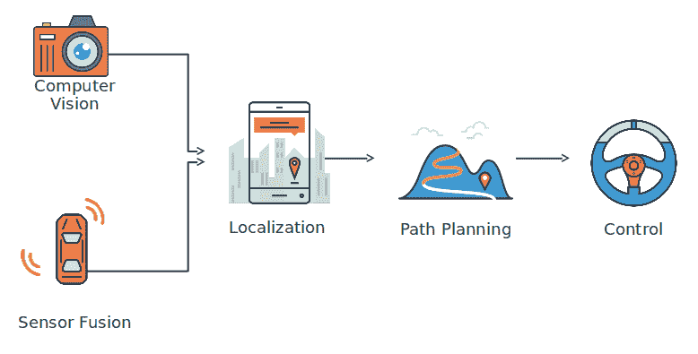
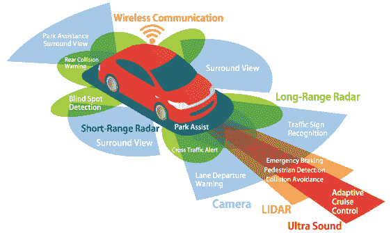
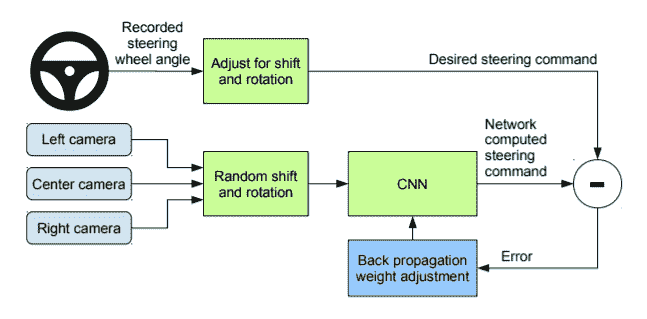
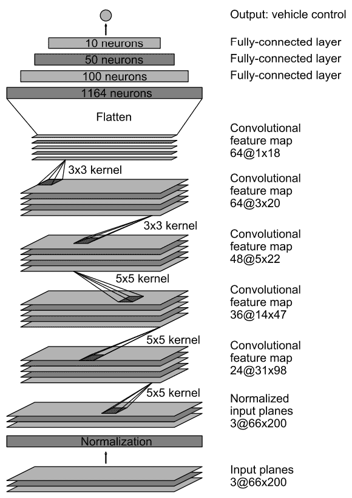
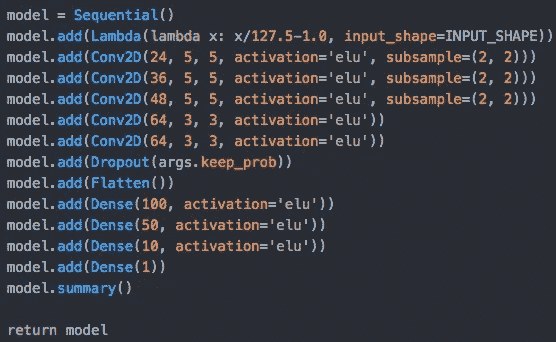

# ConvNets &无人驾驶汽车

> 原文：<https://medium.datadriveninvestor.com/convnets-driverless-cars-997976c5ee4c?source=collection_archive---------3----------------------->

**电脑+汽车=无人驾驶汽车。**不管你是否见过，我们都很好奇这是如何实现的。经过一段时间的探索，我发现无人驾驶汽车已经触手可及，用不了多久，每当你需要从**A 点到 B 点**时，你就会坐在无人驾驶汽车上。那些你一直渴望的小睡，都是可能的。

但无人驾驶汽车有趣的地方在于它背后的技术。现在坐好，放松和**让我们骑！**

无人驾驶汽车的背后是**人工智能**，特别是具体的框架叫做**卷积神经网络** (CNN 的)。打下基础，神经网络是一种机器学习(机器学习→机器自我教学！).这种类型的 ML 模型的功能就像一个**大脑**，一个由**人工神经元(感知器)**和**人工“神经”**组成的互联网络。计算机接收数据并输出经过无数次迭代优化的值，以最小化**误差或“损失”**函数。一个简单的例子是，一个神经网络被输入了一个由狗和猫组成的大型数据集。该网络分析图案并基于标签导出共同特征，并根据共同特征分离图像。这个网络是在一个大数据集上训练的，通常有数百万个，以便以后为更复杂的图像输出更好的结果。

 [## 在自动驾驶汽车发生事故的情况下，谁应该承担法律责任？-数据驱动型投资者

### 我仍然认为自动驾驶汽车是一种奢侈品，而不是必需品…

www.datadriveninvestor.com](https://www.datadriveninvestor.com/2018/11/02/who-is-legally-accountable-in-the-case-of-an-autonomous-vehicle-accident/) 

上面的例子说明了一种特殊的**类型的神经网络**。这就引出了无人驾驶汽车背后的框架。卷积神经网络是在**计算机视觉和图像识别中有效的神经网络类型。** ConvNets 在通过其他网络检测标志、面部和物体方面一直很有效，这使它能够为自动驾驶车辆的视觉提供动力。

# 那么自动驾驶汽车是如何工作的呢？

为了让自动驾驶汽车正常运行，它需要知道目的地、路线、遵守交通法规并能够做出判断。为了完成这些任务，它使用设备收集数据。

*   **多个摄像机:**通常放置 3 个摄像机(右、中、左)，以便在训练部分捕捉图像。摄像机捕捉转向角度和周围环境的图像。这对于车道和物体检测至关重要。
*   **雷达/激光雷达:**有效感知物体。激光雷达是一种较新的技术，是光探测和测距的简称。简单地说，它的工作原理是发射激光束，并计算它返回传感器所需的时间。
*   **AI:** 这是汽车的大脑。它通过算法分析数据，使车辆真正实现自主驾驶。它使用算法将输入(图像)和其他数据结合起来，以操纵车辆。
*   **你还需要汽车……至少一个模拟器！**

LIDAR in use by Voyage.

你也可以在家里试试这个！

为了探索自动驾驶汽车，我们可以使用 udacity 的自动驾驶汽车模拟器。

# **整个过程包括三个步骤:**

1.  自主车辆的数据生成
2.  用数据训练车辆
3.  测试自动驾驶汽车

# **自动驾驶汽车有 5 个关键部件:**

1.  **计算机视觉:**使用摄像机捕捉实时图像，并将这些图像作为可用数据。这是人工智能的一种形式，它基于人类的视觉皮层，通过观察来学习。
2.  **传感器融合:**在传感器融合中，计算机从摄像机、雷达/激光雷达和其他设备中获取输入，并将其放在一起，形成对环境的全面理解。这是数据生成和训练的关键步骤。计算机将 RGB 比例图像转换成 YUV 图像，然后通过算法进行传播。
3.  本地化:这决定了我们在世界上的地位。目前，我们的汽车配备了 GPS(图形定位系统)，但其精度仅限于距离实际位置约 1-2 米。这是自动驾驶汽车的一个问题，因为距离 1 米的位置可能意味着汽车会撞到人行道和行人。在那里，必须使用更复杂的技术，如激光雷达。
4.  **路径规划:**一旦我们知道了自己在世界上的位置，我们的下一个任务就是找到从 A 点到 b 点的最佳路径。计算机系统会绘制一条连接这两个位置的轨迹。接下来使用摄像机和雷达，汽车观察车辆和物体在做什么。
5.  **控制:**基于上述组件，自主系统计算转向角度和误差函数，以继续前进并在交通中导航。它负责刹车、油门和转向功能。

# 数据生成

在数据生成中，我们使用 udacity 模拟器手动驾驶汽车。我们完成大约 1-5 圈，为训练收集足够的数据。Udacity 模拟器带有一个内置的记录器，可将记录的数据(图像、特征)转换为可用数据。csv 格式。

在收集数据的同时，我还急转弯、急停并改变车辆的路径，以训练具有复杂性的模型。收集的数据用于训练模型。

这是从行为克隆学来的。这与人类的学习方式非常相似。

***行为克隆:*** *计算机记录并试图复制人类亚认知技能以自行学习某项任务的方法。*

**训练模型:**

下一步是使用这些数据来训练我们的模型。ConvNet 被输入一个**大的图像集**(每批 3 个，右、左和中间)，它是通过神经网络**向前传播**到**输出一个单一值——转向角。**将该输出值与人工输入值进行比较，并计算误差值，以改善神经网络决策。对于误差，模型使用**反向传播算法**来调整权重和偏差，以尽可能减少损失和误差。

该副本使用 NVIDIA 的 ConvNet 架构:

该模型由 9 层组成；第一层是接收图像的输入层；第二层将输入转换成平面层；以下 5 个 Conv。层向前传播有效识别数据中的像素和特征的数据。最后 3 层被称为“全连接层”,作为自治系统的控制器。

代码中的架构:

# 最后也是最后一步是测试自主系统。

这很有趣。经过一整天的训练，由于笔记本电脑的 CPU 不够好，这个模型终于可以运行了。

# **关键要点:**

*   卷积网络是一种适用于图像识别、计算机视觉和目标检测环境的神经网络。它为无人驾驶汽车背后的技术提供了动力。
*   自动驾驶汽车的 5 个主要组成部分: **1。计算机视觉** →识别物体和图像识别的能力， **2。传感器融合** →使用设备(右侧、中间和左侧摄像机)、雷达/激光雷达来全面了解车辆周围环境， **3。本地化** →弄清楚我们在世界的什么地方， **4。路径规划** →创建穿越世界的轨迹寻找从 A 点到 B 点的路径， **5。控制** →管道中的最后一步，转动方向盘并调节速度)刹车/油门)以平稳转弯
*   计算机学习的过程被称为**行为克隆。**

如果你喜欢读这篇文章，请鼓掌并与你的网络分享。要访问这个项目的代码，请访问我的 GitHub Repo！