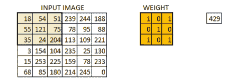
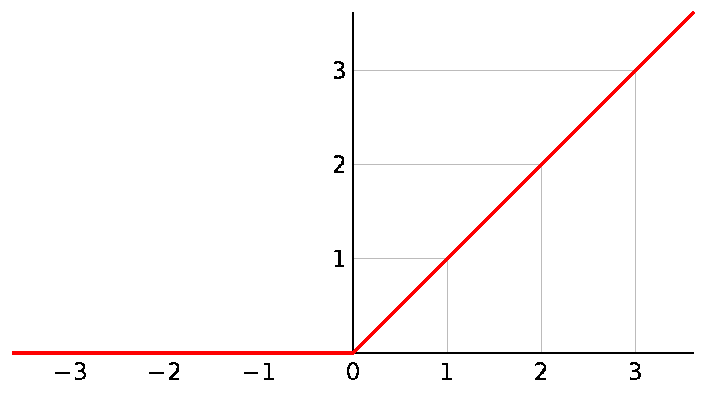

# 卷积神经网络与全连接神经网络

> 原文：<https://medium.datadriveninvestor.com/convolution-neural-networks-vs-fully-connected-neural-networks-8171a6e86f15?source=collection_archive---------1----------------------->

If the terminator had CNN, the other Sarahs wouldn’t have died: image courtesy Adweek.com

我正在阅读卷积神经网络(CNN)背后的理论，并决定写一个简短的总结作为 CNN 的概述。本文还强调了全连接神经网络的主要区别。

卷积神经网络广泛应用于各种学习问题。它们对于图像分类问题非常有效。在这篇文章中，我们将看到卷积神经网络或 CNN 与全连接神经网络的区别，以及为什么卷积神经网络在图像分类任务中表现如此出色。

首先让我们看看相似之处。卷积神经网络和神经网络都具有可学习的权重和偏差。在这两个网络中，神经元接收一些输入，执行点积，然后使用 ReLU(整流线性单元)之类的非线性函数。

全连接层的主要问题:

当对图像进行分类时——比方说大小为 64x 64x 3——完全连接的层在第一个隐藏层中需要 12288 个权重！对于尺寸为 225x225x3 = 151875 的图像，权重的数量会更大。具有大量参数的网络面临几个问题，例如较慢的训练时间、过拟合的机会

卷积神经网络的主要功能差异在于，通过一种称为卷积的操作，将主图像矩阵简化为第一层中的低维矩阵。例如，64×64×3 的图像可以缩小到 1×1×10。随后执行后续操作。

CNN 通常由以下部分组成:

*   输入层-单个原始图像作为输入给出。对于 RGB 图像，其维度将是 AxBx3，其中 3 代表红色、绿色和蓝色。
*   卷积层-卷积层是一个维数小于输入矩阵的矩阵。它对具有相同维数的一小部分输入矩阵执行卷积运算。相应元素的乘积之和就是这一层的输出。

Courtesy: [analyticsvidhya.com](https://www.analyticsvidhya.com/blog/2017/06/architecture-of-convolutional-neural-networks-simplified-demystified/padding-2/)

*   ReLU 或整流线性单位— ReLU 在数学上表示为 max(0，x)。这意味着任何小于 0 的数字都被转换为 0，而任何正数都被允许原样通过。

A ReLU function: courtesy Wikipedia

*   max pool-max pool 将传入矩阵的一小组元素中的最大值传递到输出。通常它是一个方阵。

A Maxpol function: courtesy ResearchGate.net

*   全连接层-最终输出层是一个正常的全连接神经网络层，它提供输出。

通常卷积层、ReLUs 层和 Maxpool 层被重复多次以形成一个具有多个隐层的网络，通常称为深度神经网络。

A Convolution Neural Network: courtesy MDPI.com

> 一些众所周知的卷积网络

*   LeNet 是 CNN 的先驱，由 Yann LeCun 开发，用于识别手写数字。
*   AlexNet 由 Alex Krizhevsky、Ilya Sutskever 和 Geoff Hinton 开发，赢得了 2012 年 ImageNet 挑战赛。这是第一个使用多重卷积运算的 CNN。
*   Google lenet——由 Google 开发，赢得了 2014 年 ImageNet 竞赛。与其他网络相比，该网络的主要优势在于它需要的训练参数数量少得多，从而使其速度更快，更不容易过度拟合。
*   VGGNet——这是另一个流行的网络，它最流行的版本是 VGG16。VGG16 有 16 层，包括输入、输出和隐藏层。
*   ResNet——由何开发的这个网络赢得了 2015 年的 ImageNet 竞赛。ResNet 的两个最流行的变体是 ResNet50 和 ResNet34。ResNet 的另一个复杂变体是 ResNeXt 架构。

> **参考文献**
> 
> 【http://cs231n.github.io/convolutional-networks/ 号
> 
> 【https://github.com/soumith/convnet-benchmarks 
> 
> [https://austing Walters . com/convolutionary-neural-networks-CNN-to-classify-sentences/](https://austingwalters.com/convolutional-neural-networks-cnn-to-classify-sentences/)