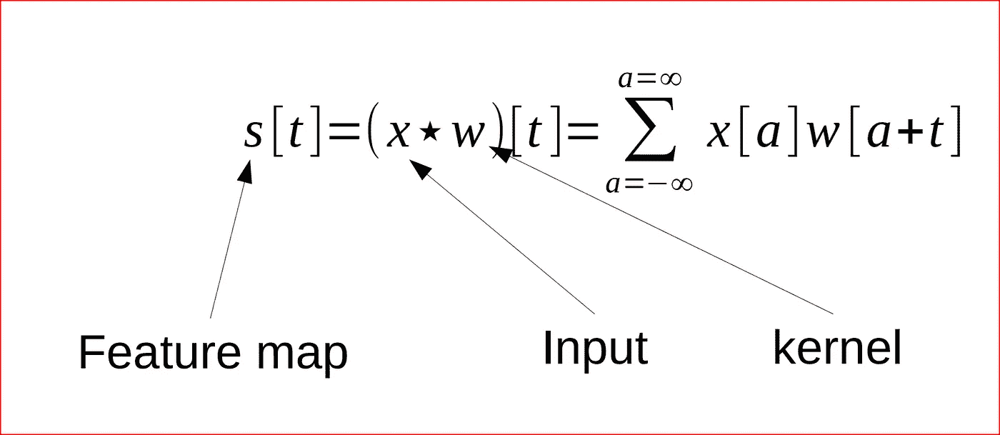
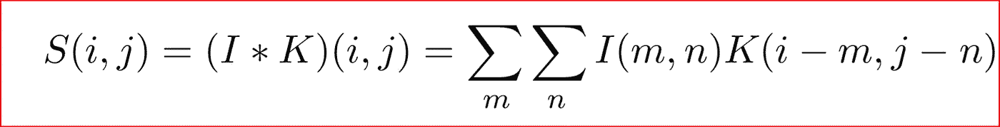
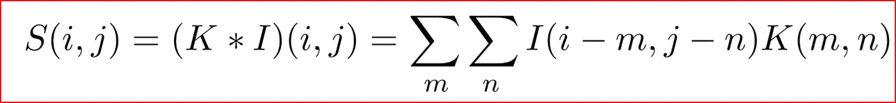
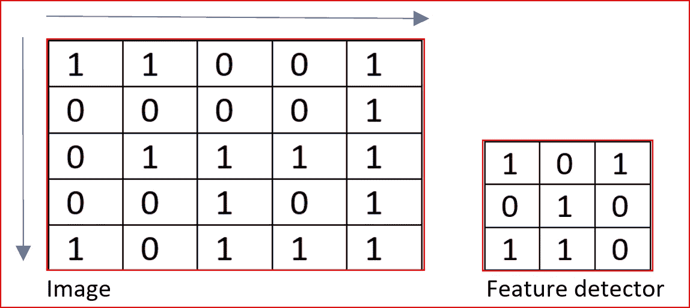
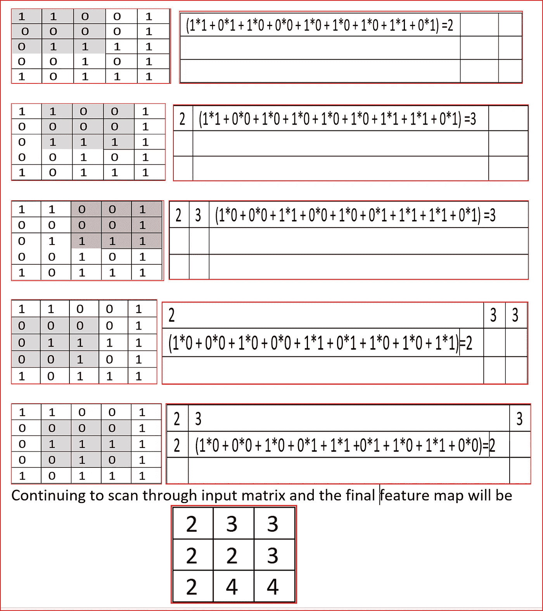
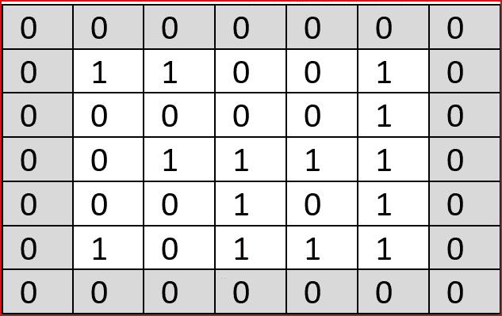
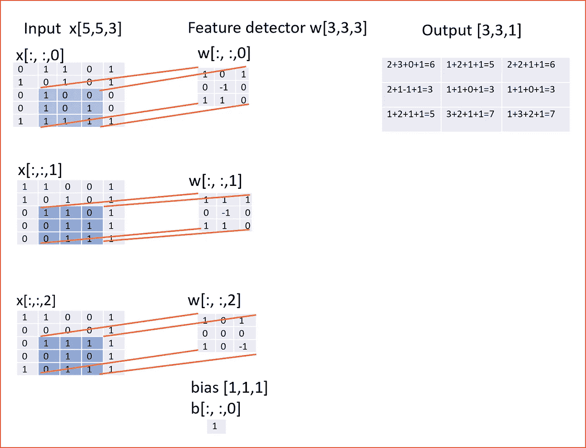
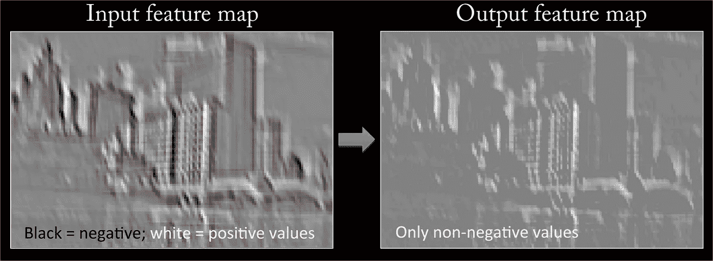
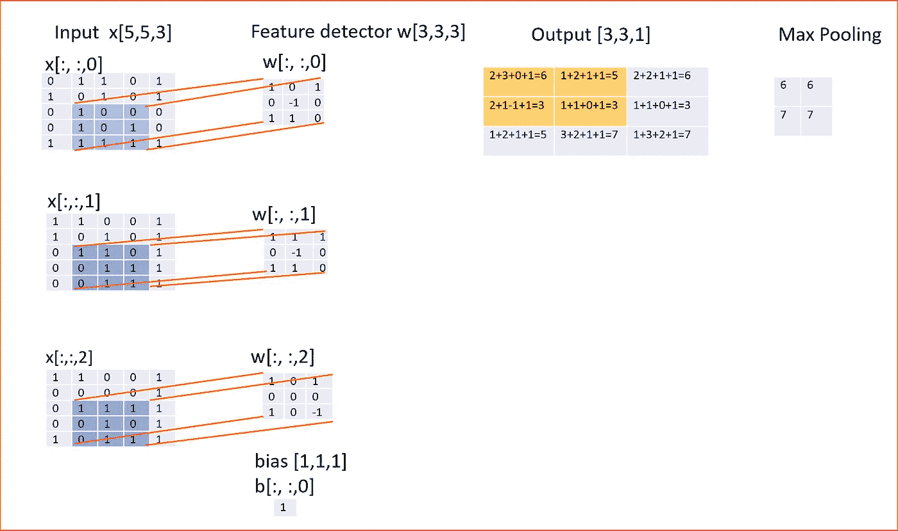
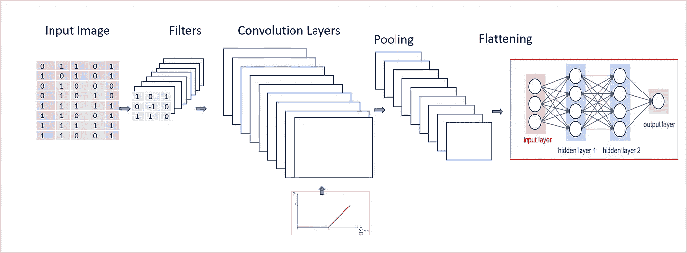

# 简化的卷积神经网络

> 原文：<https://medium.datadriveninvestor.com/convolutional-neural-network-cnn-simplified-ecafd4ee52c5?source=collection_archive---------0----------------------->

有兴趣了解当今的一些应用程序如何对你的家人和朋友的图像进行分类，并具有机器学习的基础知识，那么这就是适合你的文章。

*让我们先了解一下我们的大脑是如何识别物体的。我们将学习什么是 CNN，CNN 如何使用来自大脑的动机进行物体识别，以及 CNN 如何工作。*

*先决条件:对神经网络有基本的了解。阅读*[https://medium . com/datadriveninvestor/neural-network-simplified-c28b 6614 add 4](https://medium.com/datadriveninvestor/neural-network-simplified-c28b6614add4)

*让我们了解一下我们的大脑是如何识别图像的*

根据诺贝尔奖得主 Hubel 和 Wiesel 教授的研究，V1 视区由简单细胞和复杂细胞组成。简单单元有助于特征检测，而复杂单元结合了来自小空间邻域的几个这样的局部特征。空间池有助于平移不变特征。

当我们看到一幅新图像时，我们可能会从左到右和从上到下扫描图像，以了解图像的不同特征。我们的下一步是结合我们扫描的不同局部特征来对图像进行分类。。这正是 CNN 的工作方式

*平移不变特征是什么意思？*

图像的不变性意味着，即使当图像被旋转、调整不同大小或在不同照明下观看时，一个对象也将被识别为相同的对象。

Invariance — Rose is a rose even when rotated, shrinked

这有助于对象识别，因为图像表示对于诸如平移、旋转或小变形等图像变换是不变的。

我们使用卷积神经网络进行图像识别和分类。

*我们先来了解一下什么是 CNN，怎么用。*

# CNN 是什么？

CNN 代表卷积神经网络，这是一种用于处理数据的专用神经网络，该数据具有像 2D 矩阵一样的输入形状，如图像。

CNN 通常用于**图像检测和分类**。图像是像素的 2D 矩阵，我们在其上运行 CNN 来识别图像或对图像进行分类。识别一个图像是一个人，还是一辆车，或者只是一个地址上的数字。

和神经网络一样，CNN 也是从大脑中汲取动力。我们使用 Hubel 和 Wiesel 提出的目标识别模型。

## 什么是卷积？

卷积是一种数学运算，其中我们有一个输入 I 和一个参数 kernel K，以产生一个输出，该输出表示一个形状如何被另一个形状修改。

*让我们用一个图像来解释一下。*

我们有一个图像“x”，它是具有不同颜色通道(红色、绿色和蓝色-RGB)的像素的 2D 阵列，我们有一个**特征检测器或内核“w”**，然后我们在应用数学运算后得到的输出被称为**特征图**

Convolution function

数学运算有助于计算两个信号的相似性。

我们可能有一个特征检测器或滤波器来识别图像中的边缘，因此当我们在图像上使用这样的滤波器时，卷积运算将帮助我们识别图像中的边缘。

我们通常假设卷积函数在任何地方都是零，除了我们存储值的有限点集。这意味着在实践中，我们可以将无限求和实现为有限数量的数组元素的求和。

I is 2D array and K is kernel-Convolution function

因为卷积是可交换的，我们可以改写上面的方程，如下所示。我们这样做是为了便于在机器学习中实现，因为 m 和 n 的有效值范围变化较小。这是大多数神经网络使用的**互相关**函数。

Cross Correlation function

*那么，我们如何在 CNN 实现这一点呢？*

我们实现的方式是通过**卷积层**

卷积层是 CNN 的核心构建模块，它有助于**特征检测。**

核 K 是一组可学习的过滤器，并且与图像相比在空间上较小，但是延伸穿过输入图像的整个深度。

理解这一点的一个简单方法是，如果你是一名侦探，你在黑暗中看到了一幅大图像或一张照片，你将如何识别这个图像？

你将使用手电筒扫描整个图像。这正是我们在卷积层所做的。

内核 K 是一个特征检测器，相当于图像 I 上的手电筒，我们试图检测特征并创建多个特征图来帮助我们识别或分类图像。

我们有多个特征检测器来帮助边缘检测，识别不同的形状，弯曲或不同的颜色等。

*这一切是如何运作的？*

让我们拍摄一个具有 3 个通道(RGB)的 5×5 矩阵的图像，一个具有 3 个通道(RGB)的 3×3 的特征检测器，并且在图像上以 1 个步幅扫描特征检测器。

Feature detector will move over image by 1 stride

*当我在图像上应用特征检测器时，输出矩阵或特征图的维数是多少？*

**作为** **输入图像尺寸(W)、特征检测器尺寸(F)、步幅(S)和图像零填充(P)的函数的特征图的尺寸**为

**(威廉+2P)/S+1**

在我们的例子中，输入图像尺寸 W 是 5。

特征检测器或感受野大小是 F，在我们的例子中是 3

步幅(S)为 1，图像上使用的零填充量(P)为 0。

因此，我们的特征映射维数将是(5–3+0)/1+1 = 3。

**所以特征映射将一个 3*3 的矩阵用三个通道(RGB)** 。

这在下面一步一步地解释

Feature map based on the input image and feature detector using cross correlation function.

我们看到 5 乘 5 的输入图像被缩减为 3 乘 3 的特征图。深度或通道保持与 3(RGB)相同

我们使用多个特征检测器来寻找边缘，我们可以使用特征检测器来锐化图像或模糊图像。

如果我们不想减少特征映射的维度，那么我们可以使用零填充，如下所示

Applying a zero padding of 1 on 5 by 5 input image

在这种情况下，应用相同的公式，我们得到

**(wf+2P)/S+1 =>(5–3+2)/1+1 = 5，**

现在输出的尺寸将是 5 乘 5，有 3 个颜色通道(RGB)。

*让我们看看这一切在行动中的表现*

如果我们有一个 3 乘 3 的特征检测器或滤波器，一个偏置单元，那么我们首先应用如下所示的线性变换

**输出=输入*权重+偏差**

Input image of 5 by 5 with the three color channels and a feature detector or filter of 3 by 3 with a bias unit and stride is 1

参数数量= (3 * 3 * 3 )+1 = 28

对于 100 个特征检测器或过滤器，参数的数量将是 2800。

在每一个线性函数的卷积运算之后，我们应用 ReLU 激活函数。ReLU 激活函数在卷积层中引入了非线性。

它用特征图中的零值替换所有负像素值。

下图显示了应用 ReLU 激活功能后的特征映射转换。

source:[http://mlss.tuebingen.mpg.de/](http://mlss.tuebingen.mpg.de/)

既然我们已经完成了来自局部区域的特征检测，我们将结合来自空间邻域的所有这样的特征检测来构建图片。

记住你是一个在黑暗中扫描图像的侦探，你现在已经从左到右从上到下扫描了图像。现在我们需要结合所有的特征来识别图像

# 联营

我们现在应用池来获得平移不变性。*(记得玫瑰的形象)*

平移不变性意味着当我们少量改变输入时，汇集的输出不会改变。这有助于检测输入中常见的特征，如图像中的边缘或图像中的颜色

我们应用最大池函数，与最小池或平均池相比，它提供了更好的性能。

当我们使用最大池时，它总结了整个邻域的输出。与特征地图相比，我们现在有更少的单位。

在我们的例子中，我们使用一个 2×2 的盒子扫描所有的特征图，并找到最大值。

Applying max pooling to the output using a 2 by 2 box. Highlighted region in yellow has a max value of 6

现在我们知道卷积网络由以下部分组成

*   并行执行多重卷积—输出是线性激活函数
*   将非线性函数 ReLU 应用于卷积层
*   使用像 max pooling 这样的池函数来汇总附近位置的统计数据。这有助于“**平移不变性**
*   我们拉平最大汇集输出，然后输入到完全连接的神经网络

下图是完整的卷积神经网络

Full Convolutional Neural Network

*图像检测有使用卷积的理由吗？*

## 卷积使用了三个重要的概念

*   稀疏相互作用
*   参数共享
*   等变表示

**稀疏交互或稀疏权重通过使用小于输入图像的核或特征检测器来实现。**

如果我们有一个大小为 256×256 的输入图像，那么检测图像中的边缘将变得困难，可能只占据图像中像素的较小子集。如果我们使用较小的特征检测器，那么我们可以容易地识别边缘，因为我们关注于局部特征识别。

另一个优势是计算输出需要更少的操作，使其在统计上更有效。

**参数共享**用于控制 CNN 中使用的参数数量或权重。

在传统的神经网络中，每个权重被精确地使用一次，然而在 CNN 中，我们假设如果一个特征检测器对于计算一个空间位置是有用的，那么它可以用于计算不同的空间位置。

由于我们在 CNN 上共享参数，这减少了要学习的参数数量，也减少了计算需求。

**等变表示法**

这意味着目标检测对于光照变化、位置变化是不变的，但是内部表征对于这些变化是等变的

表示(玫瑰)=表示(转换(玫瑰))。

## 阅读它，与朋友分享，如果它有助于你获得更好的理解，请鼓掌。