# 卷积神经网络从无到有。

> 原文：<https://medium.datadriveninvestor.com/convolutional-neural-network-from-scratch-353b9331047b?source=collection_archive---------2----------------------->

嘿，伙计们，如果你想知道什么是卷积网络，或者想从不同的角度看它，你可以阅读我在 CNN 的观点。

***CNN 是什么？***
CNN 是神经网络的一种形式(更多关于 NN [*这里。*](https://medium.com/datadriveninvestor/neural-network-from-scratch-9a6c49fdd357) )用于计算机视觉、图像处理、物体检测等。我们可以通过视觉皮层识别和检测任何物体。我们可以通过 CNN 让一台电脑像我们一样识别。

CNN.

***CNN 的结构。***
一个 CNN 有两个重要的层——卷积层和神经层。
卷积层是执行滤波的卷积层、非线性层和汇集层的重复组合。
一个神经层由全连接的神经网络层和末端连接的 softmax 函数组成。

**首先**，让我们跳到卷积层做什么，
输入是一个可以是任何维度的图像，这里我们可以拿一个维度为 32 * 32 * 3 的示例图像，即行和列中的 32 个值，3 表示通道的数量(红色、绿色和蓝色)。该输入被馈送到滤波器，该滤波器包括某个维数，例如 3 * 3 * 3(即行中的 3)和一列，并且通道的数量必须与输入相同。滤波器在输入上进行卷积，以获得下一层输入。卷积只是一个点运算。所发生的是过滤器沿着输入移动，在过滤器和输入的值之间执行点运算。下图对这个操作有一个清晰的理解。

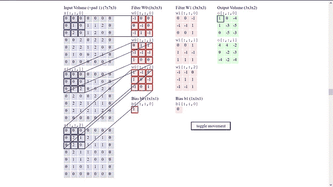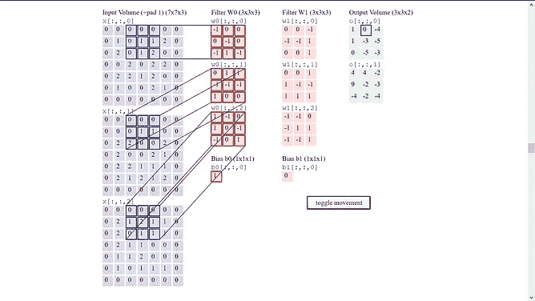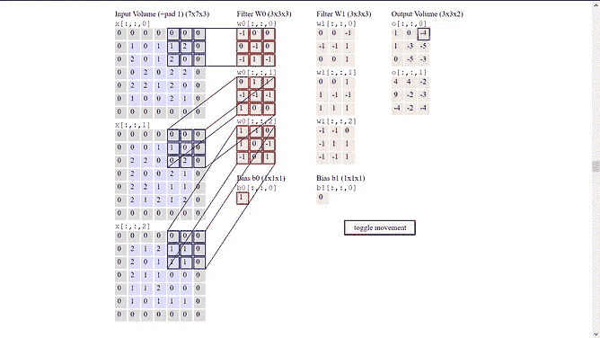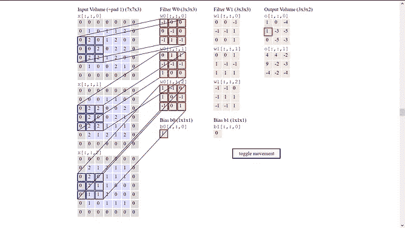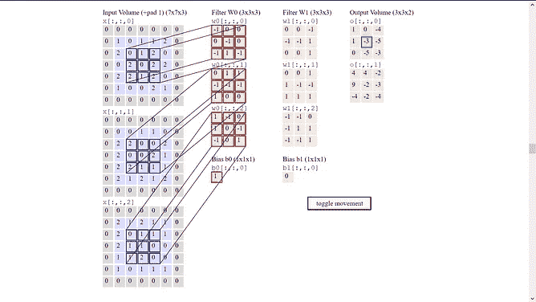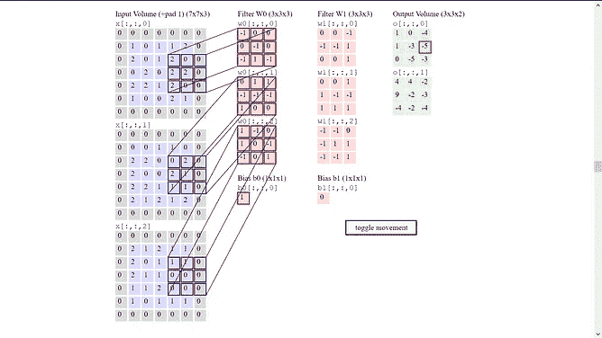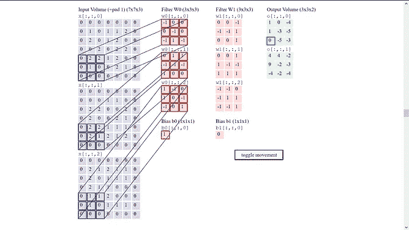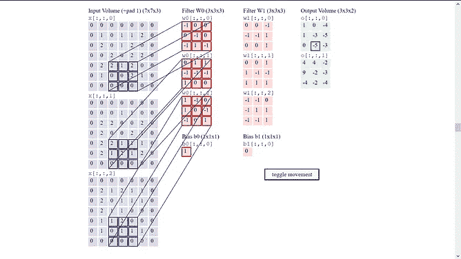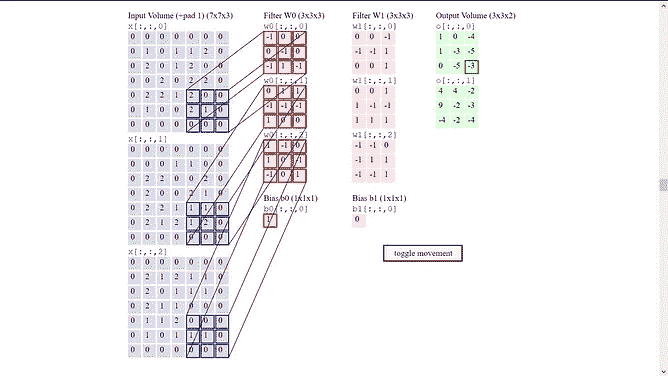

在上图中，你可以看到 5 * 5 的输入图像被一个 3 * 3 的滤波器卷积。但是还有更多。你必须了解超参数，这是你必须在这个卷积层中决定的参数。第一个参数是过滤器大小，在上图中是 3，然后是步幅大小，我们可以指定过滤器需要移动多少像素。在上面的示例中，步长大小为 1，因为过滤器在上面的图像中一次垂直和水平移动 1 个像素。当我们以上述方式对输入进行滤波时，输出维度会降低。您可以看到，角点像素在此过滤中仅使用一次，这意味着图像的角点部分受到的关注较少。为了避免这个问题，你可以填充输入图像(即在输入的所有边上加零)，这样即使你过滤它，你也会得到和输入相同的输出尺寸。你可以用填充尺寸“p”来做这件事。因此，您可以根据输入和滤波器大小来更改焊盘大小，从而在不损失尺寸的情况下获得输出。
你可以通过下面的公式得到输出尺寸大小:

> output _ image _ size(r * c)=(input _ image _ size(r * c)—filter _ size+2 * padding _ size)/stride _ size+1

此外，您可以使用任意数量的滤波器对输入图像进行卷积，以获得输入的许多特征。这用“k”表示，它等于输出中的通道数。这在上图中可以看到。

然后，该滤波器的输出被提供给一些非线性函数，例如 RELU，以使我们的数据非线性。如果我们想减少输入的大小，我们可以在这个结构中添加一个池层。我们这样做主要是为了减少计算成本。让我们来看看池层的工作原理。
池层有一个大小通常为 2 * 2 的过滤器，该过滤器应用于输入，并在应用过滤器的区域中获得最大值。这称为最大池化，它获取输入的过滤器应用区域的最大值，并且跨距设置为 1。

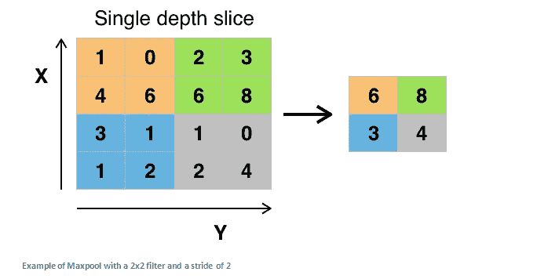

Pooling operation.

这些是卷积层中的基本操作，可以是任意组合。卷积层的基本结构如下所示。

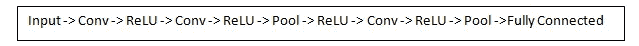

structure of CNN.

**现在卷积层的第二部分**是全连接神经网络层。

来自卷积层的输出将是行*列*通道的 3D 形式。在这一层的第一步，我们将把三维结构展平成一个单一的维度层。3D 层中的所有点现在将被表示为 1D 形式，该形式将作为完全连接的层的起始层。这个完全连接的层与我在这里描述的的香草神经网络相同。然后将其输出连接到 softmax 层，以获得所需的输出。Softmax layer 是另一个非线性函数，它是逻辑回归的推广，给出了输入“X”在“N”个类中的概率。

到目前为止，您已经看到了卷积层的正向传播，这只是工作的一半。现在的主要工作是，

***反向传播。***
我们在前向传播中所做的是初始化全连接层中滤波器和权重的一些数字，希望它能正确预测图像，但这并没有发生，因为这些数字没有被优化以准确预测，所以我们进行反向传播来优化权重。首先，我们需要计算 softmax 操作的成本函数，即预测输出乘以实际输出的负对数。然后找到权重和偏差相对于成本函数的偏导数。这是权重和偏差相对于函数的梯度。我们用权重和偏差减去这些计算出的梯度，以获得优化值。通过沿路径乘以权重，该过程被反向传播到滤波器中的初始权重，以获得所有层的优化值。这个过程重复进行，直到权重被优化到最大值。

这是 CNN 的架构，但还有更多你必须知道的话题，比如，

**迁移学习。让 CNN 从数百万张图像中从头开始学习是资源密集型的，所以我们可以使用 GitHub 等网站上已经预先训练好的模型的权重。这是可能的，因为较低级别的过滤器检测边缘和形状。对于 CNN 来说，你很有可能还需要底层的边缘和形状。因此，您可以在过滤器中使用优化的权重，这些权重已经由您的模型中的某个人进行了训练。基于模型与其他模型的相似性，您可以使用所有权重或仅使用部分权重。**

**辍学层。**
这一层只是随机地使层中节点的值为零。这样做是为了避免模型过度适应我们的数据，同时也使你的网络更加冗余。

我从以下资源中准备了我的文章，如果你想了解更多关于 CNN 的知识，我建议你看看这些资源。

[此处。](https://adeshpande3.github.io/adeshpande3.github.io/A-Beginner%27s-Guide-To-Understanding-Convolutional-Neural-Networks/)

[这里。](https://cs231n.github.io/)

[这里。](https://www.youtube.com/playlist?list=PLkDaE6sCZn6Gl29AoE31iwdVwSG-KnDzF)

**结论。**
应用 CNN 是深度学习的重大突破。它在日常生活中有很多潜在的用途。你可以看到 Face ID 被许多手机制造商采用，并在 CNN 上实现。Google lens 也是用 CNN 实现的。所以你可以看到现在的世界已经在使用 CNN，而且它在未来只会发展得更快。

如果你喜欢读这篇文章，请给它一些掌声，并在未来关注我更多类似的文章。

