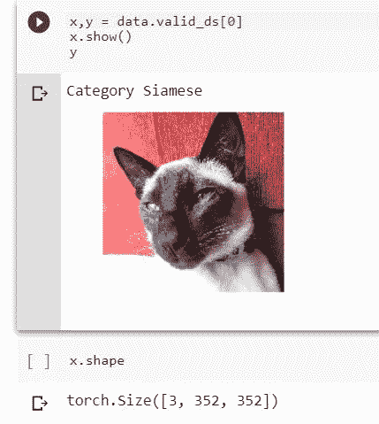
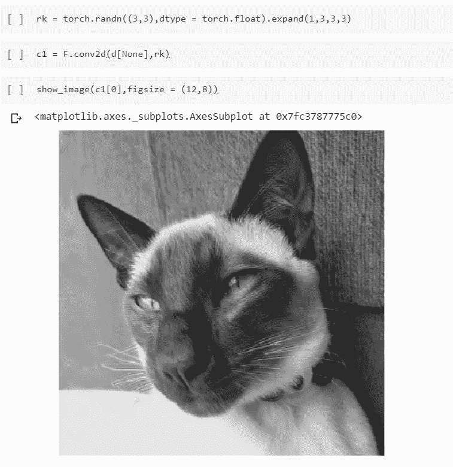
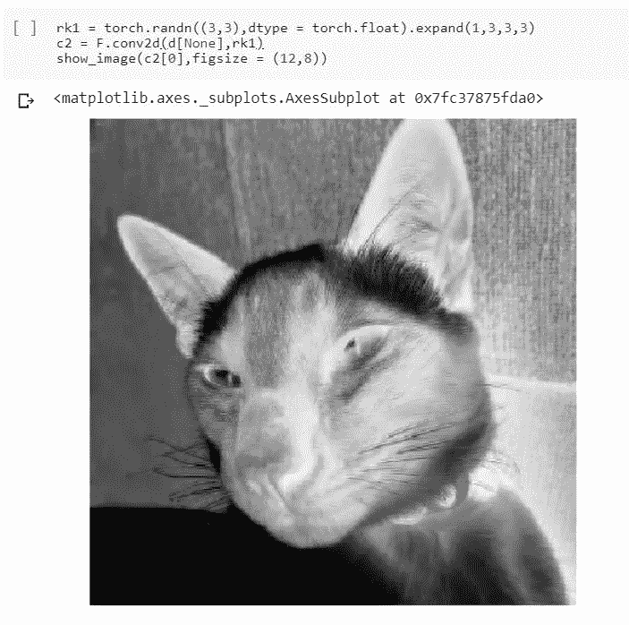
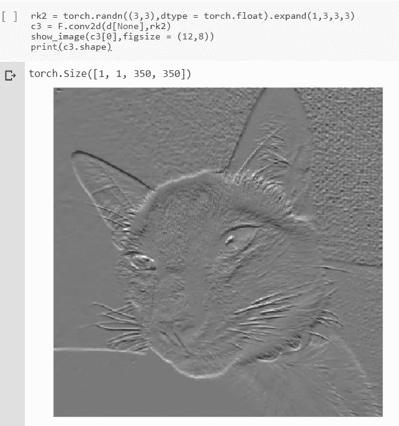
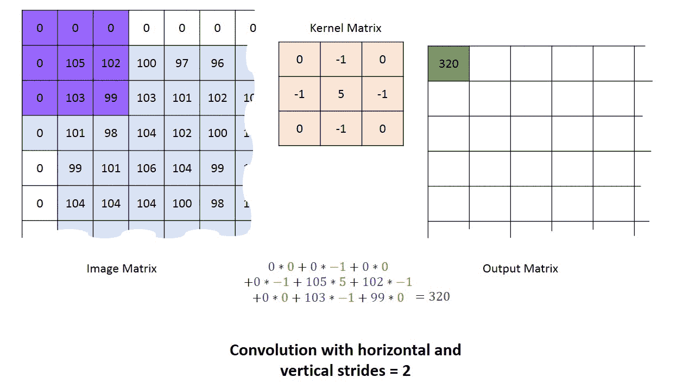

# 卷积神经网络

> 原文：<https://medium.datadriveninvestor.com/convolutional-neural-networks-3b241a5da51e?source=collection_archive---------2----------------------->

这个博客的目的是解释 CNN 的理论，并通过 python 的实际实现给出该理论的直觉。

CNN 是最先进的深度学习技术，用于涉及图像数据的任务。早期的技术包括使用图像处理技术从图像中手动提取特征，并将这些特征用于进一步的研究。这就是 CNN 的强大之处。它们自动从图像中提取重要特征，并使用这些特征进行分类、分割和对象检测任务。

Simple Convolution of a (5x5) matrix with a (3x3) kernel

卷积神经网络的每一层包括线性运算和非线性运算。线性运算是一个简单的卷积，如上图 GIF 所示。图像是一个像素矩阵，因此 5x5 矩阵可以被认为是一个以数字作为像素值的图像。3x3 内核在图像上滑动，进行逐元素的矩阵乘法，然后对其求和，所获得的值将是第一个单元的输出。我们将图像中的每个 3x3 元素乘以一个 3x3 内核，然后求和得到一个结果，这就是所谓的卷积。

 [## 深度学习用 7 个步骤解释-更新|数据驱动的投资者

### 在深度学习的帮助下，自动驾驶汽车、Alexa、医学成像-小工具正在我们周围变得超级智能…

www.datadriveninvestor.com](https://www.datadriveninvestor.com/2019/01/23/deep-learning-explained-in-7-steps/) 

在上面的例子中，我们考虑的图像只有一个通道。但实际上，大多数图像都有 3 个通道(RGB)。因此内核也需要有 3 个通道。两个秩为 3 的张量的这种卷积产生秩为 2 的张量。

Convolution of a 3 channel image with a 3x3x3 kernel

内核有助于从图像中提取特征。因此，在 CNN 的一层中，一个图像是由多个内核构成的。每个核从图像中提取不同的特征。得到的输出被堆叠以形成秩 3 张量，该张量成为下一层的输入。

我将尝试展示我在 python 中的实际意思。我抓拍了一张猫的照片。

Cat Image on which I performed the convolution

注意:我使用 Pytorch 作为框架，因此图像矩阵存储为 torch 张量。请注意图像的形状——张量中的第 0 维表示通道数，后跟图像的大小，即 352x352。

1st Convolution

2nd Convolution

3rd Convolution

我生成了 3 个形状为 3x3 的随机内核，并将其形状扩展为 3x3x3。用生成的内核卷积图像。每个卷积提供不同的形状图像(1，350，350 ),并且它们代表不同的特征集合。来自第一层的卷积的不同输出被堆叠在一起，经过非线性激活函数(主要是 ReLU ),并作为输入馈送到第二层。在每一层中执行类似的操作，并且 CNN 可以有数百层。每一层都学习从图像中提取重要的特征。这就是深度学习如此强大的地方，因为它遵循通用近似定理。无论核的初始值是什么，神经网络都学习并更新每一层中的核的值，以从图像中提取重要的特征，这对于手头的任何任务都是有用的。(分类、分割或对象检测)

随着我们深入网络，我们想要更深的输出，这意味着与许多内核进行卷积，以便我们可以在单个层中提取许多特征。随着输出变得更深入，模型变得更加内存密集型。因此，为了记住这段记忆，我们在卷积中使用了 **stride** 。跨距是内核在输入矩阵上的移动量。在输入矩阵上使用步长 2 时，输出矩阵的大小将变成一半。

为了处理边上的像素，我们在图像矩阵中添加了边界填充。可以通过向边界添加零来进行填充，这种填充形式被称为**零填充**。还有另外一种填充叫做**反射填充或者镜像填充。**

假设我们正在执行一个分类任务，并且有 10 个类别用于预测。此外，假设最终层的输出生成大小为(512，11，11)的张量。CNN 的最终输出应该是大小为(10，1)的向量，其中向量包含每个类别的概率。因此，为了得到各自的概率，我们从 512 个旋绕特征图的每一个中取平均值，并生成形状向量(512，1)。这种方法叫做**平均池**。形状(512，1)的合成向量经历线性运算，即乘以具有形状(512，10)的权重矩阵。线性运算的输出然后通过非线性函数(在这种情况下是 softmax 函数)来生成形状矩阵(10，1)。输出向量中的值将是每个类的合成概率。概率最高的类别将是预测的类别。

在下一篇博客中，我会写一些防止过度拟合的方法。

特别感谢 Jeremy 和他的课程《程序员实用深度学习》。它帮助我清楚地理解这些概念。