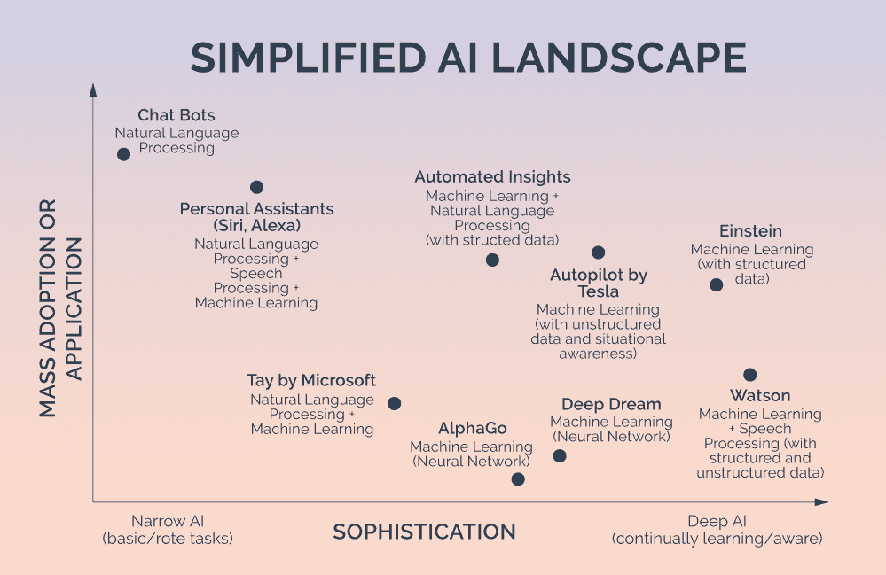
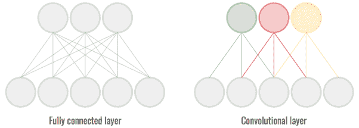

# 卷积神经网络:一种很酷的人工智能方式

> 原文：<https://medium.datadriveninvestor.com/convolutional-neural-networks-a-cool-way-to-do-ai-f588940b4d14?source=collection_archive---------13----------------------->

除了炒作之外，人工智能是一个复杂的不断发展的领域。没有一篇文章能公正地对待这一领域；这篇文章关注的是卷积神经网络。

但是首先快速介绍一下人工智能——它是一个光谱(来源:[贾斯汀·盖奇](https://startupsventurecapital.com/what-it-means-to-be-an-ai-company-45bc7bc55750)):

许多应用程序利用了许多不同的技术(来源: [Hubspot](https://research.hubspot.com/charts/simplified-ai-landscape) ):

在所有这些技术中，神经网络(NNs 或人工神经网络，又名 ann)具有很大的前景，因为它们是通过考虑示例来学习的计算系统，通常没有用任何特定于任务的规则来编程。神经网络的灵感来源于生物学，即动物大脑中的神经网络。挑战在于他们需要大量的训练数据，否则他们只会得出错误的结论。

卷积神经网络(CNN)是神经网络的一种变体，通常应用于视觉图像。CNN 也受到生物学的启发，最具体的是个体神经元如何对刺激做出反应，以及重叠覆盖整个视野。下图说明了一个训练有素的 CNN 如何更有效地获得输出(来源:[朱利安·德斯波伊斯](https://www.quora.com/What-are-the-advantages-of-a-convolutional-neural-network-CNN-compared-to-a-simple-neural-network-from-the-theoretical-and-practical-perspective#)):

CNN 很少使用预处理，因此可以了解到许多原本必须通过硬连线才能了解的东西。一些主要的缺点是，它是计算密集型的，作为一种神经网络，需要大量的训练数据，否则你可能不会得到完整的图片(没有双关语)。

CNN 也主要用于图像识别和视频分析，但也用于自然语言处理、药物发现、健康风险评估和发现衰老的生物标记。流行媒体特别通过 AlphaGo 展示了 CNN，alpha Go 是由谷歌 DeepMind 团队创建的，用于与顶级人类玩家进行棋盘游戏围棋，并赢得胜利，该游戏在几个方面使用了 CNN。

对 CNN 有什么看法——它在哪里，它要去哪里，它如何到达那里？评论离开。

*这些都是有目的的专注于实践见解的短文(我称之为 GL；dr —良好的长度；确实读过)。如果它们能让人们对某个话题产生足够的兴趣，从而进行更深入的探索，我会感到非常兴奋。我在三星的创新部门* [*NEXT*](http://samsungnext.com/) *工作，专注于深度科技领域软件和服务的早期风险投资，这里表达的所有观点都是我自己的。*