# 卷积神经网络-用于计算机视觉的人工神经网络

> 原文：<https://medium.datadriveninvestor.com/convolutional-neural-networks-artificial-neural-network-for-computer-vision-7ee553df5df9?source=collection_archive---------3----------------------->


Computer Vision

CNN(卷积神经网络)只是一种专门设计用于检测模式的神经网络。

在开始 CNN 之前，我会建议看一下我之前的关于深度学习基础和激活函数的文章。

[](https://medium.com/datadriveninvestor/activation-function-in-artificial-neural-network-e03b4a2b953d) [## 人工神经网络中的激活函数

### 在以前的文章中，我解释了人工神经网络的基本原理，并简要说明了…

medium.com](https://medium.com/datadriveninvestor/activation-function-in-artificial-neural-network-e03b4a2b953d) [](https://medium.com/datadriveninvestor/deep-learning-fundamental-important-concepts-59d7ae90901b) [## 深度学习基础-重要概念

### 深度学习是机器学习的子领域，使用受大脑神经系统结构和功能启发的算法

medium.com](https://medium.com/datadriveninvestor/deep-learning-fundamental-important-concepts-59d7ae90901b) 

## CNN 是什么？

CNN 是最常用的用于图像分类和目标检测的神经网络。CNN 内部的隐藏层被称为卷积层，这些层负责检测提供的输入(图像)中的模式。CNN 也可以有非卷积层，但卷积层是 CNN 的核心。

这个视频对理解 CNN 的基础知识很有帮助。请看看更多的见解。

## 卷积层:

就像其它层一样，卷积层也接受输入并应用特殊类型的计算，然后将输出传递给输出层。卷积层的输入称为输入信道，输出称为输出信道。

[](https://www.datadriveninvestor.com/2019/01/23/deep-learning-explained-in-7-steps/) [## 深度学习用 7 个步骤解释-更新|数据驱动的投资者

### 在深度学习的帮助下，自动驾驶汽车、Alexa、医学成像-小工具正在我们周围变得超级智能…

www.datadriveninvestor.com](https://www.datadriveninvestor.com/2019/01/23/deep-learning-explained-in-7-steps/) 

对于卷积层，发生的转换称为*卷积操作*。

## 滤波器和卷积运算:

对于每个卷积层，我们需要指定该层应该拥有的*滤波器*的数量。这些过滤器实际上是用来检测模式的。

## 模式:

想象一个交通信号的图片，其中你需要检测行人和停在这个交通信号上的汽车数量。当您将此图像提供给 CNN 时，卷积层过滤器将检测图像中的模式。不同类型的模式可能如下:

*   优势
*   形状
*   口感
*   曲线
*   目标
*   颜色；色彩；色调

过滤器可以检测图像中的一种模式是边缘，因此这种过滤器被称为*边缘检测器*。一些过滤器可以检测拐角、形状(圆形、方形等)。即使在复杂的 CNN 中，一些过滤器也更加复杂，可以检测眼睛、鼻子、头发(可能是黑色或棕色)等物体。

## 过滤器(模式检测器):

让我们举一个例子，如果你需要提取一个写在图像上的电话号码，当你把这个图像传递给 CNN 时，那么在每个卷积层上定义的过滤器将计算输入并将输出传递给下一层进行更多的计算。

CNN 输入频道将首先获取图像，然后将图像转换成像素矩阵。

在我们的例子中，我们正在检测写在图像上的电话号码，为了检测每个号码，我们需要检测边缘以及垂直和水平模式。

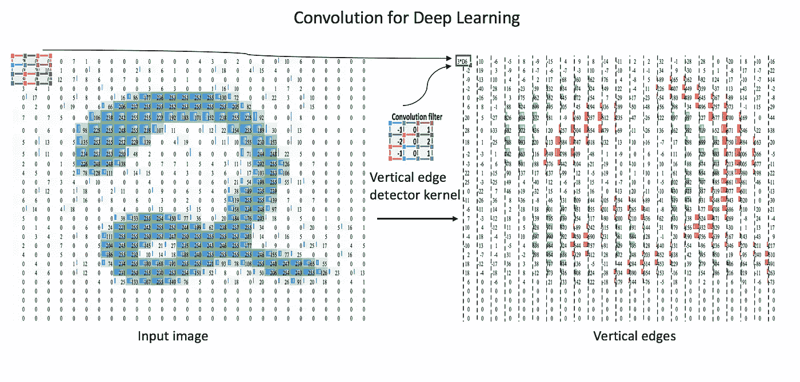

Convolutional Computation

在上面显示的图像中，我们在底部有一个蓝色的输入通道。底部阴影所示的卷积滤波器滑过输入通道，绿色输出通道:

*   蓝色(底部)—输入通道
*   阴影(蓝色顶部)——`3 x 3`卷积滤波器
*   绿色(顶部)—输出通道

对于蓝色输入通道上的每个位置，`3 x 3`滤镜会进行计算，将蓝色输入通道的阴影部分映射到绿色输出通道的相应阴影部分。

这个卷积层接收一个输入通道，过滤器将滑过输入本身的每个`3 x 3`像素集，直到它滑过整个图像的每个`3 x 3`像素块。

## 卷积运算:

这种滑动被称为*卷积*，所以实际上，我们应该说这个滤波器将*卷积*来自输入的每个`3 x 3`像素块。

蓝色输入通道是我们电话号码图像的矩阵表示。假设我们的图像是三种颜色(白、暗、灰)的灰度图像。

当你定义过滤器时，那么每种颜色将表示为数字。让我们假设我们的卷积层有四个`3 x 3`滤波器，这些滤波器填充了您在下面看到的值。这些值可以通过让`-1` s 对应黑色、`1` s 对应白色、`0` s 对应灰色来直观地表示。

你可以用下图来表示我们的过滤器，我们将把过滤器矩阵和输入矩阵相乘，然后把这些数字相加。在下面两张图片中，你可以看到计算是如何发生的。

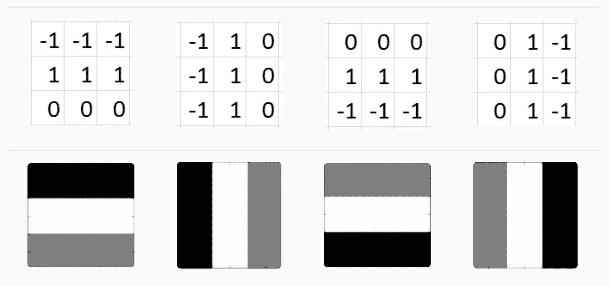

Filter Image

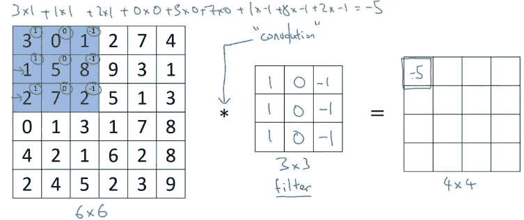

Actual Computation

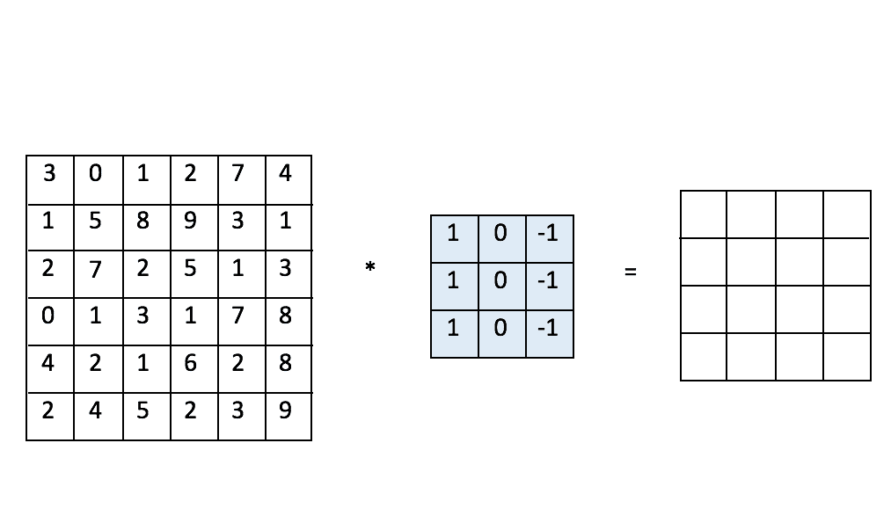

每个像素将从左到右和从上到下计算，如上图所示，将产生 4x4 矩阵作为输出，并将传递到下一层应用更多的过滤器。

**垂直边缘检测:**对于垂直边缘检测，在我们的示例中，您需要使用来自滤波器图像的第二或第四滤波器，并将其与实际图像像素矩阵相乘。

**水平边缘检测:**对于水平边缘检测，在我们的示例中，您需要使用来自滤波器图像的第一或第三滤波器，并将其与实际图像像素矩阵相乘。

经过对边缘检测的大量研究，计算机视觉研究人员发现 Sobel 和 Scharr 滤波器在边缘检测方面非常有效。

***Sobel 滤波器和 Scharr 滤波器*** 是计算机视觉科学家主要用于垂直和水平边缘检测的滤波器。

**索贝尔滤波器:**索贝尔是使用特定数字的 3×3 矩阵。


Sobel Filter

**Scharr 滤波器:** Scharr 是使用特定数字的 3x3 矩阵。

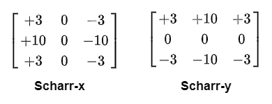

Schaar filter

## 填充:

在上面的例子中，我们在 6x6 的输入图像上应用 3x3 的滤波器矩阵，输出是 4x4 的图像。在这种技术中有两个问题:

1.  在每次迭代中，原始图像(6×6)将会缩小，并可能变成 1×1 图像。如果你有 100 个卷积层，那么你的图像可以缩小到非常小的尺寸。

如果我们假设输入图像是 N×N 维，滤波器是 f×f(通常是奇数)维，那么输出维将是 n-f+1

2.每个矩阵的角像素使用较少，并且矩阵中间的像素重叠多次。结果，我们丢失了图像边缘的信息。你可以在下面的图片中看到，用绿色填充的像素很少使用，而用红色填充的像素被多次使用。

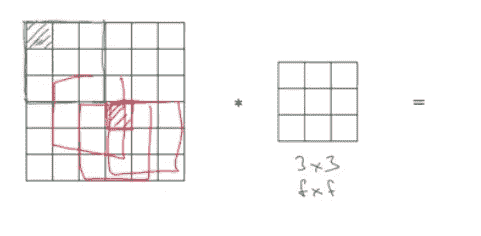

为了避免上述问题，CNN 使用图像填充技术。可以用图像矩阵周围额外像素来填充图像。在我们的例子中，我们有 6×6 的图像，如果我们在整个图像矩阵周围再填充一个像素，那么我们的输入矩阵将变成 8×8 的矩阵，现在在第一次迭代后，我们将得到 6×6 的输出矩阵，而不是 4×4 的。

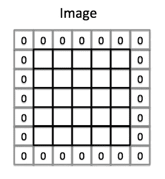

Image after extra pixel padding

因此，如果填充=1，则输出矩阵将为

(n+2p-f+1)X(n+2p-f+1)=(6+2–3+1)X(6+2–3+1)= 6 X 6(输出矩阵)。

## 有效且相同的卷积:

**有效:**表示没有填充。

**相同:**如果我们传递 6 x 6 的图像，那么填充后输出将是 6 x 6 的图像。

## 交错盘旋；

步进卷积也是 CNN 中使用的卷积的基本构件。在这种技术中，当我们在输入矩阵上从左到右和从上到下遍历时，我们将使用基于步幅值的步长。如果 stride=2，那么我们将从左到右或从上到下走两步。

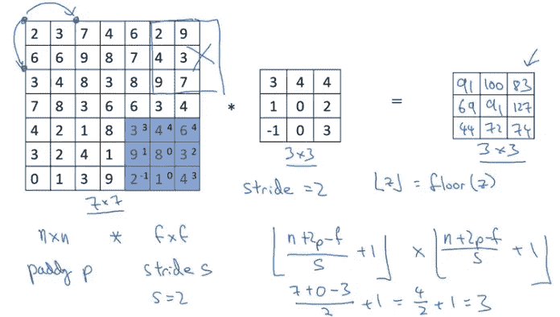

在上图中，您可以看到使用 7x7 输入矩阵和步长=2 计算输出矩阵的公式。

## 最大池:

最大池通过减少前一卷积层输出中的像素数来降低图像的维数。在下图中，你可以看到，4x4 的图像将减少 2x2 最大池矩阵使用最大数量从每个区域的像素面积。


## 平均池:

平均池是另一种类型的池，这是你从每个地区的平均值，而不是最大值。

*目前，最大池的使用远远超过平均池。*

## 为什么要用合用？

向我们的网络中添加最大池可能会有所帮助，这有几个原因。

## 减少计算负荷

由于最大池会降低卷积层的给定输出的分辨率，因此网络将在未来某个时间查看更大的图像区域，这将减少网络中的参数数量，从而降低计算负载。

## 减少过度拟合

此外，最大池化也有助于减少过度拟合。为什么最大池工作的直觉是，对于一个特定的图像，我们的网络将寻找提取一些特定的特征。

## 完整 CNN:

典型的 CNN 将具有卷积层和汇集层的组合，随后是完全连接的密集层。

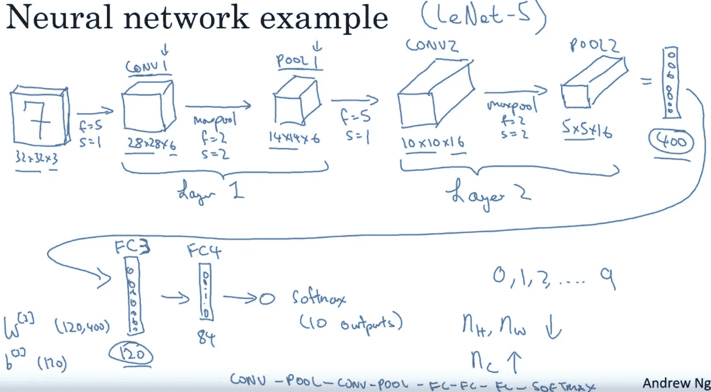

Common CNN network visualization

使用 keras，代码将如下所示:

```
import keras
from keras.models import Sequential
from keras.layers import Activation
from keras.layers.core import Dense, Flatten
from keras.layers.convolutional import *
from keras.layers.pooling import *model_valid = Sequential([
    Dense(16, input_shape=(20,20,3), activation='relu'),
    Conv2D(32, kernal_size=(3,3), activation='relu', padding='same'),
    MaxPooling2D(pool_size=(2, 2), strides=2, padding='valid')
    Conv2D(64, kernal_size=(5,5), activation='relu', padding='same'),
    Flatten(),
    Dense(2, activation='softmax')
])
```

## 物体检测:

目标检测是在单幅图像中检测单个或多个目标的技术。

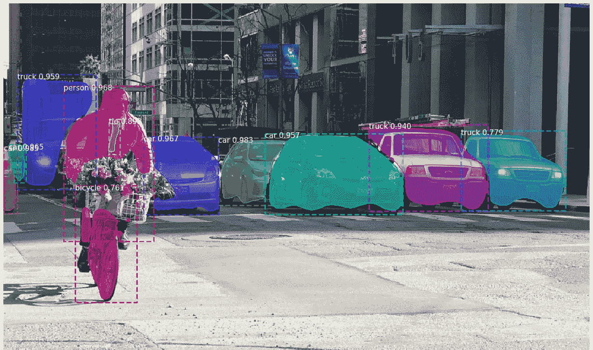

## 对象本地化:

目标定位是在每个目标周围画一个正方形边界的技术。如果你以下面的图片为例，红色方块代表物体定位。首先定义完整图像的坐标，然后计算 bx 和 by，然后定义特定对象的高度(bh)和重量(bw)。

在输出层上，你可以有多个节点来表示从提供的图像中检测到的多个对象，并且在每个节点上应该有边界框(bx，by，bh，bw)。

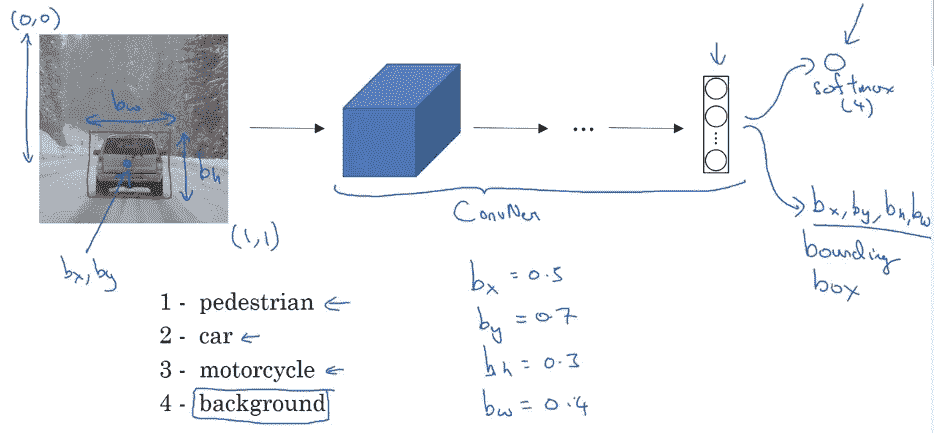

使用监督学习，我们可以从图像中分类正确的对象。在训练过程中，您可以提供每个对象的标签。如果你注意下图中 y 的值，它被定义为垂直矩阵。Pc(物体存在与否)，(bx，by，bh，bw-方盒子尺寸)，class (C1(行人道)，C2(汽车)，C3(摩托车))。在用训练数据进行训练后，监督学习算法可以从图像中检测出正确的目标。

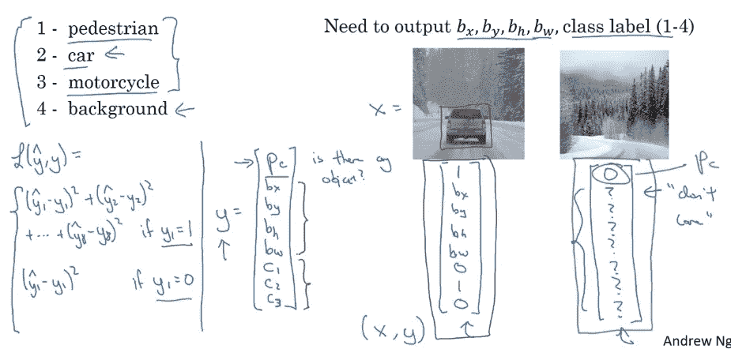

## 反向传播:

“反向传播是梯度下降用来计算损失函数的梯度的工具”。

给定输出结果，然后我们计算这个结果的损失。损失的计算方式将取决于我们使用的特定损失函数，但为了简单起见，我们现在就把它想象成模型对给定输入的分类有多远。

我们有给定输入产生的输出，然后计算该输出的损失，现在梯度下降开始使用反向传播更新我们的权重，以便最小化损失函数。

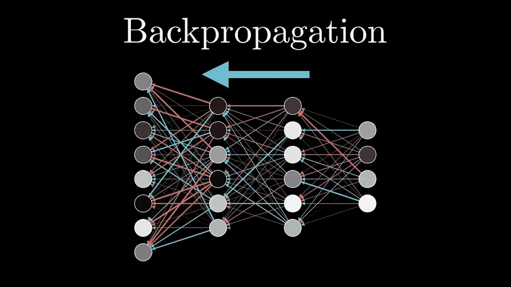

## 结论:

希望，以上的解释将给出关于使用 CNN 的图像分类和目标检测的高层次的想法。在建立 CNN 模型之前，对基本构件的理解是非常重要的。就我所知，我尽力解释 CNN 的每一个基本组成部分。

有用的资源:

[](https://adeshpande3.github.io/A-Beginner%27s-Guide-To-Understanding-Convolutional-Neural-Networks/) [## 理解卷积神经网络的初学者指南

### 卷积神经网络。听起来像是生物学和数学的奇怪结合，还有点 CS 的成分，但是…

adeshpande3.github.io](https://adeshpande3.github.io/A-Beginner%27s-Guide-To-Understanding-Convolutional-Neural-Networks/) [](https://towardsdatascience.com/simple-introduction-to-convolutional-neural-networks-cdf8d3077bac) [## 卷积神经网络简介

### 在这篇文章中，我将解释使用许多天鹅图片卷积神经网络(CNN)的概念，并将…

towardsdatascience.com](https://towardsdatascience.com/simple-introduction-to-convolutional-neural-networks-cdf8d3077bac) 

谢谢:)