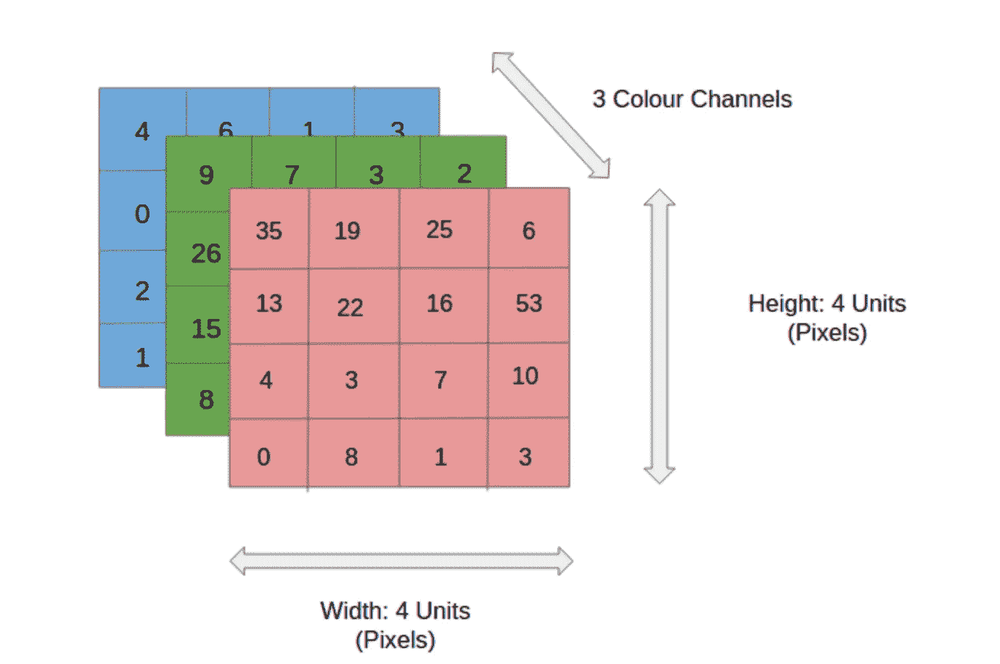
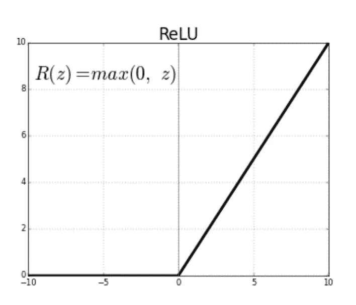
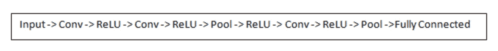
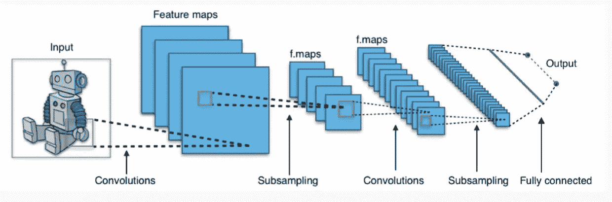

# 卷积神经网络

> 原文：<https://medium.datadriveninvestor.com/convolutional-neural-networks-e0d25a3799f6?source=collection_archive---------6----------------------->

Photo by [Andrea Reiman](https://unsplash.com/photos/9Z-YA7VtcXE?utm_source=unsplash&utm_medium=referral&utm_content=creditCopyText) on [Unsplash](https://unsplash.com/search/photos/layers?utm_source=unsplash&utm_medium=referral&utm_content=creditCopyText)

卷积神经网络(CNN)，简称 **covnets** ，专门用于处理**图像**数据。

图像识别、图像分类、目标检测、人脸识别等。，是 CNN 被广泛使用的一些领域。

查看这篇[以前的文章](https://medium.com/datadriveninvestor/neural-networks-152336f224bc)，了解神经网络的介绍。

图像中的每个像素对应于网络输入层中的一个单元。

假设待处理图像的尺寸*高* * *宽*有 3 个颜色通道，那么输入层的单位将是*高* * *宽* * *3* 。

RGB image. Image taken from [https://medium.com/@raycad.seedotech/convolutional-neural-network-cnn-8d1908c010ab](https://medium.com/@raycad.seedotech/convolutional-neural-network-cnn-8d1908c010ab)

Covnets 利用了像素值与它们的邻居**比与远处位置**更相关的事实。这导致所有像素上的权重共享。

现在，用**内核** / **滤波器**对输入数据进行卷积。这将输出一个**特征图**。特定的滤波器被设计成提取图像的一些特定特征。因此，我们在输入图层上执行大量操作(每个操作针对一个特定的要素)，其中每个操作使用不同的过滤器。

**示例**:曲线检测器功能——滤镜滑过输入图像的所有区域。在给定时间，输入图像中与滤波器卷积的区域称为**感受野**。

## 该滤波器的深度必须与输入的深度相同。

为了简化可视化，让我们假设只有一个通道输入。因此，假设滤波器的大小为 5*5(对于 3 色通道输入为 5*5*3)。

该滤波器每次滑过 5*5 大小的输入图像的所有区域，并执行卷积。每一步，过滤器都向右移动一个单位并继续。**卷积结果为单个数字。**

如上所述，这些过滤器中的每一个都可以被认为是**特征标识符**。特征可以是直边、简单的颜色和曲线。

在所有位置上滑动过滤器后，我们留下了一组数字，称为**特征图**。最后，我们将所有这些特征图作为卷积层的最终输出。

每个卷积的输出之后是**激活**以使结果输出非线性。ReLU 是使用最广泛的激活函数。它代表非线性操作的**Re**ctived**L**linear**U**nit。

ReLU Activation Function

## 为什么我们需要激活层？

激活层只不过是应用激活函数后卷积层的输出。

CNN 用于捕获特定特征，从基本特征开始，然后随着我们深入网络，增加特征的复杂性。

因此，激活功能启动或*激活*那些与我们希望提取的特征相关联的节点。

在 ReLU 的情况下，它用 0 替换节点的负值(一个不存在的特征),并保持节点的正值(指示该特征的强存在)不变。

A classic CNN architecture

现在我们可以检测特征，最后一点是将一个**全连接层**连接到网络的末端。

卷积层通常具有较小的内核大小(例如 3*3 或 5*5􏰆).在某些时候，图片是如此之小(如􏰓7*7)，以至于称之为图片是没有意义的。然后，我们将它连接到**完全连接的层**，并终止于最后一个用于**分类的 softmax 层**。

这个想法是，我们从一些低层次的特征(如图像边缘)开始，随着我们的深入，我们建立越来越多越来越复杂的特征。

参考资料:

**理解卷积神经网络的初学者指南**:[https://adeshpande 3 . github . io/A-初学者% 27s-理解卷积神经网络指南/](https://adeshpande3.github.io/A-Beginner%27s-Guide-To-Understanding-Convolutional-Neural-Networks/)

**卷积神经网络中的激活是什么？:**[https://www . quora . com/What-is-activation-in-convolutionary-neural-networks](https://www.quora.com/What-is-activation-in-convolutional-neural-networks)