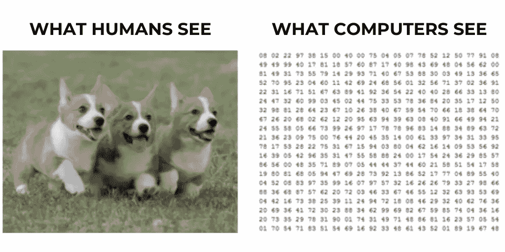
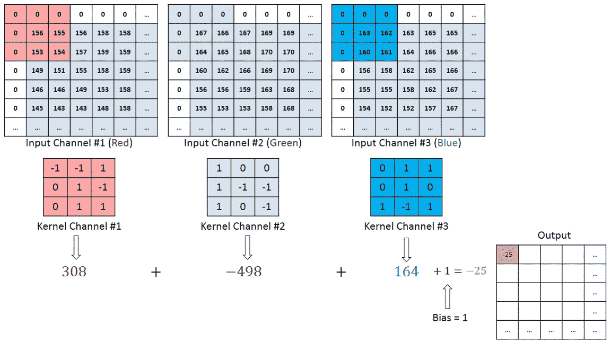
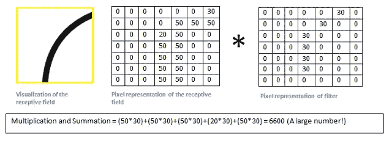
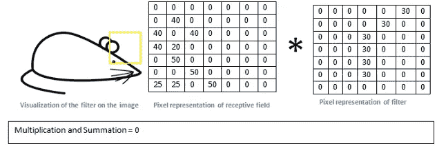
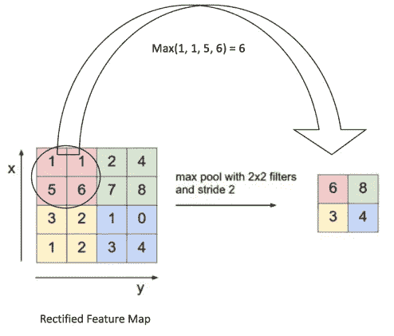
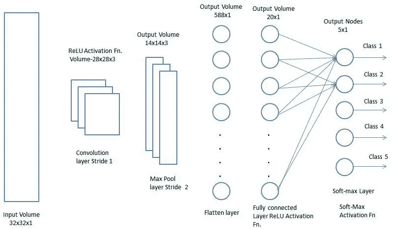

# 卷积神经网络解释

> 原文：<https://medium.datadriveninvestor.com/convolutional-neural-networks-explained-7fafea4de9c9?source=collection_archive---------6----------------------->

# 再说说 CNN 的

**卷积神经网络** (CNN)利用**深度学习**完成图像分类和识别等任务。人工智能研究人员和爱好者已经开发出基于 CNN 的方法来彻底改变面部和**物体检测**、**自动驾驶汽车**和**语音识别**🚀 🚀 🚀

神经网络比人**更快**和**更准确**，并且*始终*超越人类的能力——为人类打开新的大门。卷积神经网络的可能性是无限的，随着这项技术融入医疗保健、银行和创新的未来，它们的普及程度只会继续增长。

 [## DDI 编辑推荐:5 本让你从新手变成专家的机器学习书籍|数据驱动…

### 机器学习行业的蓬勃发展重新引起了人们对人工智能的兴趣

www.datadriveninvestor.com](https://www.datadriveninvestor.com/2019/03/03/editors-pick-5-machine-learning-books/) 

神经网络类似于国际象棋游戏，因为多个棋子一起工作——它们的运动都是相互联系的，并朝着抓住对手的国王♟️的共同愿景发展

每个单独的**节点**模拟人脑内**神经元**的连通性。每个单独的神经元对视野中被称为感受野的特定区域内的刺激做出反应；这些字段集合重叠以覆盖整个 area🧠🧠🧠

> *卷积神经网络的架构可以分解为* ***4 个主要层*** *。*

1.  卷积层
2.  非线性(ReLU 激活功能)
3.  最大池层数
4.  全连接层(分类)

# **启用计算机视觉**

对计算机视觉的基本理解是**计算机绝对喜欢数字**😱虽然人类看到这些可爱的柯基犬机器更喜欢更多的数字解释。

每幅图像本质上都是像素值的矩阵，每幅图像都有三个通道，即红、绿、蓝(原色)，这意味着图片可以转化为三个相互堆叠的二维矩阵。

对于灰度图像，像素值的范围为 0–255，其中 0 表示黑色，255 表示白色。灰度频道只有一个频道，通常更容易让 CNN 使用。

卷积神经网络的主要作用是将图像简化为一个数字阵列的*，这是更容易处理的**，而不会实际丢失图像分类所必需的特征。***

**卷积神经网络具有非常好的**空间和时间相关性**，这使得它们比普通的前向传递网络更受欢迎。**

> **本质上，计算机被输入一组数字，并输出对应于图像和每个类名的概率。**

# ****回旋****

**卷积的目的是**从输入图像中提取显著特征**。这些特征通过使用*另一个矩阵*被称为**过滤器或内核**在图像上滑动来识别——内核照亮的部分被称为**感受野**。**

****

**整个卷积层使用了多个内核- *每个内核对应于其各自的特征*。它们通常从识别更明显的特征开始，并随着每增加一个过滤器而变得更具体，以提高准确性。这创建了一个由以下三个参数控制的**激活图****

1.  ****步距** - >内核每次移动的空间数**
2.  ****填充** - >控制特征图尺寸**
3.  ****深度** - >对应于使用的过滤器数量**

**内核应用**矩阵乘法运算**，当内核**卷积**时，滤波器值乘以原始像素值，然后将这些乘积求和。**

****

**这些滤波器的实际值通过**反向传播和梯度下降**进行迭代，但我们将在后面介绍。**

> ***内核类似于覆盖特定区域(感受域)的闪光灯，并在输入图像的区域上滑动🔦***

**让我们通过下面的例子来真正理解卷积和内核是如何工作的。向右弯曲的向上的线可以被转换成像素值。给定右边所示的核的数值，我们可以识别出核正在搜索与向上的右曲线相似的图像特征。当将核应用于感受野时，我们会注意到许多重叠，因此矩阵乘法的总和非常高。**

****

**相反，下面的例子强调了老鼠的耳朵和头，如位于感受域左下角的一个圆圈和一条向下的直线所示。这些像素值与过滤器的像素值非常不同，因此矩阵乘法总计为 0，因为没有重叠。**

****

> ***这两个例子对分类都是至关重要的**——这些总和有助于计算机理解每张图像中哪些地方的某些特征更突出，从而使* ***更有信心进行区分和预测*** *。***

# ****非线性和 ReLU 激活功能****

**不管是好是坏，输入数据是*非线性的*-ReLU 函数说明了这一点，并在数据中引入了**非线性**，从而实现了更准确的预测。**

****

**ReLU 应用于每个单独的像素，并且**用 0** 替换任何负值，而正值保持不变。这种现象可以用下面的简单等式来描述。**输出=最大值(零，输入)。****

# ****最大池层数****

**在这一点上，图像已经被转换成*成百上千的矩阵堆叠在一起*——这对计算机合成、处理和解释来说是极其困难的。这里我们介绍**池层**。**

**这些基本上应用了**维度缩减**来减少**参数**的数量——这意味着需要更少的计算，并且*也减少了过拟合*的机会。合并层的另一个好处是，它们可以作为噪声抑制器，可以完全忽略任何噪声激活。**

****

**池层减少了矩阵的参数，并将输入压缩成更简单的东西，使得**仍然反映了*内核*识别的主要特征**。*最大*池层通常优先于*平均*池层，因为它们提取的主要特征是**位置不变的** -较高的值更能反映特征-因此差异将有助于更好的分类。**

> ***你也会想把***和* ***批量规格化*** *引入到你的模型中来*减少过拟合。***

# *****全连接层和分类*****

***在被输入到*多层感知器*、**之前，密集层**经常被应用。一维的当前输入输出三维张量，这对于计算机来说更难处理。***

*****展平层**将三维矩阵展开成一维矢量，然后应用**密集层**到*减少矢量的空间参数*。最后，通常应用一个 **softmax 函数**，将输出值转换成*概率*。***

******

***卷积神经网络的最后一部分包括将向量输入到**分类**模型*(多层感知器)*。这里有一些非常重要的变量需要定义。***

*   *****批量大小**决定您从数据集中使用的样本数量***
*   *****时期的数量** - >您希望模型运行确定的批量图像的次数***
*   *****详细**值将决定您如何查看每个时期的训练进度。Verbose = 0 表示您不会看到任何东西，verbose = 1 表示带有进度条的信息，verbose = 2 表示使用数字值，如“epoch 1/30”。使用哪个详细值真的没什么区别——这是您的偏好！***

***从这里开始，模型为定义数量的时期进行训练——每次，模型都经历*反向传播*,并迭代模型的权重和偏差。这属于**梯度下降**的过程。你可以看看 [**我写的这篇文章**](https://medium.com/datadriveninvestor/the-math-and-intuition-behind-gradient-descent-13c45f367a11) 固化了你对渐变下降的理解。***

******

# *****TL；CNN 博士——毕竟没那么复杂😉*****

*   ***卷积神经网络几乎适用于任何领域/行业，并以前所未有的准确性和速度超越了人类的能力***
*   ***计算机把图像的原色通道翻译成数字***
*   ***卷积识别图像特征并创建具有内核的激活图***
*   ***ReLU 激活函数将非线性引入模型***
*   ***最大池层利用降维来减少图像的空间参数***
*   ***全连接图层使用密集图层使输入更易于计算***
*   ***使用 softmax 以概率的形式输出每个定义的类***

# ***最后一件事😅***

> ****感谢您阅读我的文章，我希望您了解了更多关于* ***卷积神经网络*** *以及这种架构如何彻底改变多个行业的信息🙏如果你能做以下事情来支持我，那对我来说就意味着一切！****

1.  ***给我的文章发些**掌声**👏***
2.  *****在 [LinkedIn](https://www.linkedin.com/in/suraj-bansal/) 上连接**和我👈***
3.  *****跟随**我上[梅杜姆](https://medium.com/@bansalsuraj03) ✍️***
4.  *****查看**我的[作品集](https://tks.life/profile/suraj.bansal)了解我的最新作品💪***
5.  ***随时了解我的旅程，并**订阅**我的每月简讯🦄***