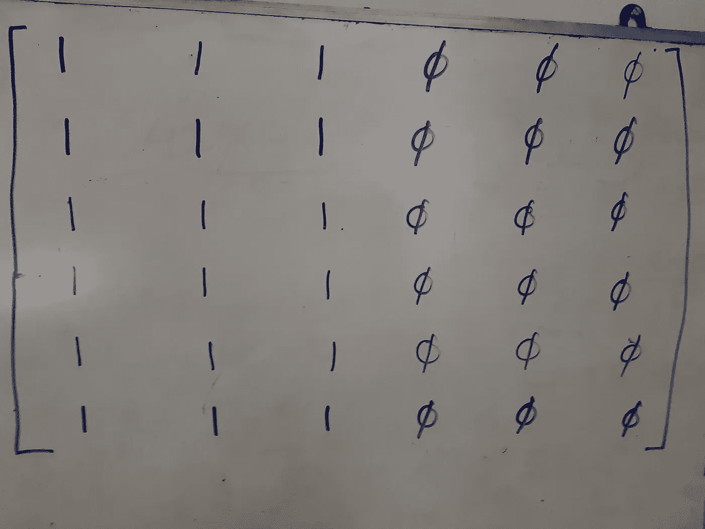
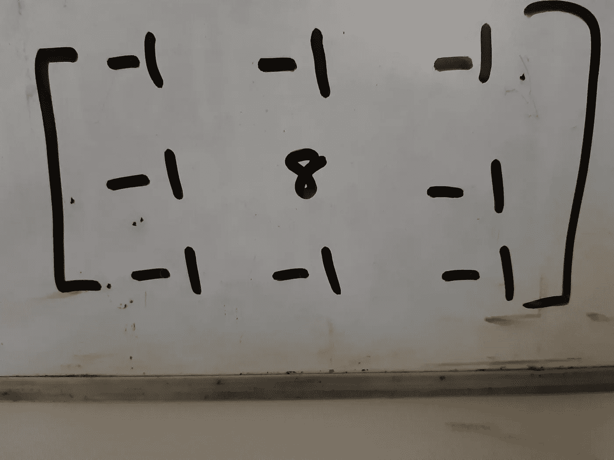
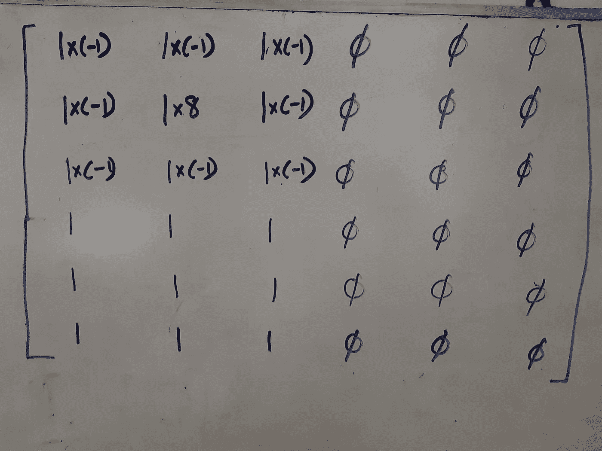
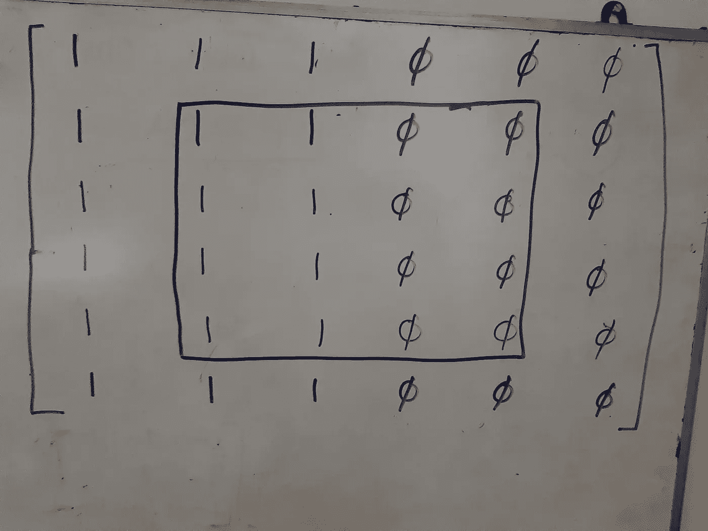
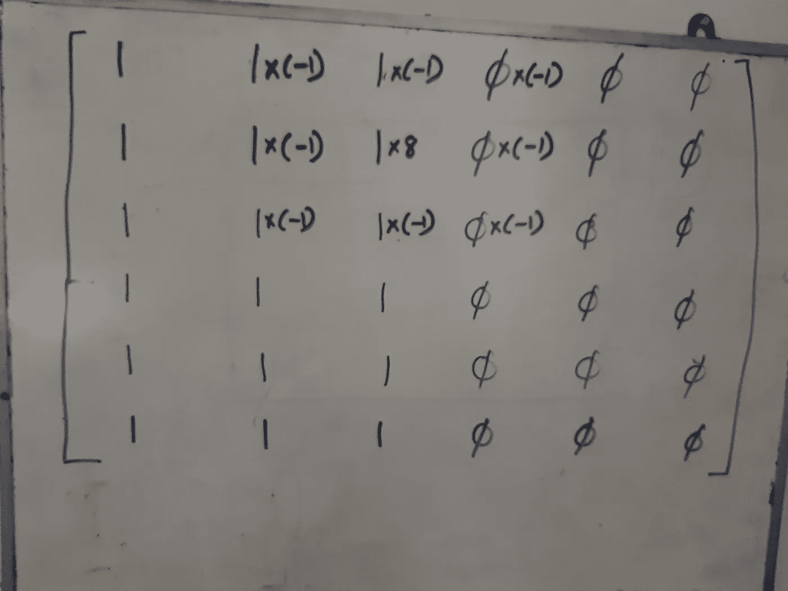
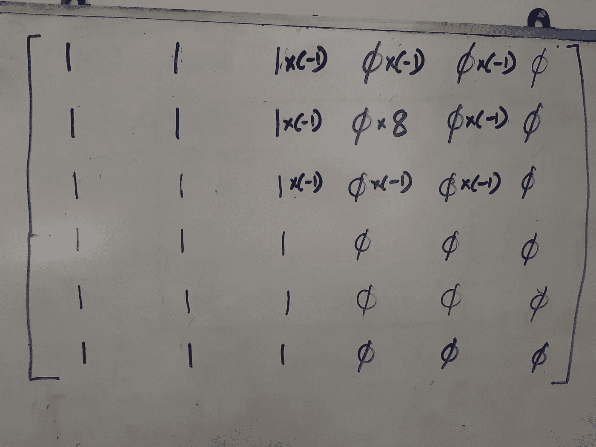
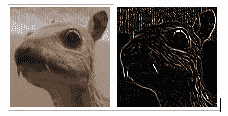

# 简化卷积

> 原文：<https://medium.datadriveninvestor.com/convolutions-simplified-50a37356b5ee?source=collection_archive---------8----------------------->

卷积神经网络(CNN)用于机器学习解决方案。让我们首先了解卷积的基本运算。卷积通常应用于图像处理中，以在图像上产生各种效果。让我们从图像处理的角度来理解卷积。

在计算机中，灰度图像存储为像素或图片元素的矩阵。每个像素存储该点图像的亮度，范围从 0 到 255。零是全黑，255 是全白，中间的数字都是灰色。彩色图像也是一个像素矩阵，但这里存储了三个不同通道的像素强度，即红、绿和蓝，它们是原色。为了简单起见，现在让我们回到灰度图像。

Image Representation

想象上面的矩阵是灰度图像的表示。1 代表白色，0 代表黑色。你也可以用 255 代替 1，但是为了简单和更容易计算，我用了 1。因此，作为一个图像，你会看到图像的左半部分是白色的，右半部分是黑色的。现在我们要做的图像处理是突出白色和黑色交叉的边缘。这是我们将为此进行的处理。

The Mask

我们将使用上面的矩阵对原始矩阵进行边缘检测，我们称之为掩模。请注意，它的中心有一个 8，周围是-1(如果算上也有八个-1，这意味着掩码中所有元素的总和是 0)。我们现在将在两个矩阵之间做一些数学运算。

First Convolution

我已经在原始矩阵上叠加了掩码和乘法符号，只需进行乘法运算，并将结果数字相加。你会得到什么？中间的那个是 8，其他的加起来是-8，所以结果是零。我们只添加受叠加和乘法影响的 9 个元素，而不是原始矩阵的所有 36 个元素。我们将很快讨论如何处理原始矩阵的所有元素。由于原始矩阵中有 36 个元素，您可以更改掩码(有 9 个元素)的位置并重复计算。你能在原始矩阵的什么地方叠加遮罩？

The Inner Matrix

你可以叠加遮罩，遮罩的中心(包含元素 8)在内部矩阵的任何元素上，我在上面的图片中用黑色突出显示了这个矩阵，它有 16 个元素。检查一下，如果您将掩码放在内部矩阵的第一列中的任何位置，您将得到相同的结果 0，因为原始矩阵到处都有 1。

如果移到内部矩阵的第二列呢？这就是黑白之间的“边界”，1 的结束和 0 的开始。

Convolution on the Edge

进行乘法运算，然后将它们全部相加，您将会看到，由于我们丢失了 3 个-1 到 0，我们将得到 8–5 = 3。这是 1 结束的边缘。如果我们将掩码再向右移动一列会怎么样？

The Other Edge

这是 0 开始的边缘。继续计算，你会看到结果是-3。将掩码再向右移动一列？原来的矩阵都是零，所以乘法和加法后结果也是零。如果在内部矩阵的特定元素的位置叠加遮罩的中心后，用此计算的结果替换内部矩阵的每个元素，您将得到以下结果。

The Result

您可以看到“白色”和“黑色”(原始矩阵的第二列和第五列，现在是您在上面看到的结果中的第一列和第四列)已经变成零(黑色)，而边缘(从白色到黑色的交叉)已经变得突出，相应列中的值为 3 和-3。

真实的图像很少会像上面的例子那样左边是白色，右边是黑色，但是原理是一样的，只有边缘被突出显示，而其他的都变成 0(黑色)。我们在上面执行的操作称为卷积，其中我们将元素相乘，然后相加，最后替换原始矩阵中心的元素。上面我们称之为遮罩的较小矩阵也称为内核。

Original Image and After Edge Detection

原图中的例子摘自维基百科的一篇文章[https://en . Wikipedia . org/wiki/Kernel _(image _ processing)](https://en.wikipedia.org/wiki/Kernel_(image_processing))。你会发现这篇文章启发了更多的卷积运算，如图像锐化，图像模糊等。这在许多图像处理操作中是有帮助的。