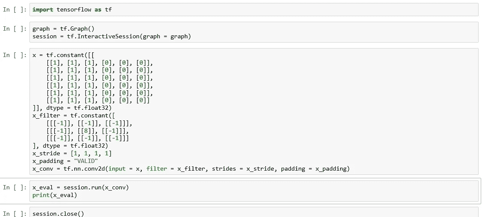
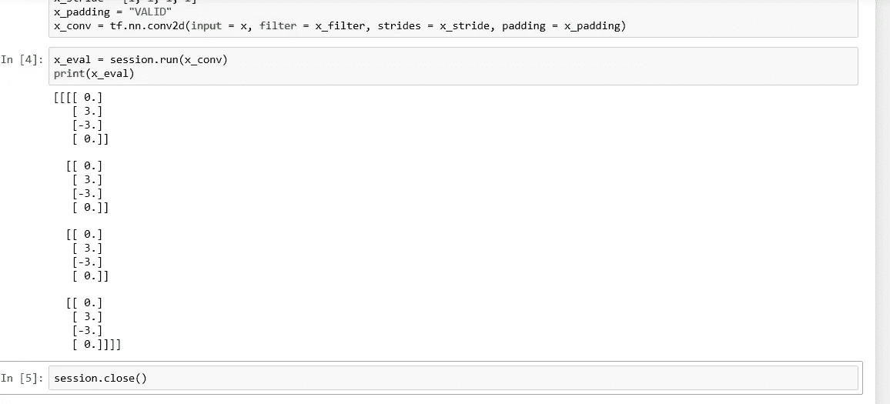
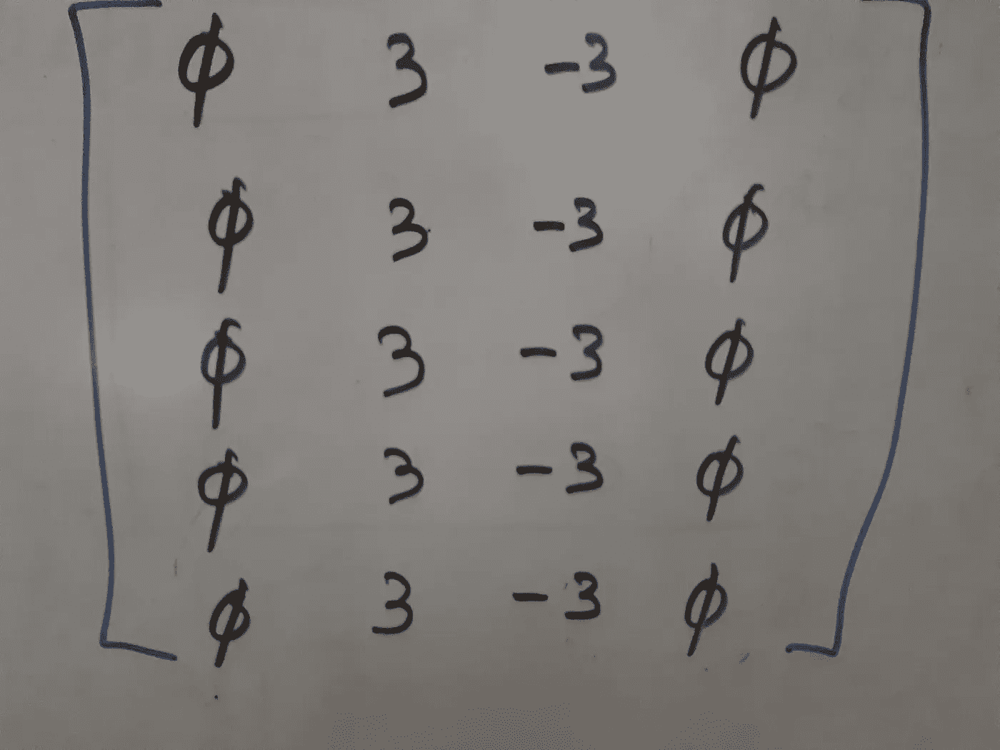

# 使用张量流的卷积

> 原文：<https://medium.datadriveninvestor.com/convolutions-using-tensorflow-85fc9b5075d5?source=collection_archive---------15----------------------->

在上一篇文章“卷积简化了 T1”中，我们讨论了卷积的矩阵操作操作，以及如何将它们应用于边缘检测等图像处理任务。然后我们手动计算这些值。我们现在将讨论如何使用 TensorFlow(一个流行的机器学习库)来计算这样的运算。关于基本张量流操作的介绍，请参考另一篇以前的文章，“[开始张量流](https://link.medium.com/ky1qWQ4nsS)”。

我首先在笔记本中给出代码，但不执行它，因为你可以看到完整的代码，而不必滚动。

Implementing a Convolution

我将在一会儿开始解释所有这些括号。你会注意到矩阵和遮罩和我在“[卷积简化版](https://link.medium.com/d1p28m6DrS)”文章中的一样。所以让我们运行代码，看看结果是否和我们在那里计算的一样！

Convolution Implemented

结果与我们在上一篇文章中计算的结果相同，如果您不能联系起来，您只需用适当的行列符号重写矩阵。

现在让我们讨论表示矩阵和其他类似结构的符号。我们通常如何写一个数字列表？像这样:[1，2，3，4，5]。像这样的列表也被称为一维张量。那么我们如何写出一个数字矩阵呢？像这样:

A Matrix

这就是你在白板上写矩阵的方式。用 Python 怎么样？我们会认为矩阵是一系列列表，一个二维张量。让我们把上面的矩阵写成一个数字列表。这里是:[[0，3，-3，0]，[0，3，-3，0]，[0，3，-3，0]，[0，3，-3，0]]。推而广之，三维张量是一系列数字的列表。为了写一个例子，让我们取另一个二维张量:[[1，2，3，4]，[5，6，7，8]，[9，0，1，2]，[3，4，5，6]]。现在让我们通过列出两个二维张量来创建一个三维张量:[[0，3，-3，0]，[0，3，-3，0]，[0，3，-3，0]，[0，3，-3，0]，[[1，2，3，4]，[5，6，7，8]，[9，0，1，2]，[3，4，5，6]]。你可以把它想象成一个长方体(立方体的三条边长度必须相同，长方体的三条边长度可以不同)。

现在让我们举一些特例。一个矩阵可能只有一行，我们将把它写成[[0，3，-3，0]]。如果我们的矩阵只有一列呢？那么每一行只有一个元素，我们将把它写成[[0]，[3]，[-3]，[0]]。如果一个三维张量只有一个矩阵呢？我们将把它写成[[[0，3，-3，0]，[0，3，-3，0]，[0，3，-3，0]，[0，3，-3，0]]。如果我们的三维张量有两个矩阵，每个矩阵有一行呢？那就要[[[0，3，-3，0]]，[[1，2，3，4]]。而如果三维张量有两个矩阵，每个矩阵有一列呢？即[[[0]，[0]，[0]，[0]，[[1]，[5]，[9]，[3]]]。

让我们想象一个二维张量，只有一行一列。那可以[[1]]。如果两个这样的二维张量组成一个三维张量呢？可能是[[[1]]，[[2]]。在上面所有的例子中，我都是随机选取括号中的数字，我只是在说明如何在我讨论的不同场景中使用括号。

我们在本文开头介绍的 Python 笔记本中使用了 conv2d 函数。查看 [TensorFlow 教程](https://www.tensorflow.org/api_docs/python/tf/nn/conv2d)中函数的语法。请注意，输入参数是一个四维张量，默认情况下维数为[batch，height，width，channels]。因为我们没有单独的 RGB 通道，所以我们只有一个通道，所以我们将它写成[1]或[0]。我们使用[1]或[0]作为元素创建通道的二维矩阵，并创建三维张量。最后，神经网络通常同时使用多行数据进行训练，这些行一起称为一批。由于我们在批处理中只有一个元素，我们用一对额外的方括号将三维张量包围起来，这样我们就有了四维张量。

conv2d 函数的下一个参数是滤波器或尺寸掩码[filter_height，filter_width，in_channels，out_channels]。因为我们没有独立的输入或输出通道，所以我们只有一个元素，[[-1]]或[[8]]。我们用这些元素做一个二维矩阵，为参数创建一个四维张量。步长参数指示在四维张量的每个维度中要移动多少个元素。在我的“[卷积简化版](https://link.medium.com/d1p28m6DrS)”文章中，我已经解释了我们通常如何在完成卷积的一个步骤(每对元素的乘法和随后的加法)后移动一个元素，然后重复输入张量的下一个元素。我们已经为最后一个参数 padding 传递了“VALID”。这意味着正如“[卷积简化版](https://link.medium.com/d1p28m6DrS)”文章中所解释的，只有内部矩阵中以黑色突出显示的元素才会位于任何卷积步骤的中心。另一种方法是在输入矩阵周围填充额外的元素，这样原始输入矩阵的所有元素都可以位于某个卷积步骤的中心，这里我们不这么做。

卷积在图像处理中的许多地方使用，卷积神经网络在机器学习中有许多应用。我们学习了如何使用 TensorFlow 库进行卷积。