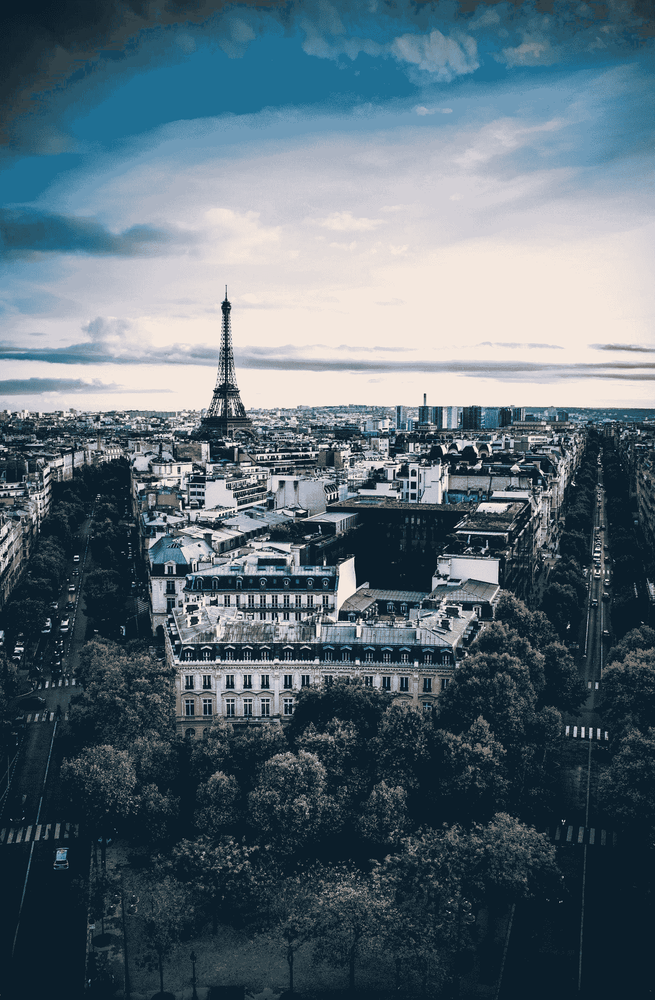
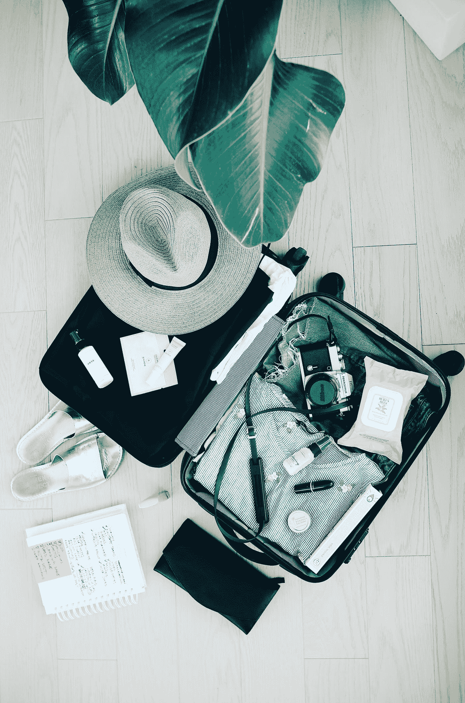
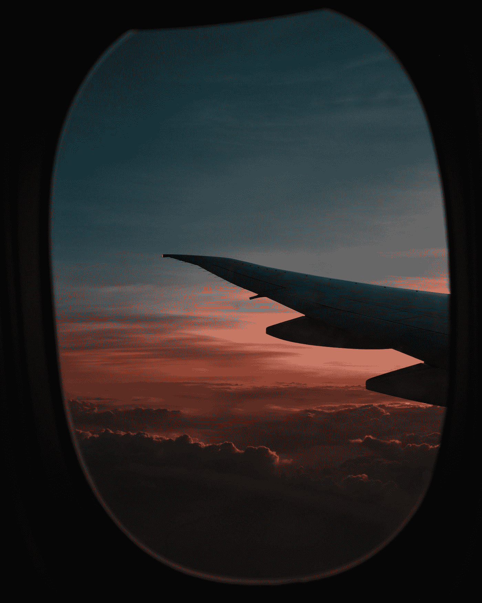

# Airbnb 发展的酷方式

> 原文：<https://medium.datadriveninvestor.com/cool-ways-airbnb-can-evolve-1e511a2d5c5?source=collection_archive---------21----------------------->

*我展示了 Airbnb 的一个深入例子，以及他们如何发展自己的产品和商业模式。这是我上一篇关于下一代产品的文章的延续。以下是我提出的总体假设:*下一代消费产品将围绕工程化体验和基于体验的产品来设计、构建和销售技术。* *

Photo by [Eric Huang](https://unsplash.com/@erickeyellow?utm_source=medium&utm_medium=referral) on [Unsplash](https://unsplash.com?utm_source=medium&utm_medium=referral)

通过写一篇大文章，我开始意识到人类在经历方面至少在某种程度上是贪得无厌的。作为一个民族，我们必须不断创新，否则我们将不复存在。事实。😃

当你的目标是制造一个真正的产品时，简单性就成了一种催化剂，让你能够交付一个带来巨大价值并触及用户生活的产品。

让我带你看一个深入的案例研究，我希望在未来几年看到 Airbnb 在哪里创新。

“green dome near brown wooden dock near green leaved trees” by [Kyle Glenn](https://unsplash.com/@kylejglenn?utm_source=medium&utm_medium=referral) on [Unsplash](https://unsplash.com?utm_source=medium&utm_medium=referral)

早在 Airbnb 试图找到产品与市场的契合度([附注:这是一篇更好地了解 P-M fit](https://firstround.com/review/how-superhuman-built-an-engine-to-find-product-market-fit/) 的必读文章)并进入高速增长模式时，UX 研究&设计公司的负责人丽贝卡·辛克莱(Rebecca Sinclair)发现，他们“线下的体验——去巴黎旅行或在树屋停留——是(用户)从我们这里购买的东西，而不是网站或应用程序。”这时他们意识到“产品就是旅行”阅读整篇文章,了解让他们更上一层楼的发展战略。这里重要的一点是要认识到产品本身就是旅行的**体验**。2011 年是该公司的一个转折点，现在该公司的市值约为 310 亿美元。非凡的增长轨迹和不可思议的产品。

现在我们对 Airbnb 如何改变战略成为世界领先的旅游公司有了一点了解，这里有一些让我感兴趣的想法。

虽然今天我们可以从各种旅行中进行选择，但看看 Airbnb 是否提供真正知名的世界旅行者策划的旅行会很有趣。这个旅行策展将包括他们去过的地方的列表，以及他们吃饭的地方，他们的互动等等。假设你以前从未去过法国，你一直想去，但你想获得一种文化和当地的体验，而不是典型的旅游谷歌推荐的体验。如果能从一个真正了解法国旅游的人那里得到一个经过验证的最佳体验，那将是非常棒的。

Photo by [Augustin de Montesquiou](https://unsplash.com/@augustindem?utm_source=medium&utm_medium=referral) on [Unsplash](https://unsplash.com?utm_source=medium&utm_medium=referral)

他们会知道最好的咖啡店，最好的能买到完美法式长棍面包的商店，这几乎就像是在法国的个人漫步。从那些最常使用 Airbnb 旅行的人(比如说，前 1%的人)那里获得推荐，并根据他们的经历和评论策划某种列表/旅行，也不会太难。你可以把这想象成类似于 Spotify 和 Apple Music 让人们管理他们著名的播放列表。真正让我吃惊的是:随着人工智能和计算能力的急剧增长，人们经常想要的产品是节省时间的服务和那些由人管理的服务。你能想象去看一群机器人打篮球而不是看勒布朗·詹姆斯吗？用埃隆·马斯克的话说，“人类被低估了。”

说到策展，TechCrunch 刚刚发表了一篇文章，介绍了 Airbnb 如何建立协作工具，让同路人一起计划旅行。我将为您节省时间，它让您能够将同行者添加到您的旅行计划中，在主板上分享想法，并评论/讨论旅行的注意事项。一个有趣的功能，如果运行良好，可能有助于用户增长和参与。这是另一篇关于 Airbnb 的有趣文章，他们[计划在 2019 年](https://www.fastcompany.com/90271599/exclusive-airbnb-will-start-designing-houses-in-2019)出售房屋。Airbnb Samara 的未来部门正在开展一个名为“后院”的项目，“努力设计和原型制作建造和共享房屋的新方式”，该公司首席产品官兼联合创始人乔·格比亚(Joe Gebbia)说。这是一种令人印象深刻的方式，通过进入物理空间、建筑和城市规划来支持业务，这对于一家数字软件公司来说是独一无二的。这些后院单元将在尺寸和功能非常卧室，浴室和新鲜的生活空间，可能会活跃一个新的用户市场。绝对期待 2019 年的原型发布！

Photo by [STIL](https://unsplash.com/@stilclassics?utm_source=medium&utm_medium=referral) on [Unsplash](https://unsplash.com?utm_source=medium&utm_medium=referral)

如果你从[第一原则](https://www.youtube.com/watch?v=F5dgivEa_eY)(“独立的基本命题或假设”，就像物理学中的一些原则)开始思考旅行，你会问这样的问题，你如何为个人创造最佳体验？你如何分解一次旅行，如何定义一次旅行？一次旅行的必需品是什么？最基本的是后勤(日程安排、航班、住宿等)、财务(一个人能负担得起的费用)和待办事项(一个人在旅途中想要完成的事情)。

虽然可能有一些东西在工作中，我很惊讶没有一个明确的忠诚度计划为他们的旅客。我认为你可以用积分和免费/独家赠品将旅游应用游戏化，这将为旅行者和主人带来平台忠诚度。这些点可以派上用场，以进一步研究日益增长的用户群。您获得的积分越多，奖励越高。类似于今天航空公司已经拥有的东西，甚至可以考虑与信用卡公司合作来积累积分。

Photo by [Leonardo Yip](https://unsplash.com/@yipleonardo?utm_source=medium&utm_medium=referral) on [Unsplash](https://unsplash.com?utm_source=medium&utm_medium=referral)

说到这里，我希望 Airbnb 开始参与他们旅行/体验中的航班流程。在我看来，飞行是旅程中非常重要的一部分，也许是旅行者最兴奋的时刻之一。如果他们可以与某些航空公司合作，让他们的用户可以进入他们的休息室，免费获得航班的 Airbnb 杂志，或者建立合作关系，让你可以在应用程序上办理航班登机手续。在你的手机上虚拟连接机场也很好，这样你就可以准确地知道去哪里，以及机场商店内是否有专门针对 Airbnb 旅行者的独家交易。这里的想法是你如何创造一个无缝的旅行体验。没有什么比一个应用程序更好的了。类似于优步希望在未来十年实现的东西，一个交通应用程序，允许你通过独立的应用程序在世界各地使用自行车、滑板车、汽车和航班，可能是全天候的。

Airbnb 旅舍的概念(我听说他们正在研究这个问题，但没有得到证实)，虽然他们的大多数选择都提供房间，但这可能是那些寻求异国情调的逃避和想要与其他独自旅行者会面和旅行的人的一个选择。把这看作是当前陈旧的旅馆业的现代化。旅馆可以由当地人经营，包括导游和当地员工。在设计方面，内部将通过展示 Airbnb 的价值观来精心打造。这也为他们提供了一种更加结构化和可持续的方式，在自然灾害期间，当公司向人们敞开大门时，甚至是在向有需要的人提供临时住房时，他们都可以提供帮助。

Photo by [rawpixel](https://unsplash.com/@rawpixel?utm_source=medium&utm_medium=referral) on [Unsplash](https://unsplash.com?utm_source=medium&utm_medium=referral)

虽然去未知的地方旅行听起来令人兴奋，但它们需要付费。可以肯定地说，旅行对世界各地的人们来说仍然有些遥不可及。如果能看到像 Airbnb Finance 这样的东西出现，那将是令人惊讶的，它允许用户分期支付度假费用。如果 Airbnb 真的相信旅行的力量，他们需要能够让人们探索更多，而这只有在有人能够采取财政措施实现这一点的情况下才会发生。了解印度尼西亚的打车应用 Go-Jek 如何向用户提供金融科技产品。当您通过数据的力量融合不同的业务部门时，会发生不可思议的事情。

有很多想法被抛出，但最让我兴奋的是对数据的访问，这将进一步使产品给你更个性化的感觉。随着更多相关数据被输入到改进的机器学习算法中，这将为根据你对食物、地点、天气、生活条件、财务稳定性和许多其他有趣因素的偏好来创建你的个人旅行顾问铺平道路。也许将原始数据个性化为洞察力可能是为现代旅行者创造难以捉摸的最佳体验的方式。只要想想亚马逊在我们生活中的交织方式，以及我们每次使用他们的服务时，他们有多少关于我们购买行为的数据。虽然有些人可能会感到震惊，但像这样的[文章已经开始揭示预期运输模型和价格优化等实践。亚马逊正在利用每一点数据来了解你，以便以一种创造性的方式实现利润最大化。](https://www.investopedia.com/articles/insights/090716/7-ways-amazon-uses-big-data-stalk-you-amzn.asp)

游戏化、探索和独特的解决方案必将让位于新的体验。你看，这种经历总是存在的。你是暂时的(想想你去主题公园的时候和你生活中普通的一天)。

大多数软件企业将发生转变，开始意识到需要强调推动解决客户面临的问题和提供创新解决方案的目标，而不是推动经常充斥着功能安装的产品路线图。

一个很好的例子就是虚拟现实和过山车在六旗游乐园的融合。通过软件想象增强身体刺激的结合。

仔细想想，当你读到 PayPal 最初的用户界面设计师最近的一条推文，说“对客户来说，参与你的产品比更多的功能更有价值”,这是很有意义的。销售你的产品时，从人们如何使用它开始，而不是它有什么功能。”

也许本杰明·富兰克林在他的一篇永恒的文章中说得很好:“人是一种社会性的生物，据我所知，被社会排斥是最糟糕的惩罚之一。”对连接世界和带来不可思议的体验的追求还远远没有结束。

随着人工智能和普遍多元化的出现，我们将看到我们的社会逐渐转变为史诗般的迪士尼乐园，在那里一切都是一种美丽的体验，甚至可能是一种上瘾的体验。

**摘要:下一代消费产品将围绕工程体验和基于体验的产品来设计、构建和销售技术。**

*当然希望你喜欢。如果你喜欢这个，你会 also❤️我的播客，* [*人民的愿景*](https://itunes.apple.com/us/podcast/vision-of-the-people/id1386339640) *在那里我采访了鼓舞人心的世界领导人(Twitter 的联合创始人，Virgin Orbit 的首席执行官，General Catalyst 的 MD，等投资运营数十亿美元的公司&,谈论他们的产品，愿景和建议，他们将与那些也希望对世界产生影响的年轻人分享！期待收到你的回复。在推特上找到我@LilRushiShah*

*特别感谢 Adi 的阅读和点评！*

## 多❤️
下次见，继续努力！