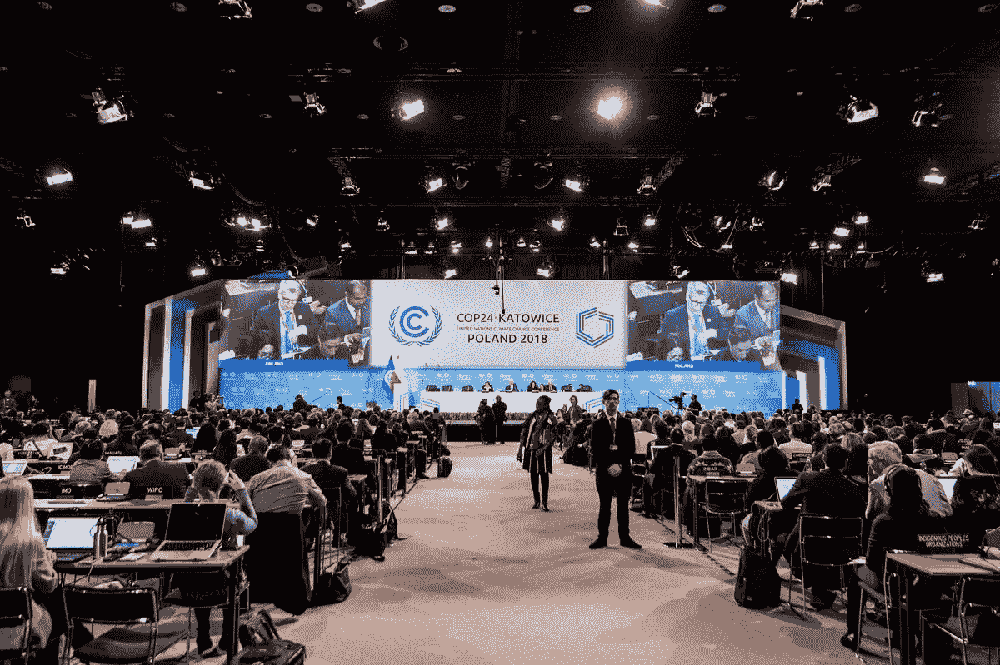
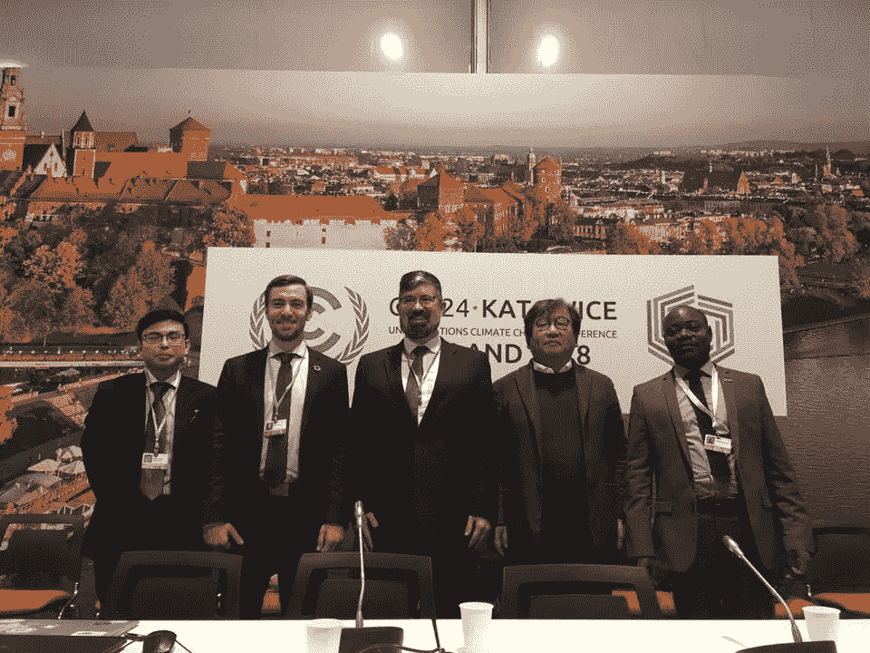
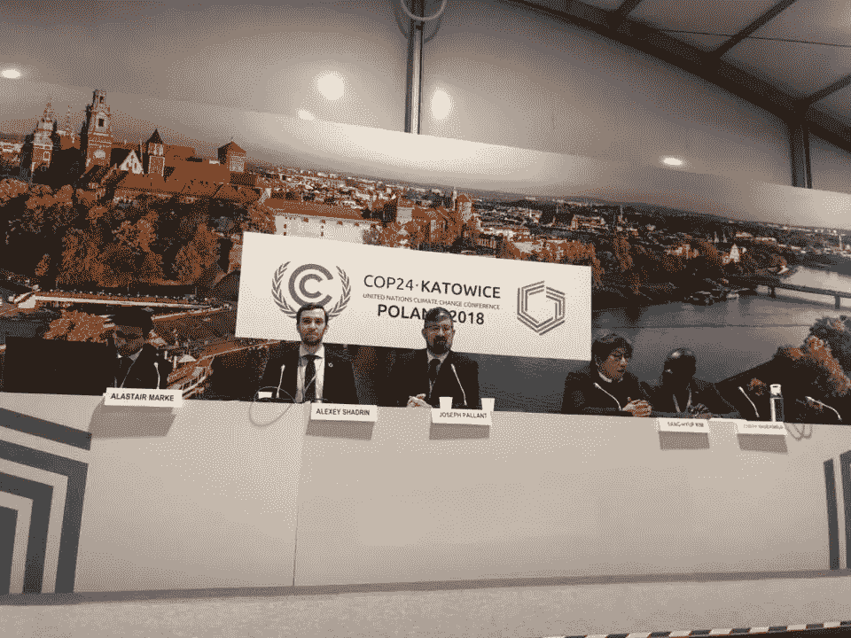
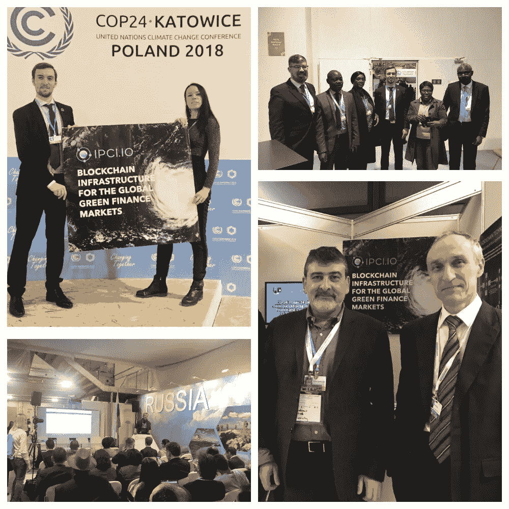

# COP24 底线:区块链为最脆弱的国家带来气候融资

> 原文：<https://medium.datadriveninvestor.com/cop24-bottom-line-blockchain-brings-climate-finance-to-most-vulnerable-states-e18943b3b70c?source=collection_archive---------30----------------------->

分布式账本技术正在帮助发展中国家建立一个吸引气候融资的值得信赖和具有成本效益的框架

区块链的优势，如点对点交易的可能性、透明度和数据的不变性，可以帮助满足气候融资中环境项目的需求:这是 12 月 14 日举行的 COP24 官方会外活动“分散的完整性:气候融资和碳市场”的中心思想，引起了来自非洲和亚洲发展中国家的嘉宾的极大关注。

该活动由区块链气候研究所、SMEFUNDS(通过促进非洲可持续企业发展来消除贫困的国际非政府组织)和道 IPCI(一家开发了世界上第一个发布和交易绿色金融工具的开源区块链平台的科技公司)组织。代表小组发言的有 Alastair Marke (BCI)、Alexey Shadrin(道)、Joseph Pallant(区块链促进气候基金会)、Sang Hyup Kim(我们共同未来联盟)、Joseph Badevokila (CTCN)。

区块链气候研究所(BCI)是一个智库和咨询组织，联合了来自 30 个国家的 80 名专家，研究将分布式账本技术应用于可再生能源投资、排放交易和适应融资等气候相关领域的机会。该研究所的专家出版了《T2》一书,《用区块链转变气候融资和绿色投资》,以推广分布式账本解决方案，加速全球气候行动，并让全球受众看到这些解决方案。

“区块链气候研究所的作用是**将决策者和创新者**聚集在一起，”世界银行和 BCI**气候**变化前主任兼 BCI 咨询委员会主席 James Close 说。

**刻不容缓的创新仪器**

区块链是一种新的存储数据的工具，无论我们想避免伪造和降低成本。道 IPCI 联合创始人阿列克谢·沙德林提醒说，这是《联合国气候变化框架公约》、各国政府和越来越多的公司所承认的。该技术可以为投资和气候项目的影响监测提供一个可信的、具有成本效益的框架，从而为不同类型的气候行动增加价值。

小组成员侧重于气候融资，这有助于为面向气候的项目带来资金，如植树造林、碳汇、可再生能源设施和各种清洁技术，这些项目可能需要许多国家花费大量资金来实施。

“为了将全球气温上升保持在比工业化前水平高 1.5-2 度的水平，到 2030 年，我们每年需要 5000 亿美元，如果气温上升的目标没有实现，用于适应的资金可能会大幅增加。另一个必要条件是透明度。2016 年，只有一半的国家遵守了《联合国气候变化框架公约》的透明度要求，以便其气候资金可以追踪。第三项要务是帮助发展中国家获得气候融资。他们中的许多人无法满足国际气候基金的严格认证要求，气候项目往往需要数年时间才能通过不同的中介机构获得资金。考虑到应对气候变化的紧迫性，我们根本没有时间等待，”BCI 总干事阿拉斯泰尔·马克描述了这种情况。

“在使用分布式账本技术时，交易二氧化碳减排量可能会更有效。我们有一项重要的任务是跟踪气候融资，”詹姆斯·克洛斯说。“我认为区块链拥有巨大的分布式发电潜力。澳大利亚就是一个例子，在那里，对等能源贸易成为可能，”他补充道。

为了提高收集气候数据和计算碳减排量的精度，区块链可以与卫星系统、物联网传感器和无人机集成。

**缓解气候变化的分布式完整性**

Joseph Badevokila 谈到了脆弱国家气候融资的障碍。他来自刚果，今天气候变化的影响在这个国家非常明显。“曾经几乎和亚马逊河一样大的刚果河正在干涸。你不能再导航了。它曾经是乍得、喀麦隆和其他国家货物的主要通道。现在不可能使用了:在一些地方，它的深度不到三米，”他告诉客人。

Badevokila 先生强调，全球变暖扰乱了季节变化和农业周期，威胁到刚果和其他非洲国家的粮食安全。因此，适应金融的需求十分迫切。这些国家面临的问题包括政府缺乏气候融资的知识和技术，或者无法满足金融机构的要求。然而，分布式气候融资系统的广泛应用可以将这些国家团结起来，共同应对全球变暖带来的灾难性后果。

**无银行账户者的连锁资金**

Alexey Shadrin 强调说:“该项目的目的是将气候融资带到没有银行账户的国家”，他详细介绍了道 IPCI 的[用例](https://ipci.io/wp-content/uploads/2018/12/daoipci-cop24.pdf)，这是一个改变游戏规则的区块链解决方案，用于绿色金融工具的验证、发行和交易。它基于自动执行的智能合同，所以人类对这个过程没有太大的影响；这有助于将欺诈风险降至最低。在第 24 次联合国气候变化大会上，[的开发者 Sergey Lonshakov 和 Alisher Khassanov 现场演示了在道上启动环保项目的过程。一年多前，在联合国气候变化框架公约第 23 次缔约方会议上，提出了一份《巴黎协定》第 6 条的即用型议定书，以核查、发布和交易国际热带木材组织。](https://ipci.io/blockchain-demo-at-cop24-showed-x10000-cost-reduction-in-direct-climate-action/)

“由于没有中介机构，环保项目的启动是免费的，而经核实的碳减排量的发放(T4)比传统的碳登记册便宜 10 倍(T5)。”

2018 年，一个可再生能源项目开发商正在部署道 IPCI 协议，以将其应用于偏远的村庄。该项目包括将区块链与可以测量太阳能消耗的智能电表结合起来。给定使用的能源量，智能合同将计算可交易令牌中联网家庭的奖励。除了智利(明年第 25 次联合国气候变化大会的主办国)，这个项目现在正在扩展到非洲和巴西。

“我看到了一个令人耳目一新的景象——俄罗斯人的展示，他们并没有忙着出售他们的自然资源，而是展示了他们几十年来统治国际象棋世界的智慧:他们赞美“工业 4.0”的优点、第四次工业革命和区块链的美丽，”记者 Alex Carlin 在他的博客[中写道。](https://www.exposedbycmd.org/2018/12/04/dispatches-from-cop-24-climate-change-summit-in-poland/?fbclid=IwAR1ZyilG8xHl-FMiKXj5t_LtLrIHqVWhvr2DINA-xLOLwmNXSPK3aHlnHB8)

**不可信的统一**

开创性的胶印开发者和气候基金会区块链创始人 Joseph Pallant 告诉与会者，区块链技术是实施巴黎协定第六条“实现减排和跨境投资合作”的最佳解决方案。为此，他们需要 ITMO——可在国际上转让的二氧化碳减排成果，一种碳资产。这一工具旨在跟踪国民账户之间二氧化碳减排量的转移，并确保《巴黎协定》所要求的透明度。“通过区块链，我们可以在个人令牌中存储个人信息，我们可以为每个 ITMO 提供一个一次性令牌，其中将包含有关国家、项目、单位和交易的信息，”帕兰特说。为了引领最佳实践，他致力于加拿大国家碳账户的区块链化。

**区块链岛**

“我们共同的未来联盟”主席金相秀(Sang-Hyup Kim)邀请在区块链工业和绿色技术领域有雄心壮志的人，到韩国“区块链岛”开发这些项目。虽然韩国是禁止各种 ICO 的国家。然而，为了不错失区块链带来的优势，当局允许建立一个特区。

自治的济州岛是韩国最大的岛屿，大约有 70 万人居住在那里。它的独特之处在于，它将是一个拥有监管沙盒的特区，对区块链来说没有严格的监管。此外，济州已经制定了到 2030 年成为无碳岛的目标，并积极实施创新的能源工具:智能电网和存储系统。在济州岛，ico 将被允许，区块链技术将被应用于公共服务以提高其效率。金先生说，在第二十四次缔约方会议上，他成功地找到了能够为实现《巴黎协定》提供新动力的领导人和解决方案。

[看完整视频](https://attend-emea.broadcast.skype.com/en-US/2a6c12ad-406a-4f33-b686-f78ff5822208/9403d709-6981-4b92-a06a-41ac4075ca01/player?cid=v2q5g3ojb6ccfp7riqzezvb7ka572fdrttbaqvhbz53cu7wgtthq&rid=EMEA)

正如我们所看到的，虽然更广泛的 COP 过程不得不延迟进展，但是较小的团队正在实施工作解决方案。会议结束时，小组收到了来自易受气候变化影响的领土的来宾提出的许多问题。

演讲者将很乐意与每个需要的人分享他们的知识和开源技术，并邀请所有感兴趣的人和组织合作应对气候变化，帮助受全球变暖影响的人适应气候变化。区块链促进气候基金会和道愿意与政府、非政府组织、私营公司和影响力投资者合作，团结他们更有效地实现巴黎协定的承诺。最后，邀请每个人继续支持直接气候行动，使用独特的[区块链二氧化碳计算器](https://co2offset.russiancarbon.org)为航空旅客，允许抵消旅程的碳足迹。如果你是以太坊的新手，这篇文章将[引导你](https://medium.com/@DAO_IPCI_64048/a-guide-to-ipci-carbon-offset-calculator-830055cc495d?fbclid=IwAR3D3HBLkjoEHnLMifQpI3DumCrLORByst2FbIfk2sjLh7bJ--zlj_ZlxXk)完成这个过程。