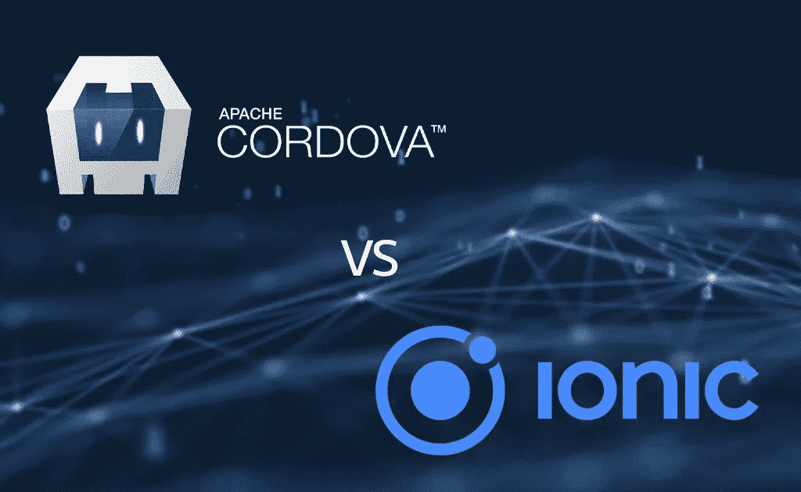

# 科尔多瓦与爱奥尼亚——为你的应用选择什么样的框架

> 原文：<https://medium.datadriveninvestor.com/cordova-vs-ionic-what-framework-to-choose-for-your-app-99b031ceddcb?source=collection_archive---------16----------------------->

Ionic 和 Cardova 都是用于创建混合应用的框架。由于两种框架各有利弊，很难说哪一种是更好的选择，因为需要考虑很多因素。话虽如此，让我们比较和对比科尔多瓦和爱奥尼亚，这样你就可以决定你的项目选择哪一个。

# 什么是科尔多瓦？

Apache Cordova——一个开源框架，允许编码人员使用 HTML5、CSS3 和 JavaScript 创建混合移动应用程序。这些应用程序将为用户提供与原生应用程序相同的体验，但创建成本要低得多。开发人员可以使用 JavaScript 库为他们的目标平台创建应用程序。这意味着用 Cordova 创建的应用程序可以像普通的本地应用程序一样安装在用户的设备上，即使它们是用 web 技术创建的。此外，Cordova 提供了各种插件，允许应用程序利用设备的功能，如相机、传感器和许多其他功能。

 [## 2019 年移动应用开发之路|数据驱动的投资者

### 任何在移动应用程序开发行业工作的人，无论他们是专注于在伦敦开发 iOS 应用程序还是…

www.datadriveninvestor.com](https://www.datadriveninvestor.com/2019/01/15/the-path-of-mobile-app-development-in-2019/) 

话虽如此，程序员仍然需要了解 Cordova 框架的所有特性才能[开发一个移动应用](https://skywell.software/mobile-app-development/)。其中包括:

*   插件——软件开发人员可以从各种插件中受益，将 JavaScript 代码连接到应用服务器端的本机代码。可以进一步使用插件来利用本地设备的功能。
*   命令行界面——这允许团队加快软件开发生命周期(SDLC)中所有阶段的速度。这包括从开始一个新项目到在各种平台上部署它的所有事情。他们还可以使用命令行界面在模拟器和实际设备上测试应用程序。

现在我们有了科尔多瓦是什么的概念，我们可以继续前进到离子框架。

# 什么是离子框架？

T2 的 Ionic 框架 T3 也是开源的，可以用来创建强大的混合应用。它包括一个丰富的前端工具和用户界面组件库，很容易用 CSS、JavaScript & HTML 创建应用程序。您还可以使用 Ionic Studio 提高团队的工作效率，Ionic Studio 是一个开发环境，旨在加快 SDLC 的特定流程。今天，它被认为是最受欢迎的平台之一。一个非常活跃的社区支持它，到目前为止，已经有超过 500 万个应用程序是用 Ionic 开发的。此外，爱奥尼亚还具有以下优势:

*   基于网络——Ionic 应用程序是用标准化的网络技术开发的，这使得它们有一个稳定的 API，而不是留给唯一的平台所有者。
*   迷人的设计——Ionic 最初旨在为所有平台提供开箱即用的简洁设计。
*   简单易用——因为它是本着简单的思想创建的，所以即使你没有太多的经验，也很容易学习 Ionic 和创建应用程序。

有了关于 Ionic 和 Cordova 的所有这些信息，混合应用领域中只有这些玩家吗，或者有 Ionic 和 Cordova 的替代品吗？

使用 Ionic 和 Cordova 框架有点冒险，因为用户设备有各种形状和大小。一些低端设备可能无法支持混合应用，这意味着你将失去一定比例的市场份额。此外，如果你正在构建混合应用程序，从某种意义上来说，你可能会遇到与网络相同的问题。这意味着出现在各种浏览器中的错误会因浏览器而异。这可能是昂贵和费时的修复；因此，用 [React Native](https://skywell.software/blog/react-native-vs-ionic-choosing-best-cross-platform-framework-in-2019/) 创建你的应用是个好主意。与 Cordova 和 Ionic 基本上都是内置在移动应用程序中的网站不同，React 原生应用程序是用 JavaScript 构建的，并由原生组件呈现。所有这些都转化为用户更自然的体验，因为应用程序将遵守操作系统的规则。React native 还提供了改进的性能和动画。您可以使用 react-native 来创建应用程序，这些应用程序实际上与使用 C 或 Java 创建的本地应用程序完全相同。

在这篇文章中，我们已经看到了离子与科尔多瓦，以及哪一个将是最好的使用。然而，一个有趣的方法是使用一个来补充另一个。例如，你可以使用 Ionic，通过它的前端工具让 Cordova 应用程序看起来更自然。但是，我们应该知道，决定使用哪一个将取决于您的项目的具体情况和需求。如果你觉得 Ionic 或 Cordova 都不符合你的需求，记住你总是把 React Native 作为首选平台。

*原载于*[*https://sky well . software*](https://skywell.software/blog/cordova-vs-ionic-frameworks/)*。*