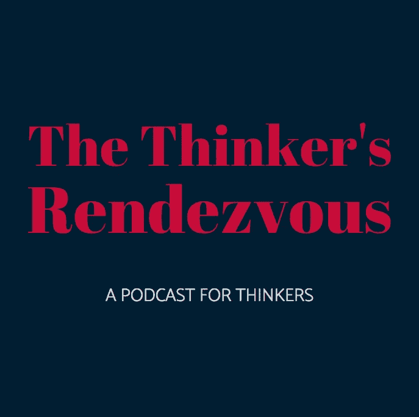

# 公司战略和节俭的必要性—更新

> 原文：<https://medium.datadriveninvestor.com/corporate-strategy-the-parsimony-imperative-updated-b52acbc8c968?source=collection_archive---------10----------------------->

# 在生意场上，就像在生活中一样，最简单的想法往往是正确的。

A leaf is an essential part of a vibrant ecosystem, and while it may appear complex, it plays a critical yet simple role as part of a larger system.

在过去的几周里，我们一直在为一个新客户进行商业设计。我们解构了他们现有的业务，并开始将其拼凑起来，以努力获得更深入的理解:进入他们的集体头脑，并发现解决系统性问题和创造价值的机会。

出现的情况并不意外也不罕见。但是，流程、可交付成果、工具、信息的网络——其中许多是基于各种政府法规、客户反馈、员工想法、误判、情绪等的反动决策——极其复杂。结果，这个行业开始了危险的倒退。员工士气低落，规模较小的竞争对手(更不用说少数初创公司了)已经超越了他们不久前还占据主导地位的地区市场。企业变得太大太复杂，领导层无法完全控制。

 [## 危机管理乘“飞机”飞行真相|数据驱动的投资者

### 当埃塞俄比亚航空公司的一架 737 Max 飞机起飞后不久坠毁，整个国家陷入危机。最好的…

www.datadriveninvestor.com](https://www.datadriveninvestor.com/2019/03/26/crisis-management-flies-on-plane-truth/) 

它没有清晰的视觉。

# 什么是节俭定律？

对许多人来说，吝啬法则或奥卡姆剃刀是一个解决问题的原则，即最简单的解决方案往往是正确的。因此，当面对解决一个问题的多个相互竞争的假设时，假设最少的解决方案是你应该选择的。在自然界和人类历史上，这样的例子比比皆是。举个例子，一个军队士兵被困在角落里，周围都是敌人。他不太可能考虑天气状况或制定复杂的逃生计划——或者人们会怎么看待他。他会做出最好的决定，因为他在寻找最清晰的生存之路。正如托马斯·阿奎那在 13 世纪指出的，

> 如果一件事用一个人就能做好，用几个人就多余了；因为我们观察到，自然不会使用两种工具(如果一种工具足够的话)。

类似地，最省力的**原则**假设动物、人类——甚至是每次下雨时从我后院流过的水——都会自然地选择阻力最小的路径，或者说“省力”。

# 简单性应该贯穿你的整个业务

从商业设计到产品工程、员工福利、网站设计和营销传播，一切都受益于理解和拥抱简单。参与设计思维或其他理解客户和人类如何决策的方式将帮助你找到最有效的成功之路。对你们中的许多人来说，这可能是一个巨大的思维转变，但是从问一些简单的问题开始。以下是一些例子:

*   我们试图解决的问题的根源是什么？我们第一次注意到它是什么时候？我们认为是什么造成的？
*   业务的其他部分是否受到此问题的影响或与之相关？
*   这个问题对你有什么影响？其他？你探索过其他选择吗？
*   你有没有通过问“如果…会怎样”的问题来重新定义这些问题？

提出好的问题不仅能让你对自己的业务有突破性的思考，还能挑战引导最终结果的决策和假设。

## [**您想了解更多关于深入思考、发现新想法以及在创新游戏中获胜的知识吗？周日晚上听贾斯汀的播客！**](https://anchor.fm/justin-jarvinen)

在我们的团队了解了业务并确定了我们负责解决的问题的根本原因后，我们能够提出有说服力的、可操作的想法和新产品，与以前相比，这些想法和产品的活动部件更少，做出的假设也更少。如今，该公司已经为大规模增长做好了准备。

##

**我希望你喜欢这篇文章。我们正在盐滩这里建造一些特别的东西，所以如果你喜欢你刚刚读到的东西，请给我一两下…或者八下掌声。**

**我是 Justin Jarvinen，除了偶尔发表一些我感兴趣的文章外，我还负责盐滩生态系统战略&风险投资。我们正在通过一个名为“战略发现”的变革性流程来改变公司应对企业战略的方式，这是一个专有的服务和工具连续体，可以产生新产品、新业务模式和创造巨大价值的新机会。**