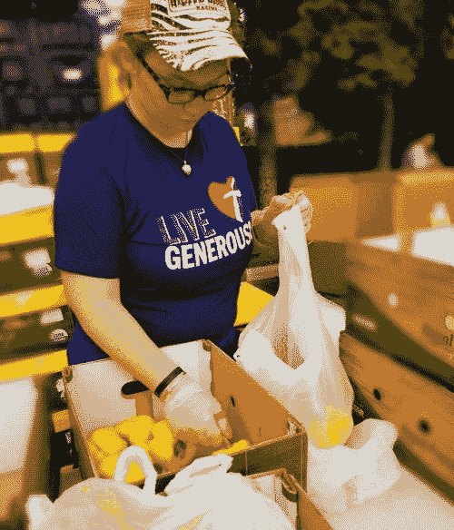

# 企业志愿者封闭个人关系

> 原文：<https://medium.datadriveninvestor.com/corporate-volunteers-seal-personal-connections-7e730c4553f7?source=collection_archive---------25----------------------->

## 公司和社区都从志愿服务中受益

志愿者是公司在其社区中最强有力的联系人。通过口口相传或 t 恤上的标志，那些贡献他们的时间和才能的人告诉社区他们的商业关怀。

最好的企业志愿者努力不是偶然发生的。它们是长期规划和协调的结果，通常有外部援助。

[凯蒂·米勒](https://twitter.com/KatieSMiller)就是这样一位助手。作为旅游行业的资深人士，她将自己的个人使命“用爱引领，在我的社区产生积极影响”融入到了职业角色中。她管理的活动为几百到一万多人服务。

米勒与销售和营销专家[亚伦·基尔比](https://twitter.com/kilby76)谈论了企业志愿服务以及这对公司和社区的好处。

 [## 在非盈利的基础上盈利

### 成功的捐赠活动全年持续进行

medium.com](https://medium.com/datadriveninvestor/engage-profitably-on-a-nonprofit-basis-26465bc2b4cd) 

众所周知，财政捐助对于非营利组织的可持续性至关重要。许多非营利组织完全由志愿者组成。

“我们经常有来自企业界的志愿者，”米勒说。“他们的支持让我们能够在保持个人联系的同时高效地服务于我们的社区。”

一个很大的优势是作为一个团队的志愿者可以提高工作效率。一群人一起做的任何事情都会在他们之间建立更强的联系，帮助他们在其他项目中更自然地作为团队工作。

“当员工作为一个团队朝着一个共同的目标工作时，生产率就会提高，”米勒说。"因此，每个人都尽自己的一份力量，确保不让任何人失望."

# 随时待命的希腊人

全国范围内的高中和大学校园的希腊社区经常需要志愿者小时来教授社会意识。这一概念有利于大型或小型企业。来自校园和企业的志愿者可以形成互惠互利的关系。

“当提供慈善机会时，会培养公司自豪感和员工参与度，”米勒说。“这是一个招募年轻员工的好方法。”

企业志愿服务也可以节省时间和金钱。

米勒说:“许多公司投入大量资源进行外部培训和郊游，希望提高工作场所的士气和生产率。”。“以企业团队的形式提供志愿者机会，提供了一种低成本或零成本的方式来实现同样的结果。”

 [## 给予对那些最需要的人来说意义重大

### 非营利组织和慈善机构都需要全年的支持

medium.com](https://medium.com/an-idea/giving-makes-a-big-difference-for-those-who-need-it-the-most-1b86025989ff) 

当一家公司在问题上表明立场时，品牌忠诚度会更高。社区参与将对品牌和参与者产生良好的影响。

“志愿服务和社区参与建立了品牌的完整性，”米勒说。“这对任何公司来说都绝对是一件好事。

“当一家公司成为志愿者时，它的品牌就从另一个只想要消费者钱的企业变成了一个为他们的付出而脱颖而出的品牌，”她说。"他们参与当地社区的愿望对人们的生活产生了影响。"

# 合乎道德的事情

给予他人通常会导致认同更多道德行为的个人态度。这种态度会影响一个企业。

“这真是一个双赢的结果，”米勒说。“道德行为引发道德思考。道德思维导致有道德的人。有道德的人导致有道德的商业行为。

“我经常和我们的志愿者分享，虽然他们确实给了别人，但我们作为志愿者经常得到回报，”她说。“能倾注到别人的生活中，真是太美妙了。”

米勒列举了 [DTEnergy](https://twitter.com/DTEnergy) 、[通用汽车](https://twitter.com/GM)、[橡树街健康](https://twitter.com/OakStreetHealth)、密歇根州蓝十字完成公司、泰森餐饮服务公司和博斯科披萨公司为“对社区做出巨大贡献”的企业

 [## 慷慨的礼物不断给予

### 注意并尊重彼此的贡献

medium.com](https://medium.com/datadriveninvestor/generositys-gift-keeps-giving-155adfc5dd54) 

企业志愿者机会有各种各样的可能性。

“联系当地学校，”米勒说。“问问你如何与他们合作。商会可能有你所在社区的非营利组织名单。试试像志愿者比赛、联合之路和当地公民组织这样的网站。如果有疑问，谷歌搜索“我附近的志愿者机会”

她说:“筹款活动总是很有趣，能引起人们的注意。”。"例如，我们每年春天都会举办拍卖和品尝会."

# **关于作者**

吉姆·卡扎曼是拉戈金融服务公司的经理，曾在空军和联邦政府的公共事务部门工作。你可以在[推特](https://twitter.com/JKatzaman)、[脸书](https://www.facebook.com/jim.katzaman)和 [LinkedIn](https://www.linkedin.com/in/jim-katzaman-33641b21/) 上和他联系。

*原载于 2018 年 9 月 27 日*[*【www.datadriveninvestor.com】*](http://www.datadriveninvestor.com/2018/09/27/corporate-volunteers-seal-personal-connections/)*。*