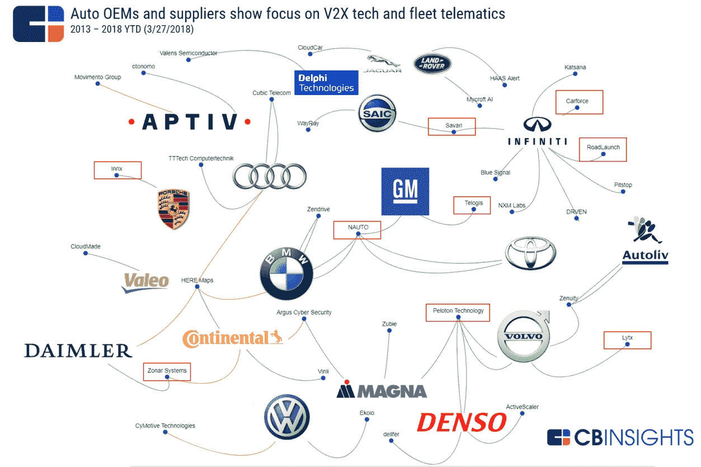
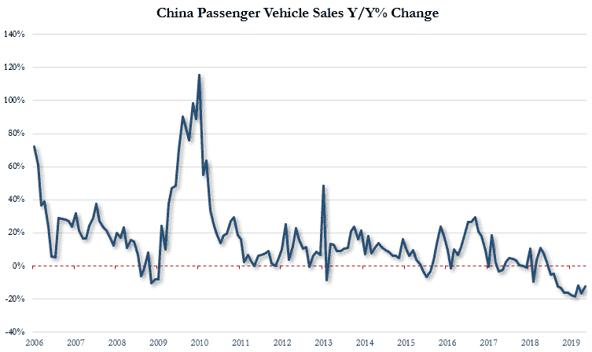

# 更正在这里

> 原文：<https://medium.datadriveninvestor.com/correction-is-here-adb60f242b42?source=collection_archive---------18----------------------->

"[2019 年 Q1 的风险投资:世界从创纪录高位拉回](https://news.crunchbase.com/news/venture-capital-in-q1-2019-the-world-pulls-back-from-record-highs/)"

"[苹果收购了无人驾驶初创公司 Drive.ai，就在它即将死亡的前几天](https://www.theverge.com/2019/6/25/18758820/drive-ai-self-driving-startup-shutting-down-apple)"

[中国历史性的汽车市场下滑仍在继续，贸易战和减排措施打击了销售](https://www.scmp.com/economy/china-economy/article/3022428/chinas-historic-car-market-decline-continues-trade-war-and)。

这些最近的头条新闻说明了汽车行业的持续趋势——修正就在这里。事实上，如果我们看看 Gartner 的炒作周期，在多年的兴奋之后，可以有把握地说，我们正在走向幻灭的低谷。

让我们更深入地分析三个主要因素，即投资、收购和中国。

 [## 在自动驾驶汽车发生事故的情况下，谁应该承担法律责任？数据驱动的投资者

### 我仍然认为自动驾驶汽车是一种奢侈品，而不是必需品…

www.datadriveninvestor.com](https://www.datadriveninvestor.com/2018/11/02/who-is-legally-accountable-in-the-case-of-an-autonomous-vehicle-accident/) 

**1)投资减少**——由于围绕自动驾驶汽车(AVs)的热潮，汽车投资在过去 4 年中大幅增长。承诺仍然存在，但结果难以捉摸，特别是实现 L4，即汽车可以在没有人的情况下行驶。Cruise 可能比任何其他公司都更好地体现了这一挑战，上个月刚刚宣布推迟其 robotaxi 服务，但没有给出进一步的细节。Cruise 于 2016 年 3 月被通用汽车收购，据报道，在产品完全上市之前，该公司以 10 亿美元的价格收购了 cruise。事实上，尽管 L4 在公司里有着令人难以置信的天赋，但这只是一个非常非常困难的问题。风投们也同样放缓了在 AVs 上的投资，转而专注于下一层，比如 V2V 和远程信息处理。

**2)更多的收购** —随着后续资金的减少和商业模式尚未完全运作，许多创业公司将会失败。然后，这些公司成为大型科技公司和越来越大的汽车公司整合的主要目标，汽车公司开始意识到软件收购的重要性。下图用橙色线条显示了此类收购。为了完整起见，绿色代表投资，红色方框表示开发 V2X 和远程信息技术的初创公司，即堆栈的下一层。

中国——他们的汽车销售不仅放缓，而且实际上还在下降，这是许多因素造成的结果，可以说不仅仅是与美国正在进行的贸易战。一个典型的例子是，6 月份的下跌是连续第 12 个月，在经历了几十年的增长后，市场确实正在经历长期放缓。

从几个指标来看，中国是汽车行业最大的参与者，包括电池和风险投资，因此经济放缓自然会影响全球的大型科技公司、大型汽车公司和初创公司。这对企业家来说意味着什么——不要指望风投资金会像以前一样充足，也不要指望企业会像以前一样渴望合作。

*这篇帖子的灵感来自与* [*布伦特西*](https://www.linkedin.com/in/westbrent/) *的一次对话。这些都是专注于实践见解的有目的的短文(我称之为 GL；dr —良好的长度；确实读过)；我写的很多东西都在*[*https://www . LinkedIn . com/in/am garg/detail/recent-activity/posts*](https://www.linkedin.com/in/amgarg/detail/recent-activity/posts/)*。如果它们能让人们对某个话题产生足够的兴趣，从而进行更深入的探索，我会感到非常兴奋。这里表达的所有观点都是我自己的。如果这篇文章有对你有用的见解，请给个赞，任何想法请留言。*