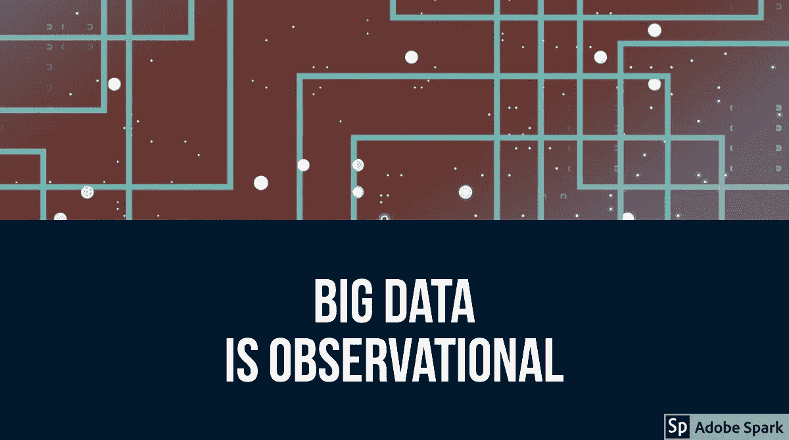

# 相关性和因果关系——第 2 部分:如何从观察数据推断因果关系。

> 原文：<https://medium.datadriveninvestor.com/correlation-and-causation-part-2-how-to-infer-causation-from-observational-data-19de1ba3338b?source=collection_archive---------7----------------------->

Big Data is Observational!

# 如果你不能对所有事情都做 RCT，你怎么能从观察数据中得出因果关系呢？

让我们从上一篇文章离开的地方开始吧。如果你还没看过，[我推荐先做](https://medium.com/@schmidt.marcello/correlation-and-causation-part-1-f75a8d427540)。我们的结论是，RCT 并不适用于所有问题。但是如果你不能对所有的问题做 RCT，那么你如何从观察数据中证明因果关系呢？

有一些标准可以帮助你从观察数据中推断因果关系。要使用它们，你也必须使用理性。

我将向你们介绍一个由奥斯汀·布拉德福德·希尔爵士于 1965 年首先提出的框架。作为伦敦大学统计学荣誉退休教授，他在对皇家医学会的主席讲话中指出:

> 然而，在推断因果关系和采取行动之前，我们不必总是坐在那里等待研究结果(变化如何产生影响)。

*希尔 AB。环境与疾病:关联还是因果关系？J R .社会医学。1965;58(5):295–300.DOI:10.1177/003591576505800503。*

# 因果框架

以下是希尔爵士提出的标准:

1.  力量
2.  一致性
3.  特征
4.  暂时性
5.  生物梯度
6.  似有道理
7.  一致性
8.  实验
9.  类似

我将逐一处理这些问题。

# 力量

这方面是直观的，我们每天都这样做。你不需要烧伤你的手一次以上就知道不要触摸热的表面。一瞬间，你的大脑已经确定了疼痛的原因。

然而，尽管很直观，这个标准也是有争议的。这是有争议的，因为在健康科学中有不可计数的因果关系，而这些因果关系不是很强。是的，它们更难被发现，甚至更难被接受，但它们是因果关系。

我们可以用晒伤作为例子。太阳光线对你皮肤的影响远不如沸腾表面的影响那样明显，但它也同样有效。如果我们过于强调实力，我们可能会错过关键的因果联系。

尽管有这样的弱点，这个概念是合理的。这是有意义的，因为如果结果中某个特定变量的影响很强，就很难用其他观察到的或未观察到的混杂变量来解释。

# 一致性

这是另一个直观的标准。如果考虑中的变量的影响在不同的研究中是一致的，由不同的人、在不同的地点、在不同的时间进行，那么它就不太可能是虚假的关联。偶然发现的。

诚然，这是重要的——尽管不是绝对必要的——以加强某一特定方向的证据。尽管如此，一致性或任何其他标准都不能孤立地用于从观察数据中推断因果关系。

# 特征

特异性可能没有前两者直观。在这里，它与诊断测试的特异性特征(阴性结果的人数，他们真正没有被研究的条件)无关。

这里使用的“特殊性”的“英语”含义是:“属于某一特定主题或与之相关的独特性质。”(牛津词典)

换句话说，一个变量与一个特定的效应相关，而不是一大堆效应。

同样，我们在这里需要小心。我们知道香烟会导致肺癌。它还会导致膀胱癌、腿部动脉阻塞、心脏病发作等。一个变量可以积极地影响其他几个变量。有时，许多不同的效应都是由不同细胞内相同或相似的机制介导的。

用希尔斯爵士自己的话说:

> 简而言之，如果特殊性存在，我们也许能够毫不犹豫地得出结论；如果不明显，我们就不必犹豫不决地保持中立。

奥斯汀·b·希尔爵士

# 暂时性

我们已经讨论过了。决定先做什么很重要，但并不总是很容易。为了从观察数据中确定因果关系，你需要确信哪个先出现。

# 生物梯度

生物梯度是一个有趣的概念。你用它来决定太阳会灼伤你的皮肤。你暴露在阳光下越多，晒伤就越严重。

这一观点适用于许多生物过程。吸烟越多，患肺癌的可能性越大。你喝的酒越多，就越有可能患上肝硬化。你的心脏没有血液的时间越长，它就越痛苦，失去功能。

然而，这并不是所有生物过程的特征。但是它的存在使得从观测数据中指出因果关系变得更加简单。

# 似有道理

有人曾经告诉我，“通往地狱的道路是由生物学上的似是而非铺成的。”这是真的。我们的大脑是惊人的，似乎我们可以解释任何事情。

有些联系可能是不可信的，因为我们缺乏知识。还有其他不真实的，我们仍然可以解释。

如果你在看数据之前就有了假设，就像你应该做的那样，这有助于在试图解释意想不到的结果时不要“制造似是而非”。

如果你想从观察数据中找出因果关系，具有合理性仍然是至关重要的。

# 一致性

你的观察性研究的证据与我们对该疾病的病理学或其他可用数据的了解一致吗？如果是这样，那就是连贯的，而且很重要。

如果你的结果与已知的一切相悖，那么两个选项中有一个是正确的:

1.  你错了。
2.  其他人都错了。

这并不是说其他人不可能都是错的。科学史上充满了例子。这些是对世界产生深远影响的革命性发现。但是大多数科学是进化的。

在改变这一切之前，你必须证明你是对的。需要更多研究的更多证据来建立一致性。并且，请有一个内在一致的论点。

# 实验

虽然 RCT 并不总是可能的，但有时可以做实验。让我们说，你注意到工人周围的特定类型的灰尘有更多的一个特定的肺部疾病。让我们也假设你可以通过引入一个呼吸器来显著地减少灰尘的吸入。最后，让我们说你做到了。这降低了肺病的发病率吗？

所以，你的假设可能是对的。

我相信我们必须提高自己的技能，用不同的眼光来看待我们收集的所有数据。通过使用自然实验、工具变量和回归不连续设计寻找找到答案的方法。这可能是如何利用我们称之为大数据的真正力量的关键。

# 类似

不同的变量往往通过相似的课程影响结果。类比可以帮助我们理解。通过比较一个新的预测器和一个旧的预测器，我们知道的更多，可能更容易破译新的联系。

总结如何从观察数据中“证明”因果关系

希尔爵士本人表示，这些并不是从观察数据中决定因果关系的硬性规则。此外，应该清楚的是，并非所有需要的条件都需要存在，并且它们的存在并不保证因果关系。

因为没有普遍的规律，我肯定这需要推理。它还需要手头主题的知识，以及打破常规的能力——正如好的推理经常做的那样。

因此，虽然相关性并不意味着因果关系，但我们可以根据一套标准和合理的推理，从相关性中推断出因果关系。

最后，我想说，在这里任何统计检验都不能代替思考。统计分析经常混淆这一推论的某些方面。一个经典的例子是当一项研究的 p 值≤ 0.05，而另一项不是。有些人会认为这是不连贯的。很可能不会。

对我来说，这些对可用数据的分析，加上巧妙的设计和合理的推理，令人振奋。大数据将需要我们更擅长它，更经常地应用它。这是迷人的时代！

这篇文章之前发表在 [theepidemiologist.ca](https://theepidemiologist.ca/2018/09/05/causation-from-observational-data/) 。