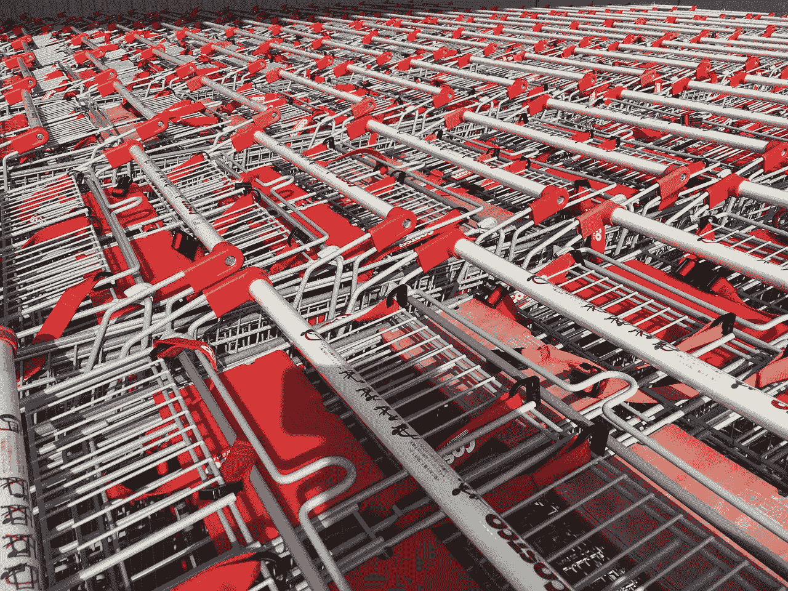
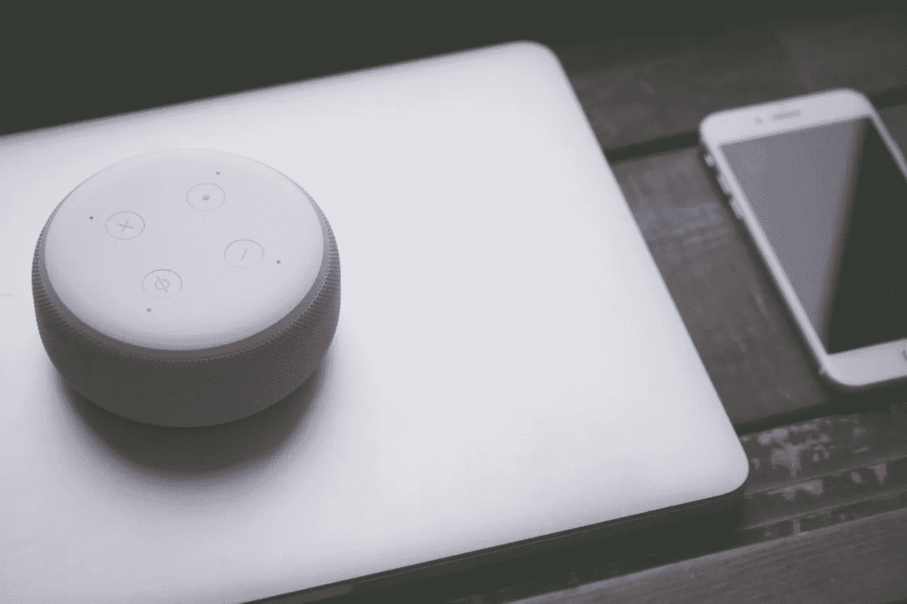
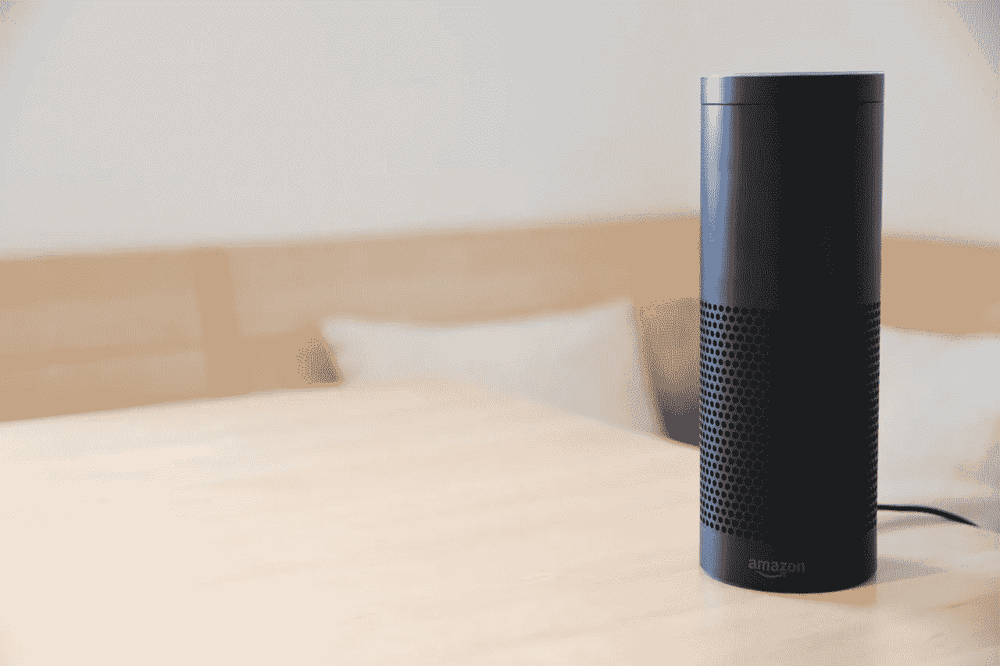
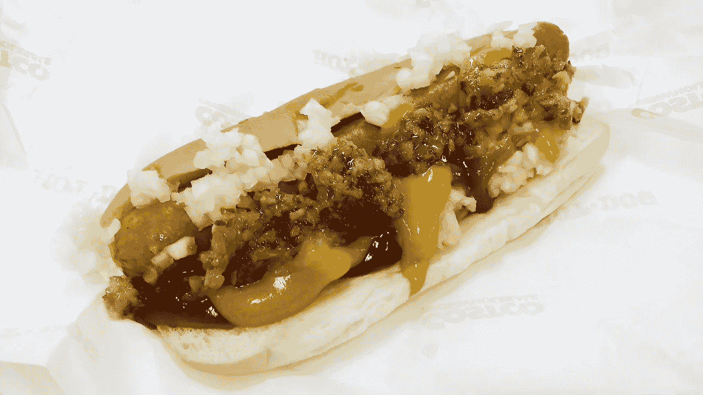

# 好市多赚钱，但亚马逊证明了吗？

> 原文：<https://medium.datadriveninvestor.com/costco-makes-money-but-is-it-amazon-proof-ada83dbe83e8?source=collection_archive---------2----------------------->

数字证明好市多赚钱，但美国最受欢迎的商店亚马逊能证明吗？

**Costco Wholesale(纳斯达克股票代码:COST)** 刚刚结束了一个伟大的 2019 年第一季度。例如，好市多第一季度收入为 353.96 亿美元，毛利为 46.76 亿美元。此外，好市多报告营业收入为 12.03 亿美元，净收入为 8.89 亿美元。

 [## 股票市场投资的机器学习——数据驱动的投资者

### 当你的一个朋友在脸书上传你的新海滩照，平台建议给你的脸加上标签，这是…

www.datadriveninvestor.com](https://www.datadriveninvestor.com/2019/01/30/machine-learning-for-stock-market-investing/) 

事实上，好市多的年收入在 2019 年 2 月 9 日升至 1415.76 亿美元。因此，就收入而言，好市多是美国第四大零售商。

详细来说，**沃尔玛(纽约证券交易所代码:WMT)** 是最大的，2019 年第一季度的收入为 5144.05 亿美元。**亚马逊(NASDAQ: AMZN)** 以 2328.87 亿美元的营收位居第二。与此同时，医药和健康保险公司 CVS Health Corp (NYSE: CVS) 以 1945.79 亿美元的收入排名第三。

# **好市多亚马逊有证明吗？**

Kantar Consulting 将好市多批发公司列为美国第四大零售商，拥有 510 家商店，2018 年零售额为 930.8 亿美元。

令人惊讶的是，好市多是我们增长最快的零售商之一，2018 年收入增长率为 9.73%。此外，好市多在 2019 年第一季度的收入增长率为 7.28%。

相比之下，沃尔玛 2019 年第一季度的收入增长率为 1.85%。此外，Stockrow 给沃尔玛 2018 年的收入增长率是 2.81%。

另一方面，亚马逊 2018 年实现了 30.93%的营收增长率。此外，亚马逊在 2018 年第四季度的收入增长率为 19.73%。

# **亚马逊威胁到好市多和其他所有人**

由于 Everything Store 的规模，亚马逊的增长率对好市多构成了威胁。

事实上，就在 5 年前的 2014 年 12 月，亚马逊的营收还不到 1000 亿美元。确切地说，亚马逊 2014 年的年收入为 889.88 亿美元。令人惊讶的是，这些收入在不到五年的时间里增长到了 2000 亿美元。

相比之下，好市多 2014 年的营收超过了亚马逊。为了解释这一点，好市多 2014 年的收入为 1126.48 亿美元。所以它显然比五年前的亚马逊更大。现在，亚马逊比好市多更大。

# **亚马逊 Prime 是美国最大的俱乐部商店**

让好市多雪上加霜的是，亚马逊 Prime 现在是美国最大的“俱乐部商店”。为了澄清，消费者情报研究伙伴[估计](https://www.digitalcommerce360.com/2019/01/18/amazon-prime-has-more-than-100-million-members-in-the-u-s/)亚马逊的会员服务在 2019 年 1 月有 1.01 亿会员。

因此，近三分之一的美国人可能会成为亚马逊 Prime 会员。举例来说，美国人口普查局[估计](https://www.census.gov/newsroom/press-releases/2019/new-years-population.html)2019 年新年美国人口为 3.2831 亿。

相比之下，据 Statista [统计](https://www.statista.com/statistics/718406/costco-membership/)，好市多在 2018 年第四季度全球拥有 9430 万会员。此外，亚马逊在 2018 年增加了 600 万名 Prime 会员，*互联网零售商*声称。

因此，亚马逊正在通过销售更多会员来击败好市多。事实上，Consumer Intelligence Partners 推断，80%的美国家庭拥有亚马逊 Prime 会员。

# **亚马逊 Prime 如何威胁好市多**

亚马逊 Prime 威胁到了好市多，因为它更方便，更容易使用。

例如，有了 Amazon Prime，没有人需要开车去大型商店，或者推着装满商品的大车到处走。相反，你可以坐在沙发上购物，并在门口收到商品。

此外，亚马逊正在扩展 Prime，并使其更加方便。具体来说， [Prime Fresh](https://www.amazon.com/b?node=10329849011&tag=googhydr-20&hvadid=325325313344&hvpos=1t1&hvnetw=g&hvrand=4571858624686997262&hvpone=&hvptwo=&hvqmt=b&hvdev=c&hvdvcmdl=&hvlocint=&hvlocphy=9028842&hvtargid=kwd-25486900&ref=pd_sl_3b1rvhfu43_b) 在美国几个城市将食品杂货送货上门。

因此，消费者少了一个每年花 60 到 120 美元购买好事多会员资格的理由。Prime 提供亚马逊的所有服务和流媒体视频，每年收费约 110 美元。

# **insta cart 和 Kroger 如何威胁 Costco**

好市多需要担心的不仅仅是亚马逊 Prime，Instacart 声称其杂货递送和取货服务在美国几十个城市都可以使用， *The Verge* [报道](https://www.theverge.com/2018/11/7/18071818/instacart-grocery-pickup-service-free-delivery-us-cities)。

此外，Instacart 通过在加拿大提供 Staples 办公用品的送货服务，直接与 Costco 竞争，超市新闻报道。这是有问题的，因为办公用品是好市多的主要产品之一。

最后，还有美国最大的超市运营商**克罗格**，拥有 5328 家店铺。Kroger 的收入为 1211.62 亿美元，是 Instacart 的最大合作伙伴。

超市新闻[报道](https://www.supermarketnews.com/online-retail/instacart-kicks-pilot-staples-canada)克罗格计划到 2018 年底提供从 1300 多家商店送货和从 1091 家商店提货的服务。此外，克罗格正在英国 T4 奥卡多集团(伦敦证券交易所:OCDO)的帮助下，通过建立机器人履行中心来增强 T2 的物流游戏。

在这种情况下，Instacart 现在是好市多最大、最危险的竞争对手之一。此外，克罗格可能很快会像亚马逊或 Instacart 一样对好市多构成威胁。

# 好市多赚了多少钱？

尽管受到威胁，好市多仍然赚了很多钱。然而，好市多遇到了一些问题。

值得注意的是，好市多 2019 年第一季度的运营现金流为负 2.19 亿美元，自由现金流为负 8.06 亿美元。因此，好市多正在经历负现金流。

然而，好市多在 2019 年 2 月 17 日拥有 60.8 亿美元的现金和等价物，以及 10.42 亿美元的短期投资。因此，好市多当天有 71.22 亿美元现金。

这对零售商来说是好事，但在亚马逊 2019 年 12 月 31 日报告的 412.50 亿美元现金和短期投资面前，这就相形见绌了。因此，亚马逊的现金是好市多的四倍。

# **Costco 是个好投资吗？**

归根结底，好市多是一家盈利且增长迅速的赚钱公司，我认为这是一笔不错的投资。

特别是，好市多投资者于 2019 年 2 月 22 日获得了 57₵股息。此外，2018 年股息增长了 7 美分。具体而言，股息从 2018 年 3 月 2 日的 50₵上涨至 2018 年 5 月 25 日的 57₵。

此外，Dividend.com 报告称，好市多向股东提供了 15 年的股息增长。此外，好市多在 2019 年 4 月 17 日提供的股息收益率为 0.93%，年化股息为 2.28 美元，派息率为 33.5%。

然而，我认为**好市多批发(纳斯达克股票代码:COST)** 在 2019 年 4 月 19 日报告的 245.81 美元的股价上定价过高。因此，我认为好市多是一只好股票，尽管零售业务受到干扰，它仍会给投资者带来回报。不过，我建议投资者等到好市多股价下跌时再买。

这个评论最早是在 [*市场疯人院*](https://marketmadhouse.com/) 看到的。