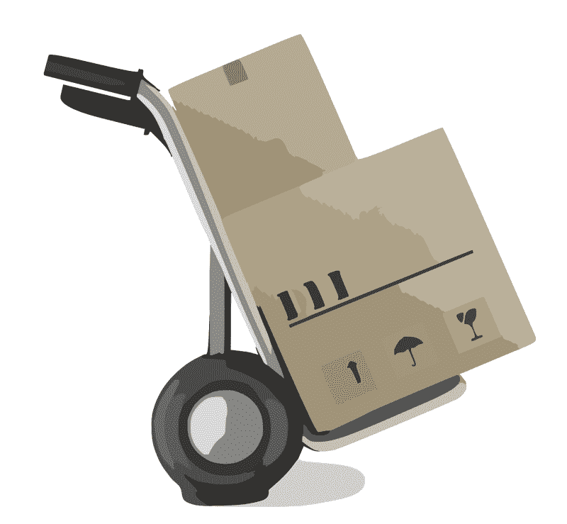

# 亚马逊会毁灭联邦快递吗？—市场疯人院

> 原文：<https://medium.datadriveninvestor.com/could-amazon-doom-fedex-market-mad-house-9fd35714b622?source=collection_archive---------23----------------------->

亚马逊(纳斯达克股票代码:AMZN) 可能刚刚通过扩大其送货服务而结束了**联邦快递(纽约证券交易所股票代码:FDX)** 的厄运。

美国消费者新闻与商业频道[报道](https://www.cnbc.com/2019/12/12/analyst-amazon-delivering-nearly-half-its-packages-instead-of-ups-fedex.html)，摩根士丹利声称亚马逊现在通过其平台交付美国人订购的一半商品。然而，亚马逊将大部分订单集中在城市地区。

引人注目的是，摩根士丹利声称其 Alpha Wave 分析显示，亚马逊物流可以交付比联邦快递更多的包裹；或者 **UPS(纽交所代码:UPS)，到 2022 年**。具体来说，摩根士丹利预计亚马逊物流在 2022 年可以交付 65 亿个包裹。

与此同时，联邦快递每年递送 34 亿个包裹，UPS 每年递送 50 亿个包裹。这些数字显然是针对美国的。

# 亚马逊可能会在三年内成为美国占主导地位的快递品牌

因此, *The Verge* [称](https://www.theverge.com/2019/12/13/21020938/amazon-logistics-prime-air-fedex-ups-package-delivery-more-than-50-percent)亚马逊是“联邦快递和 UPS 的强劲对手”因此，亚马逊可能会在三年内成为美国占主导地位的快递品牌。

因此，我们可以生活在一个亚马逊是普通人送货订单的首选的国家。换句话说，联邦快递最糟糕的噩梦可能很快就会成为现实。

值得注意的是，亚马逊今年早些时候终止了与联邦快递的地面运输和航空运输合同。然而，亚马逊仍然与联邦快递的劲敌 UPS 合作。

令人震惊的是，亚马逊在 2019 年 6 月至 9 月期间可以负担得起 96 亿美元的履约费用。Everything Store 能够承担这样的支出，因为它在 2019 年 9 月 30 日拥有 434.01 亿美元的现金和短期投资。

 [## 算法交易的机器学习|数据驱动的投资者

### 当你的一个朋友在脸书上传你的新海滩照，平台建议给你的脸加上标签，这是…

www.datadriveninvestor.com](https://www.datadriveninvestor.com/2019/01/30/machine-learning-for-stock-market-investing/) 

相比之下，联邦快递在 2019 年 8 月 31 日报告的现金和短期投资仅为 23.89 亿美元。因此，亚马逊有能力花费大量现金来扩大其物流业务，而联邦快递却做不到。

# 联邦快递赚钱了吗？

目前，联邦快递公司(纽约证券交易所代码:FDX)正在盈利。例如，联邦快递在 2019 年 8 月 31 日报告了 121.5 亿美元的季度毛利。

然而，联邦快递当天公布的季度营业收入为 9.77 亿美元，营收为 170.48 亿美元。此外，联邦快递的季度营业收入从 2019 年 5 月 31 日的 13.16 亿美元下降。此外，联邦快递的季度收入从 2019 年 5 月 31 日的 178.07 亿美元下降。然而，季度净收入从 5 月份的-19.69 亿美元上升到 8 月份的 7.45 亿美元。

联邦快递仍在赚钱，但其收入已经缩水。值得注意的是，Stockrow 估计，在截至 2019 年 8 月 31 日的季度，联邦快递的收入增长率下降了-0.02%。

引人注目的是，联邦快递的运营现金流从 5 月份的 22.9 亿美元降至 9 月份的 5.65 亿美元。此外，期末现金从-5.53 亿美元增加到 238.9 万美元。令人不安的是，融资现金上升至 9.42 亿美元。我认为这些数字显示了联邦快递借款的增加。

# 联邦快递能活下来吗？

目前，联邦快递还在生存，但财务数字暗示了未来的挣扎。

特别是，联邦快递似乎没有能力产生足够的现金来与亚马逊竞争。为了解释这一点，我对亚马逊成功的理论是，万物商店可以通过产生大量现金来摧毁竞争对手。

例如，亚马逊有现金在短时间内从零开始建立自己的送货服务。此外，有现金在全国各地建立几十个履行中心，可以作为物流中心。

与此同时，联邦快递缺乏提供这种能力的现金，严重依赖亚马逊。目前，联邦快递依赖于通过亚马逊平台订购的第三方商品。

然而，联邦快递为亚马逊最大的美国竞争对手**沃尔玛**运送商品。不幸的是，2019 年 3 月，沃尔玛在美国电子商务中的份额为 4.6%，营销图表[估计](https://www.marketingcharts.com/industries/retail-and-e-commerce-107599)。相比之下，亚马逊控制了美国 47%的电子商务。

因此，没有亚马逊，联邦快递可能无法生存。然而，亚马逊正试图将联邦快递挤出其业务。

# 亚马逊、联邦快递和反垄断

亚马逊物流的数据肯定会引发美国反垄断的辩论。

批评者可以指控亚马逊利用亚马逊物流在运输和零售领域建立垄断。例如，你可以说亚马逊正试图将联邦快递和联合包裹快递挤出市场。

杰夫·贝索斯希望联邦快递和联合包裹死掉的一个原因是锁定竞争对手；如沃尔玛，退出电商市场。贝佐斯的另一个理由是让亚马逊在杂货递送领域占据主导地位。

# 为什么山姆大叔可以迫使亚马逊停止送货

解释一下，亚马逊可以提供各种各样的商品，比如**克罗格**不能。亚马逊 Prime 可以同时给你送牛奶和鸡蛋，还有你的内衣和新电视机。克罗格能送的只有食物。

因此，来自竞争对手、消费者权益倡导者和工会的巨大压力会将亚马逊拒之门外。我怀疑政客们将很快发起一场运动，迫使贝佐斯出售或剥离亚马逊物流。

值得注意的是，亚马逊正面临联邦政府越来越多的反垄断审查，财富[报道](https://fortune.com/2019/12/04/amazon-antitrust-scrutiny-cloud/)。美国联邦贸易委员会(FTC)的调查人员正在调查亚马逊网络服务(Amazon Web Services)的云优势。

AWS 占亚马逊营业收入的 60%，因此为亚马逊物流融资。因此，联邦贸易委员会可以通过反垄断诉讼剥夺贝佐斯建设亚马逊物流所需的资金。

政治家；如唐纳德·j·特朗普(R-Florida)，可能会因为国内的反企业情绪而加大反垄断行动。我认为特朗普在明年总统大选中最有可能的对手是反企业左派；比如美国参议员伯尼·桑德斯(I-佛蒙特州)和利兹沃伦(D-马萨诸塞州)。为了对抗它们，特朗普可能会在 2020 年增加反垄断行动。

因此，联邦快递的长期前景可能比许多人想象的要光明。对亚马逊来说，在物流和送货方面取得成功是不可能的。

# 联邦快递是价值投资吗？

我认为市场先生在 2019 年 12 月 17 日将**联邦快递(纽约证券交易所:FDX)** 定价过高，为 163.23 美元。我认为交割市场的风险不值得这个价格。

然而，联邦快递在 2019 年 12 月 17 日向股东提供的股息收益率为 1.58%，年化派息为 2.60 美元，派息率为 16.75%。Dividend.com 报告称，联邦快递提供了 9 年的股息增长。

联邦快递于 2019 年 12 月 6 日支付了 65₵的季度股息。因此，我认为联邦快递是一只不错的分化股，但市场先生高估了它。

我的结论是，投资者需要远离联邦快递，直到我们看到反垄断和亚马逊的政治斗争如何发展。联邦快递是一家赚钱的公司，如果没有联邦政府的保护，它可能会面临绝望的生存竞争。

[*原载于 2019 年 12 月 17 日 https://marketmadhouse.com。*](https://marketmadhouse.com/could-amazon-doom-fedex/)