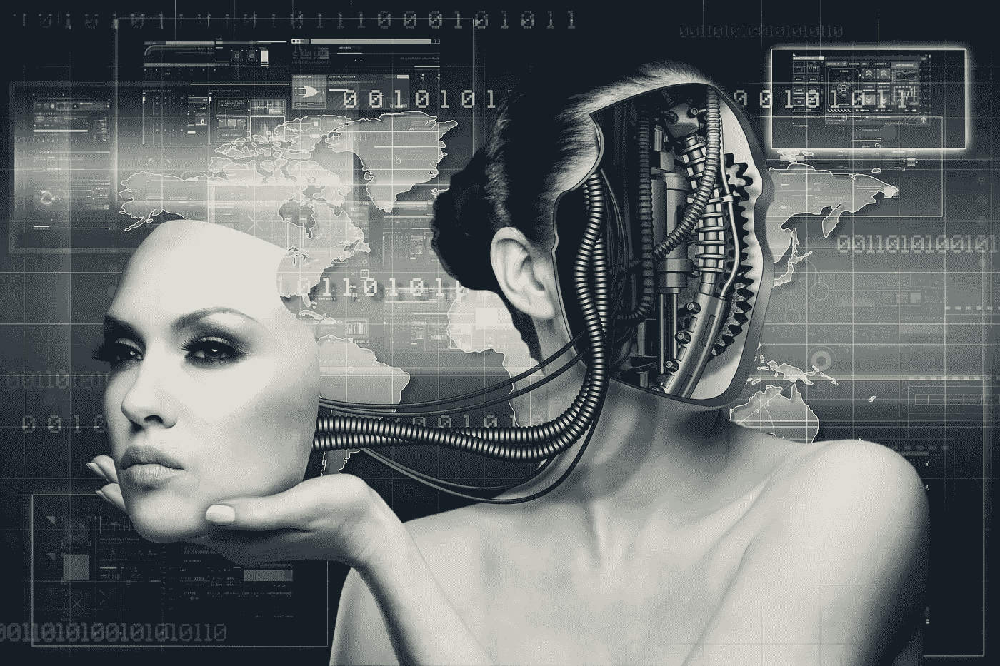
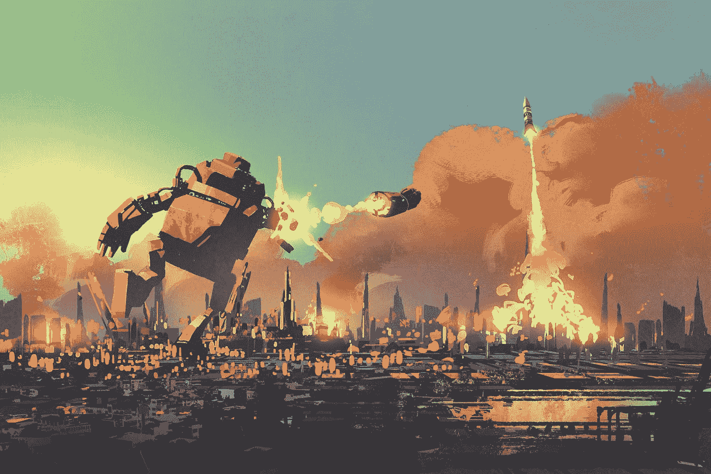
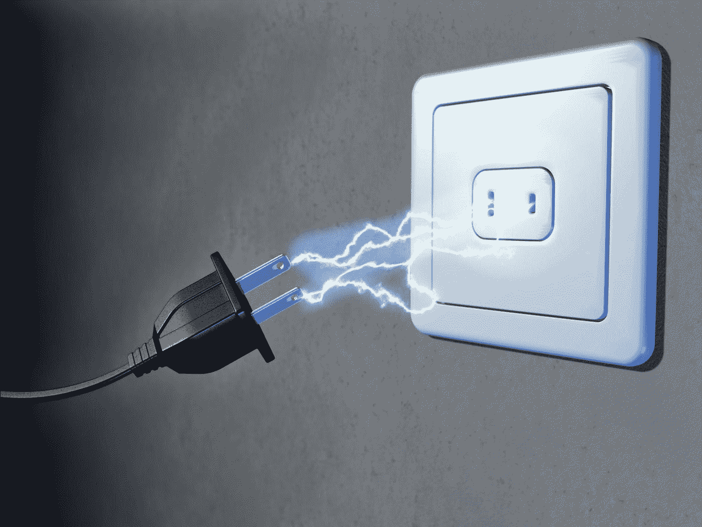
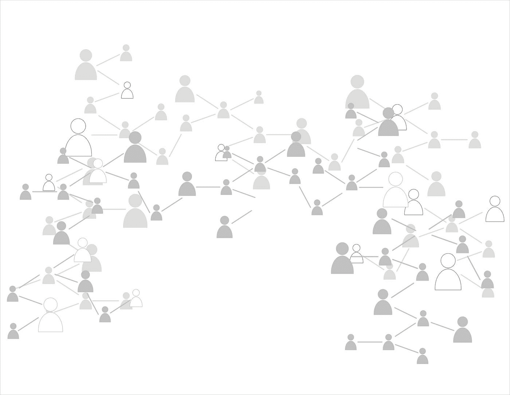

# 区块链能阻止天网吗？

> 原文：<https://medium.datadriveninvestor.com/could-blockchain-stop-skynet-c122bc2dbf07?source=collection_archive---------3----------------------->

至少有人认为，机器将接管并毁灭人类。

但是，区块链和人工智能这两项世界上最令人期待的技术的结合，能阻止这样的灾难成为现实吗？

# 有什么问题？

“最终，我认为人类很可能会灭绝，而科技很可能会在其中发挥作用。”

这是人工智能实验室 DeepMind Technologies 的联合创始人兼首席研究员谢恩·莱格(Shane Legg)的观点，该实验室于 2014 年被谷歌收购。莱格是在被问及“糟糕的人工智能”产生“负面”或“极端负面”后果的可能性有多大时做出回应的，其中“负面”意味着“人类灭绝”，“极端负面”意味着“人类痛苦”。

虽然莱格确实承认区分了“在类似人类水平的人工智能的一年内”和“在一百万年内”发生的这种灾难性事件，但这是一种现在被许多人吹捧和害怕的前景。

事实上，人工智能如今无处不在。在每个行业。几乎在生活的每个方面。此外，随着近年来机器学习的普及，就可能性而言，这项技术正在经历一场重大的范式转变。

随着我们现在迎来一个全球商业化人工智能的时代，人们普遍担心，机器学习变得如此先进的那一天不会太远，它会加速我们所知的人类生存的终结。

尼克·博斯特罗姆(Nick Bostrom)是最清楚、最清醒地提出这种担忧的人之一。这位牛津大学的哲学家经常假设不受约束的人工智能进化的未来可能结果的范围。例如，他的书 [*《超级智能:路径、危险、策略*](https://www.amazon.com/Superintelligence-Dangers-Strategies-Nick-Bostrom/dp/1501227742) 》展示了几种人类受制于机器高级思维的场景。

但是自学技术的进步真的会摧毁我们吗？如果好莱坞是可信的，那么我们作为人类的机会肯定是渺茫的。以*矩阵*为例。这部 1999 年的科幻大片设想了一个黯淡的反乌托邦，其中超智能机器导致人类的衰落和奴役，以及他们的收获作为燃料。

*与此同时，终结者*看到计算机系统*天网*实现了自我意识，并引发了一场在一天内消灭数十亿人的核交流。正如 1984 年的原版经典中所解释的，天网“将所有人类视为威胁，而不仅仅是另一边的人”，因此它“在一微秒内决定了我们的命运:*灭绝*。”

更不用说那些在 2001 年*:太空漫游*、 *IRobot* 、*银翼杀手*和*复仇者联盟:奥创时代*中出现的邪恶机器了。

更糟糕的是，这种生动想象的世界末日不需要机器成为通常在银幕上描绘的无所不包、不可战胜的超级计算机。虽然普遍的假设是，机器学习达到的意识水平首先达到，然后全面超越人类思维，但严重的问题也可能源于基本人工智能获得资源，使其能够精通某一特定学科，然后只在该学科中追求持续最大化。

博斯特罗姆的[回形针例子](https://nickbostrom.com/ethics/ai.html)强调了这种最大化的危险:

*“假设我们有一个人工智能，它的唯一目标是制造尽可能多的回形针。人工智能将很快意识到，如果没有人类会好得多，因为人类可能会决定关闭它。因为如果人类这样做，回形针会更少。此外，人体含有大量可以制成回形针的原子。人工智能试图实现的未来将是一个有很多回形针但没有人类的未来。”*

换句话说，我们必须从一开始就明确指出，最大化回形针不应该以毁灭人类为代价。这可以说是所有挑战中最艰难的一个…

# 那么，解决办法是什么呢？

最终，它可能不会像好莱坞让我们相信的那样黯淡。但似乎应该尽早寻找解决方案，以防止天网失控。

事实上，现在已经有一些解决方案摆在桌面上。首先，有谷歌 DeepMind 解决方案，这是给人类操作员实体配备一种权力，如果(当)机器开始显示出无视规则的迹象，就可以“拔掉插头”。

由牛津大学人类未来研究所的 DeepMind 研究员洛朗·奥尔索和斯图亚特·阿姆斯特朗撰写的研究论文“[安全可中断的代理人[PDF]](http://intelligence.org/files/Interruptibility.pdf) ”指出，人工智能代理人不太可能以持续最优的方式行事，因此，如果它在人类监督下运行，人类操作员可能必须按下“红色大按钮”，以阻止代理人“继续有害的行为序列——对代理人或环境有害——并引导代理人进入更安全的情况。”

这篇论文的“安全中断”框架使人类操作员能够将人工智能代理“带出微妙的局面，甚至临时使用它来完成它没有学会执行的任务，或者通常不会因此获得奖励。

此外，根据 Orseau 的说法，人工智能将能够确定适当的行为以获得奖励，这反过来将使他们能够提高自己的能力。但是如果代理 expect 也预测到它将很快被关闭，它将“试图抵抗以获得它的回报”因此，安全可中断性框架“允许人类监管者暂时控制代理，并使其相信(或选择)关闭自己。”

虽然这种解决方案可能行得通，但从一开始，我们的命运似乎就掌握在一个实体——人类操作员——的手中。换句话说，这种模式依赖于一种集中的控制/权力模式，在这种模式下，操作人员必须*永不*失败。只有一个单点故障就足够可靠了吗？

# 区块链解决这一问题的潜力

也许更可靠的解决方案是让人工智能运行在一个没有单点故障的网络上。

这就是区块链潜力巨大的地方。

通过消除集中式模型中固有的单点故障，去中心化的点对点网络可以提供更可靠的答案。如果网络上的一个节点发生故障，不会危及网络其余部分的安全。分散式网络中的节点越多，单个故障节点的重要性就越小。

节点通过块奖励被激励来维护区块链的真相。因此，通过让人工智能代理在区块链上运行，网络上的每个节点都有可能被激励来确保人工智能保持合规。*如果一个节点在这一努力中失败了，它将不会有足够的影响力来成功地感染网络的其余部分。*

正如日本 IT 公司 NTT Data 的高级主管 Arushi Srivastava 去年承认的那样，以太坊等区块链平台可以“在技术中建立治理和共识机制”，可以通过编程来防止具有潜在邪恶意图的机器人攻击网络的其余部分。

也许一个解决方案可能会进一步涉及为每个节点开发两种人工智能算法，一种促进机器学习的“最大化”，以便人工智能按照预期前进，另一种作为“控制”(或平衡)算法，被编程为保持其同胞“处于检查中”。这样一个*正交*系统哲学因此可以确保每个节点总是按照预期运行，符合我们人类的目标并处于控制之下。

此外，我们似乎已经开始结合这两种技术。例如，企业人工智能软件[的领先公司 Talla 承认](https://botchain.talla.com/whitepaper.pdf)目前，“没有任何系统可以映射可审计的、分散的轨迹，以反映机器人做出的自主决策，也没有任何系统提供重新训练机器学习模型以解决不良机器行为的方法”。

因此，Talla 正在以太坊平台上创建“BotChain”，该平台“允许 bot 开发者、企业、软件公司和系统集成商验证 bot 身份、审计交互并控制 bot 自治的边界”。对于人工智能采取的每一个行动，修补程序都会发布一个数字证书，最终形成一系列加密文件。这将至少确保机器人采取的行动受到监控，并遵守监管边界。

此外，Talla 首席执行官罗布·梅(Rob May)还观察到，机器人开始被“欺骗”，这使得机器人身份成为一个严重的问题。[因此，根据 May](https://www.prnewswire.com/news-releases/leading-artificial-intelligence-startup-announces-further-innovation-665170443.html) 先生的说法，“BotChain 是机器人的一种身份解决方案，这样随着人类与更多的机器人互动，或者机器人之间的互动，它们可以快速建立信任。”

正如梅先生所暗示的那样，人类和人工智能之间的互动对机器的未来发展至关重要。人工智能越被视为对人类进步的补充，它就可以被发展成为我们自身的延伸，而不是一个具有威胁性的、独立的外星实体。正如博斯特罗姆[所承认的](https://www.ted.com/talks/nick_bostrom_what_happens_when_our_computers_get_smarter_than_we_are#t-973536)，“我相信答案是创造超级智能的人工智能，这样即使它逃跑了，它仍然是安全的，因为它从根本上站在我们这边，因为它分享我们的价值观。”

通过要求一个节点网络就什么是真理、什么不是真理达成共识，区块链可以帮助确保机器价值观与我们的价值观一致，而不会达到不得不求助于按下一个大红色按钮来确保我们物种生存的阶段。

不可否认，区块链确实继续受到可扩展性限制的困扰，如果/当支持机器学习时，这很可能会进一步受到关注。机器学习是一种依赖大量海量数据来分析和处理模式并最终进化的技术。

尽管如此，区块链提供的安全性和不变性可以确保机器无法欺骗或绕过它们，从而达到不受挑战的霸主地位。

这不是一件小事。

*原载于 2018 年 5 月 16 日*[*【www.datadriveninvestor.com】*](http://www.datadriveninvestor.com/2018/05/16/could-blockchain-stop-skynet/)*。*