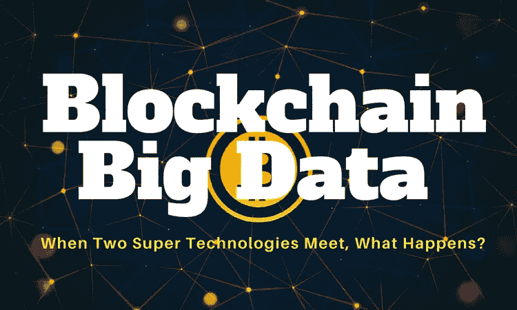
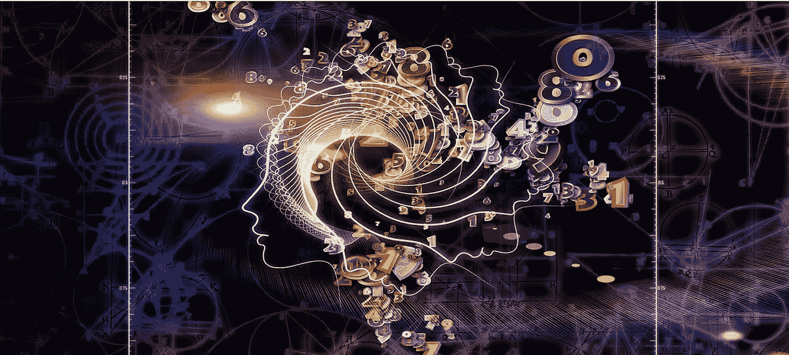
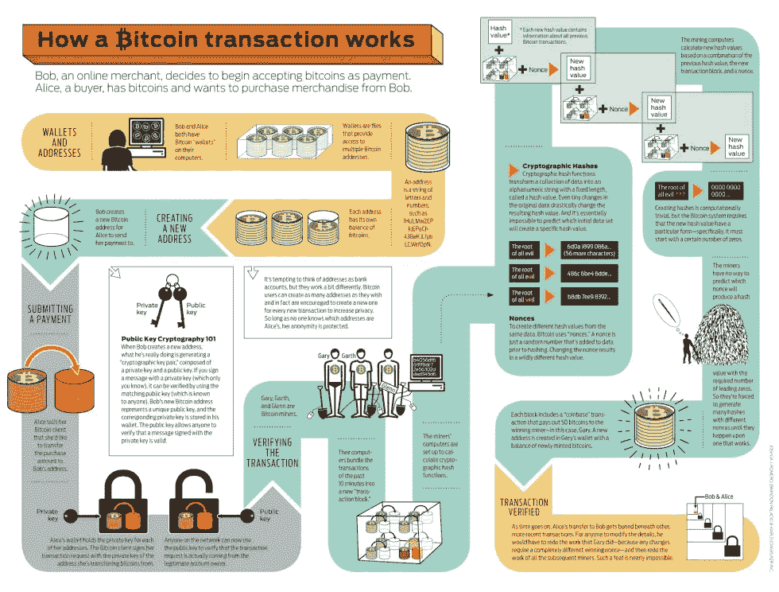

# 区块链会是每个数据科学家的梦想吗？

> 原文：<https://medium.datadriveninvestor.com/could-blockchains-be-every-data-scientists-dream-14ba62466e96?source=collection_archive---------2----------------------->

比特币是 2009 年由一个化名为中本聪的陌生人创造的一种新货币。交易没有中间人——也就是说，没有银行！比特币可以用来在 Expedia 上预订酒店，在 Overstock 上购买家具，以及购买 Xbox 游戏。但是大部分炒作都是关于通过交易变得富有。2017 年，比特币的价格飙升至数千美元。

“区块链是一个不朽的经济交易数字账本，可以通过编程不仅记录金融交易，还记录几乎所有有价值的东西。”
Don & Alex Tapscott，区块链革命(2016)的作者

区块链是一个分布式数据库系统，充当记录和管理交易的“开放账本”。数据库中的每条记录称为一个块，包含事务时间戳以及到前一个块的链接等详细信息。

## 区块链如何改变金融科技

目前，数字交易是借助代币进行的。这是由第三方(例如 Visa 或 Mastercard)生成的唯一代码，与令牌请求者(您购物的零售商)和账户发行者(客户的银行)共享。代币通过隐藏真实的客户识别数据使在线交易更加安全。由于令牌是由第三方生成的，而第三方本身并没有关于交易的信息，因此没有任何数据可供数据科学家使用。公平地说，比特币等加密货币是在提供安全和保密的交易机制的完全相反的前提下设计的。虽然这一点没有改变，但区块链为银行和金融机构提供了从客户交易历史中挖掘更多有用数据所需的技术。

最近，一个由 47 家日本银行组成的财团与一家名为 Ripple 的公司签约，允许使用区块链在银行账户之间转账。此举背后的主要原因是允许以非常低的成本进行实时传输。传统实时传输昂贵的原因之一是潜在的风险因素。双重花费(交易失败的一种形式，同一个安全令牌被使用两次)是实时传输的一个实际问题。有了区块链，这种风险基本上得以避免。大数据分析使得识别消费者支出模式和识别高风险交易成为可能，这比使用当今技术要快得多。这降低了实时交易的成本。

在银行业之外，采用区块链的主要驱动力也是安全性。在医疗保健、零售和公共管理领域，企业已经开始使用区块链来处理数据，以防止黑客攻击和数据泄露。在医疗保健行业，像区块链这样的技术可以确保在数据访问的每个级别都寻求多个“签名”。这可以防止 2015 年导致超过 1 亿份患者记录被盗的攻击重演。

但企业也希望看到这种采用带来的其他好处。与医疗保健一样，在博彩业中，区块链分析工具也被视为定义赌博模式和识别欺诈模式的便捷工具，赌场可以利用这些工具来挖掘漏洞。

## 实时分析的可能性

到目前为止，实时欺诈检测只是一个白日梦，银行机构一直依赖于使用技术来追溯识别欺诈交易。由于区块链对每笔交易都有一个数据库记录，如果需要，它为机构提供了一种实时检查模式的方法。

但所有这些可能性也引发了隐私问题，这与区块链和比特币最初流行的原因直接矛盾。我们现在都知道脸书泄露隐私的丑闻。

但是从另一个角度来看，区块链提高了数据分析透明度。与以前的算法不同，区块链技术拒绝任何无法验证和被认为可疑的输入。因此，零售行业的分析师只处理完全透明的数据。换句话说，区块链系统识别的客户行为模式可能比现在准确得多。

虽然区块链为数据科学提供了巨大的希望，但事实是，我们首先没有太多基于区块链的工业规模的技术系统。因此，在区块链变得更加主流之前，区块链的真正危险和威胁可能至少在几年内不会显现。还有一个非常有趣的情况是在塞尔维亚的贝尔格莱德，那里有很多正在开发区块链技术的创业公司。我们将在未来的岁月里看到区块链的未来。

**对于数据科学家来说，这意味着两件事。**

首先，区块链承诺提供的数据宝库要在各行各业向他们开放还需要一段时间。但更重要的是，随着这项技术的缺陷变得越来越明显，区块链面临着被监管或被传统系统取代的威胁。这可能不是数据科学家想要的，但是我们现在能做什么呢？

# **你可以在下面看到比特币交易是如何运作的:**

直到下一次，

快乐分析

**曼哈**

可以在 [**Linkedin**](http://www.linkedin.com/in/manjabogicevic/) 和**[**insta gram**](http://www.instagram.com/manjabogicevic/)上关注我**

**[https://www . toptal . com/insights/innovation/区块链-应用-创建-企业-解决方案](https://www.toptal.com/insights/innovation/blockchain-applications-create-enterprise-solutions)**