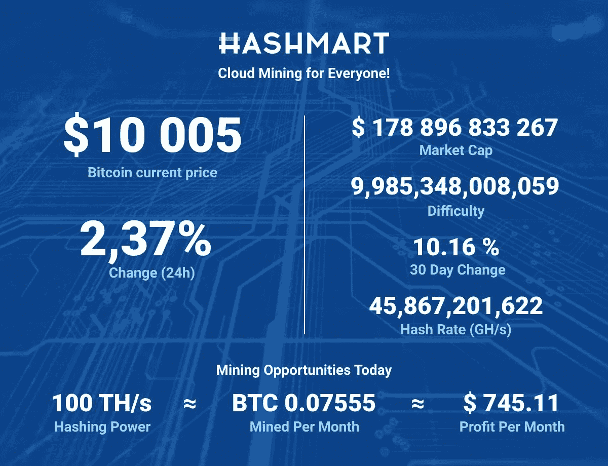

# HashMart 等云采矿服务会成为比特币采矿主流的门户吗？

> 原文：<https://medium.datadriveninvestor.com/could-cloud-mining-services-such-as-hashmart-be-the-gateway-to-taking-bitcoin-mining-mainstream-3fa630829a93?source=collection_archive---------3----------------------->

Photo by [Dmitry Moraine](https://unsplash.com/@wildbook?utm_source=unsplash&utm_medium=referral&utm_content=creditCopyText) on [Unsplash](https://unsplash.com/?utm_source=unsplash&utm_medium=referral&utm_content=creditCopyText)

## 购买比例份额的 hashrate 是否比运行自己的采矿钻机更好？

 [## 非洲的天秤座:脸书的天秤座将如何扰乱非洲

### 全球有 17 亿成年人处于金融系统之外，无法获得传统银行的服务！尽管……

www.amazon.com](https://www.amazon.com/Libra-Africa-Facebooks-going-disrupt/dp/1077622562/ref=sr_1_1?keywords=tendai+tomu&qid=1567073956) 

我以前开采过。是的，我曾在我岳父的山里农场公平地尝试过开采黄金。

我现在可以肯定地说，采矿是一项艰巨的工作。也有各种各样的方法和工具可以用来从地球的腹部提取黄金，对我来说，我更适合使用老式的探矿者的泥铲和基本的金属探测器。

 [## 2019 年成为主流的 7 大区块链挑战及更多...数据驱动的投资者

### 教训是永远不要停止学习和成长。关于技术、金融、工作场所、生产力和…

www.datadriveninvestor.com](https://www.datadriveninvestor.com/2019/03/25/top-7-blockchain-challenges-to-go-mainstream-in-2019-more/) 

正如人们所说，你永远不会忘记你的第一次——我永远不会忘记我“开采”第一块金块的那一天。在挑选出一块有前景的土地进行勘探后，我在某个区域从我的金属探测器获得了几个良好的信号，但我最初拒绝了它们，因为我认为我可能会拾取“热”岩石。所以我打开了我的铁辨别选项，看看是否能逐步淘汰目标，但我一直收到信号。

然后我用手铲挖这个地方，进一步检查，但蜂鸣声仍在继续。“再满满一铲，然后再满一铲，然后就再满一铲，”我告诉自己。当我终于在搜索线圈旁找到一把材料时，探测机器发出了巨大的尖叫声。这是一种类似于老式蒸汽机车汽笛的声音！

所以我想我找到了另一个钢钉或者一片废弃的金属，因为这个地方到处都是。但后来我开始在手中的泥土中寻找。就在那里，金子！

***比特币挖矿大同小异！***
挖掘比特币和我上面概述的套路差不多。虽然这次不是在泥土中采矿，而是在网上完成。比特币矿工使用**专用集成电路**(ASIC)或/和**图形处理单元**(GPU)来代替铲子、镐和金属探测器等工具。

比特币挖矿最近变得如此具有竞争力，以至于只有用最新的专用集成电路才能盈利。当使用台式计算机、GPU 或旧型号的 ASICs 时，能耗成本超过了产生的收入，即使有新型号可供您使用，一台计算机也很少足以与矿工所谓的“矿池”竞争。

矿池是一群矿工，他们结合自己的计算能力，在参与者之间分割开采的比特币。不成比例的大量*区块*是由联营公司开采，而不是由单个矿工开采。2017 年 7 月，矿池和公司代表了比特币计算能力的大约 80%至 90%。

根据定义，比特币挖矿是由高性能计算机执行的保护比特币网络的过程，这些计算机解决复杂的计算数学问题*(这些问题非常复杂，无法用手解决——所以是的，你可以收起你的铅笔和写字板了！)*。计算机解决其中一个问题所需要的运气和工作就相当于一个矿工*(读作:me* )在沙箱里挖掘的同时在地下挖掘黄金。计算机解决其中一个问题的几率是六万亿分之一！这一水平每 2016 个区块调整一次，或大约每两周调整一次，以保持采矿率不变。

对于比特币矿工来说，要从验证交易中赚取比特币，必须发生两件事。首先，他们必须验证 1 兆字节(MB)的事务，理论上可以小到 1 个事务，但更常见的是几千个，这取决于每个事务存储多少数据。如前所述，要向区块链添加一个事务块，矿工必须解决一个复杂的计算数学问题，也称为“*工作证明*”他们将尝试得出一个 64 位十六进制数，称为“*哈希*”，小于或等于目标哈希。一台矿工的计算机以每秒*兆哈希*(MH/s)、每秒*千兆哈希*(GH/s)、甚至每秒*万亿哈希【TH/s】的速度抛出哈希，根据单位的不同，猜测所有可能的 64 位数字，直到找到解决方案。换句话说，这是一场赌博！*

随着数字资产在全球范围内的采用，挖掘加密货币已经成为业内人士的一个话题。鉴于找到一个区块的高额回报，比特币挖矿仍然是最赚钱的硬币之一——但高回报也带来了高风险和高成本。随着超过 10000 个独立节点挖掘比特币块，一名矿工独自运行*时成功的几率并不惊人。*

# 好消息！！！

正如之前所承诺的，这本书更深入地探讨了这个话题，现在已经为你准备好了。

Purchase the book: |[Amazon](https://t.co/s9z9MLp7LT?amp=1) |[Gumroad](https://gum.co/iDLha) | [Bitcoin](https://t.me/Blockchain_Agriculture)|

***采矿类型***

鉴于寻找一个*区块*的高度困难，使用你的个人电脑(PC)或采矿钻机单独开采 BTC 是非常无利可图的。是的，机器是你的，你可以跟踪所有的支出，并从采矿中获得所有的收入。**但是**另一方面，运营自己的平台是如此困难，因为所有的责任，如安装硬件、技术维护、跟踪盈利能力的成本，都直接落在了你的肩上。这就是为什么你要把你的注意力吸引到*云*采矿上来。

*云挖掘*
云挖掘方便了通过互联网挖掘加密货币的过程。云计算是发展最快的趋势之一，其中服务器、数据库、软件和存储等计算服务是通过云来访问的。在资源方面拥有“实力”的大公司推动了这些服务，这些公司按使用量收费，就像我们支付水费或电费一样。

云挖掘为那些可能位于偏远地区并且可能很少或没有技术知识和/或硬件基础设施的人打开了加密货币挖掘的世界。云开采的过程非常简单，只需要一个人通过其网站在云开采公司开设一个账户，并选择某些东西，如合同期限和哈希权力。

然而，不可忽视的是，欺诈性公司或骗子伪装成合法的采矿公司，并搭乘潜在的云矿工的便车。因此，人们必须确定，在花血汗钱之前，对云采矿服务提供商进行彻底的背景调查是至关重要的。

** [## 非洲的天秤座:脸书的天秤座将如何扰乱非洲

### 全球有 17 亿成年人处于金融系统之外，无法获得传统银行的服务！尽管……

www.amazon.com](https://www.amazon.com/Libra-Africa-Facebooks-going-disrupt/dp/1077622562/ref=sr_1_1?keywords=tendai+tomu&qid=1567073956) 

是的，Hashmart 总部位于西伯利亚，西伯利亚以寒冷的天气和低电价而闻名(该地区每千瓦时收费 2.1 卢布(0.04 美元)，而莫斯科为 5.3 卢布)，这使其成为一个非常理想的比特币采矿中心，因为比特币采矿设备需要足够的冷却，而且往往是电力密集型的。

Hashmart can assist in navigating around the complexity of mining

Hashmart 是一个简单实惠的云挖掘服务，其主要目的是向更广泛的受众介绍比特币和其他加密货币。截至目前，Hashmart 仅提供使用 SHA256 挖掘算法的比特币云挖掘服务，以太坊和其他主要加密货币也将很快加入。

正如前面提到的，云开采的过程使一个人成为一个矿池的参与者，并涉及购买一定数量的“*哈希*能力。Hashmart 云采矿平台确保用户不需要购买任何采矿设备，因为您需要购买的只是采矿合同形式的 hash power。虽然每个人都有他/她自己的采矿策略，由他们决定哪种类型的合同适合他们，Hashmart 提供了两种类型的联系；

1.**为期 12 个月的合同**，没有相关的维护费用，持有者可以在 12 个月的合同期结束时收回所有开采的 BTC。

2.**无限期合同**，这种合同实际上是永久性的，因为它没有结束日期，更适合那些喜欢长期开采 BTC 的人，因为它不受任何时间限制。

云采矿池中的每个参与者都有与分配的哈希能力成比例的合法利润份额，并且使用 Hashmart 支付是每天进行的。第一笔款项将在您支付合同款项后的 24 小时内存入您的账户。Hashmart 还提供简单的收入预测，用户一旦购买了采矿合同，就会收到关于他/她未来收入的精确信息。所有这些信息都通过 Hashmart 网站上一个易于阅读和理解的用户仪表板呈现出来。

一定要去看看 Hashmart 的[网站](https://hashmart.io/)和模拟账户，这样你就可以进入当前的比特币牛市了！

# **免责声明**

*以上文章以独立视角撰写，作为 Hashmart 写作比赛的参赛作品。上述内容不构成财务建议，在决定是否投资任何金融产品之前，应寻求独立的财务建议。*

*如果你喜欢这篇文章，请关注我的*[*Twitter*](https://twitter.com/Tendy263)*/*[*Linkedin*](https://www.linkedin.com/in/tendai-tomu-75903612/)*。你也可以在这里* *给我买一杯* [*咖啡！*](https://www.buymeacoffee.com/Tendy263)**