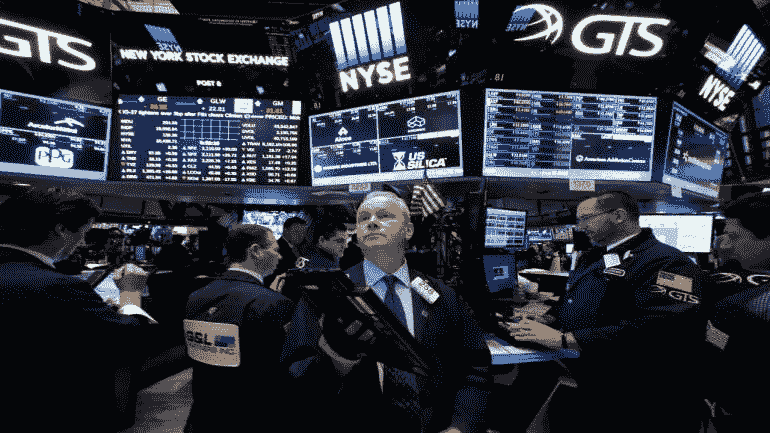
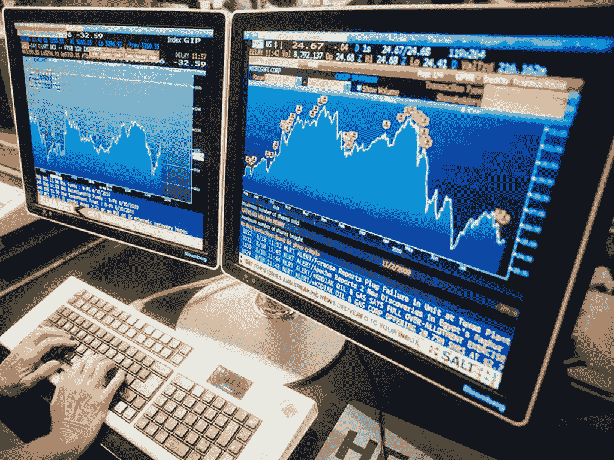
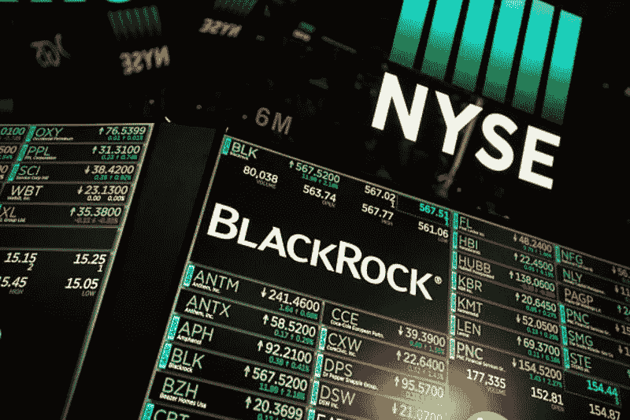
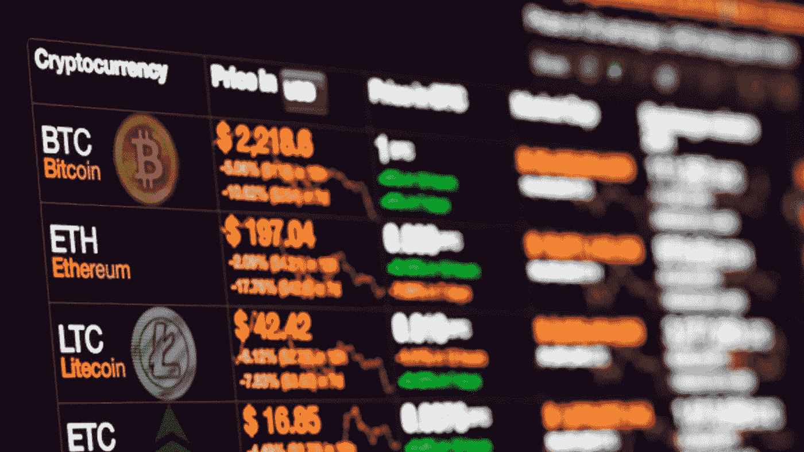
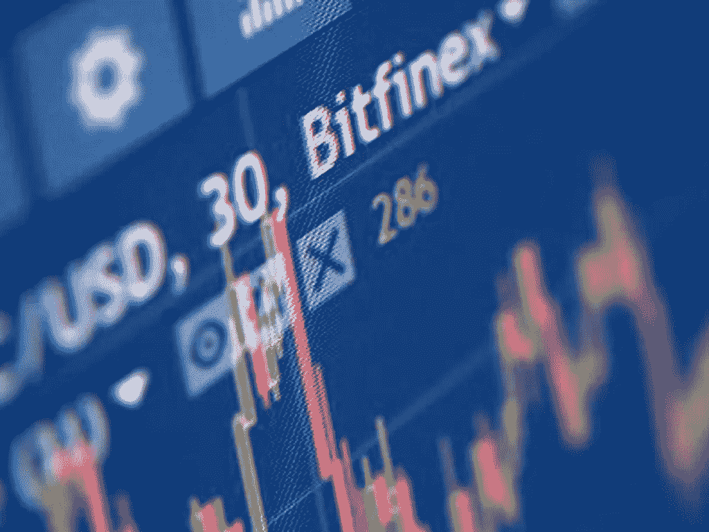

# 加密货币能提供 Algos 在华尔街蒸发的阿尔法吗？

> 原文：<https://medium.datadriveninvestor.com/could-cryptocurrencies-provide-the-alpha-that-algos-evaporated-on-wall-street-290230570609?source=collection_archive---------10----------------------->

Intern forgot to hold the mayo again. Sandwich was ruined.

在市场上，lpha(华尔街的说法)变得越来越难找到了。有点像 19 世纪加州淘金热时期的黄金。当黄金被发现的消息传出后，越来越多的人前往西部的旧金山寻找财富。虽然有大量的黄金，但越来越多的人开始知道淘金的最佳地点，最终剩下的一点点黄金不得不分给越来越多的乞丐(不是现在的乞丐)。市场也是如此。在繁荣的 80 年代和 90 年代，互联网的缺乏意味着信息不那么透明，交易员仍然可以在更长的时间内保护他们的自营交易策略，以便获得超过市场其他人的利润优势。但是那些日子，自动收报机和所有的一切，都已经成为过去了。有了以纳秒计算风险和回报的计算机化模型，市场在策略和执行方面变得如此同质化，以至于积极的经理人很难找到阿尔法。如今，数以百万计的机器人搜索市场，准备检测、吞噬和执行哪怕是最微小的市场低效和错误定价，还有数以百万计的其他算法旨在检测此类活动并效仿(也称为复制交易)。因为信息比过去透明得多，这是一件好事，现在的市场比以往任何时候都更像经济学家的“完全竞争”市场的理论模型。但是，高频交易者使用的算法驱动的量化交易模型也有另一个缺点——通过增加市场波动来加剧和夸大市场波动的趋势。我们已经在无数的“闪电崩盘”中看到了这种趋势，这些“闪电崩盘”虽然不规则，但却越来越频繁地发生。随着 2019 年的波动性将再次上升，我们当然可以预计算法交易，无论是缺点还是其他，都将增加波动性。

以上月美国股市在没有任何基本面经济消息的情况下暴跌为例。可以肯定的是，美中贸易战仍有可能发生，但交易员已经将这些担忧纳入价格，越来越多的证据表明，北京和华盛顿正在接近就此问题达成妥协。美国就业报告符合预期，尽管苹果大幅下调了预测，超出了分析师的估计，但这一下降更多是由于中国替代品的可用性，而不是全球经济萎靡不振。这就是为什么导致 12 月份下跌的相同算法也导致了此后不久的飙升，因为它们吸收了自我创造的市场反馈，即市场反应过度，变得超卖。这有点像同时吓唬自己和安慰自己——没有比这更让人精神分裂的了。

Not your typical Netflix and chill sort of date.

我们可以预计，波动性(自我创造的或其他的)将成为未来几十年的主题。据摩根士丹利称，量化交易策略，从包装成被动、低费用基金的廉价、普通的策略，到昂贵、复杂的统计对冲基金类型，管理着不少于 1.5 万亿美元的资产。尽管大宗商品市场等其它市场仍更具人情味，但这些市场也在缓慢但肯定地发生转变。由于算法只是一行行没有感情的代码，它们根据预先定义的参数行动，没有人类犹豫的好处，基于量化策略的高频交易同时使市场变得更加变化无常和脆弱。虽然量化交易者(也称为定量交易者)否认他们对整体市场的影响，但在近十年前，他们对市场的影响立刻变得清晰且不可否认。

2010 年 5 月 6 日下午 2 点 32 分，S&P500 指数莫名其妙地跳水超过 8%，仅仅 36 分钟后，又反弹了同样的幅度。当时，它被称为“闪电崩盘”，揭示了小型超高速算法交易公司的崛起，这些公司开始蚕食投资银行的阿尔法。突然间，代码变得比直觉更重要。但这并不是闪电崩盘的终结。2015 年秋天，市场再次变得精神分裂。对中国经济放缓的担忧(这种担忧三年后仍有可能出现)导致 S&P500 在 2015 年 8 月 24 日开盘时崩盘，触发了 2010 年闪电崩盘后实施的熔断机制，以暂停市场的极端波动。仅在一个交易日内，熔断机制就启动了近 1300 次。algo 交易的影响甚至可以通过交易所交易基金(ETF)感受到，在一段时间内，ETF 的价值不再与其基础资产相关联——这是 algo 交易基金可以利用的另一条途径，因为这是另一种低效率。换句话说，由自动交易引起的波动造成了被另一组算法交易程序利用的低效率。如果你愿意，可以称之为量化分析师的获利漩涡。算法交易并不像人们想象的那样独特。可能有一些“黑箱”,但在大多数情况下，每个人都可以访问相同的黑箱——例如，针对特定水平的波动性是“风险平价”策略中的常见策略，对冲基金有被称为“趋势跟踪”的策略，这些策略遵循风险平价交易引发的趋势，使波动性滚雪球。

Just because all the rocks you’ve ever seen are white, doesn’t mean there’s no such thing as a black rock.

因此，尽管大多数量化基金会辩称，它们对市场的影响相对较小——有人估计趋势跟踪策略的价值只有 3000 亿美元——但算法驱动、自动化、高频交易的综合效应产生了巨大影响。考虑到雪崩不一定是由可恶的雪人引起的，雪球也一样会起作用。可以肯定的是，市场*总是*容易受到源于极度恐慌的戏剧性暴跌的影响，并且可以肯定的是，在 1929 年的大股灾期间没有自动交易算法——*完全是由人类推动的。但自动化交易的兴起意味着，在一个比以往任何时候都更加浓缩的时期，这些波峰和波谷可能会变得更加明显，并会表现出来，导致尚未预见的后果。*

*尽管毫无疑问，高频交易远比人类场内交易者公开叫价更有效，但据高盛(Goldman Sachs)的研究人员估计，整个行业还不到一家主要银行。流动性供应是任何正常运行的市场的关键组成部分——它允许交易者无缝、平稳地进出交易头寸。但是自动做市商倾向于调整出价，当市场出现混乱时，他们会更积极(迅速)地询问。在市场动荡时期，即使是少量的抛售也会产生巨大的影响。由于量化策略是程序化的，没有决策滞后和自动化，他们可以在一个清淡的市场中如此迅速地开始抛售资产，以至于买卖订单之间产生脱节，导致巨额收益或下跌，从而产生重大的现实后果。*

## *加密货币市场*

*具有讽刺意味的是，许多针对加密货币市场，特别是加密货币交易所的批评，都是在华尔街编写的数百万行代码中诞生和滋生的。*

**

*当华尔街人士开始慢慢进入加密领域时，他们带来了自己的交易策略和算法执行。只是意识到加密货币交易所对它们可以带来的交易技巧有几个限制，讽刺的是，它创造了一个远比华尔街预期的更符合竞争和民主的市场。*

## *1.速率极限*

*虽然高频交易可能会统治华尔街，但这种策略对加密货币交易所的杠杆作用有限。几乎所有的加密货币交易所都有费率限制。这意味着在一个特定的时间框架内可以执行的交易数量是有限制的。尽管自动化交易非常可能(大多数交易所都有 API)，但华尔街意义上的高频交易却不可能。这意味着，交易者(人类或其他人)发现了低效率，也能够在更长的时间里从低效率中获利，锁定阿尔法，享受更长时间的阿尔法。这种低效率可以通过纯粹的勇气和勤奋来识别——而不是通过编程来识别。*

*加密货币市场的另一个优势是费用。为了使许多 HFT 策略在传统市场中发挥作用，收取的最低交易费确保交易者必须有足够的规模来执行这些策略。这使得新贵进入者很难进入这些市场。在加密货币市场，交易费往往是基于百分比的，这意味着即使是一个小交易者也有可能使用频繁的自动化交易从交易中获利。*

## *2.资产流动性*

*许多加密货币交易所，特别是较小的交易所(尽管一些较大的交易所也同样有罪)发布假卷，这是一个公开的秘密。在几乎没有监管的情况下，加密货币交易所运行自动化做市商机器人，以确保交易双方有足够的买卖深度，使用这些机器人不仅可以提供流动性，还可以在市场上进行实际交易，给人以成交量的错觉——这在纽约证券交易所这样一个受到严格监管的市场中是不可想象的。然而，华尔街一些衍生产品(例如 S&P500 期货)的流动性越来越差，这意味着即使是规模相对较小的对冲基金也可以通过买入或卖出这种期货来产生巨大的影响，因为交易员会在开市前进场观察期货表现，这是交易员基本上操纵市场并在交易的相反方向建立头寸(例如买入或卖出 S&P500 本身)以从交易中获利的一种方式。*

**

*Patient’s EKG looked to suggest he had crypto-fever, an incurable condition.*

*但在那些交易量真实的加密货币交易所(有几个)，出现的情况是，所有市场参与者，无论规模大小，都有类似的交易工具——交易对手的去中心化和民主化——更重要的是，在其他交易的最后是一个真正的交易对手(自动或其他)。*

## *3.数据差距*

*与传统市场不同，加密货币是新生的数字资产，任何特定的数字资产都有可能因为各种原因变得一文不值。由于大多数数字资产仍处于相对初级阶段，可供利用的数据点少之又少。大多数数字资产，尤其是那些基于以太坊区块链的资产，存在的时间还不够长，不足以形成纯粹的统计评估基础。*

*在这种背景下，对区块链项目的基础技术有足够专业知识的交易者，有能力分析项目的技术有效性和可行性，因此可能比纯粹根据价格和交易量评估交易空间的交易者处于更有利的地位。*

## *底线*

*随着越来越多的市场变得自动化，寻找阿尔法的人类交易者和算法交易者越来越多地不得不寻找其他地方。虽然加密货币交易所远非完美，但它们是交易员磨练技能和测试交易策略的绝佳场所。如果没有其他因素，加密货币交易所的全部功能的访问范围有助于以当前资本市场未能做到的方式实现市场准入的民主化(例如，大多数证券交易所的批准做市商数量有限)。如今，加密货币市场中的新贵交易商可以访问加密货币交易所的全套资源和功能，这需要在华尔街管理数百万美元的资产。*

*随着 alpha 越来越难以捉摸，交易员开始关注加密货币只是时间问题(这是高度投机性的)，加密货币市场仍处于初级阶段，但正因为如此，它仍为 alpha 提供了足够的机会。*