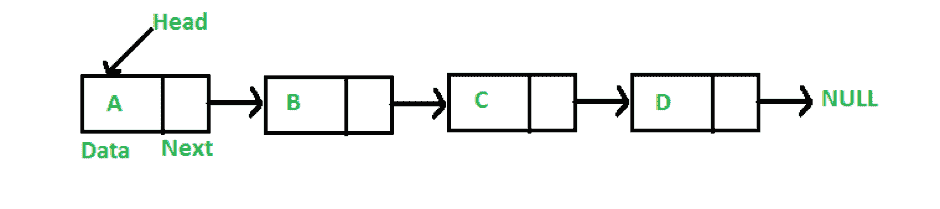
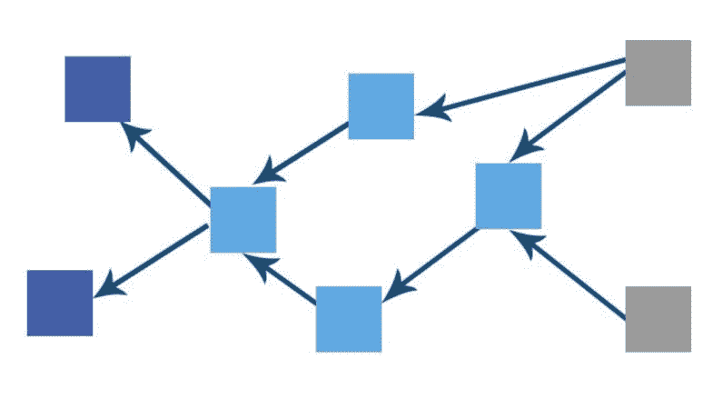

# DAG 会是区块链黑仔吗？

> 原文：<https://medium.datadriveninvestor.com/could-dag-be-a-blockchain-killer-f035d6191fcc?source=collection_archive---------2----------------------->

尽管区块链现在对世界的破坏性影响越来越大，但很少有人会认为这项技术在目前的形式下已经完成。事实上，在它达到大规模采用的水平之前，必须解决的问题仍然存在。

区块链面临的两个最紧迫的挑战是:

1.  伸缩性—许多协议无法处理大量事务。当考虑交易速度时，他们往往比不上 Visa 和 PayPal 等集中化的同行。
2.  交易费可能很贵，尤其是如果网络上有大量未核实的交易。

虽然目前正在测试旨在提高使用区块链的速度和成本的扩展解决方案，如比特币的“闪电网络”和以太坊的“分片”，但不能保证它们将足以支持其网络的快速增长的使用。

或者，许多人认为部分问题在于区块链使用的特定数据结构——即链表。

# 链接列表

区块链是一个链表，它只是计算机科学中使用的许多不同类型的数据结构中的一种。链表涉及到一个新元素被顺序链接到前一个元素。

[*来源*](https://www.geeksforgeeks.org/linked-list-set-1-introduction/)

随着每个新块被链接到链中先前添加的块，区块链链表允许我们验证所有块回到链的开始。因此，区块链仅仅代表了过去发生的交易的列表。

比特币的区块链只是链表数据结构的一个例子。它使用工作共识机制的证明，通过这种机制，矿工们竞争验证一个区块，每 10 分钟就有一个新区块加入到这个链中。但是考虑到区块链的顺序性质，在任何一个时间点上，只有一个新块可以被添加到链中。

大约同时发生的事务被放入同一个块中；但是如果块已满，事务将被保留在队列中，直到下一个可用块中有空间。这通常会造成巨大的瓶颈，严重限制网络上的事务吞吐量。

因此，考虑到与链表相关联的这些限制，出现了声称提供更快、更可扩展的区块链替代方案的其他数据结构，其中最流行的是有向非循环图，或“DAG”。

# DAG 是什么？

DAG 使用一个“[有向图](https://en.wikipedia.org/wiki/Directed_graph)”数据结构，它涉及一个节点和边(节点之间的连接)的网络。“定向”部分意味着该结构只朝一个方向前进。但是与区块链不同，dag 使用[拓扑排序](https://en.wikipedia.org/wiki/Topological_sorting):

[T5 来源:物联网链 ](https://iotchain.io/whitepaper/ITCWHITEPAPER.pdf)

这种排序意味着，虽然数据只能在一个方向上移动，即从“较早”到“较晚”，但是**而不是**必须是连续的。

DAG 构建事务图，由此为了验证新的事务，每个节点必须简单地验证来自其他节点的两个先前的事务。DAG 中没有使用任何块，这意味着网络不必每 10 分钟等待一次验证(以比特币为例)。相反，验证发生在更简单的对等基础上。这也意味着，与区块链不同，dag 不要求每个节点都与其他每个节点达成共识以进行最终验证。

因此，DAG 不是使用比特币的工作证明来确认交易，而是简单地利用其他节点已经进行的完全相同的交易来确认彼此的交易。

同时,“非循环”部分指的是这样一个事实，即一个节点不能引用回自身，这意味着一个节点上的新事务不可能在另一个节点上再次遇到。

通过识别最重的累积链来确定交易共识——交易所基于的链越长，它承载的“重量”就越大。并且如果累积链超过特定阈值，则交易可以被确认。这个过程创建了“有向图”——一系列有序的关联事件。

越来越多的加密货币正在使用 DAG 而不是区块链，包括 [IOTA](https://www.iota.org/) ，它将其 DAG 称为一个'[tangle](https://blog.iota.org/the-tangle-an-illustrated-introduction-4d5eae6fe8d4)'；和 [Byteball](https://byteball.org/) ，它使用 DAG 来提供一种数字货币、一种隐私货币和几个更多的用例。

# DAG 相对于区块链的优势

DAG 与区块链并非完全不同，两者都涉及节点网络，都是一种分布式分类帐技术，并且都是分散的。但是 DAG 也有明显的优势:

1.  不需要挖掘–Dag 中缺少块意味着验证不需要挖掘。在某些情况下(如 IOTA)，节点必须执行少量的工作证明，以防止垃圾邮件，但这个过程的难度是最小的。矿工的缺席也意味着 Dag 不会消耗大量的电力——这仍然是比特币的一个严重问题。此外，缺乏挖掘意味着 Dag 可能比比特币和以太坊更分散，这两者都经历了[哈希权力的显著集中](http://www.datadriveninvestor.com/2018/06/30/just-how-decentralized-are-cryptocurrencies/)。
2.  可扩展的解决方案—因为既不需要数据块也不需要挖掘，dag 比区块链更轻量级和可扩展。虽然更多地使用基于区块链的网络会导致性能下降，但基于 DAG 的网络在网络可扩展性方面经历了*的改善*，更多的用户能够以更快的速度确认交易。存在的新事务数量越多，节点使用它们来确认先前事务的机会就越多。
3.  微支付——比特币区块链的区块验证需要 10 分钟，交易积压导致一些用户向矿商支付更高的交易费，以确保他们的交易被包括在下一个可用的区块中。交易费用越高，用户使用比特币发送微支付就越不符合逻辑。然而，IOTA 等 Dag 是无感觉的，这使得发送微支付成为一种合理的经济选择(尽管需要注意的是，Byteball 在这一阶段确实收取交易费)。

# 那么，达格会取代区块链吗？

不太可能。虽然从理论上讲，DAG 可能是比区块链更快、更具可扩展性的解决方案，但不同类型的项目需要不同的系统。物联网似乎是 Dag 更快、无感觉的交易可能产生深远影响的一个主要领域，因为可扩展性在促进全球互联设备网络方面至关重要。

但我们不要忘记，区块链有自己的优势，这从现在有兴趣采用这项技术的政党数量之多就可以看出。例如，基于区块链的智能合约即将流行起来，而 DAG 智能合约迄今为止鲜有成功。

此外，基于 DAG 的加密货币可能会遇到潜在的问题。例如，重复花费可能会成为 Dag 的一个问题，特别是如果节点不总是能够访问完整的事务历史，IOTA 的 Tangle 就是这种情况。

尽管 DAG 哈希只在新交易中出现，但连续挖掘的缺乏使这种分类帐容易受到网络攻击，因此成功的攻击只需要 34%的网络哈希能力(相比之下，区块链需要 51%)。

事实上，IOTA 和 Byteball 目前都使用*集中式*解决方案——分别是一个“协调器”和 12 个“见证节点”——来防止此类问题。这使他们有了失败的中心点，这反过来又使这些项目的安全性受到质疑。尽管这种解决方案被认为是暂时的，但不能保证最终的分散解决方案会成功。

此外，虽然少数加密货币现在使用 DAG，但绝大多数仍在使用区块链。当然，这是否出于完全理性的原因还有待观察，但对区块链未来成就的预期，尤其是如果其臭名昭著的技术缺陷如预期那样得到解决，无疑意味着这项技术不会被匆忙放弃。

最终，dag 代表了超越区块链所能实现的令人兴奋的前景。但是考虑到它的相对婴儿期，假设它会在前进的道路上遇到障碍似乎是合乎逻辑的。这意味着，就目前而言，区块链哪儿也不会去。

*原载于 2018 年 7 月 10 日*[*【www.datadriveninvestor.com*](http://www.datadriveninvestor.com/2018/07/10/could-dag-be-a-blockchain-killer/)*。*