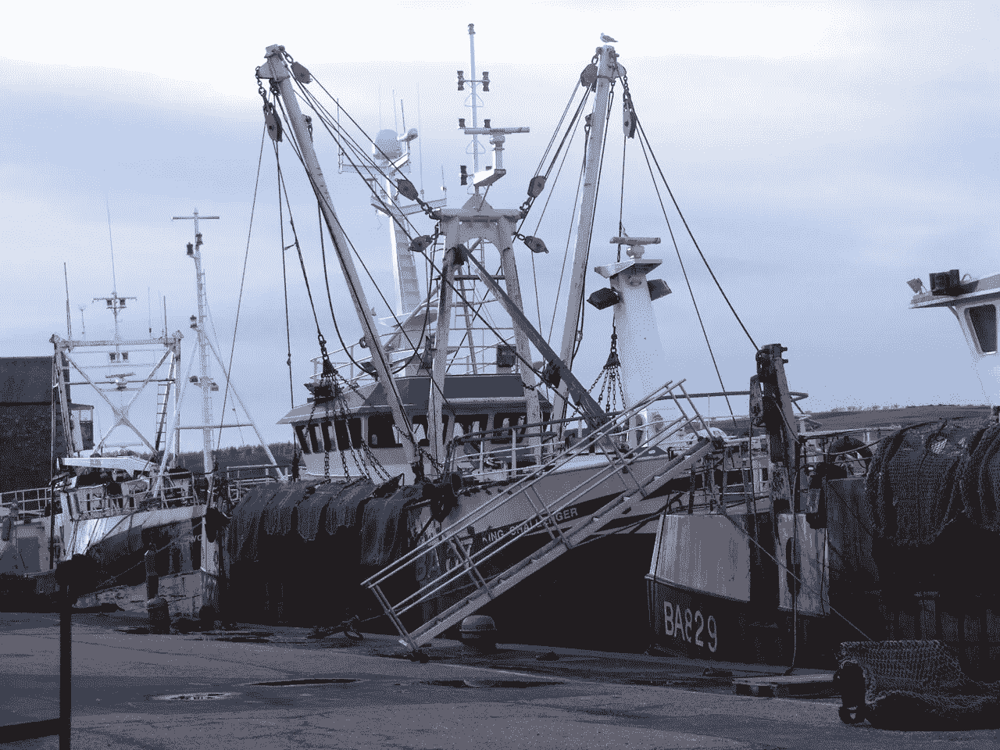
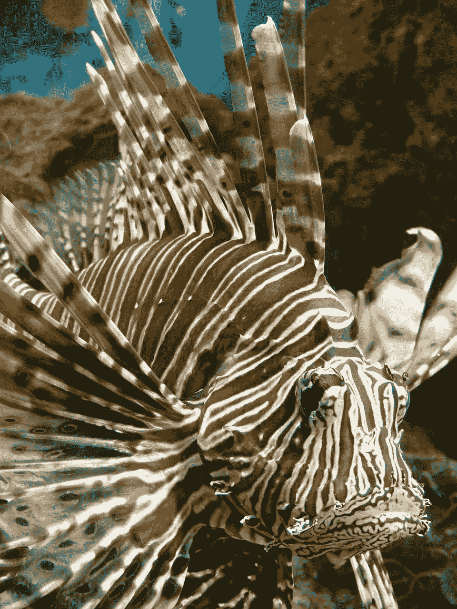

# 机器人能拯救海洋免于过度捕捞吗？

> 原文：<https://medium.datadriveninvestor.com/could-lasers-and-robots-save-the-oceans-f752d43ce61a?source=collection_archive---------14----------------------->

好吧，这听起来像是出自奥斯汀·鲍尔斯(“头上顶着该死的激光束的鲨鱼！”).但是海洋捕鱼的未来很可能是电脉冲和激光束，而不是网、鱼钩和金属链。

长期以来，商业海洋捕捞一直被批评为不可持续和破坏生态，尤其是对底栖物种。目前可供选择的捕捞方法包括底拖网、桁拖网和疏浚。一个足球场那么长、三层楼那么宽的海底拖网在海底拖曳，捕捉它们所经之处的一切，并粉碎螃蟹和珊瑚等海底生物。[据绿色和平](https://www.greenpeace.org/international/story/6895/7-ways-fishing-trawlers-are-bad-news-for-the-seabed/)报道，“所有拖网渔船的一个共同点是，它们基本上都在海洋上钻一个洞，然后捕捞很多它们不想捕捞的东西——滞销的鱼、海洋哺乳动物，甚至海鸟。”与此同时，疏浚和横梁拖网做的差不多，只是增加了坚固的金属链、栅栏和耙子，实际上是在海底犁耕，[破坏海洋生态系统](https://www.greenpeace.org.uk/what-we-do/oceans/overfishing/beam-trawlers-destroying-the-seabed/)。由于拖曳拖网和耙网的巨大重量，它们还会消耗大量燃料，造成大量的碳排放。

Traditional trawler ships preparing to go to sea.

虽然现代技术已经彻底改变了商业捕鱼——通过卫星鱼类探测、船只定位和自动监控渔具——但这只是导致了更多的过度捕捞。《海洋政策》中的一篇论文将世界剩余鱼类面临的最紧迫的威胁之一描述为“商业捕鱼，尤其是不加选择地捕获‘副渔获物’……由于各种监管和经济原因，它们无法使用或不需要，随后被扔回大海，往往已经死亡或濒临死亡。”根据联合国的数据，世界上超过 70%的渔场现在要么被“充分开发”，“过度开发”或严重枯竭。当然，这也危及到了渔业从业人员的生计。

然而，有新的技术解决方案可以拯救鱼类和渔民。[冰岛](https://patents.google.com/patent/US20100293831A1/en)[海洋研究所的 Einar Hreinsson](http://www.hafro.is/undir.php?REFID=5&ID=40&REF=1)提交的一项专利提出了一种方法，使用激光“将水生动物驱赶和/或引导到一个围栏中，这个围栏可以是一种捕鱼设备，如网或陷阱……动物对散射光作出反应，作为一种物理屏障或动物，可以被引导或引诱到围栏中。”激光还可以根据你想要捕捉的物种进行改变，从而减少副渔获物的数量:“光的类型是根据猎物选择的，这意味着光的波长是根据水生动物对哪种类型的光做出反应来选择的，即猎物认为选择的光的波长是一种障碍，因此会避开光。”

我问[海洋管理委员会](https://scholar.google.com/citations?user=wUTi2m0AAAAJ&hl=en)(MSC)——可持续渔业认证机构的首席科学标准官 Michel Kaiser 教授，这种方法是否能流行起来:“是的，目前确实有很多人对使用光和激光感兴趣，这些‘颠覆性技术’已经被证明可以在不需要可能破坏海床的沉重渔具部件的情况下将鱼集中到网中。在我参与的一项研究中，我们通过在网中的逃生面板上添加 LED 灯来减少扇贝拖网中的黑线鳕副渔获物，即向[不需要的]鱼显示出口……这些技术显示出减少不需要的副渔获物的巨大前景”。

> “由于当前技术的进步，我们正处于渔业真正创新的尖端。”

Lionfish — a deadly invasive species (and tasty meal)

马萨诸塞州的伍斯特理工学院(WPI)甚至正致力于开发一种能够自主识别和捕捉特定种类鱼类的水下机器人。最初的目标是狮子鱼(如图，左)，这种色彩鲜艳的印度洋本地鱼已经成为美国和加勒比海水域中一个非常成功的、具有破坏性的入侵物种。它有贪婪的食欲，有毒的鳍可以杀死毫无防备的捕食者，每四天产大约 30，000 个卵。WPI 开发的水下机器人使用计算机视觉 TensorFlow 神经网络来识别狮子鱼；然后它发射一个有浮力的矛尖，矛尖会浮到水面，把捕获的鱼带给水面上的渔民。所有这些听起来都非常耗时且昂贵——除了狮子鱼是一种美味佳肴，售价为每磅 20 美元；目前的捕鱼方法是潜水员手持长矛。

米歇尔·凯泽告诉我，自主潜水机器人“非常令人兴奋，它引领着智能捕鱼，这样渔民就可以避开小鱼群。由于当前技术的进步，我们正处于渔业真正创新的风口浪尖。”

还有一种方法将拖网的大规模捕捞优势与机器人和激光的物种选择相结合:脉冲拖网。在这里，一个大而轻的网可以在海底上方被拖网捕捞，而不需要破坏它。当它移动时，它发出电脉冲，使海底的鱼眩晕，并使它们上升进入网中；电脉冲也可以用来影响特定的鱼，而不会伤害其他海底生物。该理论认为，平均而言，捕获的鱼质量更好，因为它们遭受的损害更少，而总的来说，副渔获物更少。这些船也使用更少的燃料，因为脉冲拖网更轻，不会沿着海底拖曳。这种方法在荷兰渔民中特别受欢迎，例如,[VisNed 的主管 Pim Visser 告诉科学杂志](https://www.sciencemag.org/news/2018/01/tensions-flare-over-electric-fishing-european-waters)，他现在的捕捞“对环境的影响更小，经济回报更高”，并称赞这种方法挽救了许多渔业公司免于破产。

然而，脉冲拖网极具争议。它在世界上许多地方都被禁止，只有在特殊研究豁免的情况下才允许在欧盟使用。环保组织布鲁姆协会(Bloom Association)认为，脉冲拖网会导致“海洋荒漠化”:“使用的电流，一种‘脉冲双极电流’，与泰瑟枪使用的电流相同……这种类型的电流会导致如此剧烈、无法控制的抽搐，以至于 50%至 70%的大型鳕鱼在电击后会出现脊椎骨折和内出血。”英国渔民最近[告诉《泰晤士报》](https://www.thetimes.co.uk/article/dutch-devastate-marine-life-with-electric-shock-fishing-x9hpqc6hv)荷兰船只到访后，这片海域变成了“墓地”。

[Wageningen Marine Research](https://www.youtube.com/channel/UC5AvozK6qcPE3ZiJ-OIxoyw): Flatfish in pulse trawling; a view inside the cod-end

我请米歇尔·凯泽来帮助澄清这个问题——脉冲拖网是否更环保？“回答你的问题——现在下结论说对海底的影响没有传统拖网那么严重还为时过早……有理由怀疑直接的物理影响会更小，因为(与)普通拖网相比)渔具更轻。迄今为止进行的水族馆研究表明，许多动物对暴露于几分之一秒的电脉冲几乎没有反应:渔具在海底以大约每秒 1 米的速度被拖曳。”在[瓦格宁根海洋研究所](https://www.youtube.com/channel/UC5AvozK6qcPE3ZiJ-OIxoyw)(见上图)拍摄的一段视频中，在电脉冲拖网过程中，使用水下摄像机拍摄的鱼看起来并没有受伤。

总的来说，MSC 的观点是“如果创新有可能减少捕鱼对生态系统的广泛影响，从而提高可持续性，那么应该支持渔具技术的创新。”

无论哪种方式，似乎商业捕鱼——以及每一个海鲜消费者，谁可以通过他们的购买力来影响这一点——都需要做出决定。海洋的收获能变得以激光为焦点吗:更高科技，更有选择性，危害更小？或者我们只是继续把同样的旧网、链条和副渔获物扔到海里？