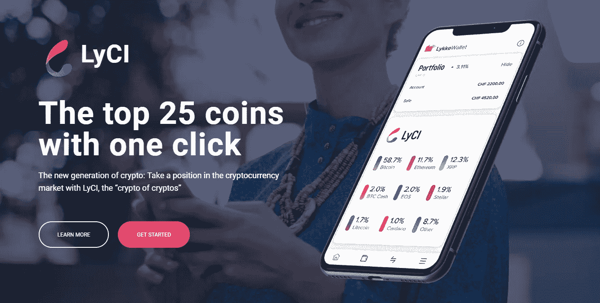
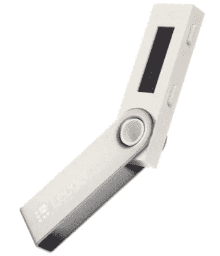
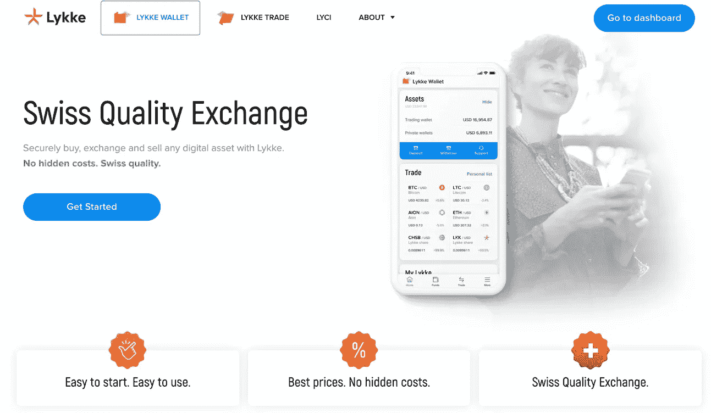
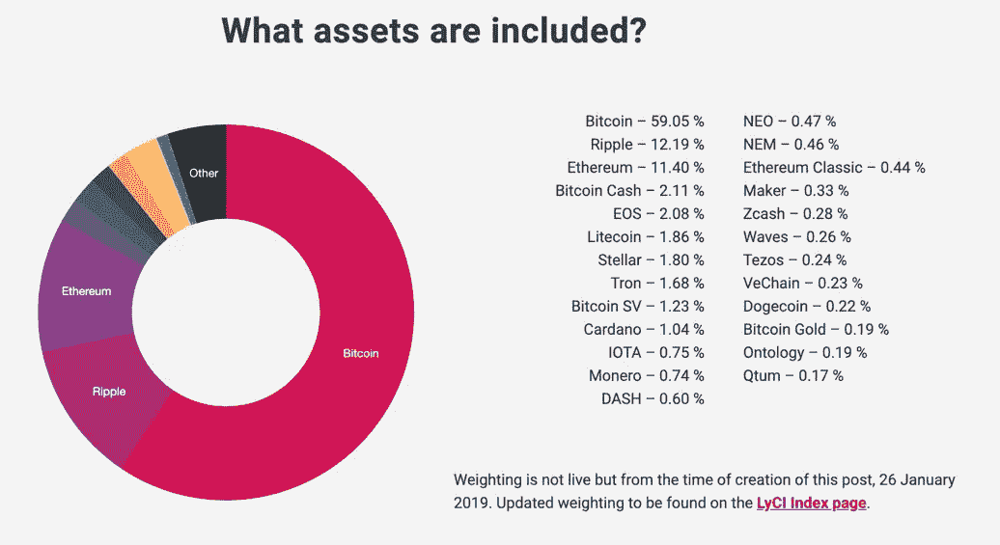
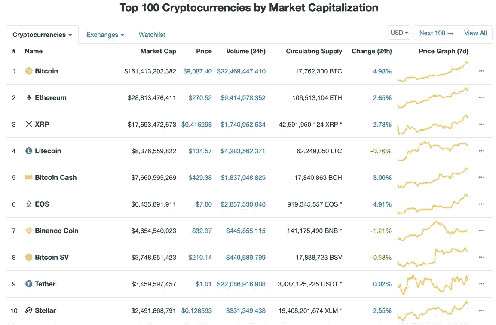
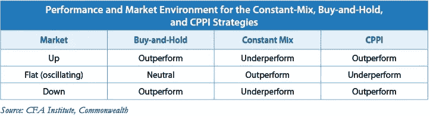
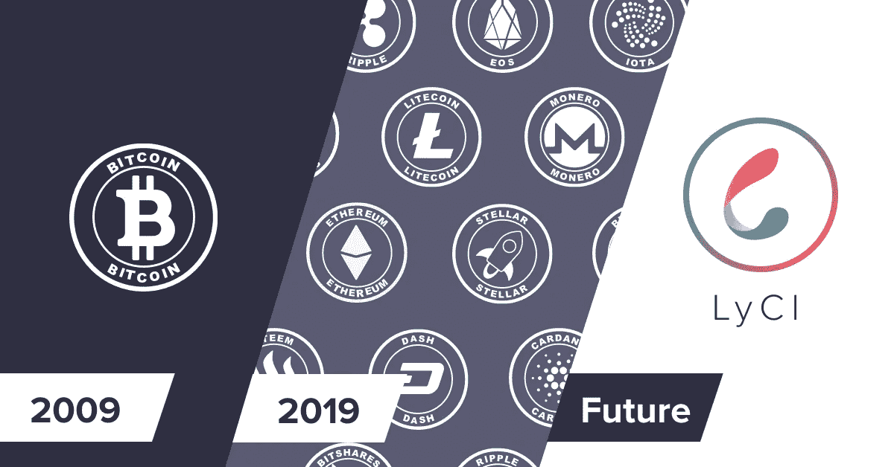

# Lykke 的 LyCI 等加密货币指数产品会成为加密投资的零售门户吗？

> 原文：<https://medium.datadriveninvestor.com/could-lykkes-lyci-index-product-be-the-gateway-retail-investors-are-waiting-for-72635c0eb2ff?source=collection_archive---------1----------------------->

***散户进入加密货币的艰险之旅***

> 希望参与加密货币市场的散户投资者面临着似乎不可逾越的障碍。虽然成为下一个加密百万富翁的前景似乎很诱人，但即使在 2019 年，进入加密货币的世界也是一项艰巨的任务。Lykke 和 LyCI 能采取有意义的措施来改变这种情况吗？本文调查…

虽然普通散户投资者熟悉股票和债券，但他们通常可以通过银行和金融顾问获得这些资产，并将其安全地存放在有保险的安全账户中。这些服务是有代价的，但所需的专业知识有限，而且监管要求金融中介机构继续代表客户行事，并保留投资者留下的资产。

 [## 总部设在瑞士的 ETP 进入加密交易市场-数据驱动的投资者

### 虽然金融市场几乎没有沉闷的时刻，特别是在引入…

www.datadriveninvestor.com](https://www.datadriveninvestor.com/2019/03/10/swiss-based-etp-enters-the-crypto-trading-market/) 

然而，在加密领域，投资者必须在一个不受监管的环境中航行，他们必须成为自己的银行。虽然加密交易所经常代表客户行事，但许多交易所并没有这样做，许多交易所已经成为黑客攻击的目标。这导致许多投资者的资金被骗。加密安全专家对以下事实提出了严厉的警告:除非你把加密货币放在钱包里，否则你不会完全拥有它。这些专家提倡硬件钱包，这种钱包看起来像 u 盘，是定制设计的，可以安全地离线存储加密货币，远离窥探的黑客和崩溃的交易所。这些预防措施是加密投资者学习曲线的必要组成部分，但它们也是大规模采用加密货币的另一个主要障碍。

A typical hardware wallet

将资金转移到加密货币交易所也会引起焦虑，因为这通常需要将传统的法定货币转移到监管较少的小国的银行账户，而这些国家与加密货币交易所本身的注册地无关。这是因为大多数国家和银行宁愿谨慎行事，也不会给基于加密货币的企业传统账户。最常见的原因是加密货币交易所的客户可能没有经过足够严格的“了解你的客户”流程，交易所可能被认为没有足够的反洗钱措施，特别是考虑到比特币与暗网和非法市场的历史。事实上，大多数加密货币交易所都受到传统金融界的排斥，他们不提供法定货币存款，只接受加密货币。

当个人习惯于购买比特币和以太坊，并开始寻找下一种热门的加密货币时，下一系列问题就来了。这导致在多个交易所开设账户，以便能够使用其他硬币，但反过来也为黑客利用安全漏洞提供了更多的通道。此外，通过冒险进入小盘股加密货币的狂野西部，投资者面临着抽水和倾销计划，这些计划试图将散户投资者卷入他们的硬币炒作中，在移除地毯之前尽可能抬高价格，在最高点卖出尽可能多的硬币，同时留给其他人基本上毫无价值的硬币。类似地，投资者可能会被精心记录的首次硬币发行白皮书所吸引，这些白皮书被打扮成下一个比特币，但没有取得突破所需的专业知识或基础设施，其存在只是为了让这种加密货币的创造者获利。

***Lykke 和 LyCI 如何为散户投资者减轻这些障碍***

与总部位于瑞士的加密货币交易所 crypto world 中的许多交易所和参与者不同，Lykke 一直追求无缝融入传统金融系统的使命，并寻求简化散户投资者买卖加密货币的流程。Lykke 没有对抗监管，而是走向监管，希望寻求与政府和金融中介机构的和谐，以使他们的业务可持续发展，并给予他们的客户他们期望从传统金融机构获得的相同保护。通过这种方法，Lykke 缓解了上述散户投资者面临的许多挑战，同时通过严格遵守“了解你的客户”和“反洗钱”法规，允许银行向自己和客户开放金融机构的大门，从而不会疏远银行。

这项任务的最新进展是 LyCI 指数产品的开发。Lykke 的 LyCI 产品借鉴了传统金融中长期盛行的理念，是一种被动的指数投资产品，允许投资者参与更广泛的加密货币市场，而无需持有基础资产本身。传统的指数产品如此成功，以至于沃伦·巴菲特甚至和一位对冲基金经理打了 1000 美元的赌，赌一只被动管理的 SP500 指数基金在 10 年内会跑赢老练的对冲基金经理。他赢了。这类产品如此成功的原因在于，它们不依赖于任何给定的公司或指数中的任何成员，而是从所有公司的整体成功中获利，同时剔除不成功的公司，并在它们进入和退出指数时纳入成功的公司。

While being an outspoken critic of crypto, Warren Buffet has long advocated passive investment vehicles as being one of the safest and profitable ways to invest in the long term

Lykke 现在已经将这一概念引入了加密货币市场。具体来说，LyCI 投资于市值排名前 25 位的加密货币，并根据其市值在指数中进行加权。市场资本总额是可用硬币的数量乘以硬币的价格，得出硬币总供应量的价值。该指数是每分钟计算一次价格，每天增加或删除成分，进一步保护投资者免受输家和赢家的影响。LyCI 在指数中内置了一些其他机制来保护投资者，例如处理非自然泵和转储的自由裁量权，以及技术上不健全的硬分叉，反叛派别试图复制一种货币，但不具备与原始货币相同的意图或基础设施完整性。这两个问题都可以看到硬币错误地发现自己在市值最高的 25 个硬币中。比特币最近就是这种情况，包括 Lykke 在内的许多交易所选择不支持一个有争议的分支，称为比特币 SV，它仍然是排名前 25 的硬币。

LyCI 不再需要在许多交易所持有多个账户，重新平衡有助于管理大幅波动的头寸，投资者不再需要跟上较小的加密货币快速飙升的市值图表。尽管有些人可能会对持有波动性更大的小额硬币的风险犹豫不决，但加密货币市场的一个特点是，大多数资金仍集中在比特币上。LyCI 目前持有超过 64%的比特币指数，在以太坊和 Ripple 分别持有市值第二和第三大的比特币。虽然比特币和这些顶级硬币仍有可能实现抛物线式跳跃，使其成为人们关注的焦点，但它们的波动性往往低于市值排名第 10 至第 25 位的硬币。因此，在风险较小的硬币上持有少量头寸的风险大大降低。

LyCI’s index weighting as of January 26th 2019

比特币在加密市场独一无二的首要地位也意味着，它往往充当整个市场的方向舵，指引大方向，但也在熊市中提供一定程度的波动缓冲，并在牛市中为有前途的新项目和货币提供跳板。因此，市值加权指数非常有利于降低波动性，同时仍允许投资者利用市值较小的硬币，这些硬币可以带来数百个百分点的收益。

持有这 25 个顶级硬币与只持有比特币相比，也提供了多样化的好处。在其他资产类别中，多元化已被一次又一次地证明，在投资者承担相同风险水平的情况下，可以增加回报。当参与像加密货币这样波动性很大的资产类别时，降低风险对大多数投资者来说是显而易见的，使用加密货币指数产品而不是购买一种或几种单独的货币是进入市场的一种更安全的方式，特别是在较长的时间范围内。事实上，谨慎的多样化意味着大多数投资者仍应将其大部分资产投资于传统工具，如股票、债券和现金；然而，如果他们的投资组合中有少量加密货币配置的空间，LyCI 是使用这种配置的一种很好的方式。

***LyCI 是否应该市值加权？***

LyCI 是指数产品的一个很好的起点，但是，该产品可以通过以下方式进行改进:从基于 [coinmarketcap.com 的](http://www.coinmarketcap.com)市值指标对指数中的单个货币进行加权的被动方法转向考虑市值和其他因素(包括定性专家意见)的混合方法。

The top 10 according to coinmarketcap.com

根据一个公开网站，只衡量市值的优势是，它让投资者和 Lykke 对产品的管理方式和透明度有一个共同的预期。缺点是加密货币市场远不如传统市场受监管，并且 coinmarketcap 的纳入不以满足监管要求为基础。相比之下，美国股票指数 SP500 要求指数成员在纽约证券交易所、纳斯达克或 CBOE BZX 上市，这些交易所受到高度监管，接受美国证券交易委员会(SEC)的审查。SEC 是一个非常强大的监管机构，它迫使上市公司提交独立审计的财务报表，并提供给投资者。这些报表是以金融分析师和投资者可以将它们区分开来的方式编制的，因为它们是根据监管进行标准化的，加密货币网站和加密货币交易所没有相应的监管机构。

虽然加密货币相对于股票的巨大收益部分是由于风险增加和信息效率低下，但需要更高的尽职调查。与其他资产相比，加密货币特定的知识和研究可以产生更高的高于市场的回报(alpha)，因为公众可以轻松获得和理解更多信息。加密货币的这一特点给市值指数带来了一个困境，这些指数盲目地包括或排除成分，而没有专家决定新的指数成员是否有权存在。

加密货币的市值数字也高度受制于其底层算法以及硬币的分配方式。例如，按市值计算，Ripple 是第三大加密货币，其总供应量的 60%为储备货币，对其创始人的隔离程度更高，其供应量并不公开。当在市值加权指数中衡量这样一枚硬币时，这构成了一个难题，也意味着如果 Ripple 向市场释放这些资金，投资者持有的价值可能会大幅贬值。类似地，一些加密货币本质上是通货紧缩的，因为它们会自动发行更多的硬币来降低价格，而其他加密货币则是通货膨胀的，因为它们会消耗现有的供应来提高价格，从而将利润返还给投资者。被称为加密经济学的加密货币设计领域很快变得复杂，然而，它的含义是，它有可能扭曲未经调整的市值加权指数。然而，我认为加密经济学的复杂性为像 Lykke 这样的公司提供了一个机会，他们无疑拥有资产特定的专业知识，可以采取更积极的方法来衡量他们的成分，以准确反映加密货币市场，并可能给投资者更好的机会从整体市场中获利。

***潜在加密货币指数产品创新***

高市值并不能保证加密货币的技术或经济有效性，最重要的是它的寿命。一个半主动的替代方案可能是，根据调整后的市值排名，从排名前 50 的硬币中选出 20 至 30 只指数成份股。纳入或排除将基于多个定性和定量因素，投资委员会将每月审查并公布这些因素。这可能会降低交易成本和快速转换成分的需要，因为指数参与者将仅每月转换一次，除非可能出现特殊情况，进入前 25 名并不能保证被纳入指数。

另一种调整也可以是从市值权重转移到等权重指数或固定权重指数，其中比特币、电子货币和纹波成分占指数的 50%，指数的其他成分权重相等。虽然这些产品比当前的 LyCI 波动性更高，但它们将让投资者在更小的加密货币中持有相当大的股份，这些货币具有更大的收益潜力。毕竟，2014 年排名前 25 位的硬币中，只有 3 个在 2019 年仍排在前 25 位。如果这种货币有一天取代比特币，那么持有 4%而不是 0.14%的股份(LyCI 最小的成分)可能会产生巨大的差异。如果这样一种产品再加上 Lykke 挑选成分的自由裁量权，这可能是购买加密货币市场的一种很好的方式，但具有最大的收益潜力。

另一方面，对于风险厌恶者来说，传统金融产品的一些特征也可以应用于加密货币指数产品。例如，一些再平衡技术包括保险(下表中的 CPPI ),当投资组合的价值增加时，更多的资金从现金投资到风险资产，而减少导致从风险资产转向现金。这种产品可能符合投资者的普遍担忧，即投资加密货币可能会“血本无归”。然而，如果可以容忍 80%的资本保留阈值，这可能会给更多厌恶风险的投资者提供进入市场的途径，因为他们最糟糕的情况是损失 20%的初始投资资金。

How different rebalancing techniques affect performance, CPPI is a natural candidate for crypto products

加密货币产品还有许多其他形式的创新，Lykke 已经开始通过创建基于硬币功能的子指数来实现这一点，如支付硬币、智能合约硬币和服务硬币指数。在以系统的方式将空头头寸整合到管理产品中的领域，进一步的调查可能是富有成效的。通过这种方式，可以利用加密货币容易出现的暴力熊市，而不是让投资者通过它们等待市场的整体上涨。

***零售加密货币投资者的未来从未如此光明***

虽然创新存在无限可能，但最令人兴奋的可能是加密货币指数产品和接受监管的公司正在为加密货币的更广泛采用和更多资金流入这一令人兴奋的新资产类别铺平道路。在易于理解的用户友好平台上容易投资的产品是加密货币所代表的潜在财富收益民主化的下一步。LyCI 等产品是将加密货币合法化的一大进步，加密货币是一种资产类别，普通投资者只需有限的专业知识就可以安全投资。加密货币不再是少数早期采用者的利基领地，而是可以由许多人分享其光明的未来。

*下面这篇文章是以独立的视角写的，作为 Lykke 的 LyCI 写作比赛的参赛作品。上述内容不构成财务建议，在决定是否投资任何金融产品之前，应寻求独立的财务建议。*

*安德鲁·道格拉斯，CFA*