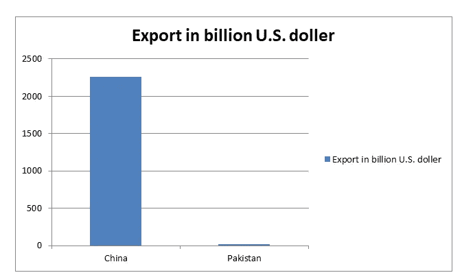

# CPEC 通向经济问题之路

> 原文：<https://medium.datadriveninvestor.com/cpec-a-road-to-an-economic-problem-94813bfbb328?source=collection_archive---------7----------------------->

中巴经济走廊(CEPC)是中国和巴基斯坦政府的倡议。作为中国“一带一路”倡议的一部分，CPEC 正致力于促进中巴贸易，通过这条路线，中国可以绕过海洋。
CEPC 计划包括建设一个交通、能源、工业和农业项目网络，该网络将延伸约 2700 公里。从巴基斯坦的瓜达尔港到中国的新疆。
CPEC 可以帮助巴基斯坦增加出口，提振经济，因为中巴之间的贸易可以变得更加舒适。它将通过公路和铁路连接巴基斯坦和中国的两个港口。CPEC 将穿越巴基斯坦，连接中国。
那么为什么这些项目会给巴基斯坦带来问题呢？我们将在博客中讨论这个问题。

# 1.在 CEPC 超支-

CEPC 不是一个小项目，它将覆盖整个巴基斯坦，它不仅有公路和铁路，这将花费 CEPC 提出的各种能源和农业项目。

截至 2017 年，CPEC 的价值约为 620 亿美元。
中国进出口银行将向巴基斯坦提供 110 亿美元的贷款，利率为 1.6%
。巴基斯坦 1 号线铁路大修计划耗资 82 亿美元，其中 70 亿美元将由中国国有银行提供优惠贷款。

规划已久的 27.1 公里长、价值 16 亿美元的拉合尔地铁橙色线被视为商业项目，不符合进出口银行 1.6%的利率。取而代之的是以 2.4%的利率融资。
巴基斯坦-中国光纤项目耗资 4400 万美元，是一条连接巴基斯坦和中国的 820 公里长的光纤线路，将使用优惠贷款建设，利率为 2%，而不是其他项目适用的 1.6%。

 [## 如果资本主义失败了，那么还有什么选择呢？数据驱动的投资者

### 在当前政治领域的修辞之旅中，我们都可以面对面地接触到流行词汇，如…

www.datadriveninvestor.com](https://www.datadriveninvestor.com/2020/03/16/if-capitalism-is-a-failure-then-what-is-the-alternative/) 

中国在 2015 年 8 月宣布，瓜达尔几个项目总计 7.57 亿美元的优惠贷款将转换为 0%利息贷款。目前由 0%利息贷款融资的项目包括:1.4 亿美元的东湾高速公路项目的建设，1.3 亿美元的瓜达尔防波堤安装，3.6 亿美元的瓜达尔煤电厂，2700 万美元的瓜达尔港泊位疏浚项目，以及 1 亿美元的瓜达尔 300 床位医院
。价值 155 亿美元的能源项目将由中巴合资公司建设，而不是由中国或巴基斯坦政府建设。中国进出口银行将以 5-6%的利率为这些投资提供融资，而巴基斯坦政府将根据合同义务以预先协商的价格从这些公司购买电力
亚洲开发银行宣布投资 1 . 95 亿美元升级 N70 和 N50 公路。英国国际发展部也提供了 7240 万美元的贷款
费萨拉巴德和木尔坦之间的 M-4 高速公路不是由中国政府资助的 CPEC 的一部分，而是由亚洲基础设施投资银行部分资助的第一个基础设施项目，将与亚洲开发银行共同资助总计约 2.75 亿美元。联合王国政府于 2015 年 10 月宣布为 M4 高速公路项目 Gojra-Shorkot 路段的建设提供 9070 万美元的赠款，也将为部分项目提供资金。
可能会有更多的贷款用于制作 CPEC，我在这里没有提到。

巴基斯坦在贷款时应该更有意识。

# 2.经济问题-

CPEC 计划促进巴基斯坦的经济发展，但是 CPEC 的发展方式可能会在未来给巴基斯坦的经济带来问题。

## 巴基斯坦小企业的问题-

CPEC 正在创造促进中国和巴基斯坦之间的贸易，CPEC 也将这样做，但另一半。
巴基斯坦必须明白，他们正试图增加与一个出口大国的贸易关系。

-2017 年以美元计(美国东部时间。)

这是两国的图表。已经看出哪个国家将主导出口。
中国企业相对比同行更先进，性价比更高。中国商品很容易让巴基斯坦的小规模工业头疼。这将是未来几年的一个大问题。如果巴基斯坦向中国商品开放经济，那么巴基斯坦的小型工业将很有可能无法面对竞争。巴基斯坦政府。在允许中国之前必须三思。因为我相信中国会为他们的商品找到一个比巴基斯坦更新的市场。我认为巴基斯坦政府。应该优先考虑小型工业。

## 没有培训巴基斯坦工人-

当巴基斯坦为 CPEC 设想道路时，他们认为巴基斯坦人民会得到工作，工人会得到培训。因此，这将创造就业机会，巴基斯坦商品将进入新的市场，但这并没有按照计划进行。中国给本国公民的工作比巴基斯坦公民多。
中国正在瓜达尔附近建造中国唯一的殖民地，为 50 万工人提供家园。
这很糟糕，因为那 50 万中国工人会抢走 50 万份工作，而这意味着巴基斯坦公民的饭碗。

## 给中国公司更多订单-

这是真的，中国公司比巴基斯坦公司获得了更多的项目。
政府只将中巴经济走廊(CPEC)的四个项目分配给当地建筑商，而且条件也很严格。
巴基斯坦建筑商协会(CAP)主席西坎达尔哈亚特哈塔克(Sikandar Hayat Khattak)表示，在大型项目中与当地合作伙伴签署合资企业(JV)的条件，也被 CPEC 政府取消，尽管外国公司必须拥有 70%至 30%的合资企业，才能发展当地行业，确保技术转让和人力资源开发。如果中国公司得到订单，他们会给中国人提供工作，这对巴基斯坦公司、人民和经济都没有好处。

## 安置问题-

由于 CPEC，巴基斯坦人民面临着重新安置的问题。因为他们的土地被 CPEC 夺走，却没有得到适当的安置。由于这种紧张局势正在一个国家内部上升。

# 3.战略问题-

CPEC 也在巴基斯坦内外产生战略影响。

## 提高中国的参与度-

正如我前面所说的，在巴基斯坦的中国工人和公司的数量在增加，在 CPEC 竣工后，中国将更多地参与巴基斯坦的事务。由于 CPEC 总会有一些中国的货物或人在这个国家，中国也开始在巴基斯坦准备只有中国人的房子，这只会在未来给巴基斯坦带来问题。巴基斯坦有一个斯里兰卡的例子，说明中国是如何占领其港口的。

## 恰巴哈尔港-

这条 CPEC 将在未来给印度的防御造成问题，因为中国可以轻易地将这条路用于军事目的。
为了应对这种情况，印度与伊朗联系，使用他们在瓜达尔附近的一个港口，该港口相对更具战略意义，名为恰巴哈尔港。如果印度和伊朗能够启动这个港口，那么对于 CPEC 将是一个巨大的打击，因为恰巴哈尔港相对来说更方便，而且处于战略位置。
还有各种其他因素也可能导致巴基斯坦的问题，比如巴基斯坦有反对 CPEC 的抗议活动，人们攻击工人等等。

# 结论-

CPEC 是个好主意，但巴基斯坦选错了合作伙伴。如果巴基斯坦不能偿还 CPEC 的贷款，那么这将是一个大问题，因为巴基斯坦在过去几周不得不向国际货币基金组织申请贷款，而国际货币基金组织对此提出了一些严格的条件。印度正试图通过恰巴哈尔港对其进行反击，这将是巴基斯坦未来几年的一项艰巨任务。

*原载于【https://onkarjadhavv.blogspot.com】**。***