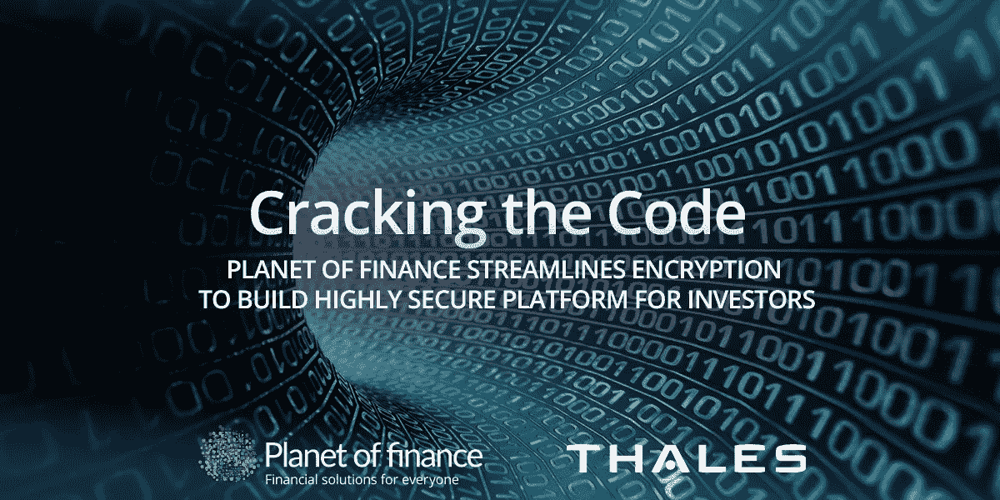

# 破解密码:金融星球简化加密，为投资者构建高度安全的平台

> 原文：<https://medium.datadriveninvestor.com/cracking-the-code-planet-of-finance-streamlines-encryption-to-build-highly-secure-platform-for-984a2f323baf?source=collection_archive---------6----------------------->

*据估计，每天有 32 亿人使用互联网，网络安全和个人数据加密变得越来越重要，尤其是对任何涉及金融服务行业的组织而言。阅读原文在* [*泰勒斯的网站这里*](https://www.thalesesecurity.com/resources/case-studies/cracking-code-planet-finance-streamlines-encryption-build-highly-secure) *。*

总部位于摩纳哥的金融星球(Planet of finance)是一家由资深银行高管组成的核心团队创立的机构，该机构非常重视所有与安全相关的事务。“金融星球”成立于 2015 年，是投资者的领先平台。以金融世界数字化为目标，该公司建立了一个动态平台，专注于在财富管理高管和个人高净值投资者之间建立长期联系。

[金融星球](https://planetoffinance.com)的成员遍布 81 个国家，专业成员共同管理着 15 万亿美元的资产。该平台提供多种好处，包括为行业成员提供建立网络、与投资者联系和筹集资金的能力。私人投资者有权寻找和比较完全符合他们独特需求的服务。

《金融星球》成功背后的一个独特优势是其围绕个人数据所有权的独特理念。[Planet of finance 的合伙人 Alain Broyon](https://www.linkedin.com/in/alainbroyon/) 描述道:“一个人的信息显然是他们自己的财产，但我们强烈主张这些数据具有内在价值。例如，如果他们选择与家族理财室分享这些信息，那么应该有适当的补偿，以认可他们所提供信息的内在价值。家族办公室从数据中受益，所有者为什么不应该受益呢！”

他继续说道，“我们的职业一直将数据安全放在最重要的位置，但是对于《金融星球》来说，为与第三方共享的数据分配额外价值的概念将事情带到了一个更高的层次。我们的目标从一开始就是保护我们客户的信息，同时让他们能够控制如何分享这些信息。为了兑现客户对我们的信任，我们的方法是实施最强大、最可靠的技术。

# 技术挑战

与金融服务领域的所有公司一样，Planet of finance 也受到广泛的行业、地区和全球监管要求的约束，包括欧盟颁布的《通用数据保护条例》(GDPR)。Broyon 解释了其中的含义，“因为我们是一个全球平台，所以找到一种解决方案至关重要，这种解决方案可以自动保护我们的数据，使我们遵守所有现行法律和规定，但不需要不断检查和调整。”

凭借 Planet of finance 的积极增长目标，该公司寻求一种安全解决方案，能够快速扩展、保持灵活性，并为其客户提供不可逾越的安全保护。[金融星球的 IT 主管郭晓晨](https://www.linkedin.com/in/xiaochen-guo-818b606a/)解释道:“为了给我们提供所需的灵活性，我们的基础设施几乎完全基于云。这立即淘汰了许多用于保护信息的传统方法。”

# 解决办法

“我们做了大量的研究，并决定加密将是我们的最佳方法，”郭说。“我们与当地的 Thales 团队进行了深入的讨论，他们真正理解我们想要实现的目标。他们非常合作，我们对泰雷兹能够提供满足我们所有要求的正确解决方案感到非常满意。”

The Planet of finance 团队选择了由 [Thales](https://www.thalesesecurity.com/resources/case-studies/cracking-code-planet-finance-streamlines-encryption-build-highly-secure) 开发的 Vormetric 应用程序加密来保护组织的数据。“泰雷兹解决方案的设计方式提供了我们需要的安全复杂性水平，但没有增加不必要的复杂性或开销，”郭说。

Vormetric Application Encryption 通过了 FIPS 140–2 Level-1 认证，包括适用于多种语言和操作系统的全面软件开发套件，以及一系列 RESTful APIs，可提供广泛的平台支持。

泰雷兹公司的 Vormetric 数据安全管理器对 Vormetric 应用程序加密进行了补充，以促进数据安全策略和加密密钥的集中管理。该解决方案的灵活性不仅能够管理泰雷兹生成的密钥，还能管理来自符合 OASIS 密钥管理互操作性协议(KMIP)标准的其他设备和第三方供应商的密钥，如[微软](https://www.microsoft.com/)、 [IBM](https://www.ibm.com/) 和[甲骨文](https://www.oracle.com/fr/index.html)。

# 结果

无论吞吐量如何，快速处理交易的能力是郭的一个关键因素:“Vormetric 应用程序加密简化了加密过程，而不牺牲性能，”他解释说。“当用户将他们的信息提交到我们的数据库中时，这些信息会立即被加密并存储。使用泰雷兹的 Vormetric 数据安全管理器(DSM)来管理安全密钥，确保控制访问的人是数据的实际所有者。这意味着，即使在数据变得可访问的极不可能的情况下，它也是完全不可理解的，因此对其他任何人都不可用，包括我们自己的内部员工。”

金融星球的技术团队利用定制的 API 调用来访问驻留在泰雷兹提供的库中的加密和解密函数。“我们做了大量的内部应用程序开发，Thales APIs 使我们能够立即访问广泛的密钥管理和加密服务，”郭评论道。

他补充说，“如果我们对不熟悉的领域有疑问，我们从泰雷兹那里得到的支持真的很大。回应总是很快，我对我们所有团队之间的沟通很满意。”

泰雷兹解决方案为金融星球创新产品的成功推出做出了重要贡献。Broyon 解释说:“随着我们继续增加新的服务，我们必须通过大量的法律和行政考虑因素:我们使用 Thales 对于帮助克服这些挑战以成为投资者的领先平台具有重要意义。

# 领导者喜欢和领导者一起工作

Alain Broyon 反思道:“我们的整个业务建立在诚信和信任的基础上，泰雷兹使我们能够以一种维护客户对我们的信心的方式发展。当今世界由数据驱动，因此与一流的合作伙伴合作势在必行。对我来说，泰雷兹是网络安全领域的世界领导者——它拥有世界一流的解决方案，由保持领先所需的人员、服务和创造力提供支持。”

# 关于泰雷兹电子安全

[Thales eSecurity](https://www.thalesesecurity.fr/) 是高级数据安全解决方案和服务领域的领导者，无论信息在何处创建、共享或存储，都值得信赖。我们确保属于公司和政府实体的数据在任何环境(内部、云中、数据中心或大数据环境)中都是安全可信的，而不会牺牲业务灵活性。安全不仅仅是降低风险，它还是渗透到我们日常生活中的数字计划的推动者——数字货币、电子身份、医疗保健、联网汽车，以及物联网(IoT)，甚至是家用设备。通过加密、高级密钥管理、令牌化以及特权用户控制和高保证解决方案，泰雷兹提供了组织保护和管理其数据、身份和知识产权以及满足法规合规性所需的一切。全球的安全专业人员依靠 Thales 自信地加速其组织的数字化转型。泰雷兹电子安全公司是泰雷兹集团的一部分。

*最初发表于*[T5【blog.planetoffinance.com】](https://blog.planetoffinance.com/professionals/cracking-the-code-planet-of-finance-streamlines-encryption-to-build-highly-secure-platform-for-investors?hs_preview=RTAwdbjE-6154047428)*。*