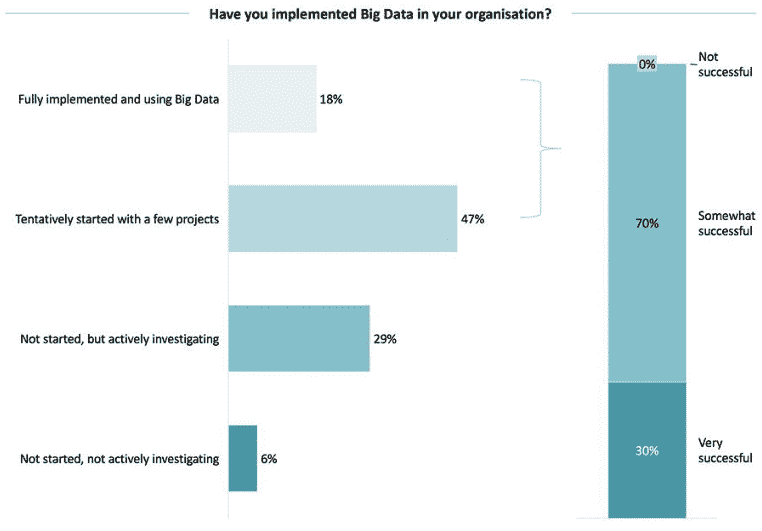
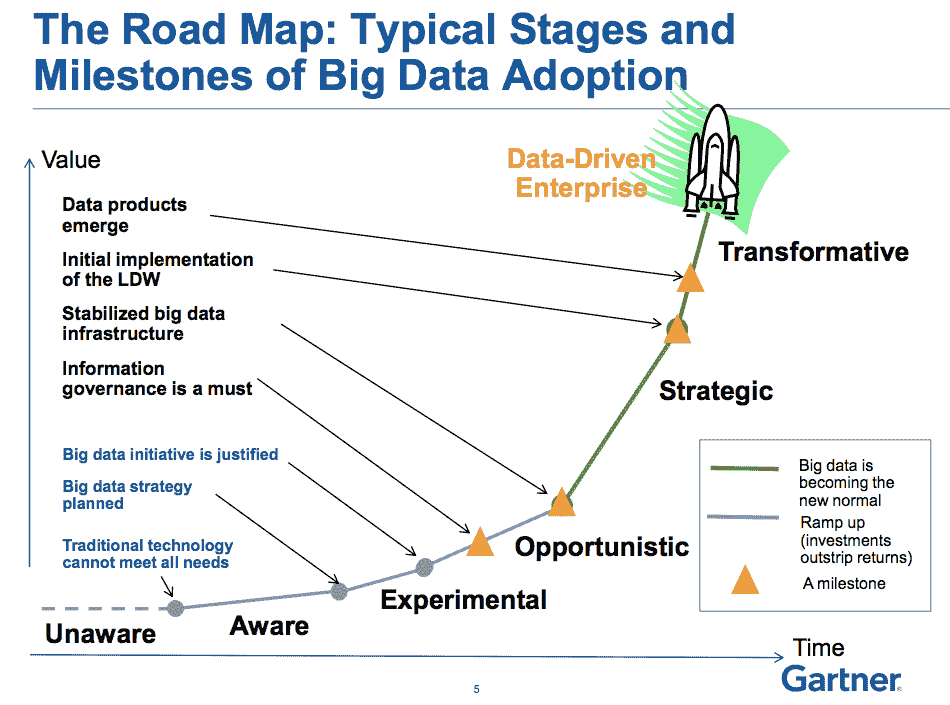
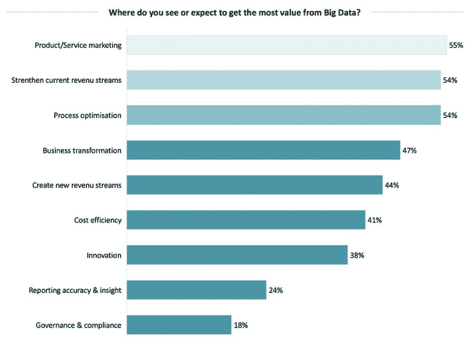

# 打造制胜的大数据战略

> 原文：<https://medium.datadriveninvestor.com/crafting-a-winning-big-data-strategy-43a7acb49a85?source=collection_archive---------1----------------------->

大数据被视为数字化转型的最重要驱动力之一，然而，挖掘这一潜力说起来容易做起来难。许多公司仍在寻找大数据、测试技术、使用案例和工具以及新的运营模式。大数据的艺术不是捕获大量复杂数据集的能力。这是对人才的投资，可以制定一个令人信服和可操作的战略，一个每个部门都可以理解和执行的战略。

大数据战略需要渗透到您的组织中，并在客户获取、客户体验、支持、营销和其他推动收入的领域中指明方向。

既然采用是必要的，那么组织如何制定大数据战略呢？

**合适的人员**

大数据需要不同的天才思想家，而传统的工具和模型并不总是能解决问题。一个组织需要能够筛选复杂的数据，并创建一个易于理解和执行的计划。建立正确的团队应该是第一项投资。这个团队将决定使用什么分析模型、使用什么工具以及什么数据最有价值。他们将概述存储数据的方法，并构建将数据分类到特定分组的架构。

【Consultancy.org】来源:T2

随着组织推动应用大数据来获得更深入的见解，只有 30%的组织提取了足够的价值。成功实施的主要瓶颈可归因于内部技能短缺和对该主题了解太少。

将数据应用到整个组织的日常工具和用途中是释放其威力的关键。

**构建路线图**

就其本身而言，数据只是一组数字。是战略给这些数字注入了意义。一旦您的团队分析了数据，就应该开始构建一个路线图，利用这些数据来创造切实的成果。目标是为从分析到实施铺平道路，并确保这条道路充分利用大数据的潜力。

确定您的业务战略和建立目标应该是您的首要任务，因为您的数据应该是执行您的战略的手段。在如何实现目标以及信息如何在整个组织中传播的过程中，信息治理是必不可少的。技术将在构建基础设施以支持长期战略和最小化技术债务方面发挥至关重要的作用。通过实验和数据验证，随着您的组织向数据驱动型组织的转变，您的战略支柱和数据产品渠道可以建立起来。

**值**

大数据让人想起早期的市场研究，当时有一件事是明确的:投资最多的组织获得了对其客户人口统计以及如何营销和销售其商品和服务的更好理解。

*资料来源:Consultancy.org*

数据不会直接推动收入或帮助组织吸引新客户。强大的分析师和正确的分析模型是从大数据中挖掘价值的关键。如果数据提供了对产品如何订购和运输的洞察，那么就必须利用这些数据来改善这些体验。请记住，由于您正在处理大数据，因此这不会是一个简单的过程。

未来是大数据。虽然有些战斗是在获取它，但要真正繁荣，一个组织必须投资于精心制定战略，利用消费者告诉你的东西。