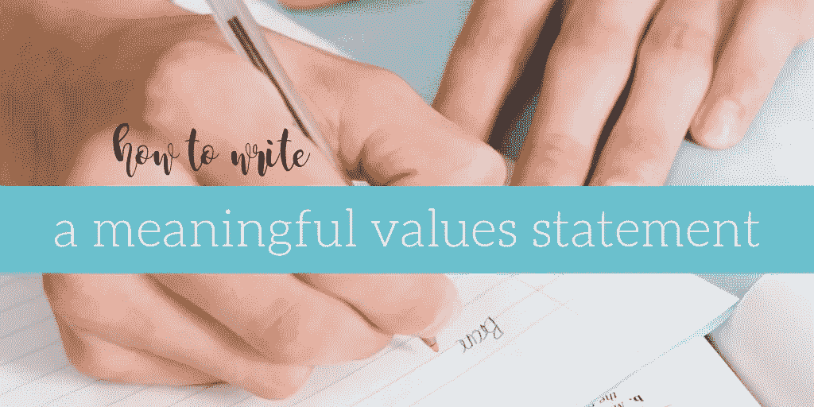

# 为你的事业和生活创造有意义、有用的价值

> 原文：<https://medium.datadriveninvestor.com/crafting-meaningful-useful-values-for-your-business-and-life-724c7857bc99?source=collection_archive---------24----------------------->

目前在我的床头柜上是布琳·布朗的《敢于领导》。我非常喜欢这本书。她涵盖了她在以前作品中讨论过的许多主题——即脆弱性——但这次是通过领导力的视角。

【顺便说一句，“领导力”不仅仅指财富 500 强公司的 CEO。这也意味着脸书小组的所有者、课程创建者、任课教师、家长——坦白地说，几乎是所有人。]

书中有不可思议的外卖，怎么推荐都不为过。然而，我今天想谈的是布雷内概述的一项具体活动。她引导读者写出他们的**价值观，指导我们在生活中做出每一个决定的原则。**

这对我来说不是新的领域；我总是让我的客户做这个练习。然而，布雷内的方法让我重新评估了我的价值观，并提出了比以往任何时候都更加一致的东西。

有什么不同？**她要求你按*方式*返回。**

当被问及我们的价值观时，我们大多数人都会给出六个或更多的答案。这些是我的:*保持真实。优先考虑质量。要有创意。玩得开心。永远不要停止学习。教育他人。*很拗口，那是修改了很多遍之后。

所以，当布雷内建议我应该只有一个或两个价值观时？不可能！

尽管我很抗拒，我还是听了。她引用了吉姆·科林斯的一句话:“如果你有三个以上的优先事项，你就没有优先事项。”

灯泡咔哒一声亮了。我一直在提倡少做的理念。我真的相信我们应该为这一年设定一两个大目标，每天只设定一两个优先事项。为什么我的价值观要不同？

我勉强通过她的提示。我从一个很大的价值列表开始，将相似的概念分组，进行硬切割，寻找概念之间的联系，并问自己“这个价值需要或服务于更大的价值吗？”

比我预期的更快，我创造了这个:

**勇气**(正直|真实性|脆弱性)
**+**
**联系**(包容|恩惠|感恩)
**+**
**好奇心**(学习|乐趣|创造力)
**=**
**成长**

从表面上看，我意识到它似乎违背了 Brené关于简单性的指示。让我解释一下。

事实上，我现在只有三个基本价值观——勇气、联系和好奇心。如果有压力，我甚至可以放弃好奇心(稍后会有更多)。

这些价值观与我是谁、什么对我重要以及我如何做决定完全一致。额外的单词帮助我记住(并教育他人)我为什么选择每个值。

*   正直的行为、真实的表现和脆弱是需要勇气的——这些都是我每天在工作和个人生活中努力去做的事情。
*   如果我想创造**联系**(与他人，同样重要的是，与我自己)，我必须包容所有人/感受，在我或他人陷入困境时有风度，并对我周围和内心的美好心怀感激。
*   对人、对个人成长、对我的职业、对这个世界保持不懈的好奇**——会让你学习、享受乐趣并富有创造力。(这个值*可以*消失，因为它最终满足了我与自我和他人联系的需要。)**

**我还意识到，当我将这些价值观付诸行动时，我不可避免地会成长为一个人——这对我非常重要。**

**我完全被我的新价值观重新激励了。就像突然之间**我可以清楚地传达对我重要的事情和*为什么*** …这真是太强大了。**

**如果你的价值观没有做到这一点，我会鼓励你深入挖掘，缩小规模。这样做，直到你对自己的价值观有了那种程度的热情。**

**不仅有可能缩减到一个或两个(或三个)总体价值，这是革命性的。**