# 速成班:谷歌机器学习课程一览——第三部分

> 原文：<https://medium.datadriveninvestor.com/crashing-the-crash-course-a-look-at-googles-machine-learning-course-part-iii-ad38d70b0ae8?source=collection_archive---------33----------------------->

欢迎来到我的谷歌机器学习速成班之旅的第三部分。在我的上一篇帖子(part [II](https://medium.com/@spraguesy/crashing-the-crash-course-a-look-at-googles-machine-learning-crash-course-part-ii-f5c11d1cddde) )中，我走过了两段路程，*降 ML* 和*减损*。这些主题涵盖了基本的线性回归以及它们如何应用于 ML 的世界。我谈到了均方误差和如何减少损失。为了使损失最小化，我们使用迭代方法。学习率告诉我们下一步猜测要走多远，负梯度告诉我们方向。步长越小，找到最小值所需的计算就越多。一大步意味着我们可能会超过最小值。由于我们可能有很多(想想以 Ms 或 Bs 开头的数字)数据点，所以使用小批量随机梯度下降通常是最佳实践，其中使用随机选择的数百个数据点，而不是计算整个数据，以便减少噪声但更有效。

下一节的标题是*TF 的第一步。*我们得到一个简短的视频，其中包含一些关于 TensorFlow 的基本信息。TensorFlow 采用分层结构构建。较高级别的 API 建立在较低级别的 API 之上，允许用户使用预定义的架构，而不必编写大量代码。他们提取了大量代码。本课程中最常用的 API 是 tf.estimator。使用更高级的 API 确实有缺点。你需要的灵活性越大，你需要使用的 API 就越低。

看完视频和上一段总结的工具包后，我们开始第一组练习。这些练习在谷歌的另一个产品[协同实验室](https://colab.research.google.com/)平台上运行。Colab 在浏览器中运行，但是如果您希望在本地运行练习，也有一个桌面版本。在本课程中，我们已经讲到你需要开始设置你的本地环境(因为你不能在现实世界中使用 Colab，废话)。如果你从未用 Python 开发过，我建议[这个](https://www.youtube.com/watch?v=dNFgRUD2w68)视频可以帮助你开始设置你的环境，如果你像我一样使用 VS 代码的话。现在开始练习。

*熊猫快速介绍*

*注意:单击 Colab 中左边的括号来运行代码。您将需要运行括号来使示例继续工作。*

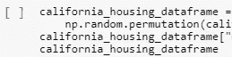

Pandas 是一个面向列的数据分析 API。许多 ML 框架都支持 Pandas 数据结构。这里有一个更全面的关于熊猫的介绍。熊猫的主要数据结构是序列和数据帧。数据帧本质上是一个关系表(想想 SQL)。系列是单列。以下是使用系列和数据帧的示例:

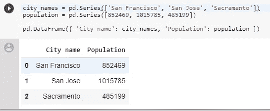

你可以通过跟随[这个](https://www.youtube.com/watch?v=cQvwhjvd9Rc)视频在你的命令行中运行所有这些。一旦你安装了 python 和 pandas，你可以进入你的命令行，输入 Python，然后粘贴上面的代码，进入你的 Python 环境。应该是这样的:

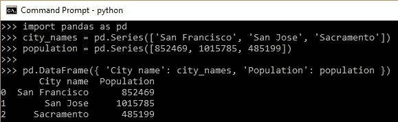

【TensorFlow 的第一步

在这篇文章发表的时候，Python 3.7 已经发布了，但是 TensorFlow 支持已经升级到了 3.6。因此，如果你想在 Colab 之外实现它(如果你正在学习这门课程，你应该这样做)，我建议确保你正在使用 Python 3.6，直到 TF 与 Python 3.7 兼容。

当您在自己的环境中进行设置时，请记住使用 pip(或 conda)安装软件包，并从设置部分导入所有内容(如 tensorflow 和 pandas)。

现在我们要用 TF 建立一个模型。建立模型有六个步骤。第一步是定义功能和配置功能列。特征是“被观察现象的一个单独的可测量的属性或特征”。从本质上来说，要素就是您要将数据放入其中以帮助您进行预测的类别。特征有两种形式，分类的和数字的。坚持以他们的住房为例，分类特征的一个例子是房地产广告中的词语或一所房子的风格。数字数据类型的一个例子是房子的平方英尺。要素类型在要素列中指明，该列仅存储数据类型，不存储实际数据。下面，功能*房间数量*与功能列中的数据类型一起定义。

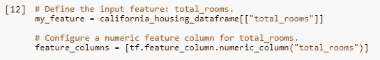

下一步是定义目标。目标是您想要预测的数据点。定义如下:

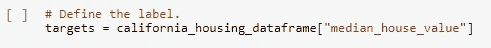

第三步是配置线性回归。如果你还记得以前的帖子，我们在这里输入学习率，即梯度步骤。这里使用的优化器是 GradientDescentOptimizer，它也调用了我们以前学过的小批量随机梯度下降。

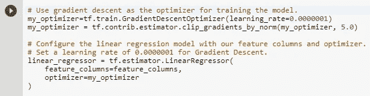

my_optimizer 设置为使用学习率为 0.0000001 的 GDO 进行训练。my_optimizer 与特色列一起用于生成一个*线性回归*估计器。

下一步是输入函数。这个函数可能看起来有点吓人，所以我会试着分解它。这些函数可能总共有 5 个参数，其中两个是必需的。第一个参数是*特性*，这些是我们用来预测目标的特性(在本例中为“总房间数”)。*目标*争论是我们试图预测的事情。*批量*是需要分析的数据点的数量，这里默认为一个。 *Shuffle* ，默认为 true，完全按照它说的做。我们洗牌，所以我们得到一批随机的数据，而不是数据当前的顺序。最后一个参数是 *num_epochs* 。时代本质上是神经网络接收你的数据的次数。纪元太少会导致数据拟合不足，但太多会导致拟合过度。看看这篇文章，更好地理解时代。

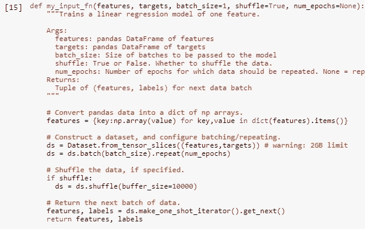

因此，我们已经定义了所有的功能，编写了函数，现在我们只需要训练模型并分析其输出。训练相当简单:

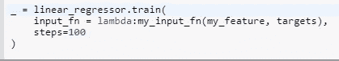

然后我们分析输出。有许多方法可以做到这一点。首先，我们可以看看 MSE 和根 MSE。根 MSE 可以用与数据相同的尺度来解释，所以这种汇总统计是首选的。然后，我们还可以对比我们的预测和目标。它们看起来像这样:

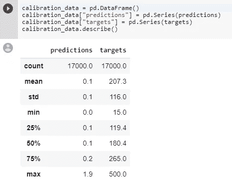

我们意识到有些事情看起来很不对劲。我们的预测和目标相差甚远。在这里，他们密谋反对对方。

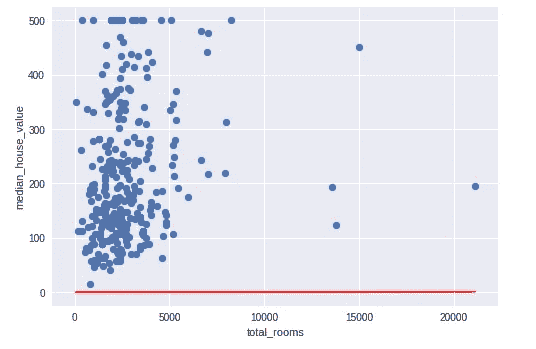

糟透了。但这并不意味着这两个数据点之间没有关系。我们可以看到有一条更好的线。这意味着我们需要调整模型超参数。查看关于调整超参数的部分，并尝试使这条线更适合。

任务的目标是让 RMSE 低于 180。这是它靠近时的样子。如你所见，这是一个比上面那条线好得多的预测(最后一条线是红色的)。

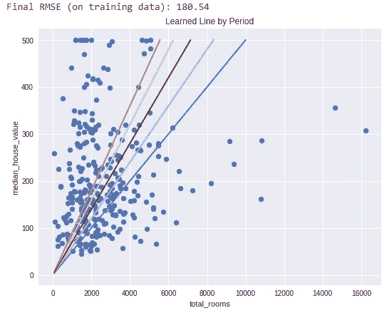

在调整超参数时，有一些经验法则可以遵循。最终，“效果取决于数据”，所以你应该保持灵活性。训练误差应该稳定地减少并最终趋于稳定。如果不收敛，运行更长时间。如果减少的时间太长，那就提高学习率。如果 TE 非常不稳定，则降低学习率。首先使用较大的批量，然后逐渐减少，直到训练误差开始变得不稳定。

*合成特征和异常值*

这些练习将教您如何创建合成要素(各要素之间的比率)以及如何处理异常值(如上图右侧的一个点)。使用*熊猫创建一个比率相当简单。*

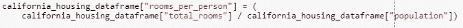

然后你把它输入到他们建立的模型中。剔除异常值也相当容易。然后，您可以再次运行该模型，并查看它所带来的改进。

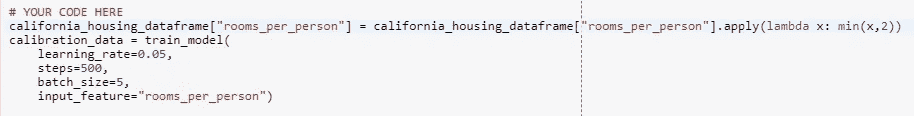

*总结*

我们对熊猫做了一个基本的观察，并展示了 TF 如何像熊猫一样获取数据集。我们学习了如何设置环境(在 Colab 或 Windows 中)。然后，我们看了一下建立模型的六个步骤，以及如何使用 TF APIs 来这样做。最后，我们能够查看我们的 ML 模型的分析，并调整它们以获得更好的拟合。在我的下一篇文章中，我将介绍课程中的*泛化*和*训练和测试集*部分。