# 疯狂互联网理论讲解(21e800)以及如何手工挖掘一个比特币！

> 原文：<https://medium.datadriveninvestor.com/crazy-theories-explained-21e800-and-how-mining-a-bitcoin-by-hand-d79a7f7e45ff?source=collection_archive---------1----------------------->

我最喜欢的关于科技的播客“Reply All”有一系列集，其中主持该节目的公司创始人亚历克斯·布隆伯格来到演播室，发布了一些关于科技的神秘趋势推文，听起来很疯狂，他要求节目的两位主持人帮助他理解它们。这些推文大部分时间都是一些阴谋论，或一些关于科技世界事件的怪异故事(而不是)。我决定用一些类似的东西，因为我在夏天读了一系列的推文。我记得我不知道他们在谈论什么，即使这种争论在每个区块链网站或论坛上都是一种巨大的趋势。由于我的自动诊断多动症，我的专注技能非常有限，在几分钟的调查后，我认为这太疯狂了，不想深入研究，但我现在有了更高的动机。以下是一些推文。

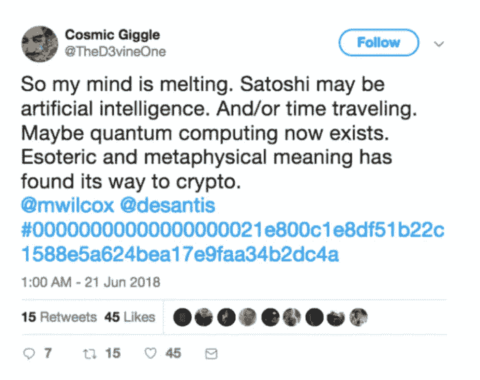

A totally rational user of Twitter sharing his opinion

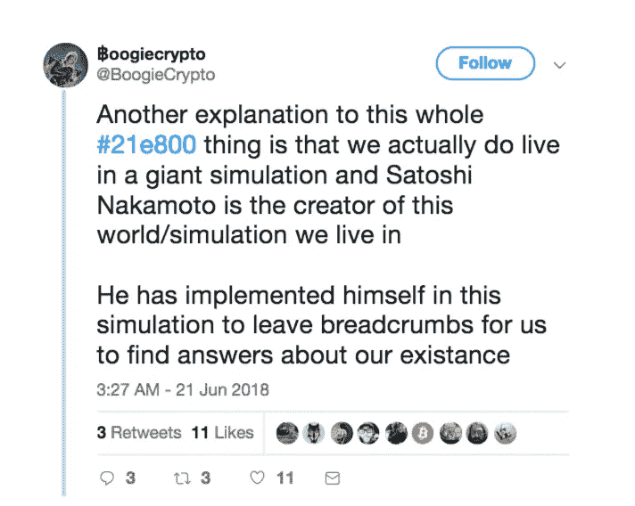

给点背景知识。比特币社区完全疯了。我看了那边所有可能的理论。其中最好的:比特币是人工智能奇点在一个由机器统治的世界里，这些机器回到了我们的时代，并创造了区块链，以便让人类为自己的创造提供大量的计算能力，比特币是一个自我生成的上帝，比特币是诺查丹玛斯预测的。

大部分的故事来源于围绕它的创造者，聪的神秘。Satoshi 是比特币创造者的昵称，这个项目背后的人的真实姓名仍然未知。比特币的其他开发者没有一个人见过 Satoshi 本人，或者知道任何关于他的细节，他只是在某个时候停下来成为比特币项目的一部分。

为了理解这篇推文的基本内容，我想从非常远的地方开始。比特币是如何被开采出来的。我的意思是一步一步挖掘它。有一个叫[的家伙在 youtube 上有一个视频，视频中他用铅笔和纸挖矿，我试图跟随所有段落并总结它们，加入来自其他网站的比特币信息。](https://www.youtube.com/watch?v=y3dqhixzGVo)

比特币的工作方式产生了一个机器难以解决的加密问题，这个问题包含了比特币交易的信息。矿工们试图独自解决这个问题，或者和其他计算机一起解决。这个问题故意设置得很难，这样就没有人能够“欺骗”创建假的过渡并接管区块链。一旦过渡解决，它将作为信息添加到比特币网络的所有计算机上。

当创建比特币交易时，它通过创建块来发生。块只不过是一系列字符串，包含有关事务的以下信息:

*   比特币的版本协议。(例如 2.0)
*   之前比特币交易的 hash 反转(更多关于 hash 的含义随文章)
*   Merkle root(也是一个散列，包含该块的所有事务)
*   交易的时间戳
*   Bit(表示挖掘所需难度的值)
*   Nonce，最重要的值！为了得到最终的正确的散列值，可以改变这个值！

一个块看起来像这样:

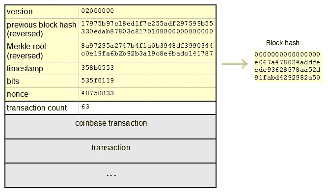

这些数据用双 SHA-256 方法加密，这意味着 SHA-256 应用了两次。阿沙-256 加密是如何工作的？

所有的加密都是从国家安全局提供的同一个散列开始的。如果你认为这是 NSA 解密信息的后门，你可能必须知道散列来自前 8 个素数的平方根，和前 64 个素数的立方根。你还这么认为吗？嗯…我也是，但是我在这个领域的专业知识只是几个小时的阅读，所以…

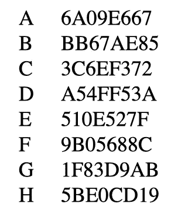

每个十六进制数字然后被转换成二进制代码。

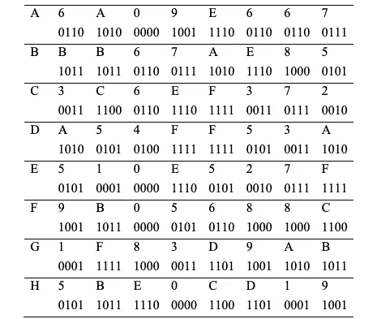

对于第一步，只分析前 3 行。a、B 和 c 及其每一列。如果列的大部分是 1，则报告 1，否则报告 0。结果进入行多数，然后被转换成十六进制。

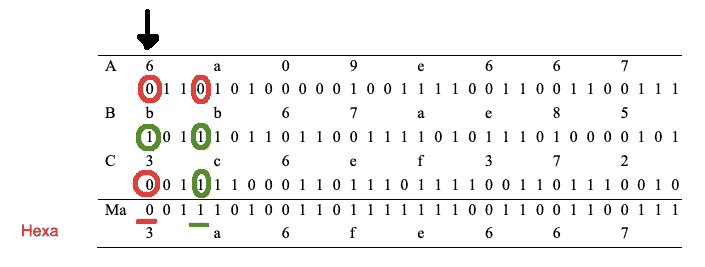

现在拿 A 行来说，所有的数字都移动了 2 个位置，最后两个作为前两个字符。这段话又重复了一遍，但移动了 13 和 22 个位置，总是在 a 行。你可以看到这三行中绿色 0 的移动。

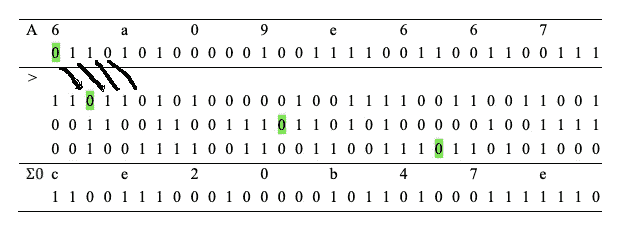

下一步是检查每一列中 1 的数量。创建一个新行σ0，如果该列中有奇数 1，则报告为 1，反之则为 0。数字从二进制转换为十六进制。

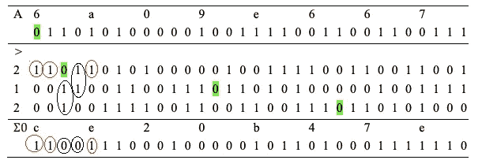

下一步是一起分析这些行。从这三行中，创建了一个单独的新行。“给出指令”的行是 E 行。查看每一列，如果 E 行中有 0，则报告到新行中的值来自 g 行。如果有 1，则该行来自 f。该数字被转换为十六进制，称为选择值。下图显示了该过程。

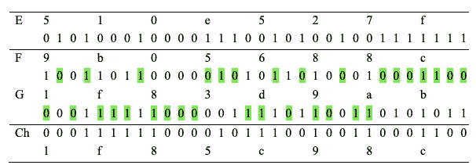

又有一个新的移位，就像之前发生的一样，但这次是在具有 6、11 和 25 个位置的行“E”上，它再次转换为十六进制，新行称为σ1。

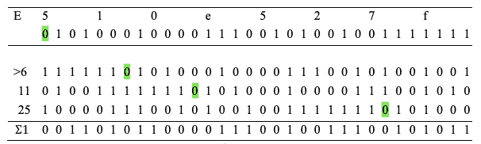

到目前为止，所有的通道都是所有 SHA-256 加密的标准。现在，块中的第一个输入开始被插入。比特币区块内的第一个数据是协议。输入以十六进制形式与 NSA 提供的另一个常数 K(耶…我知道…)、上一步中的σ1、行 H 以及上一步中的选择值相加。

你还记得一开始我们从 A 到 H 有 8 行吗？

现在，新的 A 将是第一个和多数线和σ0 线相加的和，不包括第一个数字。

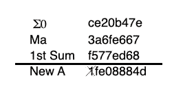

新的 B 将是我们开始的 A 线。新的 C 将是开始的 B，D、F、G 和 h 的模式相同，而新的 E 是从值“第一个总和”加上旧的 D(不包括总和的第一个数字)获得的。

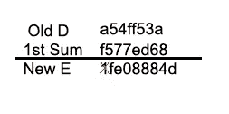

这是一轮哈希运算结束时，新方案与开始时相比的样子。

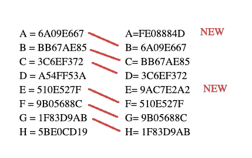

哈希值是所有反转行的值。基本上是从 H 的最后一个字母读到 a 的第一个字母。

所以应该是:ba 9d 38 f1 c 88650 b 9 f 725 e 0152 a 2 e 7 ca 9273 Fe 6 c 358 ea 76 bb 766 e 096 ad 48880 ef

但到目前为止，只有一个值的初始块被添加，该协议，作为 W 参数，以获得第一个总和。使用这些新行并重复所有段落，每次为块的所有值添加一个输入(2 次，因为它是双重散列的),我们将最终获得散列！

…但这并不是结束。为了使挖掘变得更加复杂，并且避免单个源控制整个区块链，为了被接受，散列必须以至少 17 个零开始。因此，如果获得的散列不是以 17 个零开始，则需要重复整个操作，改变块中唯一可能改变的值。“现时”。在许多情况下，仍然不可能只改变 nonce 而不获得这种特殊的散列，所以最终时间戳可以被稍微改变。

一个自制的 phyton 程序由制作手动挖掘比特币视频的家伙编写，每秒可以检查 64000 个哈希，目前一个 2k 美元的 GPU 可以做到每秒 16 次(每秒 1 万亿个哈希)

在回到主要论点之前，我觉得这太过分了，我本可以只提到几个步骤，但我从来没有完全理解不可逆函数的概念。在我看来，如果一件事情是一步一步执行的，那么以相反的顺序遵循每一步应该会到达起点。现在，我可以看到像多数线、选择线和模块 2 线这样的步骤是如何使过程无法逆转的，我也更好地理解了“解密”的不可能性的概念。有趣的是，观察到加密的所有步骤都是非常基本的数学，但它们通过迭代运行，这对计算机来说比更困难的计算更消耗能量(这是人类的概念，因为机器像我一样对 2 位数除法没有任何问题)。

回到主要论点。随着时间的推移，障碍越来越难。第一个块也称为 genesis 块，因为之前没有创建任何交易，它包含文本“泰晤士报 03/Jan/2009 Chancellor on The Times 03/Jan/2009 second elution for banks”，这是当天纽约时报的标题。

第一个程序块被认为是特殊的，因为它包含了比当时要求的更多的三级难度(开始时为 0 ),这被认为是奇怪的和不太可能的，因此可能是硬编码的。第一次挖掘花了 6 天，这也是让所有比特币狂热分子疯狂的事情，因为有遗嘱参考。

这是创世纪板块:

0000000000019d 6689 c 085 AE 165831 e 934 ff 763 AE 46 a2 a6 c 172 B3 f1 b 60 A8 ce 26 f

六月开采的区块比现在的难度多了一个等级，紧接着又多了 21e8 和 2 个 0。

000000000000000000000**21e 800**C1 E8 df 51 b 22 c 1588 e5a 624 bea 17e 9 FAA 34 b 2 DC 4a

人们试图从这个散列中读出重要性，因为它类似于创世纪块，它包含 21，这是有史以来产生的最大数十亿比特币(一旦达到这个上限，就不会再产生更多的比特币)，e8 来自万物理论，这是一种科学理论，试图描述物理学中所有已知的基本相互作用，并作为万物的可能理论。和两个 0，这将使它类似于创世纪块。

事实是，其中一个事件大约每年发生一次(难度更大)。其他数字只是随机的，但在互联网上你会发现有人试图计算这种情况发生的确切概率，他们得出了疯狂的高数字，我毫不怀疑这些数字是正确的，但对于其他任何字符串都是一样的！此外，这一趋势首先是由德森蒂斯峰推动的。德·森蒂斯峰是《比特币》杂志的创始人，在这次活动之前几个月，他注册了一家名为 E8 inc 的公司，同时也是另一家名为 DeOS 的公司的首席执行官，该公司声称发明了一种名为 DeOs 的量子计算机，可以生成不可能的哈希，但实际上从未有过证据，看起来他只是在利用媒体和比特币用户来获得一些关于他的项目的好消息。人(我指的是疯狂的人..)开始相信，拥有确切哈希的事件概率很低(大约 2500 年左右)，Satoshi 是人工智能，并试图通过区块链交流我们现实的本质…所以如果你曾经认为处理比特币和密码的人必须是这些超级聪明的人物，这是对社区的更准确的代表…

另一方面，量子计算机是一个非常有趣的论点，它们的创建和充分发展可能代表了密码学的一个问题，这是基于计算机具有足够的计算能力来“解密”某些东西的困难。(实际上按顺序检查所有可能的字符序列以获得散列，因为不可能解密)。随着量子计算机的全面运行，每秒钟可以验证的哈希数将是巨大的，所有使用密码术(比特币，还有密码等等)的系统都将崩溃。要了解更多关于密码学的知识[请查看我的旧文章](https://medium.com/@darspn/criptography-sql-database-and-security-breaches-a1ad5f34191)关于用于密码的 MD5 散列以及如何“解密”它们。