# 从头开始创建 Rails API

> 原文：<https://medium.datadriveninvestor.com/create-a-rails-api-from-scratch-fa81bcba5422?source=collection_archive---------1----------------------->

## Ruby on Rails

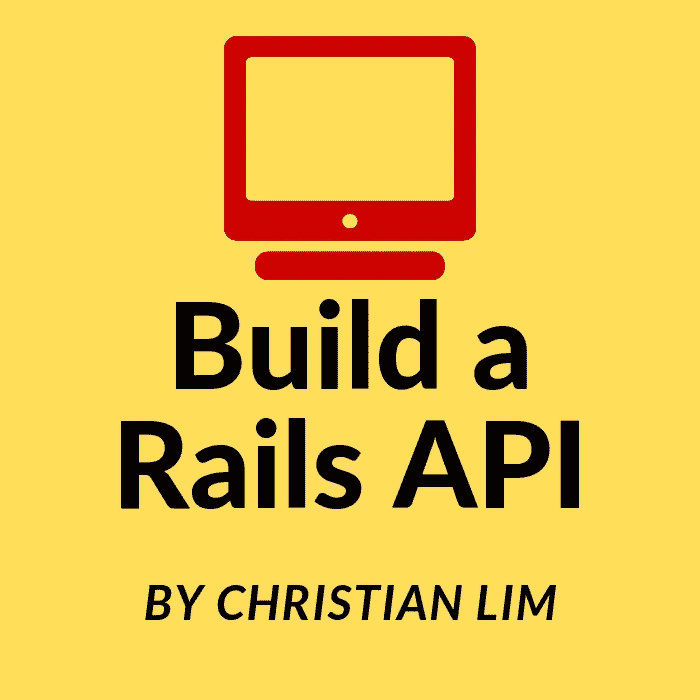

在熨斗学校经过七周的紧张学习后，我们开始学习用 Ruby on Rails 构建 API。在那之前，我一直想知道我们将如何在我们的 web 应用程序中利用 JavaScript 框架，但是一旦我了解了如何构建 API，这一切都变得有意义了。

> 注意:这个博客是面向有一些 Rails 应用程序开发经验的人的

在最初的六周里，我们一直专注于完全在 Rails 的范围内创建 web 应用程序，使用 ERB 模板将 Ruby 代码**嵌入到我们的前端****中。现在想来，这种方法对于小型项目来说是不错的，但是随着应用程序的增长，您可能希望将后端和前端的关注点分开。这就需要构建一个 Rails API 来与前端通信。**

**[](https://www.datadriveninvestor.com/2019/02/25/6-alternatives-to-the-yahoo-finance-api/) [## 雅虎财经 API |数据驱动投资者的 6 种替代方案

### 长期以来，雅虎金融 API 一直是许多数据驱动型投资者的可靠工具。许多人依赖于他们的…

www.datadriveninvestor.com](https://www.datadriveninvestor.com/2019/02/25/6-alternatives-to-the-yahoo-finance-api/) 

所以，系好安全带，放松一下，因为在这篇文章中，我将带你从什么是 API，到创建一个基本的 Rails API，它是为与前端对话而设置的！

# API 到底是什么？

在我们开始讨论如何创建 Rails API 之前，我们必须首先描述 API 是什么，它做什么，以及为什么使用它有意义！
珠穆朗玛峰的首席技术官 Mike Kail 这样描述 API:

> “API 的简单定义是，它是一个 URL 或一组 URL，向客户公开一项服务，以便以编程方式访问该服务来发送和接收信息。这使得开发人员可以连接不同的系统或系统的组件，而不必了解所有相关的复杂性。”—迈克·凯尔

将一个应用程序分成独立的部分——一个“前端”和一个“后端”,其意义是巨大的！分离使开发人员能够在一个部分上工作，而不必理解另一个部分的内部工作方式。仅此一点就是构建 API 的巨大理由！

# MVC 架构和一个 Rails API


You’re in control!

现在我们知道了 API 是什么和为什么，让我们看看你实际上是如何实现它的。好消息是，如果您以前构建过 Rails 项目，那么您已经了解了大约 90%的过程！我会解释的。让我们来看一个标准的 MVC 结构，我们有:

*   模型:这是你描述你的类和你的应用程序的整体逻辑的地方。
*   **视图:**您的应用程序的“前端”。这是用户看到的/与之交互的内容。这通常包含您的 HTML、CSS、JavaScript 和 ERB 文件，如果您正在使用它们的话。
*   **控制器:**控制器是你的模型和视图之间的纽带，从应用程序向浏览器发送信息，反之亦然。

有了 Rails，你不需要*渲染 ERB 视图。*我这么说的意思是你可以告诉你的控制器渲染其他类型的东西！在我们的例子中，我们将呈现 JSON。JSON 代表 **JavaScript 对象符号**，它是从 API 发送数据的标准方式。既然我们已经理解了这一点，让我们最终开始构建我们的应用程序吧！

# 让我们从头开始，构建一个图书列表 API


在本演练中，我们将使用生成器，因为这是 Rails 出色之处的一部分。让我们开始申请吧。该应用程序的前提是一个图书列表 API，其中有各种书籍、作者和不同的流派。一本书属于一个作者，属于一个体裁。一个作者**有很多书，通过书有很多流派**，一个**流派有很多书，通过书有很多作者。**

第一步是使用'––API '标签生成新的 Rails API 框架。这个标签告诉 Rails 省去一些应用程序不需要的中间件，它还让 ApplicationController 从::API 而不是::Base 继承。如果这对你来说没有意义，那也没关系！但为了进一步了解，请查看这篇深入的[指南](https://guides.rubyonrails.org/api_app.html)。

```
rails new book-list-api --api
```

之后，Rails 会为您生成一个文件结构。

# 制作我们的模型、迁移和控制器

Rails 使构建应用程序变得简单快捷！
使用令人惊叹的 **rails g resource** 命令，我们不仅可以构建我们的模型，还可以构建相关的迁移和控制器！所以让我们先把事情搞清楚:

*   一个作者:有很多书，通过书有很多流派。
*   一个流派:有很多书，通过书有很多作者。
*   一本书:属于一个流派，属于一个作者。

所以看起来我们有 3 个模型，书是我们的连接模型/表。我们这里是多对多的关系！

让我们开始生成吧！在终端的 book-list-api 文件中键入以下内容。

```
rails g resource author name
rails g resource genre name
rails g resource book author:references genre:references
```

运行此命令后，您的文件树应该如下所示:

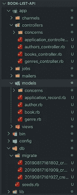

现在我们已经创建了我们的基础，我们仍然需要进入作者模型和流派模型，并对这些关系进行编码！它应该是这样的:

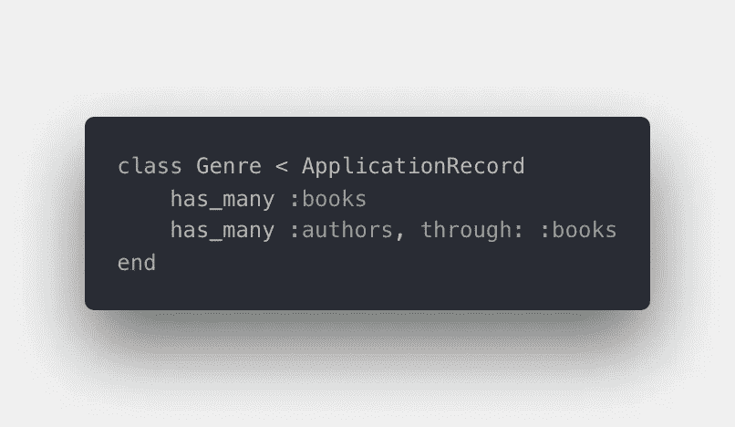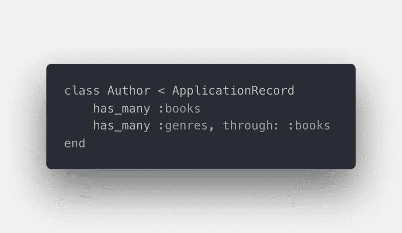

我们也不能忘记检查我们的迁移文件，所以让我们现在就看。

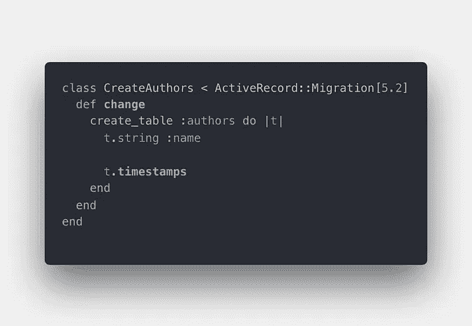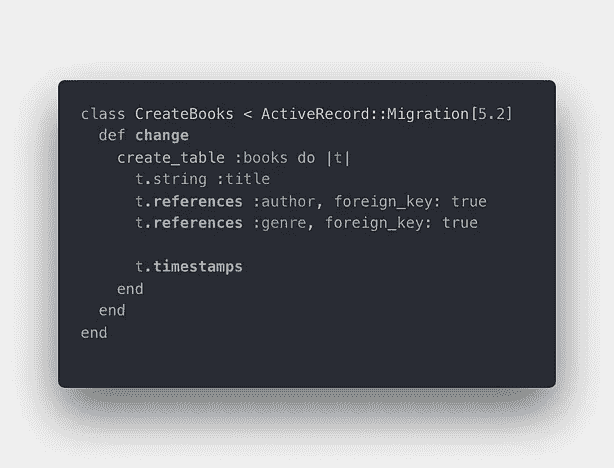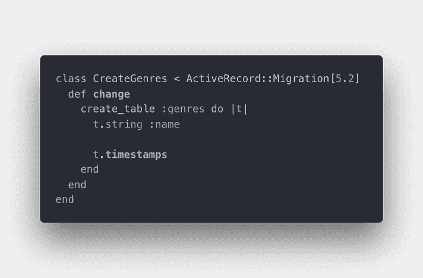

Note: the books table has the foreign keys!

看起来棒极了！我们的 books 表有我们的作者和流派外键，这正是我们想要的。现在已经设置好了，让我们开始迁移吧！

```
rails db:migrate
```

这个命令创建我们的表，以及我们的 schema.rb 文件！查看我们漂亮的方案:

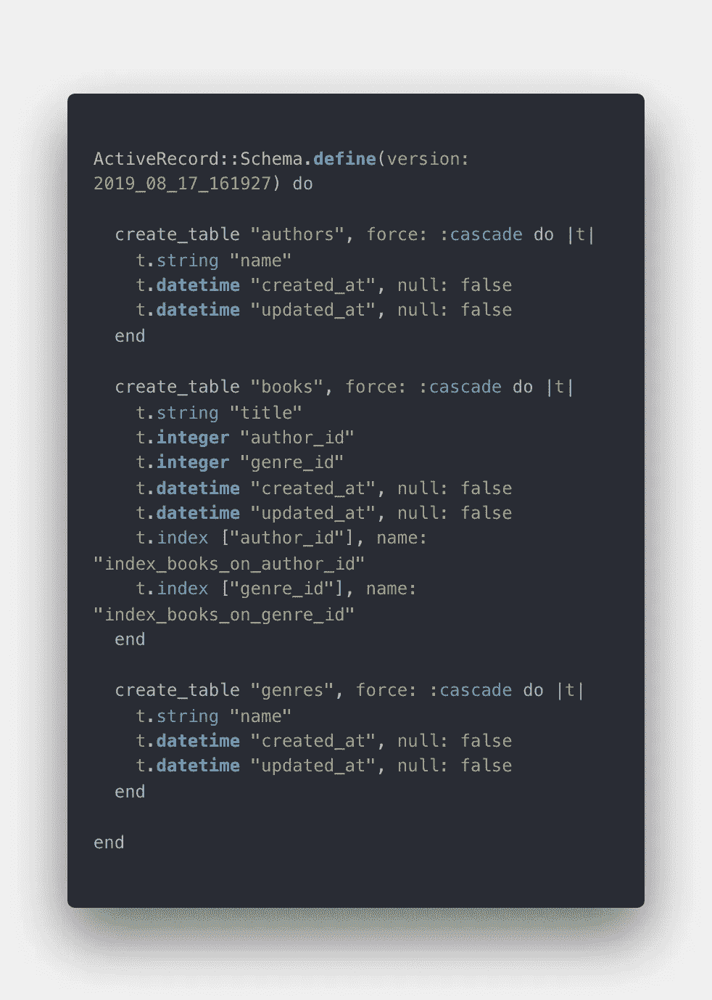

我们就快到了，现在我们需要启动我们的数据库进行测试，确保一切正常。

# 为数据库设定种子

在我们的 seeds.rb 中，让我们创建一些作者、书籍和流派！

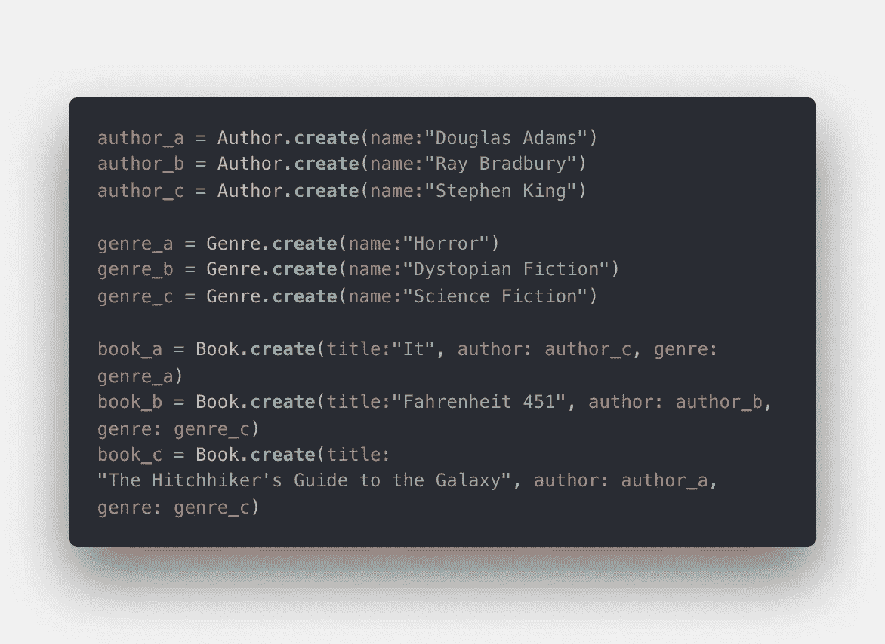

seeds.rb file

保存之后，在终端中运行 rails db:seed。

```
rails db:seed
```

现在，如果成功了，我们可以检查我们的关联是否建立，我们的数据库是否成功设置！在 Rails 控制台中，键入 Book.all，您应该会看到:

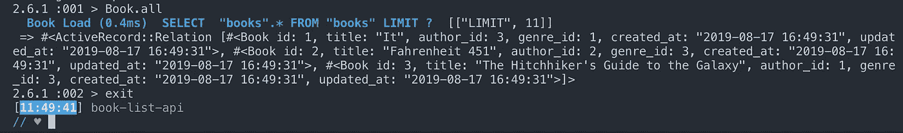

It worked! We have our associations!

我们已经很接近了！我们所要做的就是进入我们的控制器，定义我们想要的动作！

# 最后一步:控制器

在我们的 books_controller.rb 中，让我们定义我们的图书索引！通过这种方式，我们将能够访问包含我们所有书籍及其相关作者和流派的 JSON 文件！

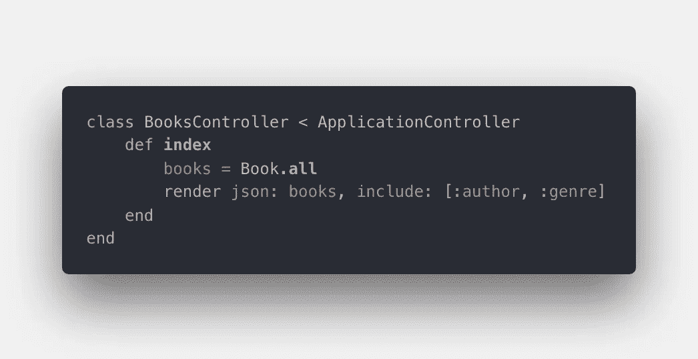

添加 include: [:author，:genre]让 Rails 知道您希望它在 JSON 中呈现相关的作者和流派信息，就是这样！我们做到了！我们已经完成了 Rails API。干得好！

让我们运行我们的本地服务器，去看看吧！在控制台运行 **rails server** ，然后打开浏览器，进入“localhost:3000/books”。这里有我们做的书！看看吧！

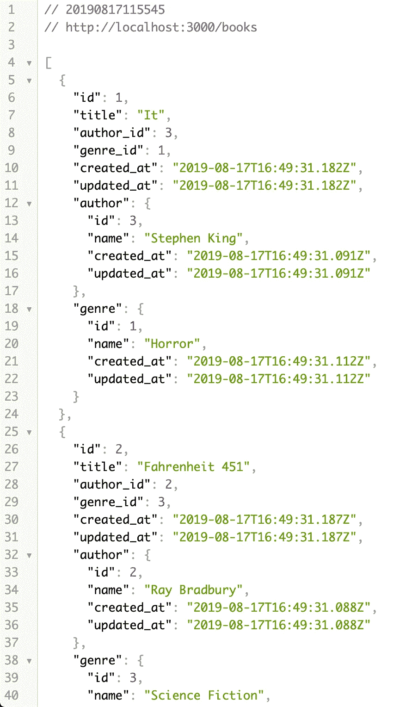

从这里，您可以构建您的前端，并从您构建的后端来回获取数据。本教程到此结束，但它仍然是一个非常基础的 API，继续摸索并添加特性，看看还能用 API 做些什么！编码快乐！**