# 在 Apache 超集中创建您的第一个销售仪表板

> 原文：<https://medium.datadriveninvestor.com/create-your-first-sales-dashboard-in-apache-superset-c6a7f3d628d6?source=collection_archive---------0----------------------->

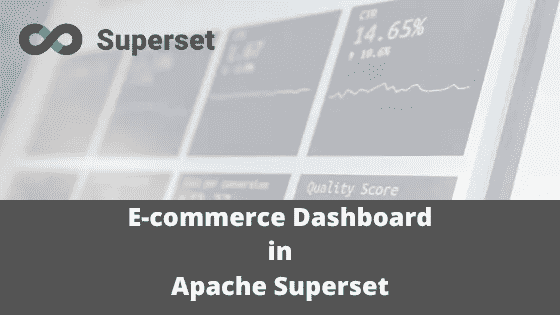

到目前为止，你已经学会了如何[获取数据](http://blog.adnansiddiqi.me/tag/scraping/)、[处理](http://blog.adnansiddiqi.me/tag/etl/)数据和[可视化](http://blog.adnansiddiqi.me/tag/data-visualization/)数据。今天，我将谈谈仪表板，它们是什么，以及如何通过使用 ***Apache 超集，为销售数据创建自己的个人或企业仪表板。***

# 什么是仪表板？

根据[维基百科](https://en.wikipedia.org/wiki/Dashboard_(business)):

> **仪表板**是一种[图形用户界面](https://en.wikipedia.org/wiki/Graphical_user_interface)，通常提供与特定目标或业务流程相关的[关键绩效指标](https://en.wikipedia.org/wiki/Key_performance_indicators)(KPI)的概览视图。在其他用法中，“仪表板”是“进度报告”或“报表”的另一个名称

基本上，仪表板是一种信息管理工具，可以以图表、表格等形式显示文本和可视格式的信息。说到电子商务销售仪表板，它有助于管理层了解他们的公司是否能够满足不同的 KPI。

# 什么是 Apache 超集？

继[气流](http://blog.adnansiddiqi.me/getting-started-with-apache-airflow/)之后，[超集](https://superset.apache.org/)是 Airbnb 提供的另一个开源工具。Apache Superset 是一个基于 python 的仪表板，它与不同种类的数据源进行交互，并在聚合图表、表格和地图的帮助下提供关于数据的见解。这是一个现代化的企业级商业智能 web 应用程序。它是用 Python Flask 开发的，支持[多种数据源。](https://superset.apache.org/installation.html#database-dependencies)

# 安装和设置

你可以选择一个 [docker 版本](https://superset.apache.org/installation.html#start-with-docker)或者你在本地机器上使用的版本。首先，我更喜欢本地版本。用`pip`本地安装即可；它还将安装所有依赖项。默认情况下，它将所有配置存储在名为`superset.db`的 SQLite DB 中。

`pip install superset`

在安装过程中，它会要求创建管理员用户/密码，您必须在创建控制面板时使用这些用户/密码。您可以随时使用命令行`flask fab`实用程序重置密码。

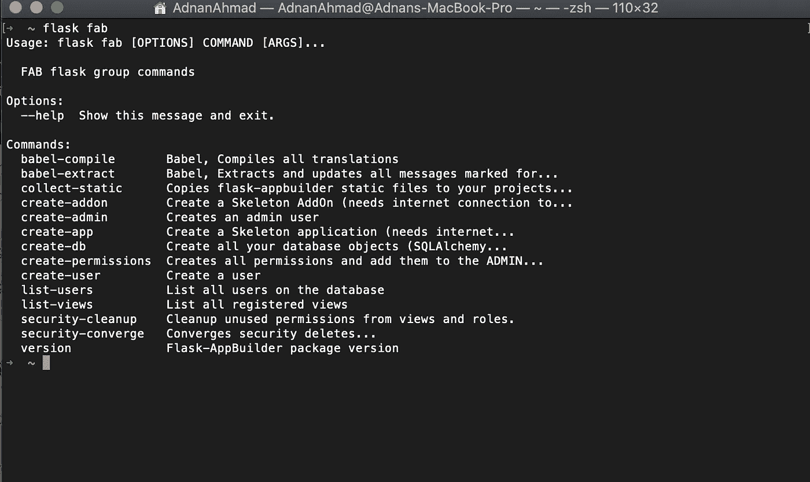

一旦安装完毕，你可以在终端上运行`superset`命令来检查它。

现在是启动仪表板服务器的时候了。

`superset run -p 8080 --with-threads --reload --debugger`

假设此端口可用，您将会看到一个类似于下图的屏幕:

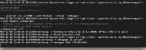

当你访问`http://127.0.0.1:8080`时，你将会受到这个屏幕的欢迎:

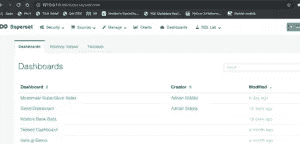

点击样本**世界银行数据**选项，它会给你一个全面的概述:

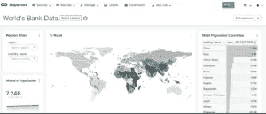

在继续之前，请允许我讨论一些与超集相关的术语:

*   **Sources** :-用于挑选您想要通过超集进一步探索的数据集或数据库。超集支持所有 [SQLAlchemy](https://docs.sqlalchemy.org/en/12/core/engines.html#database-urls) 兼容的数据源。
*   **切片:-** 给出关于数据的见解的单个单元。它可以是可视的，也可以是文本的。其中一个例子是从一开始注册用户的总数。
*   **矩阵:-** 在仪表板中，矩阵表示您愿意探索的信息类型，通常是聚合值。例如，在上面的例子中，注册用户的总数是一个矩阵。Slice 使用这个聚合值，并以图表形式或文本形式呈现信息。
*   **Dimension:-** Dimension 告诉我们哪条信息正在被聚合，以便显示在仪表板上。扩展示例，我们可以有一个名为 year 的维度，用于查找每年的注册用户。

# 电子商务仪表板创建

好的，我们将创建第一个仪表板，它将有助于做出当前和未来的决策。我从 Kaggle 获得了[数据，并基于](https://www.kaggle.com/carrie1/ecommerce-data)[这个](https://www.kaggle.com/admond1994/e-commerce-data-eda/notebook)内核做了一些清理和 EDA。我的笔记本以 Github gist 的形式提供，我用它来根据我的要求准备数据。

 [## 2019 年值得关注的 20 种数字营销趋势和技术|数据驱动的投资者

### Faisal 在加拿大工作，拥有金融/经济和计算机方面的背景。他一直积极从事外汇交易…

www.datadriveninvestor.com](https://www.datadriveninvestor.com/2019/02/04/20-digital-marketing-trends-techniques-to-watch-out-for-in-2019/) 

查看[要点](https://gist.github.com/kadnan/b6e33532e85472467f5a5d8feac75e89)上的代码。

Jupyter 笔记本生成一个表，然后与 Apache 超集连接，以便进一步研究。

# 将超集与数据库连接

你要做的最重要的事情是连接你的数据库。我在这里给你澄清一下； **Apache 超集不创建数据库或其表**。它假设您已经在表或视图中准备好了数据。超集**不支持典型的 SQL 连接**，所以您应该准备好从多个资源中提取数据的物化视图。每个到数据库的表连接都是原子性的，所以这不像创建一个数据源并在其中包含多个表。

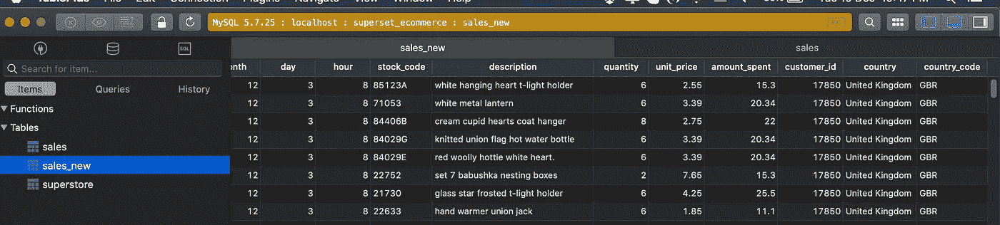

如您所见，我专门创建了一个名为 **superset_ecommerce** 的新数据库，并将所有数据转储到一个名为 **sales_new** 的表中。按照[官方网站](http://superset.incubator.apache.org/admintutorial.html?highlight=dimensions#connecting-to-a-new-database)上给出的说明，我的数据库条目如下所示:

不要忘记检查 **Expose this DB in SQL Lab** 链接，因为它有助于高级用户创建自定义查询以进行验证或探索。

我们的数据库已经连接好了，是时候引入我们需要的表了。从顶部导航栏转到 Source -> Tables，您将看到现有表的列表。

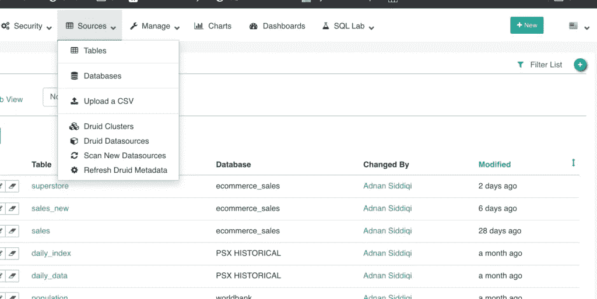

你点击右上方的 **+** 符号，会显示如下界面。选择所需的数据库来导入详细信息，并输入现有的表名。

完成后，您将会看到:

点击表格名称将显示如下界面:

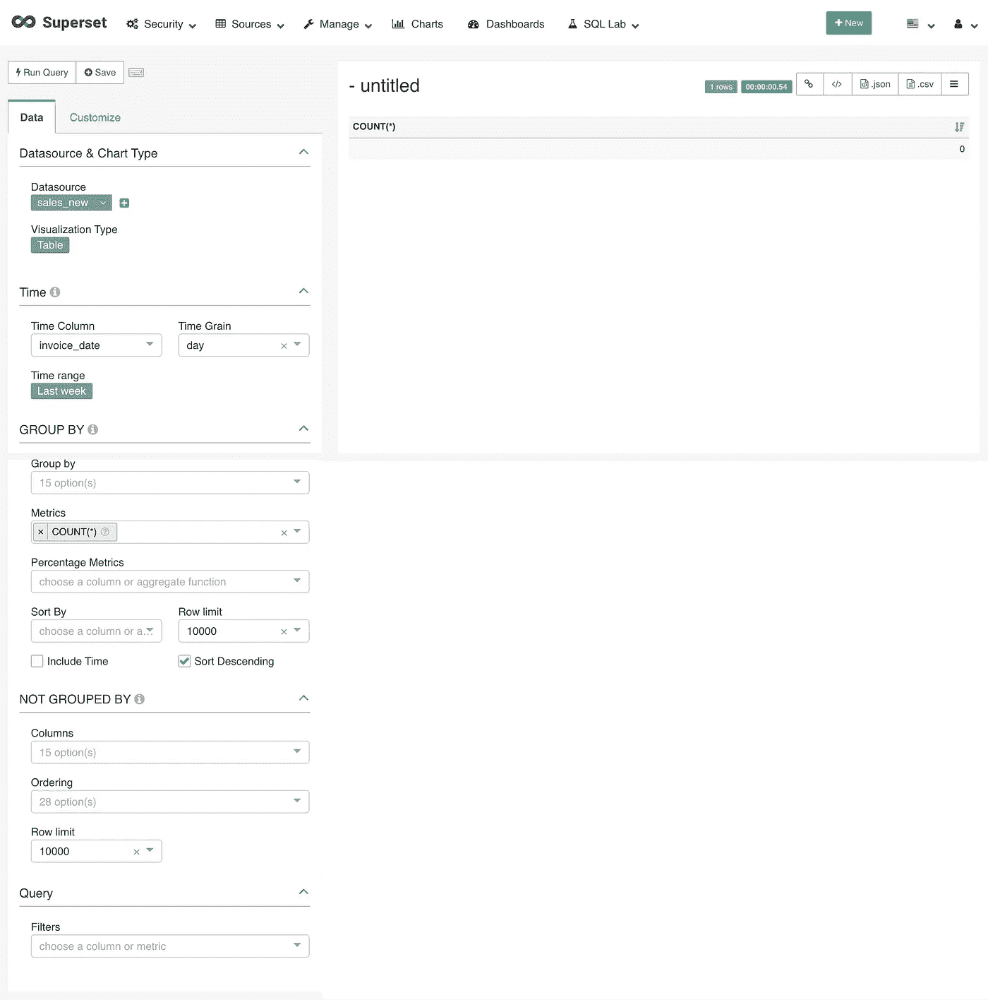

现在是时候添加你的*片*了。很明显作为*超集管理员*(什么，真的？)，你必须清楚你(或你的管理层)对什么样的信息感兴趣。您可能会看到如下信息:

*   前 5 名买家的国家名称。
*   总销售额
*   顶级客户

或许还有许多其他维度。让我们把重点放在第一个上。为了得到这些数字，我们将在`invoice_num`字段上使用`count()`，然后将它限制为最多 5 行。我得补充一个度量，*总发票。为此，我必须编辑数据源*和*。*

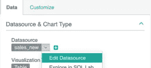

一旦你点击它，它会弹出如下窗口:

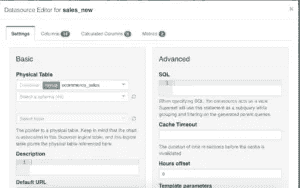

进入指标选项，添加一个新的指标，如下所示:

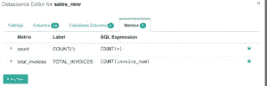

很好！让我们移动一个。在 Explorer 界面上，您会在界面右侧看到一个 0 计数。这是因为数据是旧的，我要做的就是取消设置时间范围，如下所示:

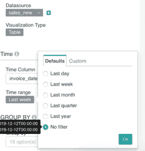

一旦完成，您运行查询，这次您将获得计数 **398k** 。表中的记录总数，不考虑任何条件。

我们必须找出前 5 名客户的国家名称以及发票数量。

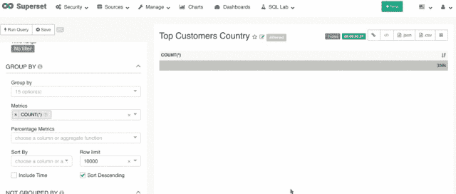

正如你在动画演示中看到的，首先我按`country`字段分组，然后用`TOTAL_INVOICE`作为矩阵。因为我只需要前 5 个条目，所以我也将限制设置为 5。

到目前为止还不错，但是这篇文章看起来并不吸引人，选一个条形图怎么样？

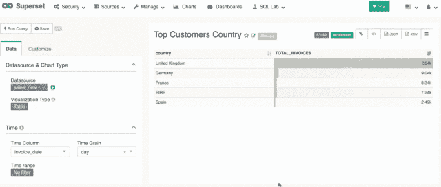

正如你在上面看到的，我是如何将基于文本的信息转换成可视的交互式信息的！多酷啊，不是吗？

现在，当您保存图表时，它会询问您是只保存图表还是也添加到仪表板上。

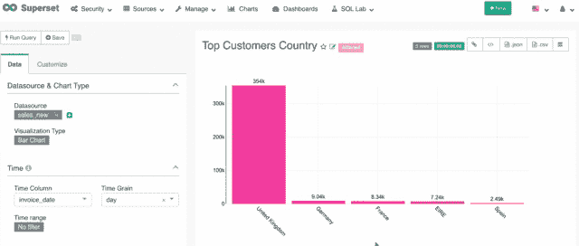

保存时要求放在新的或现有的仪表板上。我创建了一个新的仪表板，因为我们正在创建一个全新的仪表板。其他图表将放在仪表板上。

同样，我将添加另一条信息。这次是前 5 名客户的 ID 和他们的国家。我们将重复同样的程序。您可以随时通过打开顶部的**图表**选项来检查您现有的切片。

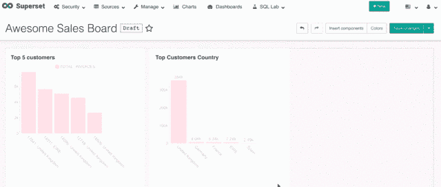

我又加了一个图表，前 5 大客户。一旦在操控板上添加了多个切片，就可以根据需要调整它们的位置。你也可以添加定制的可视化组件，就像我添加的 *header* 组件一样。

同样，你可以添加一个**相同数据的世界地图**，即前 5 名客户。

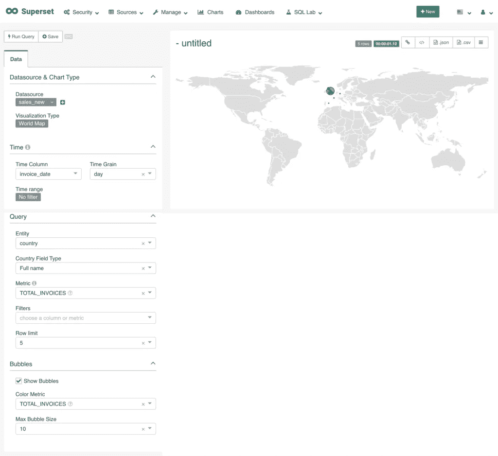

在仪表板上保存后，如下图所示。气泡显示了每个国家的数量。

# 结论

在这篇文章中，我试图介绍 Apache 超集的基础知识。这是一个非常强大的商业智能(BI)工具，易于定制和使用。它还允许创建基于角色的仪表板，例如，HR 会有不同的 KPI，因此不同的仪表板对销售团队来说是不可见的，反之亦然。我刚刚谈到了它的基础。

*原载于 2019 年 12 月 13 日*[*http://blog . adnansiddiqi . me*](http://blog.adnansiddiqi.me/create-your-first-sales-dashboard-in-apache-superset/)*。*