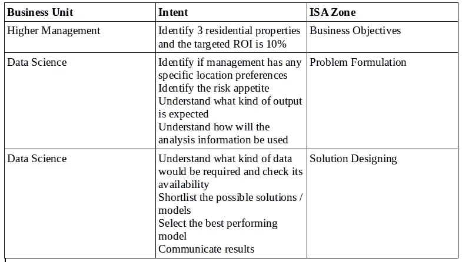

# 为您的数据科学项目创建清晰的结构

> 原文：<https://medium.datadriveninvestor.com/creating-a-lucid-structure-for-your-data-science-projects-1f68b0ca98cc?source=collection_archive---------11----------------------->

数据科学家花费大量时间处理数据收集、清理、确定合适的模型、试验、构建合适的解决方案并将结果传达给利益相关方。这些严格的任务会变得越来越复杂，如果没有一个组织良好的项目结构，可能会阻碍你在截止日期前完成任务。这里我打算介绍一种科学的方法来创建一个不证自明的数据科学项目结构。我称之为**ISA——“基于意图的结构化方法”**。

这种方法考虑了所有涉众、团队成员和参与项目的其他各方的意图。该意向可分为 3 个主要区域。**业务目标**、**问题制定**和**方案设计**。下面的示例有助于更好地理解方法的意图。

梦想投资公司买卖房产。该公司希望在下一季度投资 3 处住宅物业，并请求数据科学部门帮助他们确定 3 处可以为他们提供预期投资回报的物业。

ISA Illustration Table

现在我们已经了解了所有区域的意图，让我们创建一个项目结构。

为项目创建根目录。让我们称之为“投资”。第一步是为这个目录创建一个自述文件。该文件概述了项目及其组件。你可以写下项目目标，入围的算法，如何使用输出等。这描述了创建这个目录的意图，也解释了如何使用项目组件。确保您的工作/更改被推送到 github repo。

mkdir 投资公司

cd 投资

nano README.md

下一步是为所有数据创建一个中央存储库。因此，在 Investment 中创建一个名为“data”的目录。该路径用于在试验模型时获取数据，任何需要或请求的新数据也将保存在这里。默认情况下，您必须为每个创建的目录添加一个自述文件。在这里，自述文件可以描述各种数据源、它们的格式以及关于数据的任何其他重要信息。为每个数据源添加数据描述非常重要。例如，如果您有一个 csv 文件作为数据源，请创建另一个 csv 文件，解释数据源中每一列的含义及其数据类型。当您有多个数据集要处理时，这是很有帮助的，这样可以节省加载正确数据集的时间。这将是问题制定和解决方案设计区域的一个重要方面。再一次，确保你的工作/变更被推送到 github repo。

(确保您在投资目录中)

mkdir 数据

光盘数据

nano README.md

由于解决方案设计的第一步是功能工程和功能选择，而且会占用您的大部分时间，因此建议将预处理和清理任务模块化。因此，建议创建一个目录或至少一个文件来预处理数据。这将使您能够创建模块化预处理管道。原始数据的任何修改版本必须保存在数据目录中。如果您选择创建预处理文件夹，请确保添加自述文件，说明可以进行哪些预处理以及如何使用它。并确保您的工作/更改被推送到 github repo。

(确保您在投资目录中)

mkdir 预处理

cd 预处理

nano README.md

数据科学工具包中另一个非常重要的工具是可视化。最好为可视化创建一个单独的目录，并在其中创建另一个子目录来保存所有可视化图像。这是解决方案设计区的一个重要方面。确保自述文件描述了所使用的可视化技术以及为可视化表示而总结的数据点。图像的自述文件必须描述新的可视化是否被覆盖或保存日期等。这将确保选择正确的图像来呈现结果。我再次强调—推你工作/改变 ro github repo。

(确保您在投资目录中)

mkdir 可视化

cd 可视化

nano README.md

(确保您在投资/可视化目录中)

mkdir 图像

nano README.md

由于数据科学完全是关于实验的，所以将所有结果保存在一个中心位置以便用于比较是很重要的。因此，让我们创建另一个名为“结果”的目录，在那里可以保存您的所有结果。查看汇总结果的最便捷方式是将其保存在 csv 文件中。命名 csv 文件的一种易于管理的方法是使用日期和实验编号的组合。因此，如果您在第一天运行 3 个实验，您的 csv 可能会被命名为 day1_exp1.csv，依此类推。这是解决方案设计区域中最重要的方面。因为您的结果将决定在生产中部署您的模型时必须采用哪种方法。并确保您的工作/更改被推送到 github repo。

(确保您在投资目录中)

mkdir 结果

cd 结果

nano README.md

但是，在保存结果之前，您需要使用不同的模型/方法来试验数据。所以创建一个名为模型/方法的目录是理想的。该目录必须有自己的自述文件，列出所用的型号，并解释为什么选择列出的型号。它还解释了预期的输入和输出。这是问题公式化和解决方案设计区域的一部分。推你工作/修改 github repo。

(确保您在投资目录中)

mkdir 模型

cd 型号

nano README.md

对于项目中所有算法的所有常用或最常用的函数，可以保存在 utils.py 文件中。字符串到日期时间的转换示例可用于数据预处理和数据可视化。所以这样的公共函数可以是 utils.py 文件的一部分。推动你的工作/变化。

最后，如果您的项目依赖于需要安装的包，它们必须在 requirements.txt 文件中列出。

我明白，我可能过于强调推动你在 github 上的工作，因为维护代码变更的版本并与你的团队成员合作是极其必要的。Github 一定是你日常生活的一部分。对于那些想了解 git 如何工作的人来说，可以参考这个神奇的网站—[https://try.github.io/](https://try.github.io/)。我发现它非常有用，希望你也能学到。

这是项目结构的概要视图

Directory Structure

这是一个基本的项目结构。您可以根据您的项目需求和复杂性来构建这个结构。

为了使整个过程模块化，我用 python 创建了一个名为 pyisa 的包。这就是基于 Python 意图的结构化方法。你可以使用` *pip install pyisa* 来安装它。截至 2018 年 9 月 4 日的最新版本是 1.0.5。这仍然是一个测试版本，但是将为任何 Linux 操作系统创建一个项目结构。Windows 和 Mac 用户现阶段可以自担风险试用此套餐。独立于操作系统的操作是未来路线图的一部分。你可以这样使用它:

在命令提示符下键入:pyisa _ build—-project _ path =/absolute/path—-project _ name = name—-tree = True

如果你想做出贡献，让这个包更有意义和有用，这里有 github 链接—【https://github.com/sagard21/pyisa 

希望这个结构可以帮助你很好地组织你的项目。非常欢迎您的反馈和建议，如果值得的话，请随时分享您的知识。

特别感谢 Manas Ranjan Kar 和 Nipun Sadvilkar 对我的指导和监督，帮助我每天都在进步。没有你的教导，这个项目是不可能的。

*原载于 2018 年 9 月 10 日*[*medium.com*](https://medium.com/@sagard21/creating-a-lucid-structure-for-your-data-science-projects-7c281c855ef6)*。*