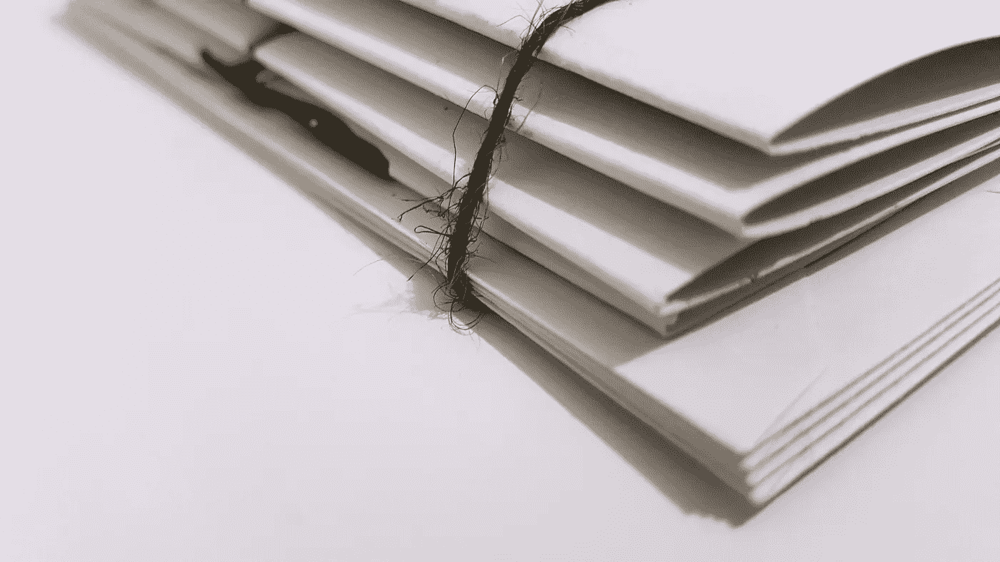

# 创建激励性成功刷卡文件

> 原文：<https://medium.datadriveninvestor.com/creating-a-motivational-success-swipe-file-deec53eb0b55?source=collection_archive---------13----------------------->

当我们感到沮丧、压力大、需要额外的推动力时，我们很难高昂着头继续前进。

我们必须为这些时刻做好准备，因为生活会不时扔给我们曲线球。有一个激励性的档案是一个很好的方法来重新集中我们的注意力，并提醒我们自己，我们可以克服我们的障碍，并因此变得更好。

 [## 摔倒不是失败。-数据驱动型投资者

### 你只有在放弃的时候才会失败。每个英雄都会倒下，我们活着就是为了失败者出现的时刻；上升到…

www.datadriveninvestor.com](https://www.datadriveninvestor.com/2019/01/17/falling-isnt-failing/) 

# 如何创建你的激励刷卡文件

选择你喜欢的工具。我真的很喜欢 [Evernote](https://evernote.com/) ，因为它可以让你用手机拍照和扫描文件，用电脑截图，然后让你把所有零散的东西汇编成一个沉重的“笔记”。最棒的是，它保存在云中，可以在任何地方访问。请随意使用“Word”、Google sheets 或任何对你来说简单易行的东西。

# 添加您最喜欢的引用。

以下是我们一直以来最喜欢的一些

> 我们就是我们反复做的事情。因此，优秀不是一种行为，而是一种习惯。
> **—亚里士多德**
> 
> 我很确定我们所想的是我们会成为什么样的人。
> **—奥普拉·温弗瑞**
> 
> 如果你将来能够回顾某件事并对此一笑置之，那你还不如现在就笑。
> **—玛丽·奥斯蒙德**
> 
> 有时候你只需要给自己你希望别人给你的东西。
> **—菲尔博士**
> 
> “我明白了，不管发生了什么，不管今天看起来有多糟糕，生活都会继续，明天会更好。”
> **—玛娅·安杰洛**

# 加上你胜利的照片。

我们已经听过无数次了:一张*图片胜过千言万语*。

记录那些你已经取得成就的时刻；那个你努力工作才买得起的假期，那个在你不知道自己会挺过来的混乱环境后的胜利…

在这些时刻拍摄照片，并将其添加到您的刷卡文件中。抓住你的胜利，这样你就可以不断提醒自己。当我们这样做时，我们就有证据证明我们有成功和真正实现目标的必要条件——我们有证据证明我们能够实现我们想要实现的目标。

在很多情况下，我们倾向于控制自己的游行。我们陷入一种迷信的偏执狂，认为如果我们过于赞美自己或享受我们的胜利，我们可能会“诅咒”我们未来成功的机会。虽然这听起来很傻，但我们一直都在这么做——因为我们想保护自己免受失败带来的负面情绪的影响。但是，现实是，成功的心态会带来更多的成功，我们取得的成就越多，继续奋斗就越容易上瘾。

## 停止关注过去发生的所有不好的事情

有趣的是，我们人类的记忆并不是准确回忆过去的可靠工具。通常，它是被污染和被框定的，以整齐地适应我们的信仰体系。为什么？因为记忆是一种功能，它旨在综合一次经历的意义，并将其储存起来，以便我们可以从过去中学习。但是，我们人类有时真的太聪明了，我们倾向于扭曲我们的记忆，或者只选择某些证实我们自己认知偏见的记忆。

所以，拍下你所有的胜利，包括帮助你实现胜利的人，并写下你当时的感受。没有什么能比得上一封胜利感谢信，尤其是当你想到未来穷困潦倒的自己时，还会读到它。

# 添加你自己的个人生活经验

通往成功的道路布满了坑坑洼洼。所以，在某个阶段我们难免会犯错。当我们这样做的时候，我们经常会了解一些我们不知道的关于自己的事情:我们需要改进的地方，或者我们不知道自己拥有的优势，这些最终拯救了我们。

在这些时刻，不要浪费你的顿悟，打开你的刷卡文件，写下障碍和它教会你的东西。让这一课在未来的几个月甚至几年里盯着你，这样你的障碍才真正成为可教的时刻，而不是一个纠结于你的不安全感的机会。

> “道路上的障碍变成了道路。永远不要忘记，每个障碍中都有改善我们状况的机会”——瑞安·哈乐黛

# 回顾和分享

没有什么比一个伟大的故事更甜蜜的了。我们喜欢伟大的故事，尤其是失败者的故事，故事中的男女主人公经历了一次几乎不可能的旅程，找到了宝藏，完成了他们的使命，同时也造福了他们自己和全人类。史诗，对！

找出这些故事的真实版本，并将它们添加到您的推送文件中。当我们看到人们克服挑战并取得胜利时，我们别无选择，只能受到鼓舞。它实际上也打破了我们头脑中的玻璃天花板。

> 在 2009 年柏林奥运会上，尤塞恩·博尔特以 9.58 秒的成绩完成了 100 米短跑，打破了自己的纪录。在 100 米短跑中，有一个荣誉徽章，叫做“10 秒钟障碍”。如果短跑运动员能够突破障碍，他们就被认为是世界上跑得最快的人之一。
> 
> 10 秒钟的纪录首次被打破是在 1968 年 6 月 20 日晚，由 3 名美国短跑运动员打破。从那以后，“自从 1977 年电子计时成为强制性的以来，世界纪录已经提高了 12 倍。”曾经被认为是不可能的事情现在已经成为职业运动员的基准。

研究人员发现，当我们看到其他人取得伟大成就时，它会消除我们头脑中的限制信念，我们会意识到它也可以成为我们的现实。当我们听到这些故事时，我们知道有一个尚未开发的潜力源泉需要我们去挖掘，当我们这样做时，我们打破记录，建立成功的企业，发起一场运动——但最重要的是，我们获得了克服今天挡在我们面前的那些障碍的动力。

# 加入杰出女性运动

加入我们的有成长意识的女性社区，她们在个人、职业和经济方面都在努力改变和进步。

## 现在加入我们吧！

*   [脸书集团](https://www.facebook.com/groups/trwprivategroup/)
*   [脸书页面](https://www.facebook.com/theremarkablewoman/)
*   [邮件列表](http://eepurl.com/dADOiv)