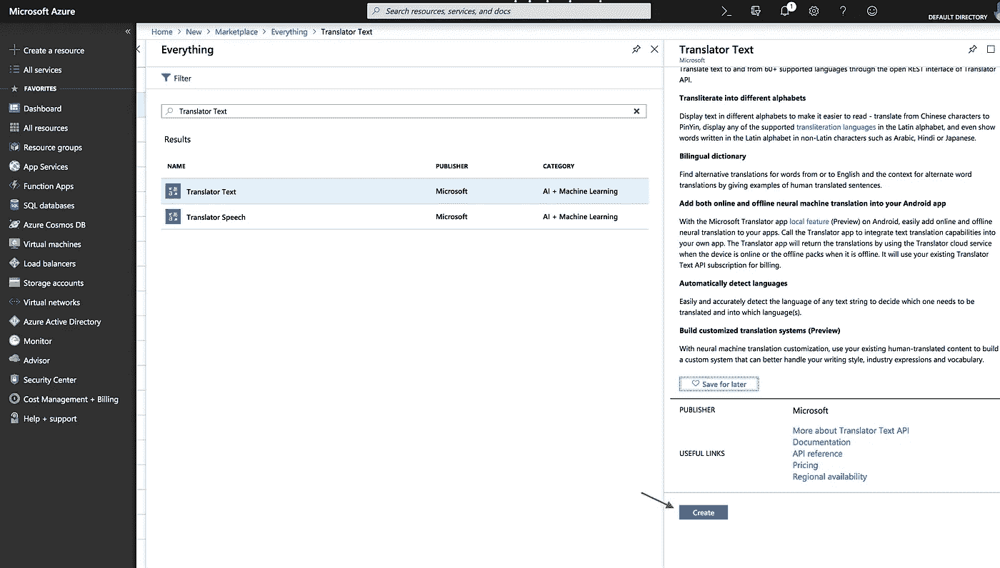
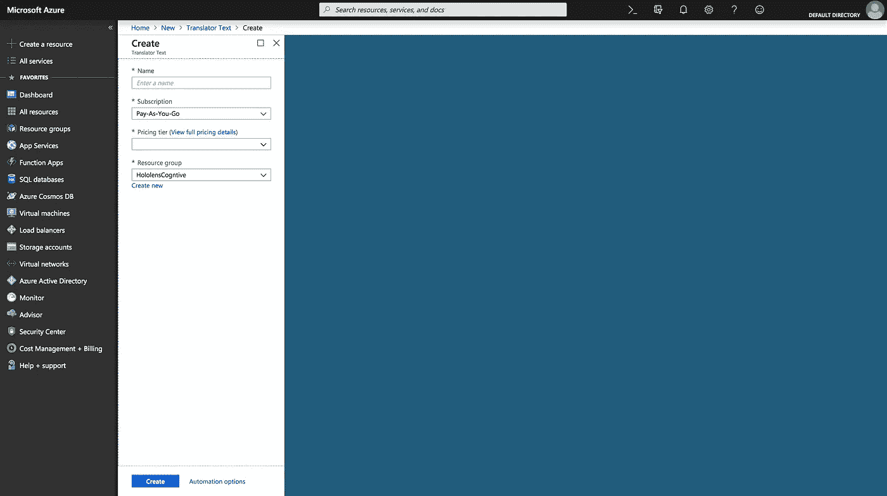
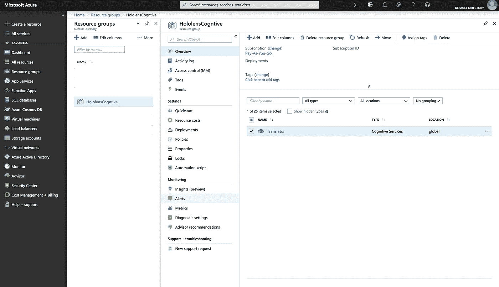
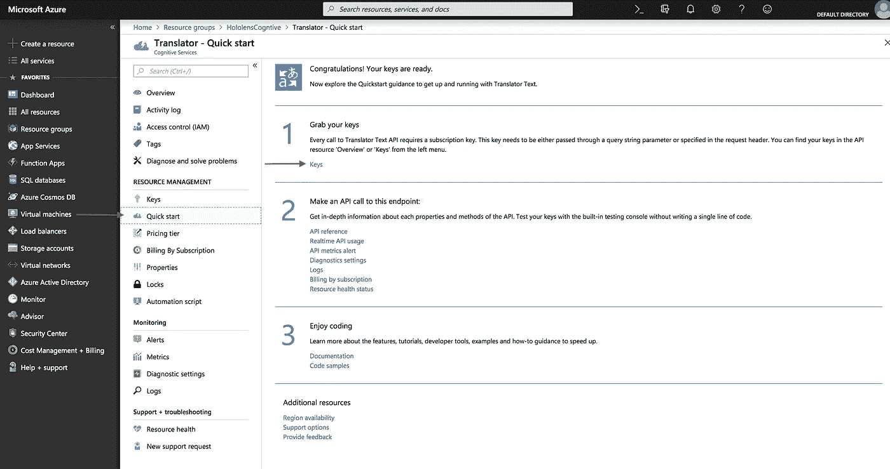
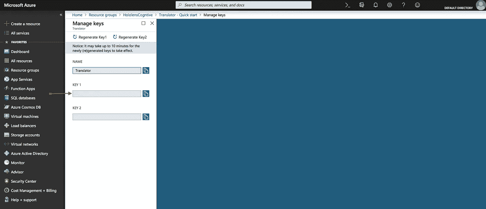

# 使用 ChatterBot 在 Python3 中创建个人聊天机器人(第 2 部分—语言翻译)

> 原文：<https://medium.datadriveninvestor.com/creating-a-personal-chatbot-in-python3-using-chatterbot-part-2-language-translation-9e819d8d971b?source=collection_archive---------1----------------------->

# 设置 Microsoft Azure 语言翻译

在这一部分，我们将在聊天机器人中加入微软 Azure 语言翻译。首先，你需要设置一个 Microsoft Azure 帐户。如果这是你第一次使用 azure，你将获得 200 美元的 Azure 点数，可以在头 30 天内使用，并可以在 12 个月内访问其他免费服务。若要开始设置您的 Microsoft Azure 帐户，请访问下面的链接:

[](https://azure.microsoft.com/en-us/free/) [## 立即创建您的 Azure 免费帐户| Microsoft Azure

### 开始享受 12 个月的免费服务和 200 美元的点数。立即使用 Microsoft Azure 创建您的免费帐户。

azure.microsoft.com](https://azure.microsoft.com/en-us/free/) 

为了翻译我们的聊天机器人文本，我们将不得不使用微软 Azure 中的 Translator Text API。创建帐户后，登录 Azure 门户。

[](https://azure.microsoft.com/en-us/features/azure-portal/) [## Microsoft Azure 门户| Microsoft Azure

### 在 Microsoft Azure Portal 中构建、管理和监控您的所有应用。为您、您的团队和…打造的单一统一中心

azure.microsoft.com](https://azure.microsoft.com/en-us/features/azure-portal/) 

登录后，您将被重定向到您的 Azure 仪表盘。在这里，我们将选择**创建资源**，并在市场搜索栏中键入**翻译文本**。选择**文本翻译器**，然后**创建。**



接下来，我们将设置一些关于将您的服务放入哪个资源组、定价层和您的订阅类型的内容。



在**名称**字段中输入您选择的名称。为您的套餐选择**现收现付**。如果这是您的第一个**翻译文本**服务，请选择定价层下的 **F0** 层。接下来，选择要将服务放入哪个资源组，或者创建一个新的资源组。最后，选择**创建**。

创建翻译文本服务后，您将看到服务正在设置的通知。成功部署服务后，转到您选择的资源组，选择新的翻译文本服务。



从“快速启动”页面，导航到“获取您的钥匙”选项卡并选择钥匙。



在“管理密钥”页面上，您将看到服务的名称和两个密钥:密钥 1 和密钥 2。复制 Key 1 中的连接字符串，并保存以备后用。



现在我们有了连接字符串，让我们开始在我们的聊天机器人中实现我们的新服务。首先，我们将创建一个 Python 脚本来管理翻译。主机和路径变量是原样的，所以我们只需要担心输入我们的订阅密钥。创建一个名为 Translator.py 的文件，并将刚才在 Azure 中生成的连接字符串复制到 subscriptionKey 变量中。

```
#Translator.pyimport http.client, uuid, json
try:
    from urllib.parse import urlparse
except ImportError:
     from urlparse import urlparsesubscriptionKey = '<Translator API connection string>'host = 'api.cognitive.microsofttranslator.com'
path = '/translate?api-version=3.0'#Language Codes as parameters
params = ""
```

既然我们已经设置了从 Azure 发送和接收请求的配置，我们需要指定我们将用来翻译的语言参数。我们将设置特定的语言代码作为参数，这取决于我们希望我们的文本被翻译成什么语言。参数中的每个语言代码由“ **&到=** ”分隔。

```
#Language Codes as parameters
# Translate to Spanish,Italian,French,Japanese,...
params = "&to=es&to=it&to=fr&to=ja&to=pt&to=hi&to=zh-Hans&to=ko"
```

有关语言代码的列表，请访问下面的 Microsoft 语言支持网站:

[](https://docs.microsoft.com/en-us/azure/cognitive-services/translator/language-support) [## 语言支持-翻译文本 API - Azure 认知服务

### Translator Text API 支持以下语言的文本到文本翻译。神经机器翻译(NMT)…

docs.microsoft.com](https://docs.microsoft.com/en-us/azure/cognitive-services/translator/language-support) 

参数中的每种语言都根据其在参数列表中的位置被赋予一个整数值，第一项从 0 开始。我们将创建一个字典来将这些值映射到它们各自的整数，这样我们就可以很快地处理它们。此时，您的 Translator.py 文件应该如下所示:

```
#Translator.py
import http.client, uuid, json
try:
    from urllib.parse import urlparse
except ImportError:
     from urlparse import urlparsesubscriptionKey = '<Translator API connection string>'host = 'api.cognitive.microsofttranslator.com'
path = '/translate?api-version=3.0'# Translate to Spanish and Italian
params = "&to=es&to=it&to=fr&to=ja&to=pt&to=hi&to=zh-Hans&to=ko"langDict  = {"spanish":"0",
             "italian":"1",
             "french":"2",
             "japanese":"3",
             "portuguese":"4",
             "hindi":"5",
             "chinese":"6",
             "korean":"7",
             }
```

在 Translator.py 中，我们将创建一个函数来处理向 Azure 发布我们的信息。

```
def post(content):
    headers = {
        'Ocp-Apim-Subscription-Key' : subscriptionKey,
        'Content-type' : 'application/json',
        'X-ClientTraceId' : str(uuid.uuid4())
    } conn = http.client.HTTPSConnection(host)
    conn.request("POST", path + params, content, headers)
    response = conn.getresponse()
    return response.read().decode('utf-8')
```

现在我们需要处理和输出从 Azure 获得的翻译。在 Translator.py 中创建一个函数“outputTranslation”来完成这个任务。我们将在下面分解这个函数的组件，并将完成的函数放在最后。该函数的第一部分处理将字符串格式化为 JSON 对象，并返回参数中列出的每个已翻译的对象。

```
def outputTranslation(text,lang):
    # Text that we're sending to Azure Translation API
    requestBody = [{'Text' : text,}] # Takes the JSON object and returns an encoded string
    content =json.dumps(requestBody,
    ensure_ascii=False).encode('utf-8') # Translates the encoded string
    result = post(content) ''' Note: We convert result, which is JSON, 
    to and from an object so we can pretty-print itself.
    We want to avoid escaping any Unicode characters 
    that result contains.''' # Returns an object from the translated string 
    output = json.loads(result) translatedText = ""
```

这部分函数处理返回的 JSON 对象，并返回翻译成您先前选择的语言的字符串。这是我们将使用我们之前创建的语言词典的地方。

```
 # Check if the language passed in by the parameter is in 
    # the dictionary of languages you provided
    if lang in langDict:
        # Create a variable that stores the value from the 
        #key passed 
        #in for a language in the dictionary
        langVal = int(langDict["{0}".format(lang)]) # Our JSON object(output) returns text and translations 
        # for each of the parameters
        # We only need to return the translation for the language
        # we selected.
        translatedText = output[0]['translations'][langVal]['text']
    else:
        print("Did not enter correct language, 
        defaulting to Spanish")
        translatedText = output[0]['translations'][0]['text']

    return translatedText
```

至此，我们已经完成了 Translator.py 文件。您的文件应该类似于下面的文件。

```
#Translator.py
import http.client, uuid, json
try:
    from urllib.parse import urlparse
except ImportError:
     from urlparse import urlparsesubscriptionKey = '<Translator API connection string>'host = 'api.cognitive.microsofttranslator.com'
path = '/translate?api-version=3.0'# Translate to Spanish and Italian
params = "&to=es&to=it&to=fr&to=ja&to=pt&to=hi&to=zh-Hans&to=ko"langDict  = {"spanish":"0",
             "italian":"1",
             "french":"2",
             "japanese":"3",
             "portuguese":"4",
             "hindi":"5",
             "chinese":"6",
             "korean":"7",
             }def post(content):
    headers = {
        'Ocp-Apim-Subscription-Key' : subscriptionKey,
        'Content-type' : 'application/json',
        'X-ClientTraceId' : str(uuid.uuid4())
    } conn = http.client.HTTPSConnection(host)
    conn.request("POST", path + params, content, headers)
    response = conn.getresponse() return response.read().decode('utf-8')def outputTranslation(text,lang):
    # Text that we're sending to Azure Translation API
    requestBody = [{'Text' : text,}] # Takes the JSON object and returns an encoded string
    content =json.dumps(requestBody,
    ensure_ascii=False).encode('utf-8')
    # Translates the encoded string
    result = post(content) ''' Note: We convert result, which is JSON, 
    to and from an object so we can pretty-print itself.
    We want to avoid escaping any Unicode characters 
    that result contains.''' # Returns an object from the translated string 
    output = json.loads(result) translatedText = "" # Check if the language passed in by the parameter is in 
    # the dictionary of languages you provided
    if lang in langDict:
        # Create a variable that stores the value from the 
        #key passed 
        #in for a language in the dictionary
        langVal = int(langDict["{0}".format(lang)])
        # Our JSON object(output) returns text and translations 
        # for each of the parameters
        # We only need to return the translation for the language
        # we selected.
        translatedText = output[0]['translations'][langVal]['text']
    else:
        print("Did not enter correct language, 
        defaulting to Spanish")
        translatedText = output[0]['translations'][0]['text']

    return translatedText
```

现在我们已经处理好了翻译服务，我们将返回到我们的 ChatBot.py 文件，并做一些修改。

我们将设置我们的聊天机器人在运行时接受输入。在开始之前，我们需要将刚刚创建的 Translator.py 文件导入到 ChatBot.py 文件中。为此，在我们已经存在的导入下面添加以下导入: **import Translator as tl** 。我们现在可以使用 **tl 在 Translator.py 文件中引用我们的方法。**

```
from chatterbot import ChatBot
import Translator as tl
```

**input()** 函数允许您在运行时以字符串形式输入文本。我们想要求用户输入他们希望他们的文本翻译成什么语言，所以我们会问他们。我们将把他们的回答翻译成小写，以保持一切一致。在我们提示输入语言后，我们会要求用户输入，从我们的聊天机器人获得响应，根据所选的语言翻译响应，并将翻译后的响应打印给用户。

```
chatbot = ChatBot('Brandon', trainer = 'chatterbot.trainers.ListTrainer')def main():
    lang = input("What language would you like your text 
    translated to?").lower()
    while True:
        request = input("Human: ")
        response = str(chatbot.get_response(request))
        print("Bot: " + tl.outputTranslation(response,lang))if __name__ == '__main__':
    try:
        print("Welcome")
        main()except KeyboardInterrupt:
        print("Program Interrupted")
```

此时，您有两个 Python 文件:ChatBot.py 和 Translator.py，以及一个可以将其响应翻译成各种语言的 ChatBot。运行 ChatBot.py 并测试您的新 ChatBot 功能。

您的 ChatBot.py 文件应该类似于以下内容:

```
from chatterbot import ChatBot
import Translator as tlchatbot = ChatBot('Brandon', trainer = 'chatterbot.trainers.ListTrainer')def main():
    lang = input("What language would you like your text 
    translated to?").lower()
    while True:
        request = input("Human: ")
        response = str(chatbot.get_response(request))
        print("Bot: " + tl.outputTranslation(response,lang))if __name__ == '__main__':
    try:
        print("Welcome")
        main()except KeyboardInterrupt:
        print("Program Interrupted")python3 ChatBot.py
```

作为额外的练习，尝试添加使用翻译器保持您的英语回复的功能。如果您对本演练或代码片段有任何意见，请随时留下您的意见和注释。

如果您有任何进一步的问题或想要探索更多功能，请参考 Microsoft Azure 文档。

Microsoft Azure 文档:

[](https://docs.microsoft.com/en-us/azure/index) [## Microsoft Azure 文档

### 了解如何使用 Microsoft Azure 云服务构建和管理功能强大的应用程序。获取文档，示例…

docs.microsoft.com](https://docs.microsoft.com/en-us/azure/index) 

继续阅读第 3 部分，将自然语言理解融入到你的聊天机器人中，这样你就可以用你的声音交流了。

[](https://medium.com/@brandonellis_56087/creating-a-personal-chatbot-in-python3-using-chatterbot-part-3-language-understanding-83ad2ed3e652) [## 使用 ChatterBot 在 Python3 中创建个人聊天机器人(第 3 部分——语言理解)

### 在这一部分，我们将使用 Wit.ai 添加一个自然语言理解层

medium.com](https://medium.com/@brandonellis_56087/creating-a-personal-chatbot-in-python3-using-chatterbot-part-3-language-understanding-83ad2ed3e652)