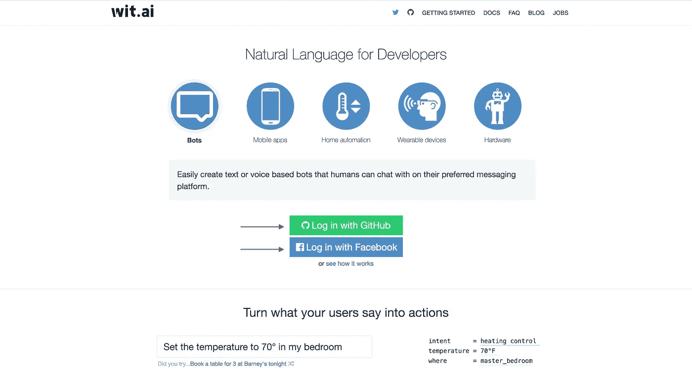
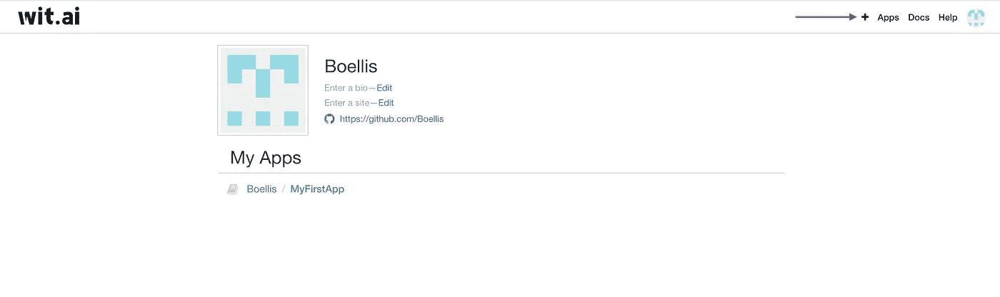
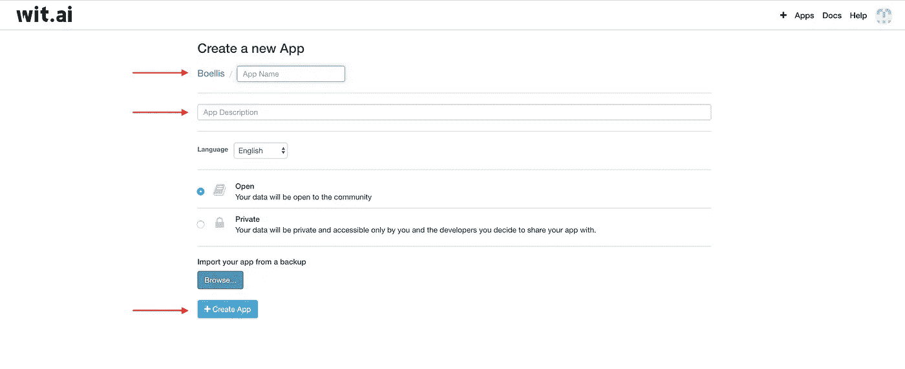
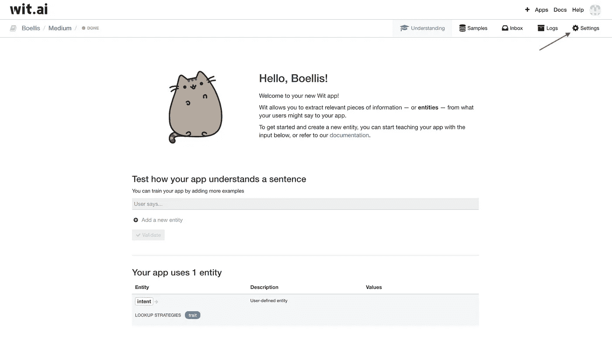
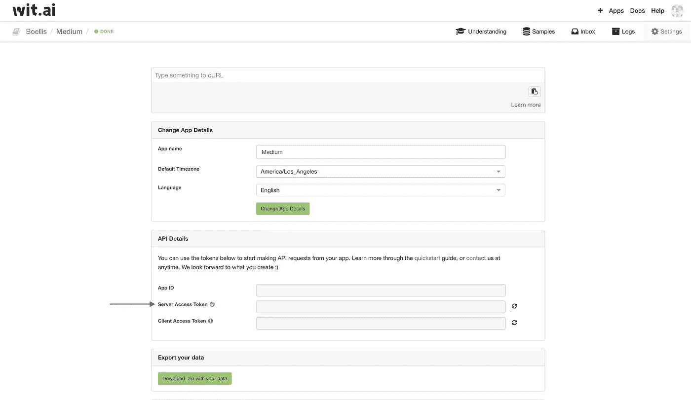

# 使用 ChatterBot 在 Python3 中创建个人聊天机器人(第 3 部分——语言理解)

> 原文：<https://medium.datadriveninvestor.com/creating-a-personal-chatbot-in-python3-using-chatterbot-part-3-language-understanding-83ad2ed3e652?source=collection_archive---------4----------------------->

在这一部分，我们将使用 Wit.ai 添加一个自然语言理解层。“Wit.ai 提供了一个可扩展的自然语言平台，使开发人员可以轻松地构建您可以与之交谈或发送文本的应用程序和设备。”Wit.ai 的文档会在文章的底部。

## 设置您的 Wit.ai 帐户

导航到 Wit.ai 页面，用你的脸书或者 GitHub 账户登录。

 [## Wit.ai

### Wit.ai 让开发者可以轻松构建你可以与之交谈或发短信的应用和设备。我们的愿景是…

wit.ai](https://wit.ai/) 

登录后，您将进入显示您的应用程序的仪表盘。我们将创建一个新的应用程序，因此选择右上角的 **'+'** 。



选择后，您将进入创建新应用程序页面。首先，你需要给你的应用取一个名字。接下来添加一个描述，详细说明您将使用该应用程序的目的。之后，选择您希望您的数据是**公开**还是**保密**。完成所有字段后，选择**创建应用**。



创建您的应用程序后，您将被引导至与下图类似的页面。从这里，我们将选择**设置**来查找我们的服务器访问令牌。服务器访问令牌允许我们从 Python 脚本与 Wit.ai 通信。



在**设置**页面上，可以在 **API 细节**选项卡下找到服务器访问令牌。在本文的后面，我们将需要服务器访问令牌，所以请继续复制它。



在开始使用 Python 之前，我们需要使用以下命令在 Python 中安装和使用 Wit.ai:

使用画中画

```
pip3 install wit
pip3 install pyaudio
pip3 install SpeechRecognition
```

来源:

```
git clone https://github.com/wit-ai/pywit
pip install .
```

对于 Mac(确保仍然安装 pyaudio、wit 和 SpeechRecognition):

```
brew install portaudio
```

Wit.ai 有很多很酷的功能，比如使用意图和实体、消息传递和交互式对话。目前，我们将只使用将语音转换为文本的功能。您需要将内置或外置麦克风连接到电脑上。

创建一个名为 Wit.py 的新 Python 文件。我们将从导入 SpeechRecognition 开始:

```
 import speech_recognition as sr
```

这里我们将创建一个名为 **talk()** 的函数来将语音转换成文本。
我们使用 Wit Recognizer 函数来监听来自某个源的音频，将该音频发送给 Wit，将该音频翻译成文本，然后将该音频作为文本返回。我们将使用麦克风作为音频源。将之前保存的服务器访问令牌复制到 key 变量的值中。

```
import speech_recognition as srrecognizeSpeech = sr.Recognizer()def talk():
    with sr.Microphone() as source:
        audio = recognizeSpeech.listen(source)
        user = recognizeSpeech.recognize_wit(audio,
        key='<your server access token>')

    return user
```

您完成的 Wit.py 文件应该类似于上面的代码块。

打开您的 ChatBot.py 文件，让我们实现我们使用 Wit.ai 服务创建的新的 **talk()** 函数。我们只是要替换选择语言的用户输入，但是 **talk()** 函数可以用来替换项目中大多数形式的用户输入。

将您刚刚创建的 Wit.py 文件导入您的 ChatBot.py:

```
import Wit as wit
```

我们正在用我们的 **talk()** 函数替换我们当前在 **main()** 函数中接收输入的方式。替换这个:

```
def main():
    lang = input("What language would you like your text 
    translated to?").lower()
    while True:
        request = input("Human: ")
        response = str(chatbot.get_response(request))
        print("Bot: " + tl.outputTranslation(response,lang))
```

有了这个:

```
def main():
    print("What language would you like your text translated to?")
    lang = wit.talk().lower()
    while True:
        request = input("Human: ")
        response = str(chatbot.get_response(request))
        print("Bot: " + tl.outputTranslation(response,lang))
```

下面是实现了 **talk()** 函数后，您完成的 ChatBot.py 文件应该是什么样子。

```
from chatterbot import ChatBot
import Translator as tl
import Wit as witchatbot = ChatBot('Brandon', trainer = 'chatterbot.trainers.ListTrainer')def main():
    print("What language would you like your text translated to?")
    lang = wit.talk().lower()

    while True:
        request = input("Human: ")
        response = str(chatbot.get_response(request))
        print("Bot: " + tl.outputTranslation(response,lang)) if __name__ == '__main__':
        try:
            print("Welcome")
            main() except KeyboardInterrupt:
            print("Program Interrupted")
```

使用以下命令在您的聊天机器人中测试语音到文本的实现:

```
python3 ChatBot.py
```

我要感谢 Jaylen Douglas 帮助我改进了进行文本到语音 API 调用的功能。你可以在这里查看他的 GitHub 简介:

[](https://github.com/ableinc) [## 开源代码库

### 软件工程师- IOS 开发者。ableinc 有 3 个存储库可用。在 GitHub 上关注他们的代码。

github.com](https://github.com/ableinc) 

Wit.ai 文档:

 [## Wit - Docs 主页

### 文档主页

Docs Homewit.ai](https://wit.ai/docs) 

继续阅读第 4 部分，我们将使用 Twilio 发送电子邮件、短信和电话。

[](https://medium.com/@brandonellis_56087/creating-a-personal-chatbot-in-python3-using-chatterbot-part-4-voice-call-sms-and-email-1a2df78400fe) [## 使用 ChatterBot 在 Python3 中创建个人聊天机器人(第 4 部分——语音呼叫、短信和电子邮件)

### 你有没有在深海潜水时丢失手机，需要给朋友发提醒短信去取更多的…

medium.com](https://medium.com/@brandonellis_56087/creating-a-personal-chatbot-in-python3-using-chatterbot-part-4-voice-call-sms-and-email-1a2df78400fe)