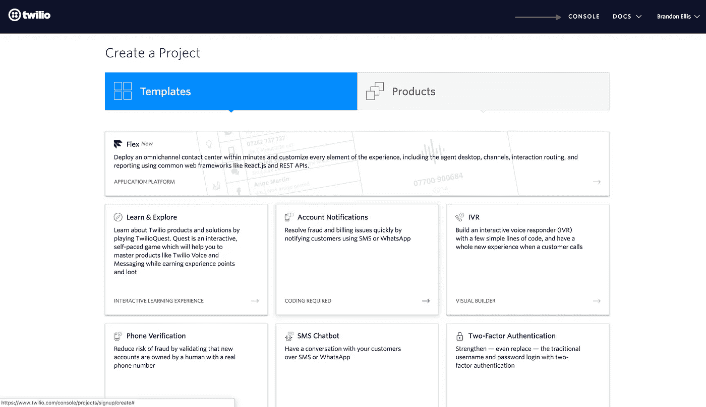
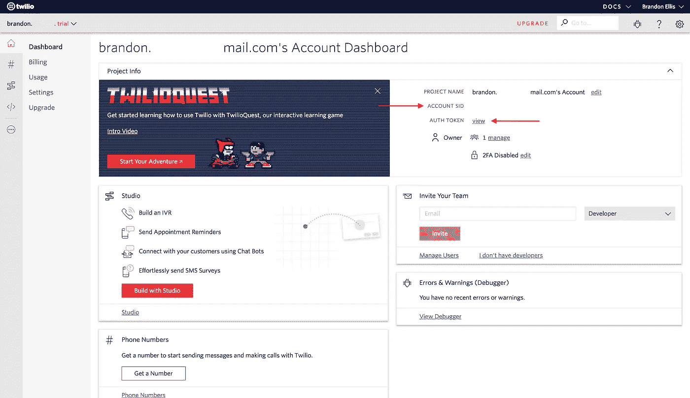
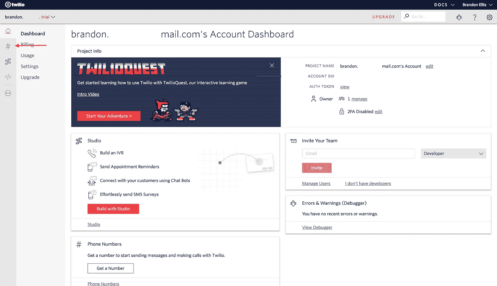
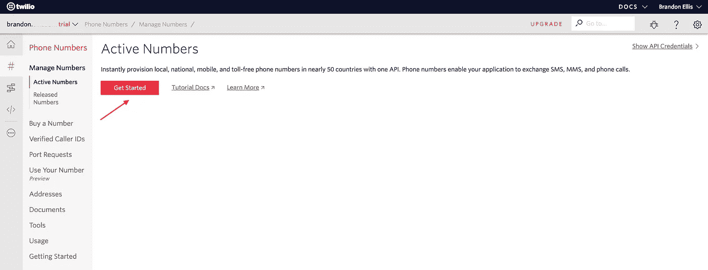
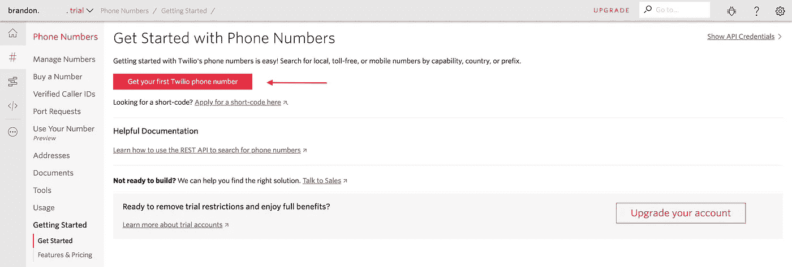
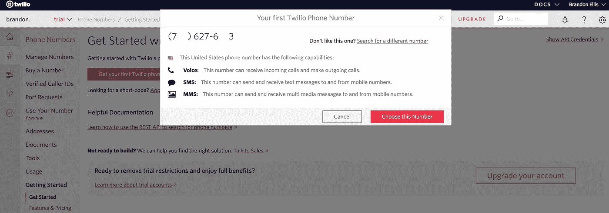
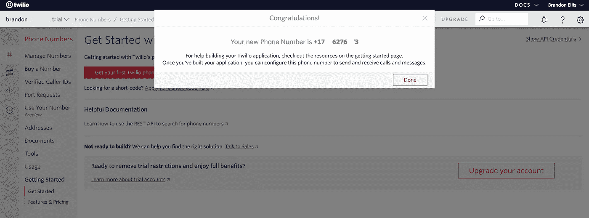
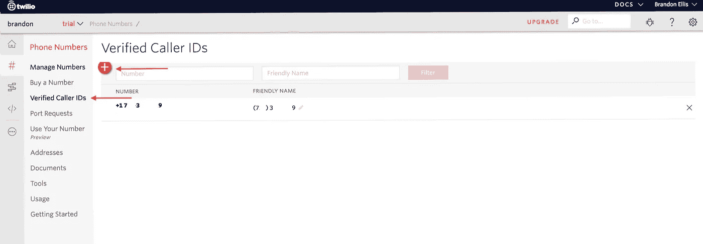
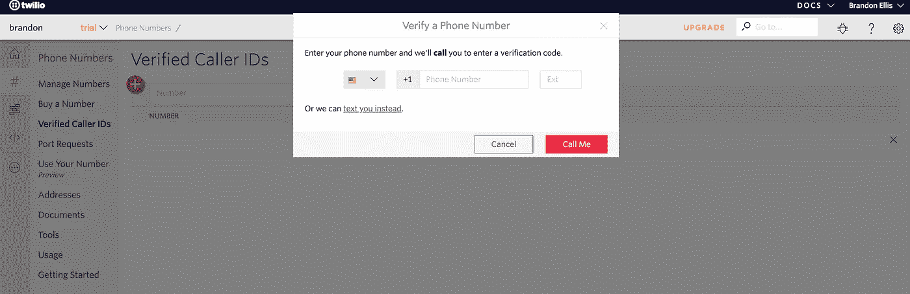

# 使用 ChatterBot 在 Python3 中创建个人聊天机器人(第 4 部分——语音呼叫、短信和电子邮件)

> 原文：<https://medium.datadriveninvestor.com/creating-a-personal-chatbot-in-python3-using-chatterbot-part-4-voice-call-sms-and-email-1a2df78400fe?source=collection_archive---------8----------------------->


你有没有在深海潜水时丢了手机，需要给朋友发提醒短信去取更多牛奶的经历？我知道，我们都经历过。也许你需要给你的老板发电子邮件，告诉他你今天不会去上班了，但是你忘记了如何使用你的电子邮件平台。日子会变得艰难，我明白。你来对地方了。

在本系列的这一点上，您应该已经设置了 Chatterbot，使用 Microsoft Azure 添加了语言翻译，并使用 Wit.ai 合并了语言理解。让我们使用更多新功能来保持列车运行。

在本系列的这一部分中，我们将使用 Twilio，所以让我们继续安装它。

```
pip install twilio
```

## 设置 Twilio 帐户

[](https://www.twilio.com/) [## Twilio -用于短信、语音、视频和认证的通信 API

### 云通信平台，用于在为全球范围构建的 API 上构建短信、语音和消息应用。获得…

www.twilio.com](https://www.twilio.com/) 

如果你是 Twilio 新手，点击注册按钮创建一个新帐户。如果您已经有一个帐户，请登录并在仪表板上保持不动。

一旦你注册了，你将被带到一个类似于下面的页面。从这里，选择控制台转到仪表板。



从控制面板中，我们将找到我们的帐户 sid 和身份验证令牌，并保存它们以备后用。我们将从 python 脚本中使用帐户 sid 与 Twilio 通信。您可以在您的仪表盘上找到您的**账户 sid** 和**认证令牌**，位置如下:



复制您的帐户 sid 并保存它供以后使用。现在我们需要找到我们的授权令牌**。**选择**认证令牌**旁边的**视图**，并复制下令牌以备后用。此时，您应该在某个地方记下了您的帐户 sid 和 auth token。

## 设置您的 Twilio 电话号码

在开始向其他人发送邮件之前，我们必须在 Twilio 中设置您的号码。由于我们将使用试用帐户，我们需要生成一个 Twilio 号码用于通信。

选择最左侧选项卡中的“ **#** ”，导航至**电话号码**页面。



从**电话号码**页面，导航至**有效号码**并选择**开始**开始设置您的 Twilio 电话号码。



选择**开始**后，您将被引导至与下图类似的页面。在此页面中，选择**获取您的第一个 Twilio 电话号码**。



在选择**获取您的第一个 Twilio 电话号码**后，您应该会看到一个类似下图的弹出屏幕，显示您的新 Twilio 电话号码。



你以后可以访问这个号码，所以你现在没有必要记下来。选择**选择该号码**以确认创建您的 Twilio 号码。



现在您有了 Twilio 电话号码，您将在稍后的 python 文件中使用它。选择完成，然后继续设置验证号码。

## 设置验证号码

因为我们使用的是试用版，我们需要设置可以拨打和发送消息的验证号码。要开始设置验证号码，请导航至您的仪表板并选择“#”。在选择验证过的号码时，我会建议使用您自己的号码，以使验证过程更容易。

选择最左侧选项卡中的“ **#** ，导航至**电话号码**页面。从**电话号码**页面，导航至**已验证的** **来电显示**并选择大红色“ **+** ”以添加新的已验证号码。



在屏幕上应该会出现一个提示，让您输入一个数字进行验证。输入您的号码，并选择一个验证选项来验证您的号码。验证码将发送到您的手机上，供您在下一个屏幕上输入。一旦您的手机被设置为认证手机，继续前进，并进入下一步。



## 发送短信

在这里，我们将设置一个 python 文件来处理打电话和发送短信。让我们继续创建一个新的 python 文件，并将其命名为 **Twilio.py** 。我们将从添加我们需要的导入开始:

```
#Twilio.py
from twilio.rest import Client
from urllib.parse import urlencode
```

接下来，我们将创建变量来存储我们之前记下的**帐户 sid** 和**身份验证令牌**。在字符串中输入各自的值。

```
#Twilio.py
from twilio.rest import Client
from urllib.parse import urlencode# Your Account Sid and Auth Token from twilio.com/console
account_sid = '<Account sid>'
auth_token = '<Auth token>'
```

这就是我们要写的向手机发送消息的函数。我们将创建一个客户端实例，它将我们的**帐户 sid** 和**身份验证令牌**作为参数。这就是我们的脚本将如何知道它需要在哪里寻找。接下来，我们将定义一个消息体，这样我们就知道将向接收者发送什么消息。在我们创建了想要发送的消息之后，我们希望客户端将该消息发送给我们想要的接收者。将 **from_** 变量设置为您之前创建的 Twilio 电话号码。将**至**变量设置为您想要发送消息的验证号码。

```
#Twilio.py
from twilio.rest import Client
from urllib.parse import urlencode# Your Account Sid and Auth Token from twilio.com/console
account_sid = '<Account sid>'
auth_token = '<Auth token>'# To do: Check behavior on moving message body to the constructor of the function.
def sendMessage(body_text):
    client = Client(account_sid, auth_token) message_body = input("Enter message to send: \n")
    #message_body = str(body_text)
    message = client.messages.create(
                                  body=message_body,
                                  from_='<Twilio Phone Number>',
                                  to='<Number to message>') return message.sid
```

## 打电话

仍然在我们的 Twilio.py 文件中，我们将创建一个允许我们打电话的函数。对于试用版，我们将只能发送语音消息，但请随时升级您的帐户，以获得 Twilio 提供的全部功能。

```
from twilio.rest import Client
from urllib.parse import urlencode# Your Account Sid and Auth Token from twilio.com/console
account_sid = '<Account sid>'
auth_token = '<Auth token>'def outgoingCall(): # The number of the phone initiating the call
    # This should either be a Twilio number 
    # or a number that you've  verified
    from_number = "<Twilio Phone Number>" # The number of the phone receiving the call.
    to_number = "<Number to call>" # Use the Twilio-provided site for the TwiML response.
    url = "[http://twimlets.com/message](http://twimlets.com/message)?" # The phone message text.
    message = input("Enter message: \n") # Initialize the Twilio client
    client = Client(account_sid, auth_token) # Make the call.
    call = client.calls.create(to=to_number,
                               from_=from_number,
                               url = url + urlencode({'Message': message}))
    return call.sid
```

现在您已经添加了您的通话功能，您可以关闭您完成的 **Twilio.py** 文件。您的文件应该类似于下面的文件。

```
#Twilio.py
from twilio.rest import Client
from urllib.parse import urlencode# Your Account Sid and Auth Token from twilio.com/console
account_sid = '<Account sid>'
auth_token = '<Auth token>'# To do: Check behavior on moving message body to the constructor of the function.
def sendMessage():
    client = Client(account_sid, auth_token) message_body = input("Enter message: \n")
    message = client.messages.create(
                                  body=message_body,
                                  from_='<Twilio Phone Number',
                                  to='<Number to message>') return message.siddef outgoingCall(): # The number of the phone initiating the call
    # This should either be a Twilio number or a number 
    # that you've verified
    from_number = "<Twilio Phone Number>" # The number of the phone receiving the call.
    to_number = "<Number to call>" # Use the Twilio-provided site for the TwiML response.
    url = "[http://twimlets.com/message](http://twimlets.com/message)?" # The phone message text.
    message = input("Enter message: \n") # Initialize the Twilio client
    client = Client(account_sid, auth_token) # Make the call.
    call = client.calls.create(to=to_number,
                               from_=from_number,
                               url = url + urlencode({'Message': message}))
    return call.sid
```

至此，我们已经建立了一种打电话和发送 sms 消息的方式，但是我们还想添加一种用我们的聊天机器人发送电子邮件的方式。目前，我们将为 Microsoft 电子邮件帐户设置此功能。如果你需要创建一个账户，你可以在这里[创建。在你有了你的微软电子邮件账户之后，进入你的 python 环境，创建一个名为 **Email.py** 的文件。](https://signup.live.com)

我们将从导入 **smtplib** 开始，这将允许我们用 smtp 监听器向任何其他设备发送邮件。我们还想继续将我们的 Microsoft 电子邮件和密码存储为变量供以后使用。

```
# Email.py
import smtplibfrom string import Templatefrom email.mime.multipart import MIMEMultipart
from email.mime.text import MIMETextMY_ADDRESS = '<Microsoft Email>'
PASSWORD = '<Microsoft Email password>'
```

让我们首先创建一个函数来检索我们的收件人的姓名和电子邮件地址。我们将联系人保存在一个名为 **mycontacts.txt** 的文本文件中。我们将打开 **mycontacts.txt** 文件，将姓名和电子邮件读入我们的 python 文件，并将姓名保存在一个列表中，然后将相应的电子邮件保存在它自己的列表中。我们现在还不需要 **mycontacts.txt** 文件，但是您可以继续往下看一个示例。

```
def get_contacts(filename):
    '''
    Return two list names, emails containing names and 
    email addresses read from a file specified by filename
    ''' names = []
    emails = [] with open(filename, mode='r', encoding='utf-8') 
    as contacts_file:
        for a_contact in contacts_file:
            names.append(a_contact.split()[0])
            emails.append(a_contact.split()[1])
        return names, emails
```

接下来，我们将创建一个函数，该函数将为我们的电子邮件从我们的函数发出时的外观设置一个模板。

```
def read_template(filename):
    '''
    Returns a template object comprising the contents of 
    the file specified by filename
    ''' with open(filename, 'r', encoding='utf-8') as template_file:
        template_file_content = template_file.read()
    return Template(template_file_content)
```

至此，我们已经建立了一种读入姓名和联系人的方法，并处理了电子邮件的格式，但是我们仍然需要一种输入我们想要发送的消息的方法。让我们写一个函数来做这件事。我们将首先打开我们的 **message.txt** 文件并读入其内容。接下来，我们将接收用户输入，并将其写入我们的 **message.txt** 文件的第二行。您可以参考下面的示例 **message.txt** 文件，以更好地了解您的输入将被写入何处。

```
def emailBody():
    with open('message.txt', 'r') as file:
        data = file.readlines() body_message = input("What message would you like as your 
    email body?")
    data[1] = "{}\n".format(body_message) with open('message.txt', 'w') as file:
        file.writelines(data)
```

现在我们已经创建了所有处理从 Python 发送电子邮件的流程，我们需要创建一个发送电子邮件的函数。我会告诉你代码中发生了什么。我们将从读取联系人列表中的联系人开始。然后，我们将打开我们的消息文件，输入我们想要发送的消息。然后，我们将使用刚刚收到的输入消息创建一个电子邮件模板。接下来，我们将设置我们的 smtp 服务器，并使用我们之前提供的信息登录到我们的 Microsoft 电子邮件帐户。之后，我们会将模板邮件发送给联系人列表中的每个联系人。发送电子邮件后，我们将终止 smtp 会话并关闭连接。

```
def main():
    names, emails = get_contacts('mycontacts.txt') # read contacts
    emailBody()
    message_template = read_template('message.txt') # setup the SMTP server
    s = smtplib.SMTP(host='smtp-mail.outlook.com', port=587)
    s.starttls()
    s.login(MY_ADDRESS, PASSWORD) # For each contact, send the email:
    for name, email in zip(names, emails):
        msg = MIMEMultipart() # Create Message # Add in the actual person name to the message template
        message =
        message_template.substitute(PERSON_NAME=name.title()) # Prints out the message for our sake
        print(message) # Setup the parameters of the message
        msg['From']=MY_ADDRESS
        msg['To']=email
        msg['Subject']="This is a test"
    # Add in the message body
        msg.attach(MIMEText(message, 'plain')) # Send the message via the server setup earlier
        s.send_message(msg)
        del msg
    # Terminate the SMTP session and close the connection
```

以下是我如何设置我的 **message.txt** 和 **mycontacts.txt** 文件的例子。如上所述，这是我们的功能查找联系人和发送给他们的消息的地方。

**mycontacts.txt**

设置联系人列表的格式如下:
**姓名(空格)电子邮件**

```
Brandon brandon@hotmail.com
Jack jack@hotmail.com
Joe joe@hotmail.com
Nancy nancy@hotmail.com
```

**message.txt**

```
Dear ${PERSON_NAME},
Your message will be here
Yours truly
```

您最终的 **Email.py** 文件应该类似于下图:

```
# Email.py
import smtplibfrom string import Templatefrom email.mime.multipart import MIMEMultipart
from email.mime.text import MIMETextMY_ADDRESS = '<Microsoft Email>'
PASSWORD = '<Microsoft Email password>'def get_contacts(filename):
    '''
    Return two list names, emails containing names and 
    email addresses read from a file specified by filename
    ''' names = []
    emails = [] with open(filename, mode='r', encoding='utf-8') 
    as contacts_file:
        for a_contact in contacts_file:
            names.append(a_contact.split()[0])
            emails.append(a_contact.split()[1])
        return names, emailsdef read_template(filename):
    '''
    Returns a template object comprising the contents of 
    the file specified by filename
    ''' with open(filename, 'r', encoding='utf-8') as template_file:
        template_file_content = template_file.read()
    return Template(template_file_content)def emailBody():
    with open('message.txt', 'r') as file:
        data = file.readlines() body_message = input("What message would you like as your 
    email body?")
    data[1] = "{}\n".format(body_message) with open('message.txt', 'w') as file:
        file.writelines(data)def main():
    names, emails = get_contacts('mycontacts.txt') # read contacts
    emailBody()
    message_template = read_template('message.txt') # setup the SMTP server
    s = smtplib.SMTP(host='smtp-mail.outlook.com', port=587)
    s.starttls()
    s.login(MY_ADDRESS, PASSWORD) # For each contact, send the email:
    for name, email in zip(names, emails):
        msg = MIMEMultipart() # Create Message # Add in the actual person name to the message template
        message =
        message_template.substitute(PERSON_NAME=name.title()) # Prints out the message for our sake
        print(message) # Setup the parameters of the message
        msg['From']=MY_ADDRESS
        msg['To']=email
        msg['Subject']="This is a test" # Add in the message body
        msg.attach(MIMEText(message, 'plain')) # Send the message via the server setup earlier
        s.send_message(msg)
        del msg
    # Terminate the SMTP session and close the connectionif __name__ == '__main__':
    try:
        main()
    except KeyboardInterrupt:
        print("Stopped the program")
```

## 将 Twilio 服务和电子邮件连接到 ChatBot.py

在我们开始之前，我想提醒您，您应该将每个文件放在同一个文件夹中。这使得遵循指南和了解我们如何实现我们的服务变得更加容易。

我们首先将 Twilio 和 Email python 文件导入到 ChatBot.py 文件中。将以下导入内容添加到您的 ChatBot.py 文件中:

```
import Twilio as twilio
import Email as email
```

随着所有新服务被添加到我们的聊天机器人中，我们需要创建一种方法来处理它们。让我们创建一个字典来存储允许我们调用服务的关键短语。如果你看着下面的字典说“这到底是什么？”，不用担心。我们在这里所做的是寻找与您在下面的字典中看到的任何短语相匹配的用户输入，并运行相应的函数。

```
services = {"send email":email.main,
            "send message":twilio.sendMessage,
            "call phone":twilio.outgoingCall}
```

我们将稍微修改一下我们的 main 方法，以检查输入请求是否匹配我们在服务字典中列出的任何短语。如果一个短语匹配，我们将调用与该短语相关的函数。如果不匹配，聊天机器人将像往常一样响应请求。

```
def main():
    print("What language would you like your text translated to?")
    lang = wit.talk().lower()
    while True:
        request = input("Human: ")
        **if request.lower() in services:
            services[request.lower()]()
            print("Completed Service")**
        else:
            response = str(chatbot.get_response(request))
            print("Bot: " + tl.outputTranslation(response,lang))
```

既然我们已经设置好了服务字典，并在聊天机器人中实现了它，我们就可以运行聊天机器人了。您完成的 ChatBot.py 文件应该类似于下面的文件。

```
#ChatBot.py
from chatterbot import ChatBot
import Translator as tl
import Wit as wit
import Twilio as twilio
import Email as emailchatbot = ChatBot('Brandon', trainer = 'chatterbot.trainers.ListTrainer')services = {"send email":email.main,
            "send message":twilio.sendMessage,
            "call phone":twilio.outgoingCall}def main():
    print("What language would you like your text translated to?")
    lang = wit.talk().lower()
    while True:
        request = input("Human: ")
        if request.lower() in services:
            services[request.lower()]()
            print("Completed Service")
        else:
            response = str(chatbot.get_response(request))
            print("Bot: " + tl.outputTranslation(response,lang))if __name__ == '__main__':
    try:
        print("Welcome")
        main()except KeyboardInterrupt:
        print("Program Interrupted")
```

继续运行您的聊天机器人，并尝试输入一些服务短语。

```
python3 ChatBot.py
```

**额外练习:**用 wit.talk()告诉你的聊天机器人你想用哪个服务，而不是自己输入。