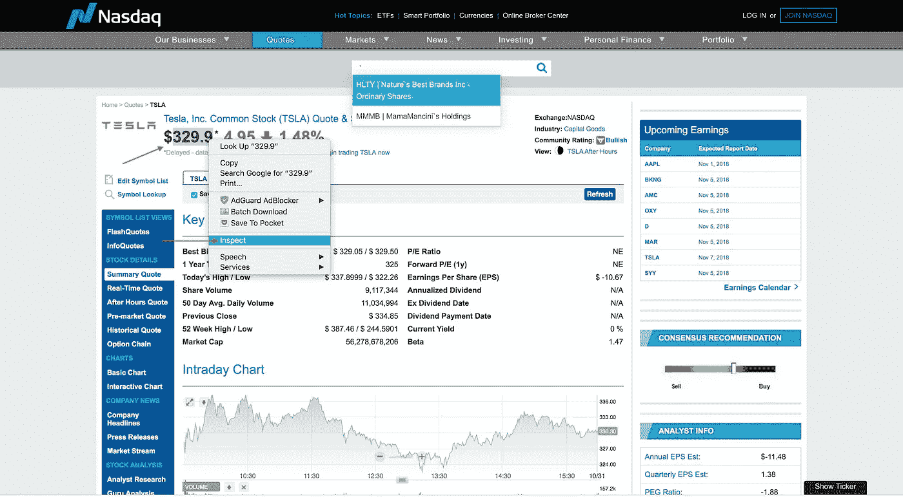
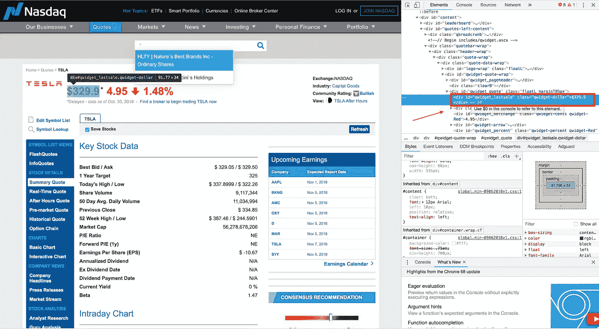

# 使用 ChatterBot 在 Python3 中创建个人聊天机器人(第 5 部分——股票信息)

> 原文：<https://medium.datadriveninvestor.com/creating-a-personal-chatbot-in-python3-using-chatterbot-part-5-stock-information-7eaedd091007?source=collection_archive---------4----------------------->

[](http://www.track.datadriveninvestor.com/1B9E)

## 网页抓取概述

那么到底什么是网络抓取呢？用最通俗的话来说，网络抓取是一种从网页中获取数据的技术。如果你想查看 BeautifulSoup(Python 网络抓取工具)上的文档，你可以在这里查看。

## 所需的 pip 安装

```
pip install beautifulsoup4
pip install google
```

## 寻找一只股票的价格

我们将使用纳斯达克来查找我们股票的最新价格。

[](https://www.datadriveninvestor.com/2019/02/21/best-coding-languages-to-learn-in-2019/) [## 2019 年最值得学习的编码语言|数据驱动的投资者

### 在我读大学的那几年，我跳过了很多次夜游去学习 Java，希望有一天它能帮助我在…

www.datadriveninvestor.com](https://www.datadriveninvestor.com/2019/02/21/best-coding-languages-to-learn-in-2019/) 

*   为了确保我们在 NASDAQ 搜索特定的股票，我们希望在我们的查询中添加一些关键字。我们的搜索格式如下:“纳斯达克股票”+“我们的股票”。我们正在做的是去谷歌搜索，并返回搜索的第一个网页。让我们举一个例子，我们想要找到特斯拉的股票价格。将发送的格式化搜索将是“纳斯达克股票特斯拉”。

这是一种我们将从中抓取数据的页面。给定页面上的任何信息，我们可以检查数据，并查看它在网页代码中的位置。让我们开始有趣的部分。因为我们将处理股票的价格，所以突出显示价格，右键单击并选择 Inspect。



选择“Inspect”后，屏幕上会出现一个标签，显示价格在网页代码中的位置。我们想从这里找到与股票金额相关的类。如果查看突出显示的红色框，可以发现美元类为 **class ="qwidget-dollar"** 。



现在我们知道了需要在网页的什么地方收集数据，让我们转到 python，开始设置一个脚本来查找单个股票信息。让我们一步一步地了解我们将如何设置一切。代码还用步骤进行了注释，因此可能更容易理解。

我们将首先询问我们的用户他们想要找到什么股票的价格。我们将从 NASDAQ 获取价格信息，因此我们将创建一个包含 NASDAQ 和我们股票名称的字符串。我们已经创建了一个方法，返回给它的搜索字符串的第一个 google url。让我们将包含 NASDAQ 和股票的字符串传递给那个方法。一旦我们有了那个 url，我们就打开它，这样我们就可以从那个页面中抓取信息。此时，我们将使用我们在本文前面找到的类变量。让我们找到存在于 **qwidget-dollar** 类中的所有值。完成这些之后，让我们打印该类的文本并将值返回给用户。如果你不能查看代码块，你可以在这里[查看。](https://gist.github.com/Boellis/e1212b280caf67fd0dd516ee37960664)

# 搜索 10 只交易最活跃的股票

寻找 10 只交易最活跃的股票分为两个主要部分。第一部分包括找出纳斯达克交易量最大的 10 只股票，并将它们存储在一个列表中。第二部分几乎与我们之前所做的寻找单个股票的价格相同。在每一页上，我们都在寻找包含我们股票价格的类，并返回值(price)。如果您无法查看代码块，您可以在这里查看[。](https://gist.github.com/Boellis/744de3742c748241e7f0364cf18cb07e)

让我们为聊天机器人添加新功能。在**服务**字典中，让我们从添加搜索单个股票价格的服务开始。让我们设置一个短语，我们希望触发我们的方法，并将其映射到我们希望被触发的方法。让我们将以下内容添加到服务字典中:

当用户输入“搜索一支股票”时，我们将运行该方法来查找一支股票。

```
"search for a stock" : singleStock.findStock
```

当用户输入“搜索活跃股票”时，我们将运行该方法来查找纳斯达克交易最多的 10 只股票的价格。

```
"search for active stocks": activeStocks.findMostActiveStocks
```

完整的 ChatBot.py 文件可以在下面找到，我们的新服务已经添加到服务字典中。如果您无法查看代码块，您可以在[这里查看](https://gist.github.com/Boellis/707c4712fab62ed79e88b7f68719a5ff)。

# 结论

第 5 部分总结了“使用 ChatterBot 在 Python3 中创建个人聊天机器人”系列。我希望你们都已经学到了一些东西，并且能够在自己的项目中实现其中的一些特性。我们已经讨论了一些话题，从语言翻译一直到网络搜集。下一个系列“当 AR 遇到物联网”将推出微软 Hololens、Vuforia、Raspberry Pi 3B+等更多产品。敬请关注，继续学习！