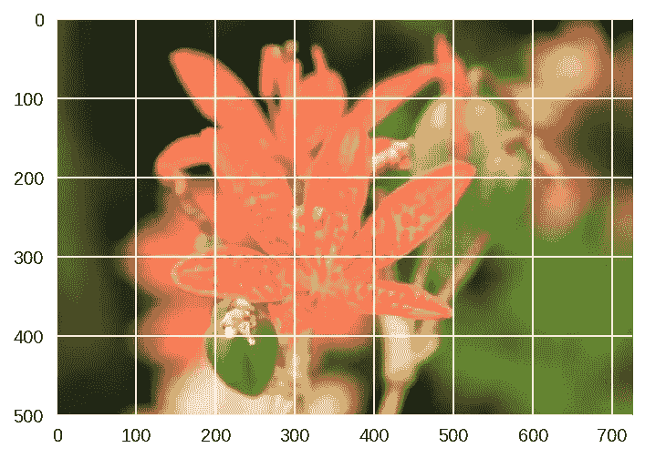

# 创建 PyTorch 图像分类器

> 原文：<https://medium.datadriveninvestor.com/creating-a-pytorch-image-classifier-da9db139ba80?source=collection_archive---------0----------------------->

[](http://www.track.datadriveninvestor.com/1B9E)

Photo by [Joshua Sortino](https://unsplash.com/@sortino?utm_source=medium&utm_medium=referral) on [Unsplash](https://unsplash.com?utm_source=medium&utm_medium=referral)

如何在 PyTorch 中构建一个图像分类器？

*“展望未来，人工智能算法将被纳入越来越多的日常应用中。例如，您可能想要在智能手机应用程序中包含一个图像分类器。要做到这一点，你需要使用一个对成千上万张图像进行训练的深度学习模型，作为整体应用架构的一部分。未来软件开发的很大一部分将使用这些类型的模型作为应用程序的公共部分。”*

*-uda city/脸书 AI PyTorch 深度学习决赛项目*

本文将带您了解使用 PyTorch 创建图像分类器的基本知识，该分类器可以识别不同种类的花。你可以想象在手机应用程序中使用这样的东西，它会告诉你你的相机正在看的花的名字。在实践中，您将训练这个分类器，然后将其导出供您的应用程序使用。

参与脸书 AI PyTorch 奖学金挑战赛最令人兴奋的部分之一是有机会为最终的挑战构建一个图像分类器。给定一些基本准则，我们的目标是通过使用 Udacity 提供的 flower 数据集来构建最准确的分类器。

PyTorch 和神经网络都不熟悉，这是一个巨大的挑战！我把这篇文章放在一起，给那些对所有这些都是全新的，并且正在寻找一个开始的地方的人。这取决于你如何利用这些信息，对其进行改进，并使之成为你自己的信息！*因为我使用 PyTorch 的经历来自 Udacity 挑战赛，所以我的代码在很大程度上借鉴了我们在整个挑战赛课程中学到的代码。反过来，这段代码大量借鉴了 PyTorch 的官方文档。*

Udacity 为 flower 数据集和一个. json 文件提供了一个很好的起点，该文件提供了一种应用类别名称的便捷方式，但项目的其余大部分取决于我们。对于挑战课程，我们提供了一个训练图像文件夹和一个验证图像文件夹，用于我们的程序。这取决于我们是否将这些图像用作训练集和测试集，或者我们是否希望拆分我们的一个文件夹，以便我们可以使用“训练”、“测试”和“验证”集。

在这个项目中，102 个花卉类中的每一个都有一个单独的文件夹。每一朵花都被标记为一个数字，每个编号的目录都包含多个。jpg 文件。

# 我们开始吧！


Photo by [Annie Spratt](https://unsplash.com/@anniespratt?utm_source=medium&utm_medium=referral) on [Unsplash](https://unsplash.com?utm_source=medium&utm_medium=referral)

因为这是一个神经网络，使用的数据集比我的 cpu 在任何合理的时间内都可以处理的大，所以我继续在 Google Colab 中设置了我的图像分类器。Colab 真的很棒，因为它提供免费的 GPU！(如果你是 Google Colab 的新手，[看看这篇文章](https://towardsdatascience.com/getting-started-with-google-colab-f2fff97f594c)！)

因为我使用的是 Colab，所以我需要从导入 PyTorch 开始。除非使用 Colab，否则不需要这样做。)

*****更新！(01/29)*** Colab 现在支持原生 PyTorch！！！你不需要运行下面的代码，但是我把它留在这里，以防有人有任何问题！**

```
#Import PyTorch if using Google Colab
# [http://pytorch.org/](http://pytorch.org/)
from os.path import exists
from wheel.pep425tags import get_abbr_impl, get_impl_ver, get_abi_tag
platform = '{}{}-{}'.format(get_abbr_impl(), get_impl_ver(), get_abi_tag())
cuda_output = !ldconfig -p|grep cudart.so|sed -e 's/.*\.\([0-9]*\)\.\([0-9]*\)$/cu\1\2/'
accelerator = cuda_output[0] if exists('/dev/nvidia0') else 'cpu'!pip install -q [http://download.pytorch.org/whl/{accelerator}/torch-0.4.1-{platform}-linux_x86_64.whl](http://download.pytorch.org/whl/{accelerator}/torch-0.4.1-{platform}-linux_x86_64.whl) torchvision
import torch
```

然后，在枕头出了点问题之后(在 Colab 是 buggy！)，我只是继续运行这个:

```
import PIL
print(PIL.PILLOW_VERSION)
```

如果您得到低于 5.3.0 的任何内容，请使用“运行时”下的下拉菜单“重新启动运行时”并再次运行此单元。你应该可以走了！

您将希望在这个项目中使用 GPU，这在 Colab 上设置起来非常简单。您只需进入“运行时”下拉菜单，选择“更改运行时类型”，然后在硬件加速器下拉菜单中选择“GPU”！


然后我喜欢跑步

```
# check if GPU is available
train_on_gpu = torch.cuda.is_available()if not train_on_gpu:
    print('Bummer!  Training on CPU ...')
else:
    print('You are good to go!  Training on GPU ...')
```

只是为了确保它的工作。然后我跑

```
device = torch.device("cuda:0" if torch.cuda.is_available() else "cpu")
```

来定义设备。

之后，我导入了文件。有很多方法可以做到这一点，包括安装你的谷歌驱动器，如果你有你的数据集存储在那里，这实际上非常简单！即使我最终没有发现这是最有用的解决方案，我还是把它包括在下面，只是因为它非常简单和有用。

```
from google.colab import drive
drive.mount('/content/gdrive')
```

然后你会看到一个链接，点击它，允许访问，复制弹出的代码，粘贴到框中，点击回车，你就可以开始了！如果你没有在左边的边框中看到你的驱动器，只需点击“刷新”,它就会显示出来。

(运行单元，单击链接，复制页面上的代码，将其粘贴到框中，按 enter 键，当您成功安装驱动器时，您会看到这一点):


其实超级简单！

但是，如果您更愿意下载一个共享的 zip 文件链接(对于这个项目来说，这样会更容易、更快)，您可以使用:

```
!wget 
!unzip
```

例如:

```
!wget -cq [https://s3.amazonaws.com/content.udacity-data.com/courses/nd188/flower_data.zip](https://s3.amazonaws.com/content.udacity-data.com/courses/nd188/flower_data.zip)
!unzip -qq flower_data.zip
```

这将在几秒钟内为您提供 Udacity 的花卉数据集！

(如果你上传的是小文件，你可以用一些简单的代码直接上传。然而，如果你愿意，如果你不想运行一些简单的代码来获取一个本地文件，你也可以只去屏幕的左侧，并点击“上传文件”。)


加载数据后，我导入了我想要使用的库:

```
# Import resources
%matplotlib inline
%config InlineBackend.figure_format = 'retina'import time
import json
import copyimport matplotlib.pyplot as plt
import seaborn as sns
import numpy as np
import PILfrom PIL import Image
from collections import OrderedDictimport torch
from torch import nn, optim
from torch.optim import lr_scheduler
from torch.autograd import Variable
import torchvision
from torchvision import datasets, models, transforms
from torch.utils.data.sampler import SubsetRandomSampler
import torch.nn as nn
import torch.nn.functional as F
```

*现在，我将从这里开始省去我所做的具体选择，以帮助您做出自己的决定。要有创意！在我添加了“你的选择”的任何地方输入你的选择，玩得开心点！

接下来是数据转换！为了帮助程序尽可能多地学习，您需要确保在训练集上使用几种不同类型的变换。您希望通过对翻转、旋转和裁剪的图像进行训练来创建更健壮的模型。(提供平均值和标准偏差是为了在将图像值传递到我们的网络之前对其进行归一化，但是也可以通过查看图像张量的不同维度的平均值和标准偏差值来找到它们。)[官方文档](https://pytorch.org/docs/stable/torchvision/transforms.html)在这里非常有用！对于我的图像分类器，我保持简单:

```
data_transforms = {
    'train': transforms.Compose([
        transforms.RandomRotation(YOUR CHOICE),
        transforms.RandomResizedCrop(224),
        transforms.RandomHorizontalFlip(),
        transforms.ToTensor(),
        transforms.Normalize([0.485, 0.456, 0.406], 
                             [0.229, 0.224, 0.225])
    ]),
    'valid': transforms.Compose([
        transforms.Resize(256),
        transforms.CenterCrop(224),
        transforms.ToTensor(),
        transforms.Normalize([0.485, 0.456, 0.406], 
                             [0.229, 0.224, 0.225])
    ])
}# TODO: Load the datasets with ImageFolder
image_datasets = {x: datasets.ImageFolder(os.path.join(data_dir, x),
                                          data_transforms[x])
                  for x in ['train', 'valid']}# TODO: Using the image datasets and the trainforms, define the dataloaders
batch_size = YOUR CHOICE
dataloaders = {x: torch.utils.data.DataLoader(image_datasets[x], batch_size=batch_size,
                                             shuffle=True, num_workers=4)
              for x in ['train', 'valid']}class_names = image_datasets['train'].classesdataset_sizes = {x: len(image_datasets[x]) for x in ['train', 'valid']}
class_names = image_datasets['train'].classes
```

正如您在上面看到的，我还在上面的代码中定义了批处理大小、数据加载器和类名。

为了快速查看数据并检查我的设备，我运行了:

```
print(dataset_sizes)
print(device)**{'train': 6552, 'valid': 818}**
**cuda:0**
```

接下来，我们需要从标签号和实际的花名进行一些映射。Udacity 提供了一个 json 文件来简单地完成这个映射。

```
# Label mapping
with open('cat_to_name.json', 'r') as f:
    cat_to_name = json.load(f)
```

测试数据加载器是个好主意，所以我运行了:

```
images, labels = next(iter(dataloaders['train']))
images.size()images, labels = next(iter(dataloaders['train']))
rand_idx = np.random.randint(len(images))
# print(rand_idx)
print("label: {}, class: {}, name: {}".format(labels[rand_idx].item(),
                                               class_names[labels[rand_idx].item()],
                                               cat_to_name[class_names[labels[rand_idx].item()]]))
```

现在它开始变得更加令人兴奋！在过去的几年中，一些比我们大多数人更有资格在计算机视觉问题中重用的人已经创建了许多模型。 [PyTorch 使得加载预训练模型并在其上构建变得容易](https://pytorch.org/docs/stable/torchvision/models.html)，这正是我们在这个项目中要做的。型号的选择完全由你决定！

一些最受欢迎的预训练模型，雷斯网，AlexNet 和 VGG 来自 ImageNet 的挑战。这些预先训练的模型允许其他人快速获得计算机视觉的前沿结果，而不需要如此大量的计算机能力、耐心和时间。我实际上用 DenseNet 有很好的效果，决定用 DenseNet161，它相对较快地给了我非常好的效果！(请不要因为对我有效就随便用这个！我只是把它作为一个例子。

您可以通过运行以下命令来快速设置

```
model = models.densenet161(pretrained=True)
```

但是让您自己选择模型、优化器和调度器可能更有趣。为了在建筑方面建立一个选择，我跑了

```
model_name = 'densenet' #vgg
if model_name == 'densenet':
    model = models.densenet161(pretrained=True)
    num_in_features = 2208
    print(model)
elif model_name == 'vgg':
    model = models.vgg19(pretrained=True)
    num_in_features = 25088
    print(model.classifier)
else:
    print("Unknown model, please choose 'densenet' or 'vgg'")
```

这允许您快速建立替代模型。

之后，您可以开始构建您的分类器，使用最适合您的参数。我继续建造

```
# Create classifier
for param in model.parameters():
    param.requires_grad = Falsedef build_classifier(num_in_features, hidden_layers, num_out_features):

    classifier = nn.Sequential()
    if hidden_layers == None:
        classifier.add_module('fc0', nn.Linear(num_in_features, 102))
    else:
        layer_sizes = zip(hidden_layers[:-1], hidden_layers[1:])
        classifier.add_module('fc0', nn.Linear(num_in_features, hidden_layers[0]))
        classifier.add_module('relu0', nn.ReLU())
        classifier.add_module('drop0', nn.Dropout(YOUR CHOICE)) YOUR CHOICE: how many layers do you want? for i, (h1, h2) in enumerate(layer_sizes):
            classifier.add_module('fc'+str(i+1), nn.Linear(h1, h2))
            classifier.add_module('relu'+str(i+1), nn.ReLU())
            classifier.add_module('drop'+str(i+1), nn.Dropout(.5))
        classifier.add_module('output', nn.Linear(hidden_layers[-1], num_out_features))

    return classifier
```

这允许一个简单的方法来改变我正在使用的隐藏层的数量，以及快速调整辍学率。您可以决定添加额外的 relu 和 dropout 层，以便更好地完善您的模型(提示，提示...).

接下来，您需要训练您的分类器参数。我决定确保在冻结特征参数的同时，只在这里训练分类器参数。通过优化器、标准和调度器，您可以随心所欲地发挥创造力。标准是用于评估模型拟合的方法，优化器是用于更新权重的优化方法，调度器提供不同的方法来调整优化期间使用的学习速率和步长。您甚至可能不想指定一个调度程序！

尝试尽可能多的选项和组合，看看什么能给你最好的结果。你可以在这里看到所有的官方文件。我建议你好好看看，自己决定要用什么！你在这里没有无限的选择，但感觉确实如此！

```
hidden_layers = YOUR CHOICEclassifier = build_classifier(num_in_features, hidden_layers, 102)
print(classifier)if model_name == 'densenet':
    model.classifier = classifier
    criterion = YOUR CHOICE
    optimizer = YOUR CHOICE 
    sched = YOUR CHOICE
elif model_name == 'vgg':
    model.classifier = classifier
    criterion = YOUR CHOICE
    optimizer = YOUR CHOICE)
    sched = YOUR CHOICE
else:
    pass
```

现在是时候训练你的模型了！

```
# Adapted from [https://pytorch.org/tutorials/beginner/transfer_learning_tutorial.html](https://pytorch.org/tutorials/beginner/transfer_learning_tutorial.html)def train_model(model, criterion, optimizer, sched, num_epochs=YOUR CHOICE):
    since = time.time()best_model_wts = copy.deepcopy(model.state_dict())
    best_acc = 0.0for epoch in range(num_epochs):
        print('Epoch {}/{}'.format(epoch+1, num_epochs))
        print('-' * 10)# Each epoch has a training and validation phase
        for phase in ['train', 'valid']:
            if phase == 'train':
                model.train()  # Set model to training mode
            else:
                model.eval()   # Set model to evaluate moderunning_loss = 0.0
            running_corrects = 0# Iterate over data.
            for inputs, labels in dataloaders[phase]:
                inputs = inputs.to(device)
                labels = labels.to(device)# zero the parameter gradients
                optimizer.zero_grad()# forward
                # track history if only in train
                with torch.set_grad_enabled(phase == 'train'):
                    outputs = model(inputs)
                    _, preds = torch.max(outputs, 1)
                    loss = criterion(outputs, labels)# backward + optimize only if in training phase
                    if phase == 'train':
                        sched.step()
                        loss.backward()
                        optimizer.step()# statistics
                running_loss += loss.item() * inputs.size(0)
                running_corrects += torch.sum(preds == labels.data)epoch_loss = running_loss / dataset_sizes[phase]
            epoch_acc = running_corrects.double() / dataset_sizes[phase]print('{} Loss: {:.4f} Acc: {:.4f}'.format(
                phase, epoch_loss, epoch_acc))# deep copy the model
            if phase == 'valid' and epoch_acc > best_acc:
                best_acc = epoch_acc
                best_model_wts = copy.deepcopy(model.state_dict())print()time_elapsed = time.time() - since
    print('Training complete in {:.0f}m {:.0f}s'.format(
        time_elapsed // 60, time_elapsed % 60))
    print('Best val Acc: {:4f}'.format(best_acc))#load best model weights
    model.load_state_dict(best_model_wts)

    return modelepochs = YOUR CHOICE
model.to(device)
model = train_model(model, criterion, optimizer, sched, epochs)
```

我希望能够轻松地监控我的纪元，并在我的模型运行时跟踪经过的时间。上面的代码两者都允许，而且效果还不错！您可以看到，该模型正在快速学习，到 epoch 6 时，验证集的准确性很快达到了 96%以上！

```
Epoch 1/YOUR CHOICE
----------
train Loss: 2.4975 Acc: 0.4737
valid Loss: 1.0240 Acc: 0.7714

Epoch 2/
----------
train Loss: 0.8445 Acc: 0.8364
valid Loss: 0.4739 Acc: 0.9071

Epoch 3/
----------
train Loss: 0.5265 Acc: 0.8915
valid Loss: 0.3285 Acc: 0.9218

Epoch 4/
----------
train Loss: 0.4149 Acc: 0.9061
valid Loss: 0.2538 Acc: 0.9413

Epoch 5/
----------
train Loss: 0.3424 Acc: 0.9243
valid Loss: 0.2326 Acc: 0.9462

Epoch 6/
----------
train Loss: 0.2954 Acc: 0.9313
valid Loss: 0.1869 Acc: 0.9621

...

Training complete in 67m 43s
Best val Acc: 0.973105
```

使用我决定使用的参数运行我选择的历元数只需要一个多小时，精度看起来不错！

现在是评估的时候了，所以您需要对您的测试(有效)集运行验证:

```
model.eval()accuracy = 0for inputs, labels in dataloaders['valid']:
    inputs, labels = inputs.to(device), labels.to(device)
    outputs = model(inputs)

    # Class with the highest probability is our predicted class
    equality = (labels.data == outputs.max(1)[1])# Accuracy is number of correct predictions divided by all predictions
    accuracy += equality.type_as(torch.FloatTensor()).mean()

print("Test accuracy: {:.3f}".format(accuracy/len(dataloaders['valid'])))
```

现在重要的是保存你的检查点。

```
model.class_to_idx = image_datasets['train'].class_to_idxcheckpoint = {'input_size': 2208,
              'output_size': 102,
              'epochs': epochs,
              'batch_size': YOUR CHOICE,
              'model': models.densenet161(pretrained=True),
              'classifier': classifier,
              'scheduler': sched,
              'optimizer': optimizer.state_dict(),
              'state_dict': model.state_dict(),
              'class_to_idx': model.class_to_idx
             }

torch.save(checkpoint, 'checkpoint.pth')
```

您不必保存所有的参数，但是我在这里将它们作为一个例子。这个检查点专门保存具有预训练的 densenet161 架构的模型，但是如果您想要保存具有二选一选项的检查点，您完全可以这样做。只需调整输入大小和型号。

然后，您可以加载您的检查点。您可以通过运行以下命令来检查您的密钥

```
ckpt = torch.load('checkpoint.pth')
ckpt.keys()
```

如果您要将模型导入到 Udacity 工作空间中，这是您想要导入库的地方，如果您还没有定义图像大小，也要确保定义图像大小！输入您的进口，也

```
image_size = 224
# Values you used for normalizing the images. Default here are for
# pretrained models from torchvision.
norm_mean = [0.485, 0.456, 0.406]
norm_std = [0.229, 0.224, 0.225]
```

现在加载并重建您的模型！

```
def load_checkpoint(filepath):
    checkpoint = torch.load(filepath)
    model = checkpoint['model']
    model.classifier = checkpoint['classifier']
    model.load_state_dict(checkpoint['state_dict'])
    model.class_to_idx = checkpoint['class_to_idx']
    optimizer = checkpoint['optimizer']
    epochs = checkpoint['epochs']

    for param in model.parameters():
        param.requires_grad = False

    return model, checkpoint['class_to_idx']model, class_to_idx = load_checkpoint('checkpoint.pth')
```

如果您在实际的 Udacity 工作区中加载检查点，那么您需要在这里做一些更改。您希望将所有内容都放在一个单元格中，并做一些小的更改。你需要类似这样的东西:

```
image_size = 224
# Values you used for normalizing the images. Default here are for
# pretrained models from torchvision.
norm_mean = [0.485, 0.456, 0.406]
norm_std = [0.229, 0.224, 0.225]device = torch.device("cuda:0" if torch.cuda.is_available() else "cpu")# TODO: Write a function that loads a checkpoint and rebuilds the model
def load_checkpoint(filepath, map_location='cpu'):
    checkpoint = torch.load(filepath)
    model = checkpoint['model']
    model.classifier = checkpoint['classifier']
    model.load_state_dict(checkpoint['state_dict'], strict=False)
    model.class_to_idx = checkpoint['class_to_idx']
    optimizer = checkpoint['optimizer']
    epochs = checkpoint['epochs']

    for param in model.parameters():
        param.requires_grad = False

    return model, checkpoint['class_to_idx']model, class_to_idx = load_checkpoint('/home/workspace/checkpoint.pth')
```

这很重要:你看到上面写着

```
map_location='cpu'
```

和

```
strict=False
```

?

你一定要包括那些！

不是开玩笑。您需要在 Udacity 工作区中使用它们！

另外，确保你的道路是正确的。正如你在上面看到的，我的是

```
model, class_to_idx = load_checkpoint('/home/workspace/checkpoint.pth')
```

您真的需要有正确的路径，否则 Udacity 将无法找到并加载您的检查点。

此外，我们 PyTorch challenge Slack 组的@Antje 说:“对我来说，直到我使用 torch 0 . 4 . 0 版本而不是 1.0.0 进行训练时，它才起作用。”

现在测试代码并开始您的项目！我们的结果是严格的通过/失败，所以如果你通过了，你就完了！我们无法知道我们的准确性(除了非官方排行榜和 Slack 上的自我报告)，这令人抓狂，因为正是我们的准确性将决定我们是否进入第二阶段！

坐好，交叉手指，等待。

(还是有困扰？我写了一篇文章，介绍了如何将您的检查点加载到 Udacity 。)

想在自己的笔记本里一直走下去？做一些图像预处理和推理进行分类是个不错的主意！继续定义您的图像路径并打开一个图像:

```
image_path = 'flower_data/valid/102/image_08006.jpg'
img = Image.open(image_path)
```

处理您的图像并查看处理后的图像:

```
def process_image(image):
    ''' Scales, crops, and normalizes a PIL image for a PyTorch model,
        returns an Numpy array
    '''
    # TODO: Process a PIL image for use in a PyTorch model
    # tensor.numpy().transpose(1, 2, 0)
    preprocess = transforms.Compose([
        transforms.Resize(256),
        transforms.CenterCrop(224),
        transforms.ToTensor(),
        transforms.Normalize(mean=[0.485, 0.456, 0.406], 
                             std=[0.229, 0.224, 0.225])
    ])
    image = preprocess(image)
    return imagedef imshow(image, ax=None, title=None):
    """Imshow for Tensor."""
    if ax is None:
        fig, ax = plt.subplots()

    # PyTorch tensors assume the color channel is the first dimension
    # but matplotlib assumes is the third dimension
    image = image.numpy().transpose((1, 2, 0))

    # Undo preprocessing
    mean = np.array([0.485, 0.456, 0.406])
    std = np.array([0.229, 0.224, 0.225])
    image = std * image + mean

    # Image needs to be clipped between 0 and 1 or it looks like noise when displayed
    image = np.clip(image, 0, 1)

    ax.imshow(image)

    return axwith Image.open('flower_data/valid/102/image_08006.jpg') as image:
    plt.imshow(image)model.class_to_idx = image_datasets['train'].class_to_idx
```



创建预测函数:

```
def predict2(image_path, model, topk=5):
    ''' Predict the class (or classes) of an image using a trained deep learning model.
    '''

    # TODO: Implement the code to predict the class from an image file
    img = Image.open(image_path)
    img = process_image(img)

    # Convert 2D image to 1D vector
    img = np.expand_dims(img, 0)

    img = torch.from_numpy(img)

    model.eval()
    inputs = Variable(img).to(device)
    logits = model.forward(inputs)

    ps = F.softmax(logits,dim=1)
    topk = ps.cpu().topk(topk)

    return (e.data.numpy().squeeze().tolist() for e in topk)
```

一旦你可以得到正确格式的图像，你就可以编写一个函数来用你的模型进行预测。一种常见的做法是预测前 5 个左右(通常称为前 KK)最有可能的类。您需要计算类概率，然后找到 KK 最大值。

要获得张量中的顶部 KK 最大值，请使用 k.topk()。该方法返回最高的 k 个概率和对应于这些类的那些概率的指数。您需要使用 class_to_idx 将这些索引转换为实际的类标签，您可以将它添加到模型中，或者从用于加载数据的 Image 文件夹中进行转换。请确保反转字典，这样您也可以获得从索引到类的映射。

这个方法应该采用一个到图像和模型检查点的路径，然后返回概率和类。

```
img_path = 'flower_data/valid/18/image_04252.jpg'
probs, classes = predict2(img_path, model.to(device))
print(probs)
print(classes)
flower_names = [cat_to_name[class_names[e]] for e in classes]
print(flower_names)
```

我对我的模特的表现非常满意！

```
[0.9999195337295532, 1.4087702766119037e-05, 1.3897360986447893e-05, 1.1400215043977369e-05, 6.098791800468462e-06]
[12, 86, 7, 88, 40]
['peruvian lily', 'desert-rose', 'king protea', 'magnolia', 'sword lily']
```

基本上，我指定的图像几乎 100%可能是秘鲁百合！想看看吗？尝试使用 matplotlib 在条形图中绘制前五类的概率以及输入图像:

```
def view_classify(img_path, prob, classes, mapping):
    ''' Function for viewing an image and it's predicted classes.
    '''
    image = Image.open(img_path)fig, (ax1, ax2) = plt.subplots(figsize=(6,10), ncols=1, nrows=2)
    flower_name = mapping[img_path.split('/')[-2]]
    ax1.set_title(flower_name)
    ax1.imshow(image)
    ax1.axis('off')

    y_pos = np.arange(len(prob))
    ax2.barh(y_pos, prob, align='center')
    ax2.set_yticks(y_pos)
    ax2.set_yticklabels(flower_names)
    ax2.invert_yaxis()  # labels read top-to-bottom
    ax2.set_title('Class Probability')view_classify(img_path, probs, classes, cat_to_name)
```

您应该会看到类似这样的内容:


我不得不说，我对此很满意！我建议测试一些其他的图像，看看你对各种图像的预测有多接近。

现在是时候做一个你自己的模型了，让我知道效果如何！


Photo by [Pez González](https://unsplash.com/@pezgonzalez?utm_source=medium&utm_medium=referral) on [Unsplash](https://unsplash.com?utm_source=medium&utm_medium=referral)

你是否完成了一个深度学习或机器学习模型，但不知道接下来该怎么处理？

**为什么不把它部署到互联网上？**

把你的模型拿出来，让每个人都能看到！

[看看这篇文章，学习如何用 Flask](https://heartbeat.fritz.ai/brilliant-beginners-guide-to-model-deployment-133e158f6717) 部署你的机器学习模型！