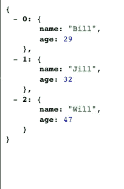
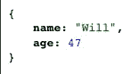
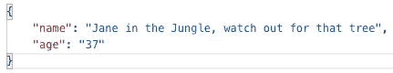

# 用 Node.js 和 Express 创建 RESTful API

> 原文：<https://medium.datadriveninvestor.com/creating-a-restful-api-with-node-js-and-express-17af18ea92e8?source=collection_archive---------1----------------------->

对于我的 mod 3 项目，在熨斗学校的新兵训练营呆了 8 周后，我决定拓展业务。虽然我已经使用 Ruby on Rails 构建了许多 API，但是我没有使用 Node 的经验。至此，我已经使用 Javascript 大约 2 周了，我开始应对新的挑战，用 Node 构建一个 API。在这篇博客文章中，我将介绍建立一个具有完整 CRUD 操作的基本 RESTful API 的步骤。希望，这将有助于某人导航节点水域，并从我的经验中学习！


Node.js Logo

为了测试请求，我将使用 Postman，这是一个测试各种 http 请求的非常有用的工具，我强烈推荐它。好了，我们走吧。首先，我们需要初始化一个 npm 项目。转到您选择的文件夹，在您的终端中键入 ***npm init*** 创建一个新的 package.json。

```
npm init
```

在创建了一个新的 package.json 之后，我们将安装并保存几个包，然后我将简要概述每个包将为我们做些什么。

```
npm install --save express body-parser nodemon
```

Express 是一个功能强大的通用软件包。它将允许我们为 http 请求设置中间件，以及设置我们的路由。

[](https://www.datadriveninvestor.com/2019/02/25/6-alternatives-to-the-yahoo-finance-api/) [## 雅虎财经 API |数据驱动投资者的 6 种替代方案

### 长期以来，雅虎金融 API 一直是许多数据驱动型投资者的可靠工具。许多人依赖于他们的…

www.datadriveninvestor.com](https://www.datadriveninvestor.com/2019/02/25/6-alternatives-to-the-yahoo-finance-api/) 

Body-Parser 做的正是它被称为的事情，它解析传入 post 请求的主体。

Nodemon 不是必需的，但是当我们保存文件时，它会重启服务器。这在项目过程中节省了大量的时间，因为我们不需要不停地手动停止和启动服务器。

厉害！现在我们已经安装了包，让我们在主目录中创建一个名为“app.js”的新文件。在 app.js 内部，我们需要 require express 和我们的中间件。

```
const express = require('express')
const app = express()
const bodyParser = require('body-parser')
```

现在我们需要我们的包并调用了 express，我们可以使用 app 访问所有的 express 方法。

在设置我们的路由之前，我们需要告诉 app 使用 body-parser。Body parser 有两个我们需要调用的方法:

```
app.use(bodyParser.urlencoded())
app.use(bodyParser.json())
```

app.use 允许中间件访问请求和响应对象，以及下一个函数。这两个方法通过 request 对象使任何传入的文本对我们可用。现在我们正在使用中间件，让我们告诉我们的应用程序监听端口上的任何 http 请求。

```
const port = process.env.PORT || 3000app.listen(port, () => {
    console.log(`Listening on port ${port}...`)})
```

如果您不打算托管您的 api，那么第一行是不必要的，您可以简单地硬编码您选择的端口。但是，如果您将 API 部署到 Heroku 之类的平台，则会为您选择一个端口，该端口将使用 process.env.PORT 进行设置。太棒了！现在我们已经建立了 API 的框架，让我们向 package.json 添加一个脚本来启动我们的服务器。

```
"scripts": { "start": "nodemon app.js"}
```

现在，我们可以通过在终端中键入 *npm start* 来启动我们的服务器，当我们对文件进行任何更改时，它将重新启动。现在我们已经启动并运行了我们的服务器，让我们设置一些路由。

```
app.get('/', (req, res) => {
     res.send('working')})
```

酷，现在如果我们向 [http://localhost:3000，](http://localhost:3000,)发送一个 GET 请求，我们应该会得到文本‘working’。

厉害！现在我们知道我们的服务器工作正常，让我们设置 CRUD 操作。对于这个例子，我们将使用用户。为了模拟数据库，让我们将一些用户“播种”到一个全局对象中，并创建一个模拟的“id”。

```
const users = { 0: {name: 'Bill', age: 29}, 1: {name: 'Jill', age: 32}, 2: {name: 'Will', age: 47}}let id = 3
```

太棒了，首先，让我们制定一条路线来查看我们所有的用户。

```
app.get('/users', (req, res) => { res.json(users) })
```

现在，如果我们向[http://localhost:3000/users](http://localhost:3000/users)发送一个 GET 请求，我们应该会看到“数据库”中的所有用户。



太棒了，在我们设置读取操作的同时，让我们创建一条获取单个用户的路线。

```
app.get('/users/:id', (req, res) => {
     if (users[req.params.id]){
           res.json(users[req.params.id])
     } else {
           res.json('User not found')
     }
})
```

通过在初始路线后指定/:id，我们可以通过" *req.params.id"* 访问参数。通过访问 http://localhost:3000/2 ，我们应该看到 id 为 2 的用户。



太好了！现在我们可以看到我们的用户，让我们设置我们的创建路线。

```
app.put('/users', (req, res) => {
        if (req.body.name && req.body.age){
             const {name, age} = req.body
             users[id] = {name, age}
             res.send(`Successfully created user with id: ${id}`)
             id++ } else {
             res.send('Failed to create user') }})
```

现在，如果我们向[http://localhost:3000/users](http://localhost:3000/users,)发出一个带有姓名和年龄的 PUT 请求，我们应该会得到“成功创建的用户”以及发送回来的用户 id，然后我们会为下一个用户增加 id。否则，如果缺少属性，用户将不会被添加到我们的对象中。


successful PUT request


invalid PUT request

完美！现在我们可以创建一个用户了，让我们创建一个路由，使用他们唯一的 id 来更新他们的属性。

```
app.patch('/users', (req, res) => { if (users[req.body.id]){ let user = users[req.body.id] user.name = req.body.name || user.name user.age = req.body.age || user.age res.json(user) } else { res.json('Failed to update or find user with that id.') }})
```

太好了，现在如果我们使用用户 id 进行补丁请求，我们可以更新他们的姓名和/或年龄，否则如果我们的身体缺少姓名或年龄，我们将保留这些属性。最后，我们用更新后的用户进行响应。



successful PATCH request


invalid PATCH request

太棒了。我们需要的最后一个 CRUD 操作是删除用户的能力，让我们来实现它。

```
app.delete('/users', (req, res) => {
     if (users[req.body.id]){
         delete users[req.body.id] res.send(`Deleted user with ID ${req.body.id}`) } else {
          res.send(`Failed to find user with ID ${req.body.id}`)
     }})
```

现在我们应该能够通过用户 id 来删除用户了。


successful DELETE request


invalid DELETE request

厉害！现在我们有了一个全功能的 Node.js API，我们可以创建一个用户，查看所有用户以及单个用户，更新一个用户，最后删除一个用户。

学习 Node.js 和 Express 的基础知识是一个非常棒的过程，我将继续改进并了解更多关于 Node 的精彩世界。感谢您花时间分享这些知识！喝杯咖啡休息一下，这是你应得的。


Photo by [rawpixel.com](https://www.pexels.com/@rawpixel?utm_content=attributionCopyText&utm_medium=referral&utm_source=pexels) from [Pexels](https://www.pexels.com/photo/top-view-photo-of-ceramic-mugs-filled-with-coffees-1415555/?utm_content=attributionCopyText&utm_medium=referral&utm_source=pexels)