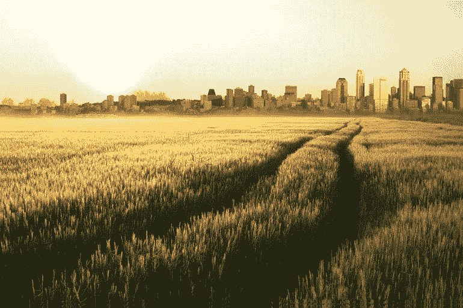
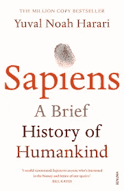
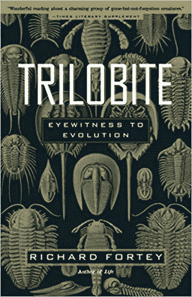
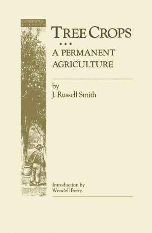
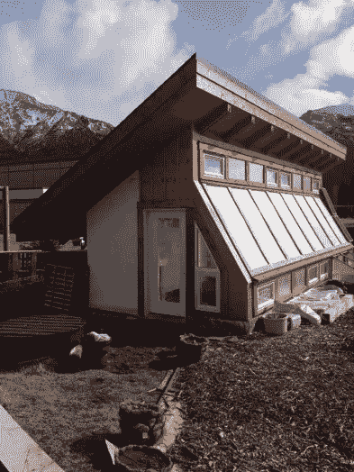

# 在新的不稳定天气模式下创造稳定的食物供应

> 原文：<https://medium.datadriveninvestor.com/creating-a-stable-food-supply-with-erratic-weather-d9f4af18e5c6?source=collection_archive---------14----------------------->

今年，我们在地图上看到了整个加拿大的气温。这给我们的花园以及整个加拿大的农场造成了巨大的破坏。从宏观层面来看，如果这种情况变得更加频繁，它可能会开始影响整体食品供应。在阿尔伯塔省南部，今年农场无法从地里收获谷物。艾伯特气象站这里的不稳定天气表现为生长季节的缩短。这是以春天冰冻地面上的雪的形式出现的，那时我们预计会下雨，秋天会下雪，那时我们预计会干燥。所有这些都让大大小小的种植者面临失败，但事情本不应该是这样的。

问题的核心是，人类依赖的作物生产需要一个可预测的、稳定的、可变性很小的气候。不幸的是，对于我们种植的作物来说，自然/天气是一个不断变化的巨大系统；生态学家称之为动态稳定性。这意味着大自然试图保持一种波动的停滞状态，这也是年复一年这种不稳定天气的部分原因。如果气候开始变得不稳定，这种种植模式将面临严重的压力，我们将需要比基因操纵更复杂的手段来确保稳定的食物供应。这篇文章是关于我们可以用来管理这种不确定性的一些方法。

## 当前食物系统的主要驱动力

在过去的 12，000 年里，人类一直以各种形式和规模在这个星球上从事园艺活动(我把园艺比喻为所有的食物生产)，并受益于上一个冰河时代后的解冻和相对稳定，年轻的 Dryas。

目前对考古记录的解释表明，人类在上一个冰河时期后不久出于需要开始创新农业方法。学者尤瓦尔·胡拉里在《智人》一书中写道，一些考古学家认为，由于粮食不安全，全球人口“低至 1000 人”，而粮食不安全是农业发展的主要驱动力之一。根据你的信念和过去十年的观察，我们可能会遇到类似的困境；然而，我们的人口比 1000 人多得多，所以赌注要高一点。即使你不认同气候变化，以一种不考虑地质时间的方式种植粮食就像玩俄罗斯轮盘赌。地质记录告诉我们，气候总是在变化，这些变化可能相当极端。如果人类实验继续下去是必要的，我们难道不应该考虑到地质智能来进行园艺吗？

## 园艺地球的新方法

考虑到地质学，我们应该灌输给人类食物系统设计的主要信息是适应性。对深层时间的研究表明这是真的，所以这应该是设计我们的小型和大型食物系统的主要设计约束之一。

顺便说一句，如果你要建立一个无法应对气候波动的非适应性食物系统，你会；

*   种植数百万英亩的单一作物田
*   饲养食草动物，以单一作物田种植的谷物为食
*   允许跨国公司拥有过去 40 亿年产生的所有基因变异，这样他们就可以把它投资到他们自己的种子中
*   将杂草视为一种威胁，而不是试图增加多样性和适应变化天气的自然
*   鼓励全球大多数人口住在杂货店外，而不是自己种植食物
*   将全球农民人口减少到 3%以下
*   从多年生植物转变为一年生植物
*   通过使用化肥、农用化学品和耕作使土壤中的碳矿化
*   建立一个食品体系，其中大部分产品是玉米、大豆和小麦三种作物的衍生物，所有这些作物都需要气候稳定

因此，一个有弹性和适应性的食物系统将与此相反，在一个比我们目前所处的气候更不稳定的气候条件下，它将有更好的机会提供食物。对我来说，你是否相信气候变化并不重要:根据大量的地质学资料，我们知道气候会及时变化，所以为什么不现在就建立一个受益于这种不可避免性并从中繁荣发展的食物系统呢？

因此，适应性食物系统将

*   以类似于[加布·布朗](https://vimeo.com/80518559)的方式种植数百万英亩的多种作物
*   饲养食草动物，将所有类型的植物转化为蛋白质和脂肪，包括杂草。
*   要求生命公司按照开放源代码软件运动的例子，开放他们创造的任何基因工程种子，并要求在新种子发布前谨慎使用科学方法。
*   将杂草视为学习的机会和信号，向我们展示自然是如何适应的
*   鼓励回归后院和社区园艺。改变杂货店作为后备措施而不是主要食物来源的观点。
*   制定政策，鼓励农民回归土地，奖励适应气候变化的特定耕作方式
*   鼓励将多年生草、草本植物、福布斯、灌木和树木整合到一年生系统中。
*   激励经营类似于 Gabe Browns 农场的农业实践
*   建立一个鼓励多样化的食品体系

J.Russell Smith does a great job of describing what a new type of agriculture based on similar concepts described above might look like.

## 抵御风暴的最后一招

Canmore Community Strawbale Passive Solar Greenhouse

这篇文章的想法来自于我最近收到的大量关于温室的咨询。这些温室调查都有一个共同点，气候适应。看来，目前从事园艺或意识到气候变化的人们已经开始认识到，他们可能需要全年保护一些更敏感的作物，以确保丰收。有趣的是，这些潜在客户将这个想法与温室联系起来。温室代表了除上述之外的另一种选择，可以通过控制空间内的天气而增加气候适应性，而不管外面的天气如何。房屋制造商可以开始将像被动式太阳能温室这样的食品设备作为房屋建筑的一部分。同样是这些开发商，社区娱乐设施、社区中心和新分区的游乐场可以建造更大规模的被动式太阳能温室，作为气候适应性分区内的社区“设施”。这些更大的温室可以作为当地的杂货店，用来储存草药、蔬菜，甚至一些潜在的蛋白质。我们从第二次世界大战中得知，战争期间，胜利菜园生产了后院近 50%的食物。在后院或社区增加一个温室将同时增加粮食安全和气候保险。

## 被动式太阳能温室设计免费介绍

我们最近推出了我们的[被动式太阳能温室设计免费介绍](https://www.smallfarmacademy.com/a/10115/LAFiALDo)。这是一个 30 分钟的视频，以简单易懂的方式解释了温室设计的过程。如果你有兴趣参加我们的基础或综合温室设计课程，点击[这里。](https://vergepermaculture.ca/passive-solar-greenhouse/)

**Rob 的简历:**
在不到十年的时间里，Rob Avis 离开了卡尔加里的油田，重新开始了他的工程生涯，帮助客户和学生设计住房、能源、水、废物和食品的集成系统，同时支持当地经济和再生土地。他现在正领导着下一波的永久农业教育，教授改变职业的专业人士成为成功再生企业的生态企业家。了解更多信息，并在[https://vergepermaculture.ca/contact/](https://vergepermaculture.ca/contact/)与罗布联系