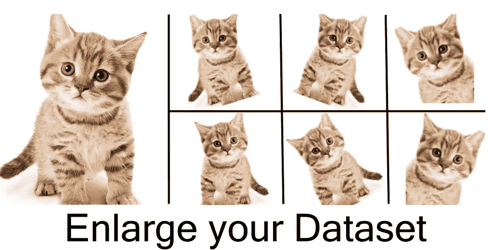
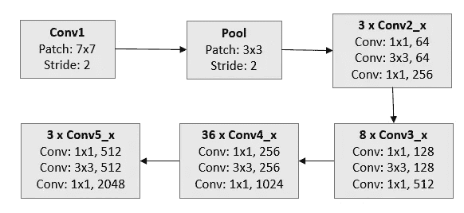
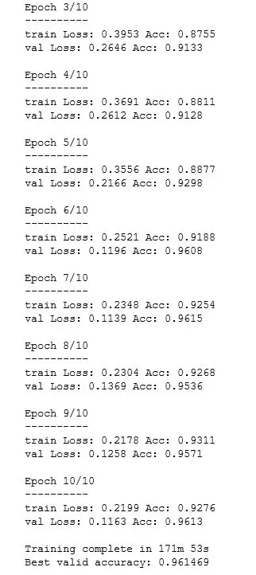
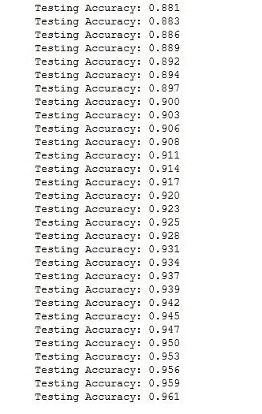
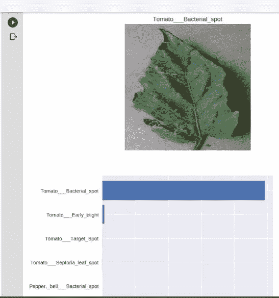
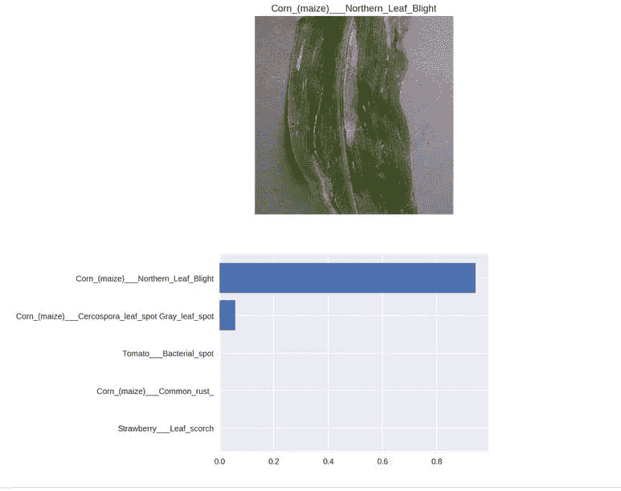

# 使用脸书的深度学习平台 PyTorch 创建一个检测植物疾病的人工智能应用程序

> 原文：<https://medium.datadriveninvestor.com/creating-an-ai-app-that-detect-diseases-in-plants-using-facebooks-deep-learning-platform-pytorch-15faaeb6bec3?source=collection_archive---------6----------------------->

联合国粮食及农业组织(UN)称，跨境植物病虫害影响粮食作物，给农民造成重大损失，威胁粮食安全。

近年来，跨界植物病虫害的传播急剧增加。全球化、贸易和气候变化，以及几十年来农业集约化导致的生产系统复原力下降，都起到了一定作用。

 [## 挑战你对人工智能和社会的看法的 4 本书——数据驱动的投资者

### 深度学习、像人类一样思考的机器人、人工智能、神经网络——这些技术引发了…

go.datadriveninvestor.com](http://go.datadriveninvestor.com/4AI1) 

跨界植物病虫害很容易传播到几个国家，达到流行病的程度。疾病的爆发和激增会给农作物和牧场造成巨大损失，威胁脆弱农民的生计，同时威胁数百万人的粮食和营养安全。

如果你对数据科学或机器学习感兴趣，你可能听说过这些平台众包数据挑战。我首先想到的是卡格尔。Kaggle 是一个众包平台，吸引、培养、培训和挑战来自世界各地的数据科学家，以解决数据科学、机器学习和预测分析问题。这个平台使数据科学家和其他开发人员能够参与运行机器学习竞赛，编写和共享代码，并托管数据集。

寻找项目想法和数据集，发现了另一个类似 Kaggle 的平台，但作为一个非营利组织，我说的是 crowdAI。crowdAI 还主办开放数据科学挑战赛，并帮助大学、政府机构、非政府组织或企业运行和管理他们的数据挑战。crowdAI 平台是一个开源基础设施，可以立即联系到世界各地成千上万的数据科学家，以解决有趣的数据问题。

我想提一下克劳代，因为正是在那里我发现了“植物村疾病分类挑战”。这项比赛的目标是开发能够根据图像准确诊断疾病的算法。

这个挑战已经结束了，但是我想用一个不同的深度学习框架来达到同样的目标:PyTorch。因此，我使用深度学习模型和迁移学习技术开发了一个 AI 应用程序。

对于这个挑战，我使用了“PlanVillage 数据集”。该数据集包含一个开放的植物健康图像库，以支持移动疾病诊断的开发。该数据集包含 54，309 幅图像。这些图像涵盖了 14 种作物:*苹果、蓝莓、樱桃、葡萄、橙子、桃子、甜椒、土豆、覆盆子、大豆、南瓜、草莓和番茄*。它包含 17 种基础疾病、4 种细菌性疾病、2 种霉菌(卵菌)疾病、2 种病毒性疾病和 1 种由螨虫引起的疾病的图像。12 种作物也有健康叶片的图像，这些叶片没有明显受到疾病的影响。

该数据集包含 38 类作物病害对，如下所示:

1)苹果黑星病，苹果黑星病
2)苹果黑腐病，苹果轮纹病
3)苹果雪松锈病，杜松裸子菌
4)苹果健康 5)蓝莓健康 6)樱桃健康 7)樱桃白粉病，Po-dosphaera spp .
8)玉米灰斑病、玉米灰斑病
9)玉米普通锈病、玉米柄锈菌
10)玉米健康
11)玉米大斑病、玉米大斑病
12)葡萄黑腐病、Guignardia bidwelli
13)葡萄黑麻疹(Esca)、嗜灰褐腐菌、褐腐菌
14)葡萄健康
15)葡萄
17)桃细菌性斑点病、油菜黄单胞菌
18)桃健康 19)甜椒细菌性斑点病
油菜黄单胞菌
20)甜椒健康
21)马铃薯早疫病、早疫病
22)马铃薯健康
23)马铃薯晚疫病、晚疫病
24)树莓健康
25)大豆健康
26)南瓜白粉病、白粉菌 30)番茄早疫病菌
30)番茄早疫病菌、番茄早疫病菌
31)番茄晚疫病菌、马铃薯晚疫病菌
32)番茄叶霉病菌、番茄黄化叶斑病菌
33)番茄番茄叶枯病菌
34)番茄二斑叶螨、二斑叶螨
35)番茄靶斑病菌、番茄棒孢霉
36)番茄花叶病毒
37)番茄黄化曲叶病毒

# 为训练和测试数据集定义转换

对我们的训练和测试数据集使用数据扩充的目的是通过对图像应用随机变换来增加我们的模型可以看到的图像的数量。在我的例子中，我应用了一些数据增强，比如随机旋转、调整裁剪、随机水平翻转和居中裁剪。记住，我们希望我们的模型对图像进行分类，而不考虑方向。

# 选择神经网络架构

我决定使用 torchvision.models 中的一个预训练模型来获取图像特征，并使用这些特征构建和训练一个新的前馈分类器。

我选择的预训练模型是微软的剩余网络架构:Resnet-152。这是 COCO 2015 竞赛中使用的模型之一，它在以下方面获得了第一名:ImageNet 分类、ImageNet 检测、ImageNet 定位、COCO 检测和 COCO 分割。

Architecture of a Resnet-152

我使用预训练模型的原因是因为这是一个节省时间的过程，并且这种模型是在大型数据集上训练的，以解决与我想要解决的问题类似的问题。

# 移除原始分类器

在安装了用于图像分类的预训练模型之后，我移除了原来的分类器，然后添加了一个新的分类器，以帮助我识别植物疾病，最后，通过冻结一些参数来微调模型。

# 超参数

我用 10 个时期运行模型，并使用学习率为 0.001 的 Adam optimizer:

运行测试函数，得到的精度为 0.961

为了确保模型运行良好，我决定应用健全性检查再次测试模型:

看起来效果还不错！我只需要部署模型，让应用程序准备好在 smarthphone 上使用！

你可以在 GitHub 上查看我的完整代码:

 [## 病毒/植物疾病分类器

### 使用深度学习模型检测植物疾病的人工智能应用程序…

github.com](https://github.com/viritaromero/Plant-diseases-classifier) 

粮农组织关于植物病虫害的文章:

 [## 植物病虫害

### 跨界植物病虫害影响粮食作物，给农民造成重大损失，并威胁粮食…

www.fao.org](http://www.fao.org/emergencies/emergency-types/plant-pests-and-diseases/en/) 

你可以在这里找到 PlantVillage 数据集的论文:

## 来自 DDI 的相关故事:

 [## 数据科学和软件工程哪个更有前途？

### 大约一个月前，当我坐在咖啡馆里为一个客户开发网站时，我发现了这个女人…

medium.com](https://medium.com/datadriveninvestor/which-is-more-promising-data-science-or-software-engineering-7e425e9ec4f4)  [## 用 7 个步骤解释深度学习

### 和猫一起

medium.com](https://medium.com/datadriveninvestor/deep-learning-explained-in-7-steps-9ae09471721a)