# 通过卷积神经网络创造艺术

> 原文：<https://medium.datadriveninvestor.com/creating-art-through-a-convolutional-neural-network-ed8a4d9a3f87?source=collection_archive---------1----------------------->

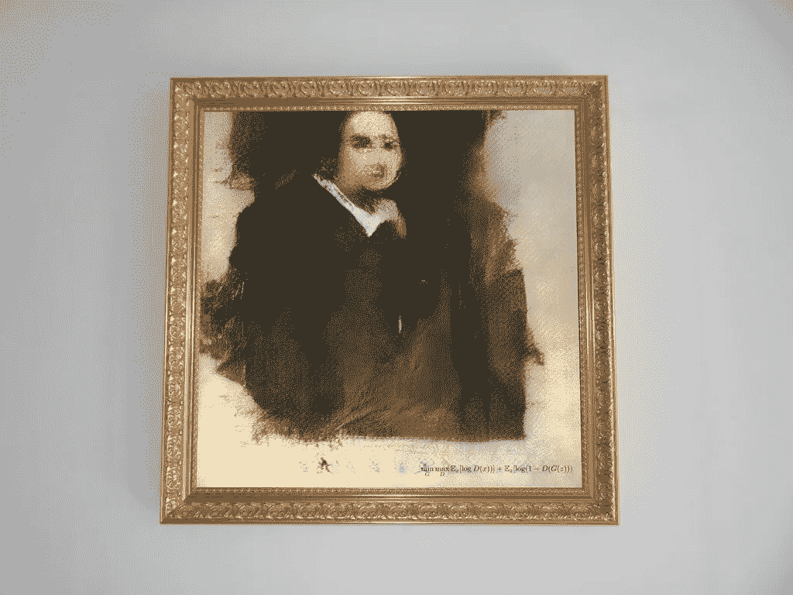

根据《纽约时报》的一篇文章，一幅由人工智能制作的肖像挂在纽约佳士得拍卖行，对面是安迪·沃霍尔的版画，旁边是罗伊·利希滕斯坦的青铜作品。它的售价是这两件作品的两倍多。“来自 La Famille de Belamy 的 Edmond de Belamy”拍出了 43.25 万美元(包括费用)，是佳士得最初估价 7000 美元至 1 万美元的 40 多倍。买家是匿名电话竞标者。

人工智能(AI)在不同领域变得越来越重要，它正在彻底改变创造性过程的本质。你想象过用 AI 创作艺术吗？这就是现在正在发生的！t 使用人工智能检查此音乐视频:

风格转换是以其他图像的风格重新组合图像的技术。这一切都是从 Gatys 等人发表了一篇令人惊叹的论文开始的，这篇论文讲述了如何利用深度学习，特别是卷积神经网络(CNN)，将艺术风格从一幅画转移到另一幅画中。

# **什么是卷积神经网络？**

在深度学习中，卷积神经网络(CNN，或 ConvNet)是一类深度神经网络，最常用于分析视觉图像。CNN 是最强大的图像分类和分析网络之一。

它们还有其他应用，如图像和视频识别、推荐系统、医学图像分析、自然语言处理和风格转换。

Example of a CNN

风格转移允许我们将一个图像的风格应用到另一个图像。将样式转换为内容的关键是使用经过训练的 CNN 将内容与图像的样式分离开来。

风格转换将查看两个不同的图像。我们通常称之为风格图像和内容图像。

使用经过训练的 CNN，风格转移找到一个图像的风格和另一个图像的内容。

我们可以用 VGG，一个训练有素的 CNN 来改变风格。VGG 代表视觉几何组。这是由牛津大学的 K. Simonyan 和 A. Zisserman 在论文“用于大规模图像识别的非常深的卷积网络”中提出的 CNN 模型。

VGG 由 16 层卷积和 ReLU 非线性组成，由 5 个汇集层分隔，并以 3 个完全连接的层结束。我们可以从这个网络的不同层面提取图像的内容和风格。

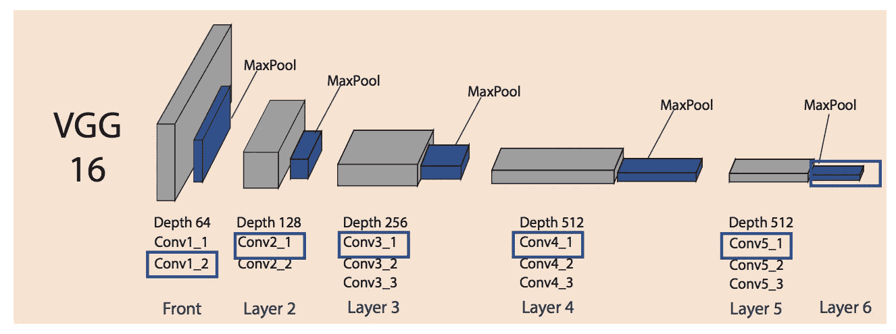

VGG16 structure

这些模型将尝试合并两个图像以创建一个新的第三个图像，如下所示:

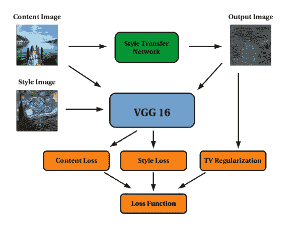

以下是我用 VGG19 模型做的一些实验。您可以看到样式和内容图像:

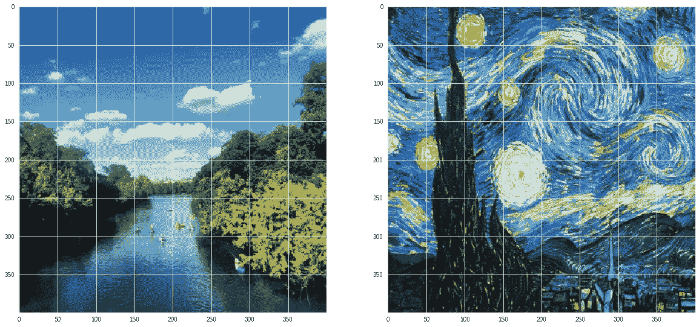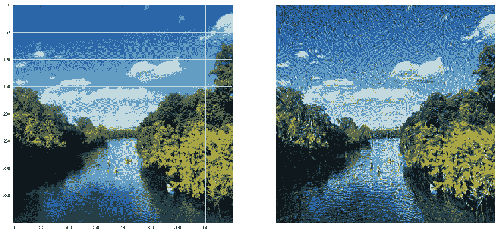

# 这不是 Photoshop，这是人工智能！

# **你听说过深梦吗？**

深梦是另一个使用风格转移的工具。这是一个由谷歌工程师 Alexander Mordvintsev 创建的计算机视觉程序，它使用 CNN 通过算法幻觉来寻找和增强图像中的模式，从而在故意过度处理的图像中创建一个梦幻般的幻觉外观。

看这些我用深度梦生成的图片！

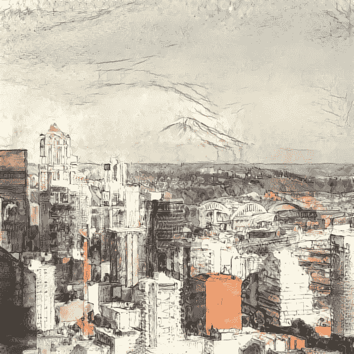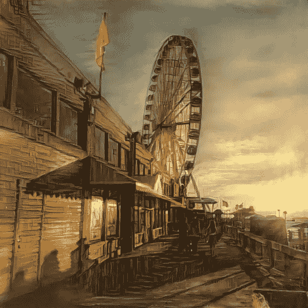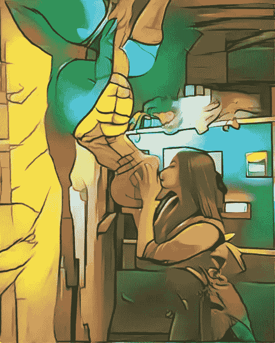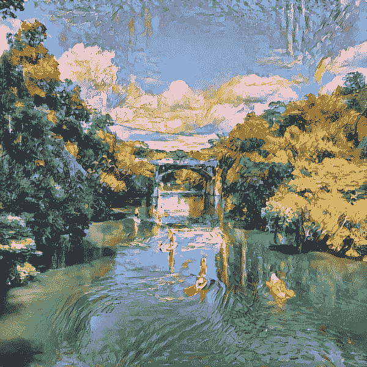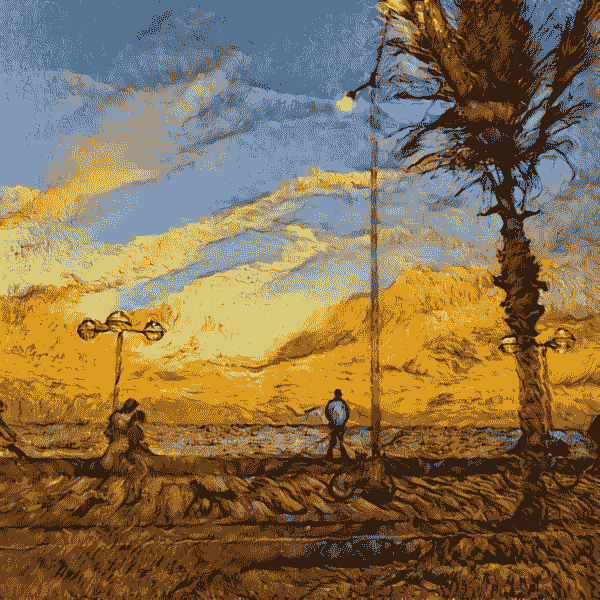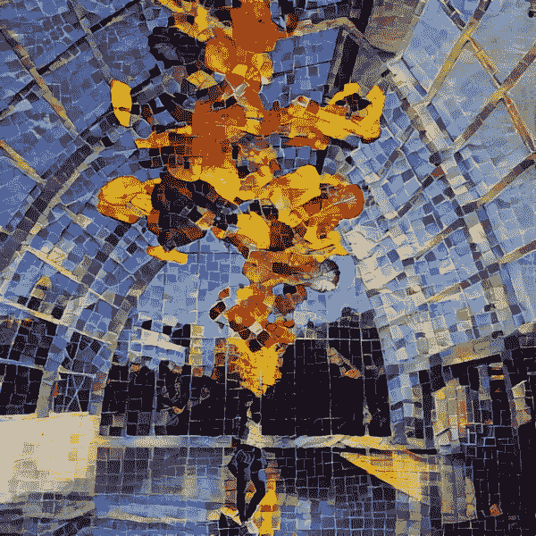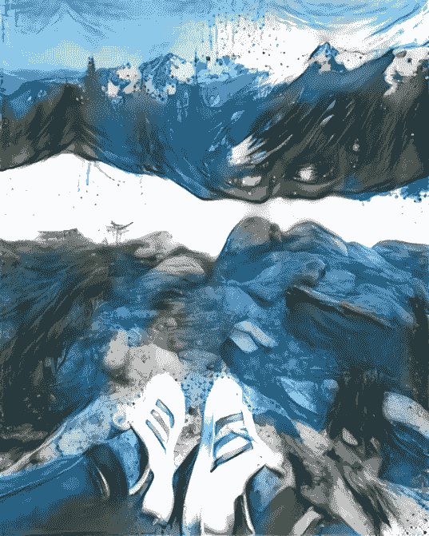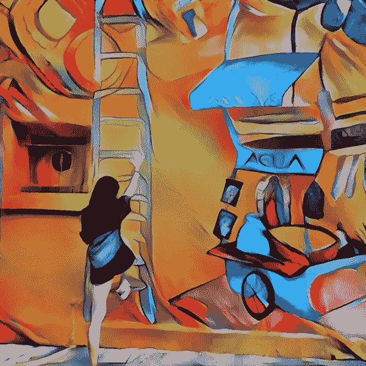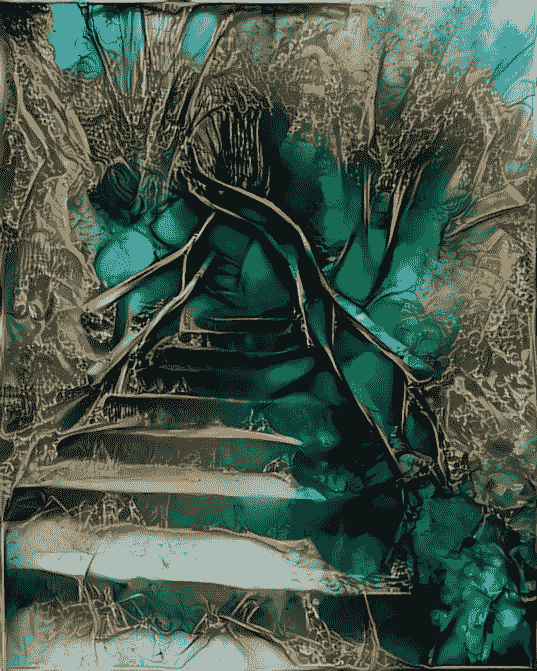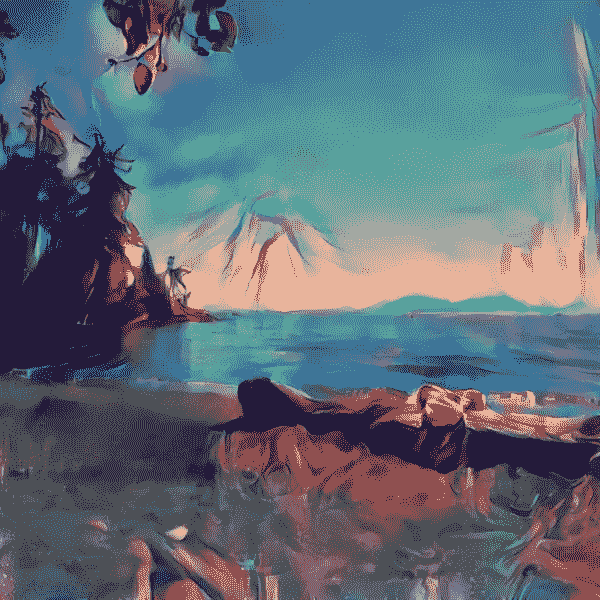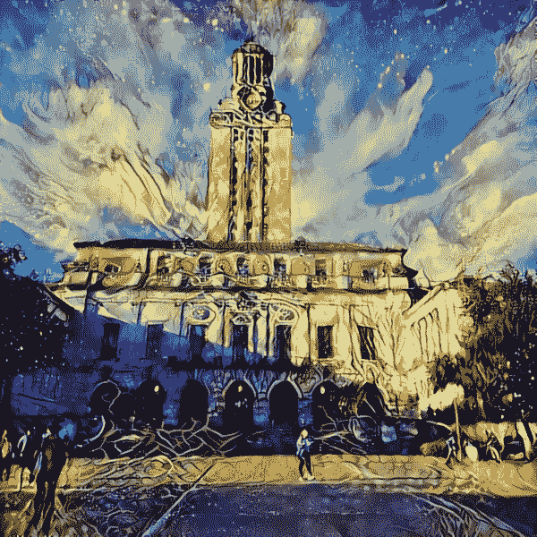

用深梦做一些实验吧！

 [## 深度梦境发生器

### 这项技术是原始深度梦境方法的更高级版本。它能够使用自己的…

deepdreamgenerator.com](https://deepdreamgenerator.com/) 

阅读利昂·a·加蒂斯、亚历山大·s·埃克、马蒂亚斯·贝希的论文，这一切都是从这里开始的:

 [## [1508.06576]艺术风格的神经算法

### 摘要:在美术中，尤其是绘画，人类已经掌握了通过绘画创造独特视觉体验的技巧

arxiv.org](https://arxiv.org/abs/1508.06576)  [## viritaromero -概述

### 软件工程师，对人工智能和机器学习充满热情。-维里塔罗梅罗

github.com](https://github.com/viritaromero)