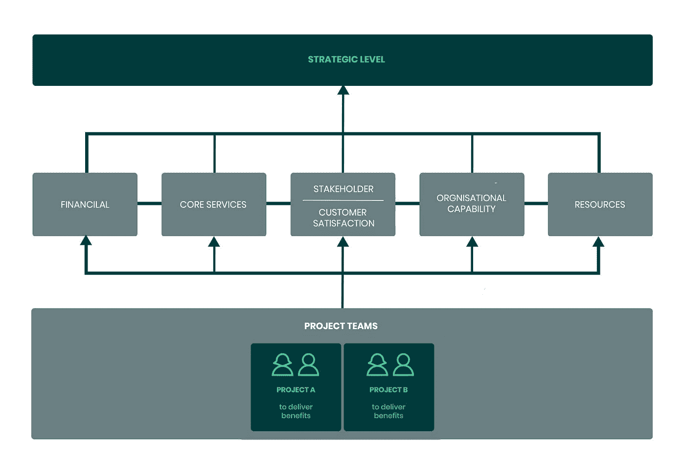

# 利用风险管理创造机会

> 原文：<https://medium.datadriveninvestor.com/creating-opportunities-with-risk-management-92929083ff33?source=collection_archive---------6----------------------->

© Dylan Gillis

风险管理更多的是创造机会，而不是担心威胁。通过采取积极主动的方法，您可以在潜在问题变成问题之前解决它们，并在没有压力的情况下保持对业务的控制。风险管理最简单的形式就是为你的企业开发机会，并尽早消除可能的威胁。

所有行业的企业主和经理都需要考虑发展或维持业务的风险。一个简单的事实是，为了保持竞争力，大多数企业至少需要将其部分流程数字化，如果不是大部分流程的话。

 [## 一个企业在肚子上移动:如何照顾直觉|数据驱动的投资者

### 事实证明，直觉不仅仅是一种感觉。科学很清楚:你的直觉比你知道的更多…

www.datadriveninvestor.com](https://www.datadriveninvestor.com/2018/11/09/a-business-moves-on-its-stomach-how-to-make-allowances-for-gut-feelings/) 

这篇文章将主要关注如何从数字的角度，或者软件项目的角度来处理风险管理。

> 定义:风险是一个**不确定的**事件或一系列事件，一旦发生，将对项目或运营目标的实现产生影响。不确定的事件也可以表现为实现组织、投资组合或项目目标的**机会**或**威胁**。

# 风险的常见原因是什么？

以下是开发软件解决方案时风险的一些常见原因。

## 1:没有定义期望从项目中获得什么能力和好处

以技术特性和功能的形式讨论业务需求是非常常见的。相反，讨论业务问题和解决这些问题所需的能力。通过这样做，并确定你期望得到什么好处，你就增加了得到你所需要的东西的机会，并减少了误解。

帮助你实现这一点的一个很好的工具是能力分解结构。在你早期的头脑风暴会议中开始创建你的 CBS，你会很快理解你要实现的目标是简单还是复杂。

## 2:对角色和职责了解不多

当人们认为每个人都知道自己应该做什么时，麻烦就来了。花时间确保团队中的每个人都知道他们的职责是什么，以及谁负责其他工作。

## 3:没有企业主参与日常项目

没有业务部门的人参与项目肯定会让人失望。如果你要改变团队的工作方式，那么请一位资深人士给团队提供反馈和建议是值得的。这也将减少因时间延误而超支的风险。

在开发过程中让高级业务所有者参与进来，可以确保所有的技术解决方案从业务角度来看都符合您的要求。这意味着你可以创造一个很好的机会来学习和改进最初的概念。这通常可以节省时间并降低开发成本。

## 4:正在进行的工作和多任务处理太多

有太多的工作在进行中(WIP)是对任何软件项目的直接威胁。有太多的职位空缺会导致缺乏关注和工作解决方案的延迟交付。

专注于需要以正确的顺序构建的内容。然后分配团队成员进行需要构建的工作。目标是在最短的时间内交付解决方案，而不是让每个人都 100%忙碌。

当项目经理试图让每个人都 100%的忙碌，100%的时间，我总是知道一个项目有麻烦了。他们关注的是活动，而不是结果。

## 5:选择供应商合作伙伴时的决策标准

因为项目的成本很容易量化，所以在选择供应商合作伙伴时，它通常比诸如**质量**、**产量、**和**技术/商业知识**等标准更重要。将成本优先于上述三个标准的结果通常会导致构建的解决方案不能满足您的业务需求，并且由于质量较低和吞吐量较慢而导致大量成本超支。

# 接近风险管理

每个企业都朝着五个战略目标努力。您的风险管理之旅应该从了解每个项目将如何影响或改变业务层面的目标开始。

1.*:与改善企业财务状况的切实措施有关。*

*2. ***核心服务*** :任何专注于提高效率、质量或产量的变化。*

*3. ***利益相关者或客户满意度*** :确保声誉得到管理，服务需求保持强劲且可预测。*

*4. ***组织能力* :** 项目确保组织保持相关性并能够满足未来需求(例如创新和新服务开发)。*

*5. ***资源*** :确保你的员工不仅有合适的技能，还有合适的工具来完成他们的工作。*

# *管理风险*

*当风险管理作为一个集体的团队工作来处理，而不是使用一个筒仓的方法时，它的效果最好。风险不关心组织边界，因此以筒仓心态工作只会增加对业务的负面影响。*

> *定义:筒仓心态是指某些部门或个人不希望与同一公司的其他人分享信息。*

*理想的情况是，公司的每个级别/部门都了解源自其控制领域的风险如何以及在哪里产生影响。尤其是在影响公司战略目标的情况下。*

*在下图中，您将看到风险管理有不同的级别。在最高层，你的首席执行官在战略层面管理风险。然后，您的运营(核心服务)和项目团队需要管理其特定领域内的风险。默认情况下，任何合理规模的软件项目都会影响一个或多个战略目标。任何可能影响战略目标并进而影响战略层面的风险，都需要上报给你的首席执行官。*

**

*沟通是识别新风险和现有风险变化的核心。有效的风险管理取决于参与，而参与又取决于沟通。它应通过以下方式改进战略、项目和运营目标的实施和运行:*

*   *减少惊喜的次数*
*   *更有效地利用资源*
*   *减少浪费*
*   *更注重正确地做正确的事情*

*通过对风险管理采取系统的方法，更容易升级、委派和更有效地管理风险。作为一般的经验法则，从风险会产生影响的地方开始管理风险。*

*让我们以软件项目为例:如果一个工作包会晚两天，但整个项目仍然会按时按预算交付，那么在项目中管理它。但是，如果项目本身将很早或很晚交付，则应上报给高级管理层。有人认为早期交付是一个可以利用的机会，而晚期交付是一个需要减轻的威胁。*

# *风险管理责任*

*那么，在不同的组织层次上，谁负责识别和管理风险呢？*

## *项目层面的责任*

*对于大多数中小型软件项目，项目经理将承担风险经理的角色。对于生命攸关的项目(如医疗行业),可能需要一名训练有素的风险经理。软件项目中的每个人都需要以某种方式参与风险管理。第一步是让每个人都充分理解并履行他们的职责，并在项目中成为一名积极主动的团队成员。*

## *业务/战略层面的责任*

*在这一级，高级管理层将每天监控战略目标的风险。首席执行官、首席财务官、首席运营官和其他高级管理人员应该积极参与风险管理。*

# *识别风险的框架*

*在项目开始时，你可以做一些工作，这些工作会给你一些警告信号，表明项目不再能满足你的需求。通过在项目开始时花时间定义标准基线，您可以测量项目的进度和性能。这样做可以让您定义项目的可接受公差。超出这些公差的任何东西都将是风险:*

*   *质量:交付项目，使其符合约定的验收标准，没有缺陷，易于操作；*
*   ***吞吐量/数量**:以一致的速度交付可用的工作。*
*   ***时间:**在预算时间内交付项目；*
*   ***范围:**项目交付后业务所需的能力。通常由能力分解结构和详细需求来表示。交付上述能力所需的努力。*
*   ***效益:**企业能够实现项目最初交付的效益。*
*   ***团队合作:**拥有一个运转良好的团队，作为一个运转不良的团队，不会导致实现上述绩效变量。*
*   ***成本:**在预算成本内交付项目；*

*对于上述每个主题，您可以定义更具体的指标/措施，以便对可能给项目和业务带来机会或威胁的情况给出早期警告信号。*

> ****需要一个可靠的软件伙伴？*** [***联系方式***](https://forbytes.com/contact/)*

# *阅读更多信息:*

* [## 管理良好的项目的 5 个特征

### 为了获得最好的项目结果，你首先需要了解开发过程并澄清问题…

medium.com](https://medium.com/@donlowe/5-characteristics-of-a-well-managed-project-bcccfe9e5b50)  [## 如何为您的项目成功构建角色和职责

### 任何项目的成功都需要每个团队成员负起责任。与任何公司一样，个人需要…

medium.com](https://medium.com/datadriveninvestor/how-to-structure-roles-and-responsibilities-for-your-project-success-3ab952db3510)  [## 如何使用项目组合管理来控制软件开发

### 在许多情况下，处理软件开发的企业会面临管理问题。的…

medium.com](https://medium.com/@donlowe/how-to-use-portfolio-management-to-control-software-development-91b8efe90775)*