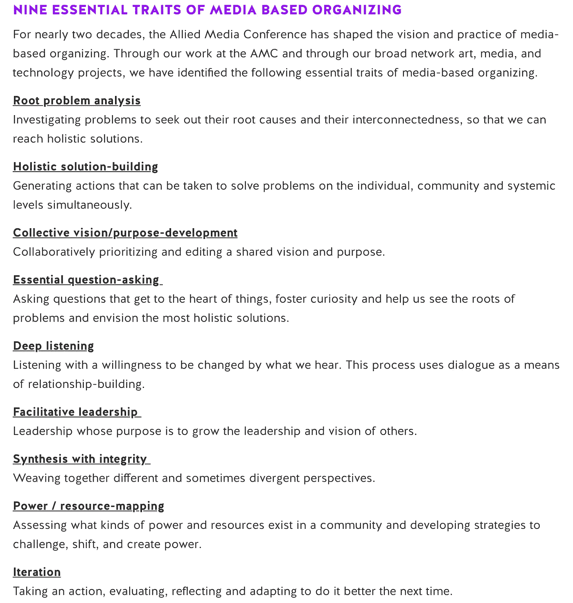

# 创造安全空间，培养科技包容性

> 原文：<https://medium.datadriveninvestor.com/creating-safe-spaces-and-fostering-inclusiveness-in-tech-f119706098f7?source=collection_archive---------29----------------------->

## 我在纽约科技杂志博览会的经历

刚刚过去的这个周末，我有幸参加了第一届纽约科技杂志展****(NYTZF)。那里挤满了设计师、工程师、艺术家和技术专家，他们都在重新定义科技领域的意义。****

****博览会快结束时，有一个由 BUFU(由我们为我们而办) 举办的研讨会，这是一个以探索不同社区之间的文化和政治关系为使命的组织。你可以点击上面的链接找到更多关于他们的信息。****

****我们被要求阅读几个不同组织的道德准则，并写下我们是否同意这些准则，以及我们将如何改进这些准则。我了解到 [**联合媒体会议**](https://www.alliedmedia.org/about/story) 关于媒体组织的策略，该策略遵循以下原则:****

********

****[https://www.alliedmedia.org/media-based-organizing](https://www.alliedmedia.org/media-based-organizing)****

****我的第一反应是，这是一种从一开始就建立在包容性基础上的简单的内容创建方式，而不是为了让越来越多的人参与进来而不得不开发同一产品的多次迭代。****

****这不是一件容易的事。我发现，即使在 Flatiron 开发我们的学生项目，也需要做很多工作才能让一些东西发挥作用，一旦你到了那里，你现在必须预测用户或客户会做什么，他们需要访问什么，以及他们将如何以有效的方式获得它。所以，也许让事物变得容易理解的问题不仅仅在于让更多的观众更容易理解创作的细节，还在于以一种有意义的方式与观众建立联系。****

> ****“如果穷人得不到它，它既不是激进的，也不是革命性的”****

****在 Chris Zacharias 的一篇文章中，他提出了一个叫做“ [**页面权重**](http://blog.chriszacharias.com/page-weight-matters) 的概念，以及它与可访问性的关系。简而言之，在优化 Youtube“观看页面”背后的代码之前，世界上有很多人可以访问 Youtube，但没有带宽来及时加载页面。仅仅是看一个视频的第一帧就花了 20 多分钟。幸运的是，现在有一些方法可以解决这个问题。****

****编码让我们可以创造任何我们想创造的东西，但作为创造者，我们也有责任去考虑那些我们可能不在身边或没有任何联系的人。****

****读完课文并写下我们的感想后，我们被要求与另一桌读过同样课文的人配对，讨论我们的印象。当 BUFU 的创始人之一让我们根据我们的讨论和我们用拇指阅读的文本(一种熟悉的熨斗练习)来衡量我们对未来的感觉时，所有的小组都停顿了一下。).****

****My Group****

****Some Other Peeps****

****在讨论接近尾声时，我们被要求写下自己未来道德准则的 3 条原则。我的小组对我们讨论的文本中使用的语言谈了很多，所以我们选定了三个词作为我们原则的基础。我们选择了以下内容:****

******存在******

****出现在你试图改变的空间很重要——或者体现你想看到的行为。这可能是身体上或精神上的存在，但实际上这只是在过程的每一步考虑可访问性。****

******时间******

****我们的文章谈到了“挖掘时间”(现在可能在他们的网站上编辑过)，我们花了相当多的时间来解构它。有些人说这种语言太“榨取主义”了——就像我们从别人那里拿走时间却没有贡献价值——所以我们对它进行了改进。相反，我们说你应该以尊重他人时间的方式收回自己的时间。一个例子是致力于拥有高效的代码，但是*也*让它对其他人可读。****

******漏洞******

****脆弱就是难受！但你不能否认它在不同群体或认同不同群体的个人之间建立联系的重要性。这非常类似于上面提到的“整体合成”原则。****

****在叙述我的经历时，似乎杂志公平符合我们创造的道德准则的模式。NYTZF 的目的是邀请各行各业的人，并创造一个在数字空间意味着什么的物理表现。在这样做的过程中，我们有许多人 ***在场*** 以促进和见证谁在帮助这个目的。****

****通过作为一个组织的代表参加 NYTZF，你利用你的 ***时间*** 向其他人展示你在做什么。信息共享的方式之一是通过免费杂志。但是如果他们来晚了，什么都没有了呢？许多摊位经营者有一个很好的解决方案:一个链接或二维码来下载该杂志。组织的时间得到了有效的利用，同时也记住了那些有时间限制或者可能根本不能出席的人。****

****在博览会上，我遇到了一些有伟大思想和伟大事业的优秀人士。说说你对网络的看法，但它确实需要 ***脆弱性*** 。你分享你是谁，你在做什么，你希望做什么，以努力与其他人联系，这些人有希望在长期内帮助你(反之亦然)。当我在 [**完美黑客**](http://flawlesshacks.com/) 展台工作时，这种事情发生了很多次。“完美黑客”是碧昂斯主题的黑客马拉松，面向技术领域的女性——不考虑编码经验。在阅读了无瑕黑客桌的描述后，许多人想知道更多并进行合作。在促进包容性的过程中，我们只会邀请更多的包容性和协作，没有什么比人们一起努力让世界变得更好更伟大的事情了。****

****你的道德准则是什么样的？****